# 3.7.3 压电材料的一般分析过程

**产品：**Abaqus/Standard  

本节讨论包含压电耦合的单元的一般分析过程。

### I. 压电材料的瞬态动态分析

### 测试的单元

C3D8E

### 测试的功能

说明了包含压电耦合的单元的瞬态动态分析能力。在单独的分析中施加集中节点电荷和电势。

### 问题描述

压电棒[1×1×10]承受电势。纵向顶面的电势规定为1，纵向底面的电势规定为0。电极通过使用将面上所有电势设置为相同规定值的方程来模拟。材料在局部3方向极化。

块体沿长度方向使用五个C3D8E单元建模。测试中使用的PZT-5H材料的材料特性如下：

**弹性特性：**

| 工程常数 | |
| --- | --- |
|  | 60.61 GPa |
|  | 60.61 GPa |
|  | 48.31 GPa |
|  | 0.289 |
|  | 0.512 |
|  | 0.512 |
|  | 23.5 GPa |
|  | 23.0 GPa |
|  | 23.0 GPa |

**压电耦合矩阵（应变系数）：**

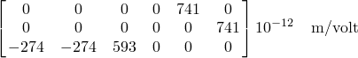

**完全约束材料的介电矩阵：**

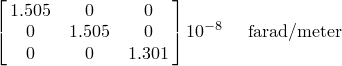

对于未约束材料，压电系数矩阵和介电矩阵是压电文献中常用的电特性，可以根据上述压电特性表示。这些关系在["压电分析，"Abaqus理论指南第2.10.1节](../stm/stm-link.md#stm-anl-piezoelectric)中给出。这些特性通常由制造商提供。对于PZT-5H材料，特性如下：

**压电系数矩阵：**

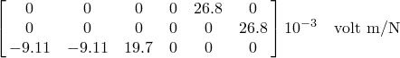

**未约束材料的介电矩阵：**

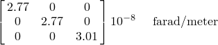

测试涉及瞬态动态步骤，其中顶面的电势在0.014秒内斜坡上升至1伏，然后在步骤的剩余时间内保持恒定。步骤结束时的结果对应于静态解。

### 结果与讨论

施加的1伏电势产生1伏/米的电势梯度。压电常数和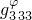可用于估计单位面积的电荷。对于未约束材料：

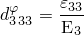

和

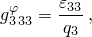

其中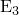是电势梯度，是局部3方向的电荷密度。因此电荷密度等于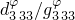=3.01×10^-8。施加电压的面积为10；因此，静态反作用电荷应为约3.01×10^-7。[ppzodyn1.inp](../eif/ppzodyn1.inp)的结果确认了此反作用电荷。在输入文件[ppzodyn2.inp](../eif/ppzodyn2.inp)中，代替在顶面规定1的电势值，施加3.01×10^-7的集中节点电荷。这导致顶面产生1伏的电势。

### 输入文件

[ppzodyn1.inp](../eif/ppzodyn1.inp)

带规定电势的动态分析。

[ppzodyn2.inp](../eif/ppzodyn2.inp)

带集中节点电荷的动态分析。

### II. 压电材料的几何非线性静态分析

### 测试的单元

C3D20E

### 测试的功能

说明了压电材料的几何非线性静态分析能力。两端夹紧的梁承受导致达到临界屈曲载荷的电势。

### 问题描述

压电材料梁两端夹紧并承受电势。梁长0.4 m，宽0.006 m，厚0.005 m。梁一端的电势规定为500千伏，另一端规定为0千伏。电极通过使用将梁两端所有节点的电势设置为相同规定值的方程来模拟。在第一步中，在中心施加小载荷以引起小的几何缺陷。

块体使用20个C3D20E单元建模。用于模拟的PZT-5H材料特性在前一节中给出。

### 结果与讨论

梁的临界屈曲载荷为：

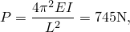

其中E是纵向的杨氏模量，I是梁截面相应的惯性矩。分析显示临界压力为773 N。压力随着网格细化收敛于解析屈曲载荷。

### 输入文件

[ppzobuckle.inp](../eif/ppzobuckle.inp)

几何非线性静态分析。

### III. 压电分析中的大旋转

### 测试的单元

C3D4E    C3D6E    C3D8E    C3D10E    C3D20RE

### 测试的功能

不同压电单元类型的大旋转。

### 问题描述

用不同压电单元类型建模的五个块体承受电势。一面的电势规定为1伏，相对面的电势规定为0伏。块体绑到三个正交表面以防止无约束刚体运动，但相对于表面可以切向自由移动。表面也用于规定刚体旋转。

### 结果与讨论

施加的电势梯度大小保持恒定，但随单元适当旋转。

### 输入文件

[ppzolarrot.inp](../eif/ppzolarrot.inp)

压电单元的大旋转。

### IV. 压电材料行为的验证

### 测试的单元

C3D8E

### 测试的功能

使用一般静态分析验证压电材料特性。

### 问题描述

PZT-5H块体承受不同载荷，可以从中验证压电材料特性。

### 结果与讨论

在第一步中，规定材料局部3方向上两个相对面的电势。施加足够的边界条件以防止刚体运动，但模型在其他方面不受约束。压电常数=593×10^-12和=19.7×10^-3可以用应变、电势梯度和电荷密度表示为：

和

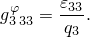

通过使用应变、和的数值结果验证压电常数、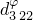、、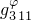、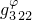和。未约束材料在局部3方向的介电常数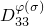由下式给出：

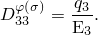

和的数值结果确认了上述关系。在步骤2-4中，以不同方式对模型充电，验证与步骤1相同的压电材料参数。在步骤2中，底面和顶面的电势被切换。在步骤3中，施加集中节点电荷，在步骤4中，代替规定电势施加分布式电荷。在步骤5中，在局部1方向施加电势梯度以验证压电特性、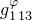和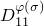。

在步骤6-7中施加开路条件（电势梯度不由电压边界条件规定），导致等于零的反作用电荷。压电本构方程可以不同形式编写。特别地，应变可以用电势梯度或电荷密度表示。如果本构关系用电势梯度表示，则柔度数据（通常在压电文献中表示为）定义零电势梯度下的机械行为。在Abaqus中，零电势梯度下的刚度数据用于指定机械行为。如果本构关系使用电荷密度表示，则柔度矩阵（通常在压电文献中表示为）定义零电荷密度下的机械行为。柔度可以从柔度和电特性获得。对于PZT-5H材料，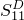=14.05×10^-12，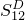=7.27×10^-12，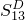=3.05×10^-12，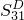=3.05×10^-12，和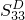=8.99×10^-12。通过在零电荷（开路条件）下加载模型，验证这些弹性柔度。

### 输入文件

[ppzovallin.inp](../eif/ppzovallin.inp)

用于验证压电材料特性的几何线性静态分析。

[ppzovalnlg.inp](../eif/ppzovalnlg.inp)

用于验证压电材料特性的几何非线性静态分析。

[ppzovalnlg_tfv.inp](../eif/ppzovalnlg_tfv.inp)

用于验证温度和场变量依赖的压电材料特性的几何非线性静态分析。

