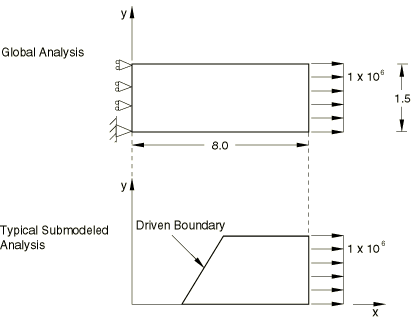
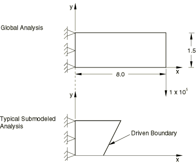

# 3.8.2 二维连续体应力/位移子模型

**产品：**Abaqus/Standard  Abaqus/Explicit  

### 测试的单元

CPEG3    CPEG4    CPEG6    CPEG6M    CPEG8    

CPE3    CPE4    CPE4H    CPE4R    CPE6    CPE6M    CPE8    CPE8H    CPE8R    

CPS3    CPS4    CPS4R    CPS6    CPS6M    CPS8    

### 测试的功能

子模型功能应用于二维连续体应力/位移单元。在Abaqus/Standard中，全局分析和子模型分析均使用各种组合的一般静态和线性摄动程序。在Abaqus/Explicit中，全局分析和子模型分析的程序都是准静态的。

### 问题描述

**模型：**

所有全局模型在x-y平面中的尺寸为8.0×1.5，平面外尺寸为1.0（平面应力分析）。

**材料：**

| 杨氏模量 | 3×10^6 |
| --- | --- |
| 泊松比 | 0.3 |
| 密度 | 10.0 |
| Rayleigh阻尼（） | 0.2 |
| Rayleigh阻尼（） | 0.4 |

**载荷和边界条件：**

所有涉及静态程序的全局模型和Abaqus/Explicit准静态程序承受如图[3.8.2-1](ch03s08abv205.md#ver2dsubmodel-staticdomains)所示的载荷和边界条件。在Abaqus/Standard中，载荷的时间历史、执行相应子模型分析的时间以及从全局模型请求的文件输出对于每个单独分析都是唯一的。在Abaqus/Explicit中，全局和子模型分析使用相同的步骤时间和平滑步骤载荷。

**图3.8.2-1** 与静态程序一起使用的全局和子模型域。

所有在Abaqus/Standard中涉及动态程序的全局模型承受如图[3.8.2-2](ch03s08abv205.md#ver2dsubmodel-dyndomains)所示的载荷和边界条件。对于使用直接积分隐式动态程序的瞬态模拟，可以通过更改输入文件中定义的参数来测试载荷的不同激励频率。与静态分析一样，载荷的时间历史、执行相应子模型分析的时间以及从全局模型请求的文件输出对于每个单独分析都是唯一的。

**图3.8.2-2** 与动态程序一起使用的全局和子模型域。

### 结果与讨论

子模型分析中所有驱动变量的幅值在全局分析文件输出中被正确识别，并应用于子模型分析中的驱动节点。

### 输入文件

##### **Abaqus/Standard输入文件**

以下输入文件测试使用静态和线性静态摄动程序的各种静态分析组合：

[pgcg4sfs.inp](../eif/pgcg4sfs.inp)

CPEG3、CPEG4单元；全局分析。

[pscg4sf1.inp](../eif/pscg4sf1.inp)

CPEG4单元；pgcg4sfs.inp的子模型分析。

[pscg4sf1_sb.inp](../eif/pscg4sf1_sb.inp)

CPEG4单元；基于应力的子模型分析。

[pscg4sf2.inp](../eif/pscg4sf2.inp)

从pscg4sf1.inp重启。

[pscg4sf2_sb.inp](../eif/pscg4sf2_sb.inp)

从pscg4sf1_sb.inp重启。

[pgcg8sfs.inp](../eif/pgcg8sfs.inp)

CPEG6、CPEG8单元；全局分析。

[pscg8sf1.inp](../eif/pscg8sf1.inp)

CPEG4单元；pgcg8sfs.inp的子模型分析。

[pgcg8sks.inp](../eif/pgcg8sks.inp)

CPEG6M、CPEG8单元；全局分析。

[pscg8sk1.inp](../eif/pscg8sk1.inp)

CPEG4单元；pgcg8sks.inp的子模型分析。

[pscg8sk1_sb.inp](../eif/pscg8sk1_sb.inp)

CPEG4单元；基于应力的子模型分析。

[pgce4sfs.inp](../eif/pgce4sfs.inp)

CPE3、CPE4单元；全局分析。

[psce4sf1.inp](../eif/psce4sf1.inp)

CPE4单元；pgce4sfs.inp的子模型分析。

[psce4sf1_sb.inp](../eif/psce4sf1_sb.inp)

CPE4单元；基于应力的子模型分析。

[pgce4sfsg.inp](../eif/pgce4sfsg.inp)

CPE3、CPE4单元；[*SUBMODEL](../key/key-link.md#usb-kws-msubmodel)、GLOBAL ELSET；全局分析。

[psce4sf1g.inp](../eif/psce4sf1g.inp)

CPE4单元；[*SUBMODEL](../key/key-link.md#usb-kws-msubmodel)、GLOBAL ELSET；子模型分析。

[pgce4shm.inp](../eif/pgce4shm.inp)

CPE4H单元；全局分析。

[psce4sh1.inp](../eif/psce4sh1.inp)

CPE4单元；pgce4shm.inp的子模型分析。

[pgce4srm.inp](../eif/pgce4srm.inp)

CPE4R单元；全局分析。

[psce4sr1.inp](../eif/psce4sr1.inp)

CPE4单元；pgce4srm.inp的子模型分析。

[pgce8sfs.inp](../eif/pgce8sfs.inp)

CPE6、CPE8单元；全局分析。

[psce8sf1.inp](../eif/psce8sf1.inp)

CPE4单元；pgce8sfs.inp的子模型分析。

[pgce6sms.inp](../eif/pgce6sms.inp)

CPE6M单元；全局分析。

[psce6sm1.inp](../eif/psce6sm1.inp)

CPE6M单元；pgce6sms.inp的子模型分析。

[psce6sm1_sb.inp](../eif/psce6sm1_sb.inp)

CPE6M单元；基于应力的子模型分析。

[pgcs4sfs.inp](../eif/pgcs4sfs.inp)

CPS3、CPS4单元；全局分析。

[pscs4sf1.inp](../eif/pscs4sf1.inp)

CPS4单元；pgcs4sfs.inp的子模型分析。

[pgcs6sms.inp](../eif/pgcs6sms.inp)

CPS6M单元；全局分析。

[pscs6sm1.inp](../eif/pscs6sm1.inp)

CPS6M单元；pgcs6sms.inp的子模型分析。

以下输入文件测试使用直接解稳态动态和直接积分隐式程序的各种动态分析组合：

[pgce8shd.inp](../eif/pgce8shd.inp)

CPE8H单元；全局分析。

[psce8sh1.inp](../eif/psce8sh1.inp)

CPS8单元；pgce8shd.inp的子模型分析。

[pgce8srd.inp](../eif/pgce8srd.inp)

CPE8R单元；全局分析。

[psce8sr1.inp](../eif/psce8sr1.inp)

CPE8单元；pgce8srd.inp的子模型分析。

[psce8sr1_sb.inp](../eif/psce8sr1_sb.inp)

CPE8单元；基于应力的子模型分析。

[pgcs8sfd.inp](../eif/pgcs8sfd.inp)

CPS6、CPS8单元；全局分析。

[pscs8sf1.inp](../eif/pscs8sf1.inp)

CPS8单元；pgcs8sfd.inp的子模型分析。

[pscs8sf1_sb.inp](../eif/pscs8sf1_sb.inp)

CPS8单元；基于应力的子模型分析。

[submodel2delem_cpe8h_gd_std.inp](../eif/submodel2delem_cpe8h_gd_std.inp)

CPE8H单元；全局[*DYNAMIC](../key/key-link.md#usb-kws-hdynamic)分析。

[submodel2delem_cps8_sd_std.inp](../eif/submodel2delem_cps8_sd_std.inp)

CPS8单元；子模型[*DYNAMIC](../key/key-link.md#usb-kws-hdynamic)分析。

##### **Abaqus/Explicit输入文件**

[submodel2delem_cpe_g_xpl.inp](../eif/submodel2delem_cpe_g_xpl.inp)

CPE4R、CPE3单元；全局分析。

[submodel2delem_cpe4r_s_xpl.inp](../eif/submodel2delem_cpe4r_s_xpl.inp)

CPE4R单元；子模型分析。

[submodel2delem_cps_g_xpl.inp](../eif/submodel2delem_cps_g_xpl.inp)

CPS4R、CPS3单元；全局分析。

[submodel2delem_cps4r_s_xpl.inp](../eif/submodel2delem_cps4r_s_xpl.inp)

CPS4R单元；子模型分析。

[submodel2delem_cpe6m_g_xpl.inp](../eif/submodel2delem_cpe6m_g_xpl.inp)

CPE6M单元；全局分析。

[submodel2delem_cpe6m_s_xpl.inp](../eif/submodel2delem_cpe6m_s_xpl.inp)

CPE6M单元；子模型分析。

[submodel2delem_cps6m_g_xpl.inp](../eif/submodel2delem_cps6m_g_xpl.inp)

CPS6M单元；全局分析。

[submodel2delem_cps6m_s_xpl.inp](../eif/submodel2delem_cps6m_s_xpl.inp)

CPS6M单元；子模型分析。

