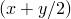
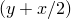

# 3.8.8 壳子模型

**产品：**Abaqus/Standard  Abaqus/Explicit  

### I. 弯曲测试

### 测试的单元

S3    S3R    S3RS    S4    S4R    S4RS    S4RSW    S8R    STRI3    

### 测试的功能

子模型功能应用于各种壳单元，每个节点6个自由度，承受弯曲载荷。全局分析和子模型分析都测试了各种组合：在Abaqus/Standard中使用一般静态和静态摄动程序，在Abaqus/Explicit中分析是动态和准静态的。

### 问题描述

**模型：**

所有全局模型在x-y平面中的尺寸为10.0×3.0，厚度为0.001，使用五个截面点。

**材料：**

| 杨氏模量 | 1×10^6 |
| --- | --- |
| 泊松比 | 0.3 |
| 密度 | 10 |

**载荷和边界条件：**

除文件[pgsf4srsgm.inp](../eif/pgsf4srsgm.inp)和[pssf4sr1gm.inp](../eif/pssf4sr1gm.inp)中定义的问题外，全局模型受到约束，使得沿y轴的节点的所有位移和旋转自由度都被抑制。然后模型中的所有单元承受1×10^7的正z方向的均匀压力载荷。在Abaqus/Explicit中，单元承受1×10^2的正z方向的均匀压力载荷。在Abaqus/Explicit中使用三角形壳的全局模型有三个步骤；但是，子模型分析有一个从第三个全局步骤驱动的步骤。这是有效的，因为在前两个步骤中惯性力不显著（过程是准静态的）。

在Abaqus/Standard文件[pgsf4srsgm.inp](../eif/pgsf4srsgm.inp)和[pssf4sr1gm.inp](../eif/pssf4sr1gm.inp)以及使用四边形壳的Abaqus/Explicit输入文件中，模型的一部分通过厚度有两个壳单元。模型的一端固定，而z方向的位移施加在另一端：一层壳施加正z方向，另一层施加相反方向。这是一种特殊情况，通常需要使用多个子模型以确保驱动节点被分配给正确的全局单元。

在输入文件[pgsf3srm.inp](../eif/pgsf3srm.inp)和[pssf3sr1.inp](../eif/pssf3sr1.inp)中使用高斯积分进行壳截面。

### 结果与讨论

子模型分析中所有驱动变量的幅值在全局分析文件输出中被正确识别，并应用于子模型分析中的驱动节点。

### 输入文件

##### **Abaqus/Standard输入文件**

[pgsf3srm.inp](../eif/pgsf3srm.inp)

S3/S3R单元；全局分析。

[pssf3sr1.inp](../eif/pssf3sr1.inp)

S3/S3R单元；子模型分析。

[pgsf3srmg.inp](../eif/pgsf3srmg.inp)

S3/S3R单元；[*SUBMODEL](../key/key-link.md#usb-kws-msubmodel)、GLOBAL ELSET；全局分析。

[pssf3sr1g.inp](../eif/pssf3sr1g.inp)

S3/S3R单元；[*SUBMODEL](../key/key-link.md#usb-kws-msubmodel)、GLOBAL ELSET；子模型分析。

[pgse4sfs.inp](../eif/pgse4sfs.inp)

S4单元；全局分析。

[psse4sf5.inp](../eif/psse4sf5.inp)

S4单元；子模型分析。

[pgsf4srs.inp](../eif/pgsf4srs.inp)

S4R单元；全局分析。

[pssf4sr1.inp](../eif/pssf4sr1.inp)

S4R单元；子模型分析。

[pgsf4srsgm.inp](../eif/pgsf4srsgm.inp)

S4R单元；多个[*SUBMODEL](../key/key-link.md#usb-kws-msubmodel)选项；全局分析。

[pssf4sr1gm.inp](../eif/pssf4sr1gm.inp)

S4R单元；多个[*SUBMODEL](../key/key-link.md#usb-kws-msubmodel)选项；子模型分析。

[pgs68srm.inp](../eif/pgs68srm.inp)

S8R单元；全局分析。

[pss68sr1.inp](../eif/pss68sr1.inp)

S8R单元；子模型分析。

[pgs63sfs.inp](../eif/pgs63sfs.inp)

STRI3单元；全局分析。

[pss63sf1.inp](../eif/pss63sf1.inp)

STRI3单元；子模型分析。

##### **Abaqus/Explicit输入文件**

[submodelshell_g_gel_s3r_xpl.inp](../eif/submodelshell_g_gel_s3r_xpl.inp)

S3R单元；[*SUBMODEL](../key/key-link.md#usb-kws-msubmodel)、GLOBAL ELSET；全局分析。

[submodelshell_s_gel_s3r_xpl.inp](../eif/submodelshell_s_gel_s3r_xpl.inp)

S3R单元；[*SUBMODEL](../key/key-link.md#usb-kws-msubmodel)、GLOBAL ELSET；子模型分析。

[submodelshell_g_s3r_xpl.inp](../eif/submodelshell_g_s3r_xpl.inp)

S3R单元；全局分析。

[submodelshell_s_s3r_xpl.inp](../eif/submodelshell_s_s3r_xpl.inp)

S3R单元；子模型分析。

[submodelshell_g_s3rs_xpl.inp](../eif/submodelshell_g_s3rs_xpl.inp)

S3RS单元；全局分析。

[submodelshell_s_s3rs_xpl.inp](../eif/submodelshell_s_s3rs_xpl.inp)

S3RS单元；子模型分析。

[submodelshell_g_s4_xpl.inp](../eif/submodelshell_g_s4_xpl.inp)

S4单元；全局分析。

[submodelshell_s_s4_xpl.inp](../eif/submodelshell_s_s4_xpl.inp)

S4单元；子模型分析。

[submodelshell_g_s4r_xpl.inp](../eif/submodelshell_g_s4r_xpl.inp)

S4R单元；全局分析。

[submodelshell_s_s4r_xpl.inp](../eif/submodelshell_s_s4r_xpl.inp)

S4R单元；子模型分析。

[submodelshell_g_m_s4r_xpl.inp](../eif/submodelshell_g_m_s4r_xpl.inp)

S4R单元；多个[*SUBMODEL](../key/key-link.md#usb-kws-msubmodel)选项；全局分析。

[submodelshell_s_m_s4r_xpl.inp](../eif/submodelshell_s_m_s4r_xpl.inp)

S4R单元；多个[*SUBMODEL](../key/key-link.md#usb-kws-msubmodel)选项；子模型分析。

[submodelshell_g_m_s4rs_xpl.inp](../eif/submodelshell_g_m_s4rs_xpl.inp)

S4RS单元；多个[*SUBMODEL](../key/key-link.md#usb-kws-msubmodel)选项；全局分析。

[submodelshell_s_m_s4rs_xpl.inp](../eif/submodelshell_s_m_s4rs_xpl.inp)

S4RS单元；多个[*SUBMODEL](../key/key-link.md#usb-kws-msubmodel)选项；子模型分析。

[submodelshell_g_m_s4rsw_xpl.inp](../eif/submodelshell_g_m_s4rsw_xpl.inp)

S4RSW单元；多个[*SUBMODEL](../key/key-link.md#usb-kws-msubmodel)选项；全局分析。

[submodelshell_s_m_s4rsw_xpl.inp](../eif/submodelshell_s_m_s4rsw_xpl.inp)

S4RSW单元；多个[*SUBMODEL](../key/key-link.md#usb-kws-msubmodel)选项；子模型分析。

### II. 膜测试

### 测试的单元

S4R5

### 测试的功能

子模型功能应用于两片壳单元，每个节点5个自由度，承受膜型载荷。全局分析和子模型分析都使用一般静态和静态摄动程序的各种组合。

### 问题描述

**模型：**

全局模型在x-y平面中的尺寸为0.24×0.12，厚度为0.001，使用五个截面点。

**材料：**

| 杨氏模量 | 1×10^6 |
| --- | --- |
| 泊松比 | 0.25 |

**载荷和边界条件：**

=10^3，=10^3，在所有外部节点。=0，在所有节点。

### 结果与讨论

子模型分析中所有驱动变量（这种情况下是平移自由度）的幅值在全局分析的文件输出中被正确识别，并应用于子模型分析中的驱动节点。

### 输入文件

[pgs54srs.inp](../eif/pgs54srs.inp)

S4R5单元；全局分析。

[pss54sr1.inp](../eif/pss54sr1.inp)

S4R5单元；子模型分析。

[pgs54srsg.inp](../eif/pgs54srsg.inp)

S4R5单元；[*SUBMODEL](../key/key-link.md#usb-kws-msubmodel)、GLOBAL ELSET；全局分析。

[pss54sr1g.inp](../eif/pss54sr1g.inp)

S4R5单元；[*SUBMODEL](../key/key-link.md#usb-kws-msubmodel)、GLOBAL ELSET；子模型分析。

### III. 热传递测试

### 测试的单元

DS3    DS6    DS8    

### 测试的功能

子模型功能应用于热传递分析中的壳单元网格。

### 问题描述

**模型：**

全局模型在x-y平面中的尺寸为10.0×3.0，厚度为0.001，使用三个截面点。

**材料：**

| 热传导率 | 1.0 |
| --- | --- |

**载荷和边界条件：**

在x=y=0处T=0.0；在x=10.0，y=3.0处T=100.0。

### 结果与讨论

子模型分析中的温度幅值在全局分析文件输出中被正确识别，并应用于子模型分析中的驱动节点。

### 输入文件

[pgs33dfh.inp](../eif/pgs33dfh.inp)

DS3单元；全局分析。

[pss33df1.inp](../eif/pss33df1.inp)

DS3单元；子模型分析。

[pgs36dfh.inp](../eif/pgs36dfh.inp)

DS6单元；全局分析。

[pss36df1.inp](../eif/pss36df1.inp)

DS6单元；子模型分析。

[pgs38dfh.inp](../eif/pgs38dfh.inp)

DS8单元；全局分析。

[pss38df1.inp](../eif/pss38df1.inp)

DS8单元；子模型分析。

### IV. 热应力分析

### 测试的单元

DS4    S4    S4R    

### 测试的功能

测试使用子模型技术的顺序耦合热应力分析。

### 问题描述

**模型：**

全局模型在x-z平面中的尺寸为3.0×2.0，厚度为0.001，使用三个截面点。

**材料：**

| 杨氏模量 | 1.0×10^6 |
| --- | --- |
| 泊松比 | 0.3 |
| 热传导率 | 4.85×10^4 |
| 热膨胀系数（） | 1.0×10^-6 |

**载荷和边界条件：**

在全局部热传递分析中，通过在板顶面的所有节点规定T=0，在底面的所有节点规定T=100，在模型中建立线性穿过厚度的温度梯度。热应力分析的全局模型受到约束，使得x=0处=0，x=0和x=3处=0，x=y=z=0处=0。

### 结果与讨论

在Abaqus中，可以通过三种方法中的任何一种完成顺序耦合热应力分析的子模型化。当由于网格不同而需要在模型之间对温度作为场变量进行插值时，必须从输出数据库读取温度，因为结果文件不支持温度插值。驱动变量可以使用结果文件或输出数据库进行插值。

**方法1**

1. 运行全局模型上的热传递分析，并输出节点温度。
2. 运行全局模型上的热应力分析，从先前的全局热传递分析中读取（可能插值）温度作为场变量。输出节点温度和位移。
3. 运行子模型分析，从全局热应力分析中读取（可能插值）温度作为场变量和位移。

**方法2**

1. 运行全局模型上的热传递分析，并输出节点温度。
2. 运行全局模型上的热应力分析，从先前的全局热传递分析中读取（可能插值）温度作为场变量。输出节点温度和位移。
3. 运行热应力子模型分析，从全局热传递分析中读取（可能插值）温度作为场变量，从全局热应力分析中读取位移。

**方法3**

1. 运行全局模型上的热传递分析，并输出节点温度。
2. 运行热传递子模型分析，从全局模型读取温度作为驱动。输出节点温度。
3. 运行热应力子模型分析，从先前的热传递子模型分析中读取（可能插值）温度作为场变量。

前两种方法利用了不同网格插值技术。

子模型分析中所有驱动变量的幅值在全局分析中被正确识别，并应用于子模型分析中的驱动节点。

### 输入文件

[pgs34dfq.inp](../eif/pgs34dfq.inp)

DS4单元；全局热传递分析。

[pss34df1.inp](../eif/pss34df1.inp)

DS4单元；子模型热传递分析。

[pgse4sfsc.inp](../eif/pgse4sfsc.inp)

S4单元；全局静态热应力分析。

[psse4sf5.inp](../eif/psse4sf5.inp)

S4单元；子模型静态热应力分析。

[pgsf4srq.inp](../eif/pgsf4srq.inp)

S4R单元；全局静态热应力分析。

[pssf4sr2.inp](../eif/pssf4sr2.inp)

S4R单元；子模型静态热应力分析。

[pssf4sr2_inter1.inp](../eif/pssf4sr2_inter1.inp)

从全局热传递分析插值温度的子模型热应力分析。

[pssf4sr2_inter2.inp](../eif/pssf4sr2_inter2.inp)

从全局热应力分析插值温度的子模型热应力分析。

[pssf4sr2_2odb_inter.inp](../eif/pssf4sr2_2odb_inter.inp)

从两个不同输出数据库文件（代表热传递分析）插值温度的子模型热应力分析。

### V. 有限旋转测试

### 测试的单元

S4R

### 测试的功能

子模型功能应用于壳单元，每个节点6个自由度，在大位移分析中承受旋转边界条件。在Abaqus/Standard中，全局分析和子模型分析都使用一般静态程序。在Abaqus/Explicit中，两个分析都使用动态程序。

### 问题描述

**模型：**

全局模型和子模型都使用单个单元，x-y平面中的尺寸为10.0×3.0，厚度为0.001。

**材料：**

| 杨氏模量 | 1×10^6 |
| --- | --- |
| 泊松比 | 0.3 |
| 密度 | 10 |

**边界条件：**

全局模型受到约束，使得沿y轴的节点的所有位移和旋转自由度都被抑制。剩余节点的旋转自由度在所有三个旋转分量上使用不同的幅值函数给出有限旋转边界条件。

### 结果与讨论

子模型分析中所有驱动变量的幅值在全局分析文件输出中被正确识别，并应用于子模型分析中的驱动节点。

### 输入文件

##### **Abaqus/Standard输入文件**

[pgsf4srr.inp](../eif/pgsf4srr.inp)

S4R单元；全局分析。

[pssf4sr3.inp](../eif/pssf4sr3.inp)

S4R单元；子模型分析。

##### **Abaqus/Explicit输入文件**

[submodelshell_grot_s4r_xpl.inp](../eif/submodelshell_grot_s4r_xpl.inp)

S4R单元；全局分析。

[submodelshell_srot_s4r_xpl.inp](../eif/submodelshell_srot_s4r_xpl.inp)

S4R单元；子模型分析。

### VI. 连续体壳单元

### 测试的单元

C3D8I    SC6R    SC8R    S4    

### 测试的功能

测试连续体壳单元的子模型功能。全局模型和子模型都使用一般静态程序。

### 问题描述

在所有问题中，全局模型是悬臂梁，一端承受集中载荷，另一端固定。子模型由包含固定端的部分悬臂梁组成。

### 结果与讨论

子模型分析中所有驱动变量的幅值在全局分析输出数据库中被正确识别，并应用于子模型分析中的驱动节点。

### 输入文件

[global_sc8r_c3d8i.inp](../eif/global_sc8r_c3d8i.inp)

SC8R单元；全局分析。

[sub_sc8r_c3d8i.inp](../eif/sub_sc8r_c3d8i.inp)

C3D8I单元；子模型分析。

[global_sc6r_c3d8i.inp](../eif/global_sc6r_c3d8i.inp)

SC6R单元；全局分析。

[sub_sc6r_c3d8i.inp](../eif/sub_sc6r_c3d8i.inp)

C3D8I单元；子模型分析。

[global_shell_sc8r.inp](../eif/global_shell_sc8r.inp)

S4单元；全局分析。

[sub_shell_sc8r.inp](../eif/sub_shell_sc8r.inp)

SC8R单元；子模型分析。

