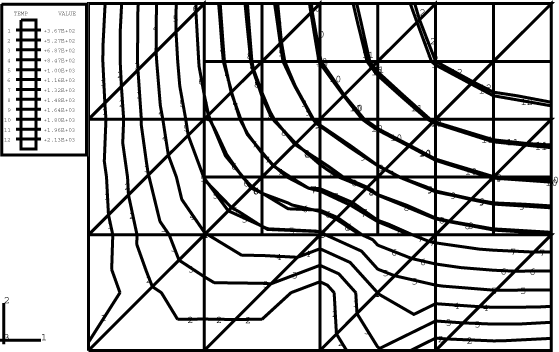

# 3.8.10 Heat transfer submodeling

**Products: **Abaqus/Standard  Abaqus/Explicit  

### Features tested

The submodeling capability is applied to heat transfer elements in Abaqus/Standard and to coupled temperature-displacement elements in Abaqus/Explicit. The thermal expansion coefficient is set to zero and dummy mechanical properties are used in Abaqus/Explicit analyses since only the thermal response is of interest. Three of the global model meshes are taken from element patch tests, while the fourth is a regular mesh. In Abaqus/Standard both steady-state and transient procedures are tested, while in Abaqus/Explicit the dynamic temperature-displacement procedure is used for all simulations.

### I. DC2D4, CPE4RT, CPS4RT elements

### Problem description

**Model: **

The geometry is taken from the patch test in [ec24dfp4.inp](../eif/ec24dfp4.inp).

The global model dimensions are 0.24  0.12 in the *x*–*y* plane with a thickness of 1.0. One side of the submodel lies along the right-hand side of the global model, while the other three sides of the submodel lie completely inside the global model.

**Material: **

| Conductivity | 4.85 10--4 |
| --- | --- |
| Density | 0.283 |
| Specific heat | 0.116 |

**Loading: **

A uniform film with a reference sink temperature of 75 and a film coefficient of 0.103 is applied along the left edge of the global model. Nodal temperatures of 48 and 60 are applied to the lower right and upper right nodes of the global model, respectively.

### Results and discussion

Transient heat transfer analysis is performed. The nodal temperatures for the driven nodes in the submodel are correctly interpolated from the global model results.

### Input files

##### **Abaqus/Standard input files**

[pgc24dfs.inp](../eif/pgc24dfs.inp)

Global analysis.

[psc24df1.inp](../eif/psc24df1.inp)

Submodel analysis.

##### **Abaqus/Explicit input files**

[submodelht_g_cpe4rt_xpl.inp](../eif/submodelht_g_cpe4rt_xpl.inp)

CPE4RT, global analysis.

[submodelht_g_cps4rt_xpl.inp](../eif/submodelht_g_cps4rt_xpl.inp)

CPS4RT, global analysis.

[submodelht_s_cpe4rt_xpl.inp](../eif/submodelht_s_cpe4rt_xpl.inp)

CPE4RT, submodel analysis.

[submodelht_s_cps4rt_xpl.inp](../eif/submodelht_s_cps4rt_xpl.inp)

CPE4RT, submodel analysis.

### II. DC2D6, CPE6MT, CPS6MT elements

### Problem description

**Model: **

The global model dimensions are 4  3 in the *x*–*y* plane with a thickness of 1.0. The submodel occupies the upper right-hand corner of the global model.

**Material: **

| Conductivity | 4.85 104 |
| --- | --- |
| Density | 0.283 |
| Specific heat | 0.116 |

**Loading: **

A body flux of 0.3 is applied on the entire global model and submodel. Nodal temperatures of 200 and 400 are prescribed along the left edge and the bottom edge of the global model, respectively.

### Results and discussion

In Abaqus/Standard steady-state heat transfer analysis is performed. In Abaqus/Explicit a transient analysis is performed over a period of time in which the steady-state regime is reached. The nodal temperatures for the driven nodes in the submodel are correctly interpolated from the global model results. In [Figure 3.8.10--1](ch03s08abv213.md#verheatsubmodel-contours) a temperature contour plot for the submodel overlays a contour plot of the global model. The temperature contours match at the boundaries between the global and submodels, showing that the driven nodal temperatures on the submodel are correct.

**Figure 3.8.10–1** Temperature contours in global model and submodel with DC2D6 elements.

### Input files

##### **Abaqus/Standard input files**

[pgc26dfs.inp](../eif/pgc26dfs.inp)

Global analysis.

[psc26df1.inp](../eif/psc26df1.inp)

Submodel analysis.

##### **Abaqus/Explicit input files**

[submodelht_g_cpe6mt_xpl.inp](../eif/submodelht_g_cpe6mt_xpl.inp)

CPE6MT, global analysis.

[submodelht_g_cps6mt_xpl.inp](../eif/submodelht_g_cps6mt_xpl.inp)

CPS6MT, global analysis.

[submodelht_s_cpe6mt_xpl.inp](../eif/submodelht_s_cpe6mt_xpl.inp)

CPE6MT, submodel analysis.

[submodelht_s_cps6mt_xpl.inp](../eif/submodelht_s_cps6mt_xpl.inp)

CPE6MT, submodel analysis.

### III. DC3D8, C3D8RT elements

### Problem description

**Model: **

The geometry is taken from the patch test in [ec38dfp4.inp](../eif/ec38dfp4.inp).

The global model dimensions are 1  1  1. The submodel lies completely inside the global model.

**Material: **

| Conductivity | 4.85 104 |
| --- | --- |
| Density | 0.283 |
| Specific heat | 0.116 |

**Loading: **

Nodal temperatures of 0 and 1000 are prescribed on the planes *y*=0 and *y*=1, respectively.

### Results and discussion

In Abaqus/Standard steady-state heat transfer analysis is performed. In Abaqus/Explicit a transient analysis is performed over a period of time in which the steady-state regime is reached. The nodal temperatures for the driven nodes in the submodel are correctly interpolated from the global model results.

### Input files

##### **Abaqus/Standard input files**

[pgc38dfs.inp](../eif/pgc38dfs.inp)

Global analysis.

[psc38df1.inp](../eif/psc38df1.inp)

Submodel analysis.

##### **Abaqus/Explicit input files**

[submodelht_g_c3d8rt_xpl.inp](../eif/submodelht_g_c3d8rt_xpl.inp)

C3D8RT, global analysis.

[submodelht_s_c3d8rt_xpl.inp](../eif/submodelht_s_c3d8rt_xpl.inp)

C3D8RT, submodel analysis.

### IV. DCAX8, CAX4RT elements

### Problem description

**Model: **

The geometry is taken from the patch test in [ec28dfp4.inp](../eif/ec28dfp4.inp).

The planar dimensions for the global model are 0.24  0.12. One side of the submodel lies along the right-hand side of the global model, while the remaining three sides of the submodel lie completely inside the global model.

**Material: **

| Conductivity | 4.85 104 |
| --- | --- |
| Density | 0.283 |
| Specific heat | 0.116 |

**Loading: **

A body force flux is applied on the entire model. A radiation load with a reference sink temperature of 1000 and a radiation constant of 10.  1013 is applied along the right edge. A nodal temperature of 900 is prescribed at nodes on the left edge and the middle nodes on the top and bottom edges.

### Results and discussion

In Abaqus/Standard steady-state heat transfer analysis is performed. In Abaqus/Explicit a transient analysis is performed over a period of time in which the steady-state regime is reached. The nodal temperatures for the driven nodes in the submodel are correctly interpolated from the global model results.

### Input files

##### **Abaqus/Standard input files**

[pgca8dfs.inp](../eif/pgca8dfs.inp)

Global analysis.

[psca8df1.inp](../eif/psca8df1.inp)

Submodel analysis.

##### **Abaqus/Explicit input files**

[submodelht_g_cax4rt_xpl.inp](../eif/submodelht_g_cax4rt_xpl.inp)

CAX4RT, global analysis.

[submodelht_s_cax4rt_xpl.inp](../eif/submodelht_s_cax4rt_xpl.inp)

CAX4RT, submodel analysis.

