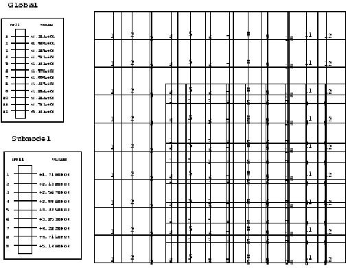
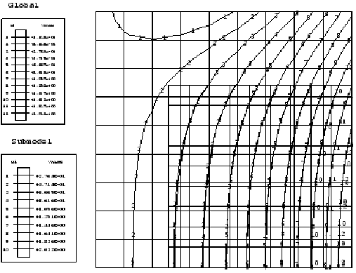
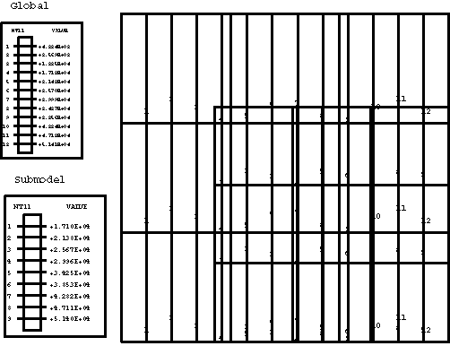
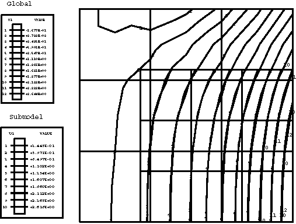
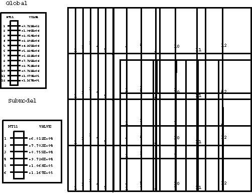
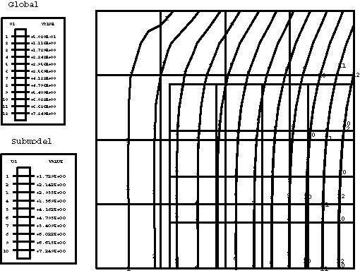
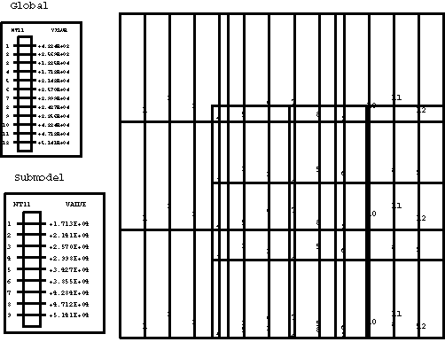
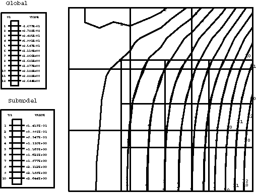

# 3.8.11 Coupled temperature-displacement submodeling

**Products: **Abaqus/Standard  Abaqus/Explicit  

### Elements tested

C3D8HT    C3D8RHT    C3D8RT    C3D4T    C3D6T    C3D8T    C3D20HT    C3D20RHT    C3D20RT    C3D20T    

CAX4HT    CAX4RHT    CAX3T    CAX4T    CAX4T    CAX6MHT    CAX6MT    CAX8HT    CAX8RHT    CAX4RT    CAX8RT    CAX8T    

CGAX3HT    CGAX3T    CGAX4HT    CGAX4RHT    CGAX4RT    CGAX4T    CGAX6MHT    CGAX6MT    CGAX8HT    CGAX8RHT    CGAX8RT    CGAX8T    

CPE4HT    CPE4RHT    CPE4T    CPE6MHT    CPE6MT    CPE8HT    CPE8RHT    CPE8RT    CPE3T    CPE4RT    CPE8T    

CPEG3T    CPEG4RHT    CPEG4RT    CPEG4T    CPEG6MHT    CPEG6MT    CPEG8T    

CPS4RT    CPS3T    CPS4T    CPS6MT    CPS8RT    CPS8T    

SC8RT    

### Features tested

The submodeling capability is applied to two-dimensional, three-dimensional, and axisymmetric continuum coupled temperature-displacement elements. General steps invoking the steady-state coupled temperature-displacement and the dynamic temperature-displacement procedures are used in Abaqus/Standard and Abaqus/Explicit, respectively, for both the global and submodel analyses.

### Problem description

**Model: **

All global models have dimensions 7.0  7.0 in the *x*–*y* or *r*–*z* plane. Each submodel has dimensions 5.0  5.0 in the *x*–*y* or *r*–*z* plane and occupies the lower right-hand corner of the corresponding global model. In all but the axisymmetric models, the out-of-plane dimension is 1.0. In axisymmetric models the structure analyzed is a hollow cylinder with an outer radius of 8.0.

**Material: **

In Abaqus/Standard:

| Young's modulus | 30 106 |
| --- | --- |
| Poisson's ratio | 0.3 |
| Coeff. of thermal expansion | 1 105 |
| Thermal conductivity | 3.77 105 |
| Specific heat | 0.39 |
| Density | 82.9 |

In Abaqus/Explicit:

| Young's modulus | 110 109 |
| --- | --- |
| Poisson's ratio | 0.3 |
| Coeff. of thermal expansion | 1 103 |
| Thermal conductivity | 390 |
| Specific heat | 384 |
| Density | 8900 |

**Loading: **

In all Abaqus/Standard models a distributed flux of magnitude 0.3 is applied to the right face; in Abaqus/Explicit the flux magnitude is 0.5 104.

**Boundary and initial conditions: **

In the global model fixed boundary conditions =0 and =0 are prescribed on the left and bottom faces, respectively. In three-dimensional models the additional constraints =0 are applied to the nodes on the front and back faces. The initial temperature is zero everywhere, and fixed temperature boundary conditions are applied on the left face. In the submodel =0 is prescribed everywhere on the bottom face, while degrees of freedom 1, 2, and 11 for the nodes on the top and left faces are being driven by the global solution. The mass scaling technique is used in the Abaqus/Explicit models to speed-up the analysis.

### Results and discussion

In the global analyses the temperature field predicted by Abaqus varies linearly in the *x*-direction in nonaxisymmetric models and logarithmically in the *r*-direction in axisymmetric models. The predicted displacement field is nonuniform in all models. The Abaqus/Standard results depicted for the temperature and *x*- or *r*-displacement contour plots are shown below. For comparison purposes the temperature and displacement solutions predicted by the submodels are also presented in the same contour plots, and excellent agreement between the global and submodel results is obtained. Hence, the amplitudes of all driven variables in the submodel analysis are identified correctly in the global analysis file output and applied at the driven nodes in the submodel analysis.

Global and submodel analyses results for 4-node plane stress elements in Abaqus/Standard are shown in [Figure 3.8.11--1](ch03s08abv214.md#vertempdispsubmodel-temp-plane4) and [Figure 3.8.11--2](ch03s08abv214.md#vertempdispsubmodel-ux-plane4).

Global and submodel Abaqus/Standard analyses results for 8-node plane strain elements are shown in [Figure 3.8.11--3](ch03s08abv214.md#vertempdispsubmodel-temp-plane8) and [Figure 3.8.11--4](ch03s08abv214.md#vertempdispsubmodel-ux-plane8).

Global and submodel Abaqus/Standard analyses results for 8-node axisymmetric elements are shown in [Figure 3.8.11--5](ch03s08abv214.md#vertempdispsubmodel-temp-axisym) and [Figure 3.8.11--6](ch03s08abv214.md#vertempdispsubmodel-ur-axisym).

Global and submodel Abaqus/Standard analyses results for 20-node brick elements (front face) are shown in [Figure 3.8.11--7](ch03s08abv214.md#vertempdispsubmodel-temp-brick) and [Figure 3.8.11--8](ch03s08abv214.md#vertempdispsubmodel-ux-brick).

In Abaqus/Explicit the driven temperatures and displacements in the submodel are correctly interpolated from the global analysis file output. Each of the two-dimensional, three-dimensional, or axisymmetric submodels can be driven from any global model that has the same dimensionality. The results between the global model and submodel agree extremely well.

### Input files

##### **Abaqus/Standard input files**

The following input files test the steady-state fully coupled thermal-stress procedure:

[pgc38ths.inp](../eif/pgc38ths.inp)

C3D8HT elements; global analysis.

[psc38ths.inp](../eif/psc38ths.inp)

C3D8HT elements; submodel analysis.

[pgc38tys.inp](../eif/pgc38tys.inp)

C3D8RHT elements; global analysis.

[psc38tys.inp](../eif/psc38tys.inp)

C3D8RHT elements; submodel analysis.

[pgc38trs.inp](../eif/pgc38trs.inp)

C3D8RT elements; global analysis.

[psc38trs.inp](../eif/psc38trs.inp)

C3D8RT elements; submodel analysis.

[pgc38tfs.inp](../eif/pgc38tfs.inp)

C3D8T elements; global analysis.

[psc38tfs.inp](../eif/psc38tfs.inp)

C3D8T elements; submodel analysis.

[pgc3kths.inp](../eif/pgc3kths.inp)

C3D20HT elements; global analysis.

[psc3kths.inp](../eif/psc3kths.inp)

C3D20HT elements; submodel analysis.

[pgc3ktys.inp](../eif/pgc3ktys.inp)

C3D20RHT elements; global analysis.

[psc3ktys.inp](../eif/psc3ktys.inp)

C3D20RHT elements; submodel analysis.

[pgc3ktrs.inp](../eif/pgc3ktrs.inp)

C3D20RT elements; global analysis.

[psc3ktrs.inp](../eif/psc3ktrs.inp)

C3D20RT elements; submodel analysis.

[pgc3ktfs.inp](../eif/pgc3ktfs.inp)

C3D20T elements; global analysis.

[psc3ktfs.inp](../eif/psc3ktfs.inp)

C3D20T elements; submodel analysis.

[pgca4ths.inp](../eif/pgca4ths.inp)

CAX4HT elements; global analysis.

[psca4ths.inp](../eif/psca4ths.inp)

CAX4HT elements; submodel analysis.

[pgca4tys.inp](../eif/pgca4tys.inp)

CAX4RHT elements; global analysis.

[psca4tys.inp](../eif/psca4tys.inp)

CAX4RHT elements; submodel analysis.

[pgca4trs.inp](../eif/pgca4trs.inp)

CAX4RT elements; global analysis.

[psca4trs.inp](../eif/psca4trs.inp)

CAX4RT elements; submodel analysis.

[pgca4tfs.inp](../eif/pgca4tfs.inp)

CAX4T elements; global analysis.

[psca4tfs.inp](../eif/psca4tfs.inp)

CAX4T elements; submodel analysis.

[pgca6ths.inp](../eif/pgca6ths.inp)

CAX6MHT elements; global analysis.

[psca6ths.inp](../eif/psca6ths.inp)

CAX6MHT elements; submodel analysis.

[pgca6tfs.inp](../eif/pgca6tfs.inp)

CAX6MT elements; global analysis.

[psca6tfs.inp](../eif/psca6tfs.inp)

CAX6MT elements; submodel analysis.

[pgca8ths.inp](../eif/pgca8ths.inp)

CAX8HT elements; global analysis.

[psca8ths.inp](../eif/psca8ths.inp)

CAX8HT elements; submodel analysis.

[pgca8tys.inp](../eif/pgca8tys.inp)

CAX8RHT elements; global analysis.

[psca8tys.inp](../eif/psca8tys.inp)

CAX8RHT elements; submodel analysis.

[pgca8trs.inp](../eif/pgca8trs.inp)

CAX8RT elements; global analysis.

[psca8trs.inp](../eif/psca8trs.inp)

CAX8RT elements; submodel analysis.

[pgca8tfs.inp](../eif/pgca8tfs.inp)

CAX8T elements; global analysis.

[psca8tfs.inp](../eif/psca8tfs.inp)

CAX8T elements; submodel analysis.

[pgca3hhs.inp](../eif/pgca3hhs.inp)

CGAX3HT elements; global analysis.

[psca3hhs.inp](../eif/psca3hhs.inp)

CGAX3HT elements; submodel analysis.

[pgca3hfs.inp](../eif/pgca3hfs.inp)

CGAX3T elements; global analysis.

[psca3hfs.inp](../eif/psca3hfs.inp)

CGAX3T elements; submodel analysis.

[pgca4hhs.inp](../eif/pgca4hhs.inp)

CGAX4HT elements; global analysis.

[psca4hhs.inp](../eif/psca4hhs.inp)

CGAX4HT elements; submodel analysis.

[pgca4hys.inp](../eif/pgca4hys.inp)

CGAX4RHT elements; global analysis.

[psca4hys.inp](../eif/psca4hys.inp)

CGAX4RHT elements; submodel analysis.

[pgca4hrs.inp](../eif/pgca4hrs.inp)

CGAX4RT elements; global analysis.

[psca4hrs.inp](../eif/psca4hrs.inp)

CGAX4RT elements; submodel analysis.

[pgca4hfs.inp](../eif/pgca4hfs.inp)

CGAX4T elements; global analysis.

[psca4hfs.inp](../eif/psca4hfs.inp)

CGAX4T elements; submodel analysis.

[pgca6hhs.inp](../eif/pgca6hhs.inp)

CGAX6MHT elements; global analysis.

[psca6hhs.inp](../eif/psca6hhs.inp)

CGAX6MHT elements; submodel analysis.

[pgca6hfs.inp](../eif/pgca6hfs.inp)

CGAX6MT elements; global analysis.

[psca6hfs.inp](../eif/psca6hfs.inp)

CGAX6MT elements; submodel analysis.

[pgca8hhs.inp](../eif/pgca8hhs.inp)

CGAX8HT elements; global analysis.

[psca8hhs.inp](../eif/psca8hhs.inp)

CGAX8HT elements; submodel analysis.

[pgca8hys.inp](../eif/pgca8hys.inp)

CGAX8RHT elements; global analysis.

[psca8hys.inp](../eif/psca8hys.inp)

CGAX8RHT elements; submodel analysis.

[pgca8hrs.inp](../eif/pgca8hrs.inp)

CGAX8RT elements; global analysis.

[psca8hrs.inp](../eif/psca8hrs.inp)

CGAX8RT elements; submodel analysis.

[pgca8hfs.inp](../eif/pgca8hfs.inp)

CGAX8T elements; global analysis.

[psca8hfs.inp](../eif/psca8hfs.inp)

CGAX8T elements; submodel analysis.

[pgce4ths.inp](../eif/pgce4ths.inp)

CPE4HT elements; global analysis.

[psce4ths.inp](../eif/psce4ths.inp)

CPE4HT elements; submodel analysis.

[pgce4tys.inp](../eif/pgce4tys.inp)

CPE4RHT elements; global analysis.

[psce4tys.inp](../eif/psce4tys.inp)

CPE4RHT elements; submodel analysis.

[pgce4trs.inp](../eif/pgce4trs.inp)

CPE4RT elements; global analysis.

[psce4trs.inp](../eif/psce4trs.inp)

CPE4RT elements; submodel analysis.

[pgce4tfs.inp](../eif/pgce4tfs.inp)

CPE4T elements; global analysis.

[psce4tfs.inp](../eif/psce4tfs.inp)

CPE4T elements; submodel analysis.

[pgce4tfsg.inp](../eif/pgce4tfsg.inp)

CPE4T elements; [*SUBMODEL](../key/key-link.md#usb-kws-msubmodel), GLOBAL ELSET; global analysis.

[psce4tfsg.inp](../eif/psce4tfsg.inp)

CPE4T elements; [*SUBMODEL](../key/key-link.md#usb-kws-msubmodel), GLOBAL ELSET; submodel analysis.

[pgce6ths.inp](../eif/pgce6ths.inp)

CPE6MHT elements; global analysis.

[psce6ths.inp](../eif/psce6ths.inp)

CPE6MHT elements; submodel analysis.

[pgce6tfs.inp](../eif/pgce6tfs.inp)

CPE6MT elements; global analysis.

[psce6tfs.inp](../eif/psce6tfs.inp)

CPE6MT elements; submodel analysis.

[pgce8ths.inp](../eif/pgce8ths.inp)

CPE8HT elements; global analysis.

[psce8ths.inp](../eif/psce8ths.inp)

CPE8HT elements; submodel analysis.

[pgce8tys.inp](../eif/pgce8tys.inp)

CPE8RHT elements; global analysis.

[psce8tys.inp](../eif/psce8tys.inp)

CPE8RHT elements; submodel analysis.

[pgce8trs.inp](../eif/pgce8trs.inp)

CPE8RT elements; global analysis.

[psce8trs.inp](../eif/psce8trs.inp)

CPE8RT elements; submodel analysis.

[pgce8tfs.inp](../eif/pgce8tfs.inp)

CPE8T elements; global analysis.

[psce8tfs.inp](../eif/psce8tfs.inp)

CPE8T elements; submodel analysis.

[pgcg3tfs.inp](../eif/pgcg3tfs.inp)

CPEG3T elements; global analysis.

[pscg3tfs.inp](../eif/pscg3tfs.inp)

CPEG3T elements; submodel analysis.

[pgcg4tys.inp](../eif/pgcg4tys.inp)

CPEG4RHT elements; global analysis.

[pscg4tys.inp](../eif/pscg4tys.inp)

CPEG4RHT elements; submodel analysis.

[pgcg4trs.inp](../eif/pgcg4trs.inp)

CPEG4RT elements; global analysis.

[pscg4trs.inp](../eif/pscg4trs.inp)

CPEG4RT elements; submodel analysis.

[pgcg4tfs.inp](../eif/pgcg4tfs.inp)

CPEG4T elements; global analysis.

[pscg4tfs.inp](../eif/pscg4tfs.inp)

CPEG4T elements; submodel analysis.

[pgcg4tfsg.inp](../eif/pgcg4tfsg.inp)

CPEG4T elements; [*SUBMODEL](../key/key-link.md#usb-kws-msubmodel), GLOBAL ELSET; global analysis.

[pscg4tfsg.inp](../eif/pscg4tfsg.inp)

CPEG4T elements; [*SUBMODEL](../key/key-link.md#usb-kws-msubmodel), GLOBAL ELSET; submodel analysis.

[pgcg6ths.inp](../eif/pgcg6ths.inp)

CPEG6MHT elements; global analysis.

[pscg6ths.inp](../eif/pscg6ths.inp)

CPEG6MHT elements; submodel analysis.

[pgcg6tfs.inp](../eif/pgcg6tfs.inp)

CPEG6MT elements; global analysis.

[pscg6tfs.inp](../eif/pscg6tfs.inp)

CPEG6MT elements; submodel analysis.

[pgcg8tfs.inp](../eif/pgcg8tfs.inp)

CPEG8T elements; global analysis.

[pscg8tfs.inp](../eif/pscg8tfs.inp)

CPEG8T elements; submodel analysis.

[pgcs4trs.inp](../eif/pgcs4trs.inp)

CPS4RT elements; global analysis.

[pscs4trs.inp](../eif/pscs4trs.inp)

CPS4RT elements; submodel analysis.

[pgcs4tfs.inp](../eif/pgcs4tfs.inp)

CPS4T elements; global analysis.

[pscs4tfs.inp](../eif/pscs4tfs.inp)

CPS4T elements; submodel analysis.

[pgcs6tfs.inp](../eif/pgcs6tfs.inp)

CPS6MT elements; global analysis.

[pscs6tfs.inp](../eif/pscs6tfs.inp)

CPS6MT elements; submodel analysis.

[pgcs8trs.inp](../eif/pgcs8trs.inp)

CPS8RT elements; global analysis.

[pscs8trs.inp](../eif/pscs8trs.inp)

CPS8RT elements; submodel analysis.

[pgcs8tfs.inp](../eif/pgcs8tfs.inp)

CPS8T elements; global analysis.

[pscs8tfs.inp](../eif/pscs8tfs.inp)

CPS8T elements; submodel analysis.

##### **Abaqus/Explicit input files**

[submcoupledtmp_g_c3d4t_xpl.inp](../eif/submcoupledtmp_g_c3d4t_xpl.inp)

C3D4T elements; global analysis.

[submcoupledtmp_s_c3d4t_xpl.inp](../eif/submcoupledtmp_s_c3d4t_xpl.inp)

C3D4T elements; submodel analysis.

[submcoupledtmp_g_c3d6t_xpl.inp](../eif/submcoupledtmp_g_c3d6t_xpl.inp)

C3D6T elements; global analysis.

[submcoupledtmp_s_c3d6t_xpl.inp](../eif/submcoupledtmp_s_c3d6t_xpl.inp)

C3D6T elements; submodel analysis.

[submcoupledtmp_g_c3d8rt_xpl.inp](../eif/submcoupledtmp_g_c3d8rt_xpl.inp)

C3D8RT elements; global analysis.

[submcoupledtmp_s_c3d8rt_xpl.inp](../eif/submcoupledtmp_s_c3d8rt_xpl.inp)

C3D8RT elements; submodel analysis.

[submcoupledtmp_g_sc8rt_xpl.inp](../eif/submcoupledtmp_g_sc8rt_xpl.inp)

SC8RT elements; global analysis.

[submcoupledtmp_s_sc8rt_xpl.inp](../eif/submcoupledtmp_s_sc8rt_xpl.inp)

SC8RT elements; submodel analysis.

[submcoupledtmp_g_cax3t_xpl.inp](../eif/submcoupledtmp_g_cax3t_xpl.inp)

CAX3T elements; global analysis.

[submcoupledtmp_s_cax3t_xpl.inp](../eif/submcoupledtmp_s_cax3t_xpl.inp)

CAX3T elements; submodel analysis.

[submcoupledtmp_g_cax4rt_xpl.inp](../eif/submcoupledtmp_g_cax4rt_xpl.inp)

CAX4RT elements; global analysis.

[submcoupledtmp_s_cax4rt_xpl.inp](../eif/submcoupledtmp_s_cax4rt_xpl.inp)

CAX4RT elements; submodel analysis.

[submcoupledtmp_g_cax6mt_xpl.inp](../eif/submcoupledtmp_g_cax6mt_xpl.inp)

CAX6MT elements; global analysis.

[submcoupledtmp_s_cax6mt_xpl.inp](../eif/submcoupledtmp_s_cax6mt_xpl.inp)

CAX6MT elements; submodel analysis.

[submcoupledtmp_g_cpe3t_xpl.inp](../eif/submcoupledtmp_g_cpe3t_xpl.inp)

CPE3T elements; global analysis.

[submcoupledtmp_s_cpe3t_xpl.inp](../eif/submcoupledtmp_s_cpe3t_xpl.inp)

CPE3T elements; submodel analysis.

[submcoupledtmp_g_cpe4rt_xpl.inp](../eif/submcoupledtmp_g_cpe4rt_xpl.inp)

CPE4RT elements; global analysis.

[submcoupledtmp_s_cpe4rt_xpl.inp](../eif/submcoupledtmp_s_cpe4rt_xpl.inp)

CPE4RT elements; submodel analysis.

[submcoupledtmp_g_cpe6mt_xpl.inp](../eif/submcoupledtmp_g_cpe6mt_xpl.inp)

CPE6MT elements; global analysis.

[submcoupledtmp_s_cpe6mt_xpl.inp](../eif/submcoupledtmp_s_cpe6mt_xpl.inp)

CPE6MT elements; submodel analysis.

[submcoupledtmp_g_cps3t_xpl.inp](../eif/submcoupledtmp_g_cps3t_xpl.inp)

CPS3T elements; global analysis.

[submcoupledtmp_s_cps3t_xpl.inp](../eif/submcoupledtmp_s_cps3t_xpl.inp)

CPS3T elements; submodel analysis.

[submcoupledtmp_g_cps4rt_xpl.inp](../eif/submcoupledtmp_g_cps4rt_xpl.inp)

CPS4RT elements; global analysis.

[submcoupledtmp_s_cps4rt_xpl.inp](../eif/submcoupledtmp_s_cps4rt_xpl.inp)

CPS4RT elements; submodel analysis.

[submcoupledtmp_g_cps6mt_xpl.inp](../eif/submcoupledtmp_g_cps6mt_xpl.inp)

CPS6MT elements; global analysis.

[submcoupledtmp_s_cps6mt_xpl.inp](../eif/submcoupledtmp_s_cps6mt_xpl.inp)

CPS6MT elements; submodel analysis.

### Figures

**Figure 3.8.11–1** Temperature contours in global and submodels: 4-node plane stress.

**Figure 3.8.11–2**  contours in global and submodels: 4-node plane stress.

**Figure 3.8.11–3** Temperature contours in global and submodels: 8-node plane strain.

**Figure 3.8.11–4**  contours in global and submodels: 8-node plane strain.

**Figure 3.8.11–5** Temperature contours in global and submodels: 8-node axisymmetric.

**Figure 3.8.11–6**  contours in global and submodels: 8-node axisymmetric.

**Figure 3.8.11–7** Temperature contours in global and submodels: 20-node brick.

**Figure 3.8.11–8**  contours in global and submodels: 20-node brick.

