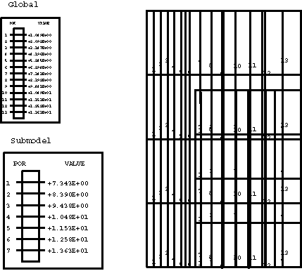
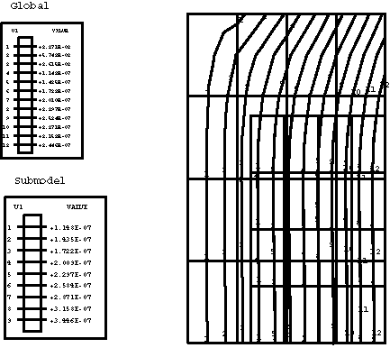
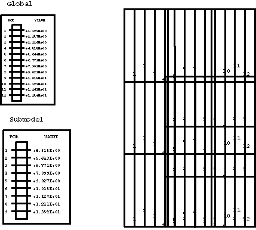
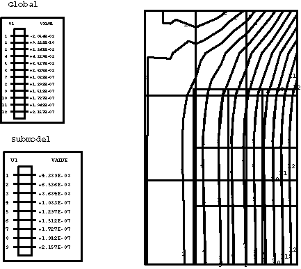

# 3.8.12 孔隙压力子模型

**产品：**Abaqus/Standard  

### 测试的单元

C3D8PH    C3D8PT    C3D10MP    C3D20P    C3D20RP    

CAX4RP    CAX6MP    CAX8P    CAX8RP    

CPE4P    CPE6MP    CPE8P    CPE8RP    

### 测试的功能

子模型功能应用于具有孔隙压力的二维、三维和轴对称连续体单元。全局分析和子模型分析都使用调用土壤固结程序的一般步骤。

### 问题描述

**模型：**

所有全局模型在x-y或r-z平面中的尺寸为3.0×5.0。每个子模型在x-y或r-z平面中的尺寸为2.05×3.45，占据相应全局模型的右下角。除轴对称模型外，平面外尺寸为1.0。在轴对称模型中，分析的结构是外半径为5.0的空心圆柱体。

**材料：**

| 杨氏模量 | 100×10^6 |
| --- | --- |
| 泊松比 | 0.0 |
| 渗透率 | 1×10^-5 |
| 密度 | 1.4142 |

**载荷：**

在所有模型中，大小为0.002的分布流施加在右面，汇孔隙压力为14.7。

**边界和初始条件：**

在全局模型中，固定边界条件=0和=0分别规定在左面和底面。在三维模型中，附加约束=0施加在前后面上的节点。初始孔隙比处处为单位一，固定孔隙压力边界条件施加在左面。在子模型中，=0规定在底面所有位置，而顶面和左面节点上的自由度1、2和8由全局解决方案驱动。

### 结果与讨论

在全局分析中，Abaqus预测的孔隙压力场在非轴对称模型中在x方向线性变化，在轴对称模型中在r方向对数变化。预测的位移场在所有模型中都是非均匀的。这些结果在下面显示的孔隙压力和x或r位移等值线图中描述。为了比较，子模型预测的孔隙压力和位移解决方案也显示在相同的等值线图中，全局和子模型结果之间获得了极好的一致性。因此，子模型分析中所有驱动变量的幅值在全局分析文件输出中被正确识别，并应用于子模型分析中的驱动节点。

[图3.8.12-1](ch03s08abv215.md#verppresssubmodel-ppress-plane8)和[图3.8.12-2](ch03s08abv215.md#verppresssubmodel-ux-plane8)中显示了在8节点平面应变单元的全局和子模型分析结果。

[图3.8.12-3](ch03s08abv215.md#verppresssubmodel-ppress-axisym)和[图3.8.12-4](ch03s08abv215.md#verppresssubmodel-ur-axisym)中显示了在8节点轴对称单元的全局和子模型分析结果。

[图3.8.12-5](ch03s08abv215.md#verppresssubmodel-ppress-brick)和[图3.8.12-6](ch03s08abv215.md#verppresssubmodel-ux-brick)中显示了在20节点砖单元（前表面）的全局和子模型分析结果。

### 输入文件

以下输入文件测试瞬态土壤固结程序。每个测试执行时间为1的瞬态固结计算的单一步骤。

[pgc38phd.inp](../eif/pgc38phd.inp)

C3D8PH单元；全局分析。

[psc38phd.inp](../eif/psc38phd.inp)

C3D8PH单元；子模型分析。

[pgc3apkd.inp](../eif/pgc3apkd.inp)

C3D10MP单元；全局分析。

[psc3apkd.inp](../eif/psc3apkd.inp)

C3D10MP单元；子模型分析。

[pgc3kpfd.inp](../eif/pgc3kpfd.inp)

C3D20P单元；全局分析。

[psc3kpfd.inp](../eif/psc3kpfd.inp)

C3D20P单元；子模型分析。

[pgc3kprd.inp](../eif/pgc3kprd.inp)

C3D20RP单元；全局分析。

[psc3kprd.inp](../eif/psc3kprd.inp)

C3D20RP单元；子模型分析。

[pgca4prd.inp](../eif/pgca4prd.inp)

CAX4RP单元；全局分析。

[psca4prd.inp](../eif/psca4prd.inp)

CAX4RP单元；子模型分析。

[pgca6pkd.inp](../eif/pgca6pkd.inp)

CAX6MP单元；全局分析。

[psca6pkd.inp](../eif/psca6pkd.inp)

CAX6MP单元；子模型分析。

[pgca8pfd.inp](../eif/pgca8pfd.inp)

CAX8P单元；全局分析。

[psca8pfd.inp](../eif/psca8pfd.inp)

CAX8P单元；子模型分析。

[pgca8prd.inp](../eif/pgca8prd.inp)

CAX8RP单元；全局分析。

[psca8prd.inp](../eif/psca8prd.inp)

CAX8RP单元；子模型分析。

[pgce4pfd.inp](../eif/pgce4pfd.inp)

CPE4P单元；全局分析。

[psce4pfd.inp](../eif/psce4pfd.inp)

CPE4P单元；子模型分析。

[pgce6pkd.inp](../eif/pgce6pkd.inp)

CPE6MP单元；全局分析。

[psce6pkd.inp](../eif/psce6pkd.inp)

CPE6MP单元；子模型分析。

[pgce8pfd.inp](../eif/pgce8pfd.inp)

CPE8P单元；全局分析。

[psce8pfd.inp](../eif/psce8pfd.inp)

CPE8P单元；子模型分析。

[pgce8prd.inp](../eif/pgce8prd.inp)

CPE8RP单元；全局分析。

[psce8prd.inp](../eif/psce8prd.inp)

CPE8RP单元；子模型分析。

[ctp_gbmodel.inp](../eif/ctp_gbmodel.inp)

C3D8PT单元；全局分析。

[ctp_sbmodel.inp](../eif/ctp_sbmodel.inp)

C3D8PT单元；子模型分析。

### 图片

**图3.8.12-1** 全局和子模型中的孔隙压力等值线：8节点平面应变。

**图3.8.12-2** 全局和子模型中的等值线：8节点平面应变。

**图3.8.12-3** 全局和子模型中的孔隙压力等值线：8节点轴对称。

**图3.8.12-4** 全局和子模型中的等值线：8节点轴对称。

**图3.8.12-5** 全局和子模型中的孔隙压力等值线：20节点砖。

**图3.8.12-6** 全局和子模型中的等值线：20节点砖。

