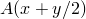
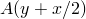

# 3.8.15 Shell-to-solid submodeling

**Products: **Abaqus/Standard  Abaqus/Explicit  

### I. In-plane loading

### Elements tested

C3D8I    C3D8R    C3D20R    S3R    S3RS    S4    S4R    S4RS    S4RSW    S8R    STRI3    

### Features tested

The submodeling capability is tested on patches of shell elements, with 6 degrees of freedom per node, subject to in-plane loading. In Abaqus/Standard general static, static perturbation, dynamic, and steady-state dynamic procedures are used in various combinations for both the global and submodel analyses. A general, nonlinear static procedure (using NLGEOM) is also included in a separate global and submodel analysis. In Abaqus/Explicit an explicit dynamic procedure (with NLGEOM=NO) is used for both the global and the submodel analyses. The dynamic and explicit dynamic procedures are also tested using NLGEOM=YES in both the global and submodel analyses.

### Problem description

**Model: **

All global models have dimensions 0.24  0.12 in the *x*–*y* plane and use five section points through the thickness of 0.0125.

**Material: **

| Young's modulus | 1 106 |
| --- | --- |
| Poisson's ratio | 0.25 |
| Density | 1.0 |

**Loading and boundary conditions: **

 = ,  =  at all exterior nodes, and  = 0 at all nodes. *A* = 103 in the first step and changes from step to step. In the solid submodel this boundary condition is applied to all faces except the face parallel to the *y*–*z* plane at *x* = 0.12. The latter is driven by the global model.

### Results and discussion

The amplitudes of all driven variables in the submodel analysis are correctly identified in the global analysis file output and applied at the driven nodes in the submodel analysis.

### Input files

##### **Abaqus/Standard input files**

[pgsf3srmp.inp](../eif/pgsf3srmp.inp)

S3R elements; global analysis.

[psc38simp1.inp](../eif/psc38simp1.inp)

S3R/C3D8I elements; submodel analysis.

[psc3ksrmp1.inp](../eif/psc3ksrmp1.inp)

S3R/C3D20R elements; submodel analysis.

[pgse4srmp.inp](../eif/pgse4srmp.inp)

S4 elements; global analysis.

[psc38simp5.inp](../eif/psc38simp5.inp)

S4/C3D8I elements; submodel analysis.

[psc3ksrmp5.inp](../eif/psc3ksrmp5.inp)

S4/C3D20R elements; submodel analysis.

[pgse4srmpgm.inp](../eif/pgse4srmpgm.inp)

S4 elements; multiple [*SUBMODEL](../key/key-link.md#usb-kws-msubmodel) options; global analysis.

[psc38simp5gm.inp](../eif/psc38simp5gm.inp)

S4/C3D8I elements; multiple [*SUBMODEL](../key/key-link.md#usb-kws-msubmodel) options; submodel analysis.

[psc3ksrmp5gm.inp](../eif/psc3ksrmp5gm.inp)

S4/C3D20R elements; multiple [*SUBMODEL](../key/key-link.md#usb-kws-msubmodel) options; submodel analysis.

[pgsf4srmp.inp](../eif/pgsf4srmp.inp)

S4R elements; global analysis.

[psc38simp2.inp](../eif/psc38simp2.inp)

S4R/C3D8I elements; submodel analysis.

[psc3ksrmp2.inp](../eif/psc3ksrmp2.inp)

S4R/C3D20R elements; submodel analysis.

[pgsf8srmp.inp](../eif/pgsf8srmp.inp)

S8R elements; global analysis.

[psc38simp3.inp](../eif/psc38simp3.inp)

S8R/C3D8I elements; submodel analysis.

[psc3ksrmp3.inp](../eif/psc3ksrmp3.inp)

S8R/C3D20R elements; submodel analysis.

[pgs63srmp.inp](../eif/pgs63srmp.inp)

STRI3 elements; global analysis.

[psc38simp4.inp](../eif/psc38simp4.inp)

STRI3/C3D8I elements; submodel analysis.

[psc3ksrmp4.inp](../eif/psc3ksrmp4.inp)

STRI3/C3D20R elements; submodel analysis.

##### **General nonlinear static analyses (using NLGEOM)**

[pgsf3srsp.inp](../eif/pgsf3srsp.inp)

S3R elements; global analysis.

[psc38sisp1.inp](../eif/psc38sisp1.inp)

S3R/C3D8I elements; submodel analysis.

[psc3ksrsp1.inp](../eif/psc3ksrsp1.inp)

S3R/C3D20R elements; submodel analysis.

[pgse4srsp.inp](../eif/pgse4srsp.inp)

S4 elements; global analysis.

[psc38sisp5.inp](../eif/psc38sisp5.inp)

S4/C3D8I elements; submodel analysis.

[psc3ksrsp5.inp](../eif/psc3ksrsp5.inp)

S4/C3D20R elements; submodel analysis.

[pgse4srspgm.inp](../eif/pgse4srspgm.inp)

S4 elements; multiple [*SUBMODEL](../key/key-link.md#usb-kws-msubmodel) options; global analysis.

[psc38sisp5gm.inp](../eif/psc38sisp5gm.inp)

S4/C3D8I elements; multiple [*SUBMODEL](../key/key-link.md#usb-kws-msubmodel) options; submodel analysis.

[psc3ksrsp5gm.inp](../eif/psc3ksrsp5gm.inp)

S4/C3D20R elements; multiple [*SUBMODEL](../key/key-link.md#usb-kws-msubmodel) options; submodel analysis.

[pgsf4srsp.inp](../eif/pgsf4srsp.inp)

S4R elements; global analysis.

[psc38sisp2.inp](../eif/psc38sisp2.inp)

S4R/C3D8I elements; submodel analysis.

[psc3ksrsp2.inp](../eif/psc3ksrsp2.inp)

S4R/C3D20R elements; submodel analysis.

[pgsf8srsp.inp](../eif/pgsf8srsp.inp)

S8R elements; global analysis.

[psc38sisp3.inp](../eif/psc38sisp3.inp)

S8R/C3D8I elements; submodel analysis.

[psc3ksrsp3.inp](../eif/psc3ksrsp3.inp)

S8R/C3D20R elements; submodel analysis.

[pgs63srsp.inp](../eif/pgs63srsp.inp)

STRI3 elements; global analysis.

[psc38sisp4.inp](../eif/psc38sisp4.inp)

STRI3/C3D8I elements; submodel analysis.

[psc3ksrsp4.inp](../eif/psc3ksrsp4.inp)

STRI3/C3D20R elements; submodel analysis.

##### **Dynamic analyses (NLGEOM=YES)**

[substs_g_s4r_p_nl_std.inp](../eif/substs_g_s4r_p_nl_std.inp)

S4R element; global analysis.

[substs_s_shel_c3d8_p_nl_std.inp](../eif/substs_s_shel_c3d8_p_nl_std.inp)

C3D8 elements; submodel analysis.

##### **Abaqus/Explicit input files**

##### **NLGEOM=NO**

[substs_g_s3r_p_xpl.inp](../eif/substs_g_s3r_p_xpl.inp)

S3R element; global analysis.

[substs_g_s3rs_p_xpl.inp](../eif/substs_g_s3rs_p_xpl.inp)

S3RS element; global analysis.

[substs_g_s4r_p_xpl.inp](../eif/substs_g_s4r_p_xpl.inp)

S4R element; global analysis.

[substs_g_s4rs_p_xpl.inp](../eif/substs_g_s4rs_p_xpl.inp)

S4RS element; global analysis.

[substs_g_s4rsw_p_xpl.inp](../eif/substs_g_s4rsw_p_xpl.inp)

S4RSW element; global analysis.

[substs_s_shel_c3d8r_p_xpl.inp](../eif/substs_s_shel_c3d8r_p_xpl.inp)

C3D8R elements; submodel analysis.

##### **NLGEOM=YES**

[substs_g_s3r_p_nl_xpl.inp](../eif/substs_g_s3r_p_nl_xpl.inp)

S3R element; global analysis.

[substs_g_s3rs_p_nl_xpl.inp](../eif/substs_g_s3rs_p_nl_xpl.inp)

S3RS element; global analysis.

[substs_g_s4r_p_nl_xpl.inp](../eif/substs_g_s4r_p_nl_xpl.inp)

S4R element; global analysis.

[substs_g_s4rs_p_nl_xpl.inp](../eif/substs_g_s4rs_p_nl_xpl.inp)

S4RS element; global analysis.

[substs_g_s4rsw_p_nl_xpl.inp](../eif/substs_g_s4rsw_p_nl_xpl.inp)

S4RSW element; global analysis.

[substs_s_shel_c3d8r_p_nl_xpl.inp](../eif/substs_s_shel_c3d8r_p_nl_xpl.inp)

C3D8R elements; submodel analysis.

### II. Bending of cantilevered plate

### Elements tested

C3D8I    C3D8R    C3D20R    S3R    S3RS    S4    S4R    S4RS    S4RSW    S8R    STRI3    

### Features tested

The submodeling capability is tested on a flat plate with uniform geometry made up of various shell elements, with 6 degrees of freedom per node, at the global level and three-dimensional continuum elements at the submodel level, subject to a bending load. In Abaqus/Standard general static, static perturbation, dynamic, and steady-state dynamic procedures are used in various combinations for both the global and submodel analyses. A general, nonlinear static procedure (using NLGEOM) is also included in a separate global and submodel analysis. In Abaqus/Explicit an explicit dynamic procedure (with NLGEOM= NO) is used for both the global and the submodel analyses. The dynamic and explicit dynamic procedures are also tested using NLGEOM=YES in both the global and submodel analyses.

### Problem description

**Model: **

All global models have dimensions 10.0  3.0 in the *x*–*z* plane and use five section points through the thickness of 0.1.

**Material: **

| Young's modulus | 1 106 |
| --- | --- |
| Poisson's ratio | 0.3 |
| Density | 1.0 |

**Loading and boundary conditions: **

The global model is constrained such that all displacement and rotation degrees of freedom for nodes along the *y*-axis are suppressed. All elements in the global model are then subject to a uniform pressure load in the positive *z*-direction. The magnitude of the pressure varies from step to step. In the solid submodel the pressure is applied to a surface that corresponds to the midsurface of the shell elements.

### Results and discussion

The amplitudes of all driven variables in the submodel analysis are correctly identified in the global analysis file output and applied at the driven nodes in the submodel analysis. Contour plots of displacements and Mises stress obtained for the submodels agree well with the contour plots of displacements and Mises stress obtained for the same region in the global models.

### Input files

##### **Abaqus/Standard input files**

[pgsf3srmf.inp](../eif/pgsf3srmf.inp)

S3R elements; global analysis.

[psc38simf1.inp](../eif/psc38simf1.inp)

S3R/C3D8I elements; submodel analysis.

[psc3ksrmf1.inp](../eif/psc3ksrmf1.inp)

S3R/C3D20R elements; submodel analysis.

[pgse4srmf.inp](../eif/pgse4srmf.inp)

S4 elements; global analysis.

[psc38simf5.inp](../eif/psc38simf5.inp)

S4/C3D8I elements; submodel analysis.

[psc3ksrmf5.inp](../eif/psc3ksrmf5.inp)

S4/C3D20R elements; submodel analysis.

[pgsf4srmf.inp](../eif/pgsf4srmf.inp)

S4R elements; global analysis.

[psc38simf2.inp](../eif/psc38simf2.inp)

S4R/C3D8I elements; submodel analysis.

[psc3ksrmf2.inp](../eif/psc3ksrmf2.inp)

S4R/C3D20R elements; submodel analysis.

[pgsf8srmf.inp](../eif/pgsf8srmf.inp)

S8R elements; global analysis.

[psc38simf3.inp](../eif/psc38simf3.inp)

S8R/C3D8I elements; submodel analysis.

[psc3ksrmf3.inp](../eif/psc3ksrmf3.inp)

S8R/C3D20R elements; submodel analysis.

[pgs63srmf.inp](../eif/pgs63srmf.inp)

STRI3 elements; global analysis.

[psc38simf4.inp](../eif/psc38simf4.inp)

STRI3/C3D8I elements; submodel analysis.

[psc3ksrmf4.inp](../eif/psc3ksrmf4.inp)

STRI3/C3D20R elements; submodel analysis.

##### **General nonlinear static analyses (using NLGEOM)**

[pgsf3srsf.inp](../eif/pgsf3srsf.inp)

S3R elements; global analysis.

[psc38sisf1.inp](../eif/psc38sisf1.inp)

S3R/C3D8I elements; submodel analysis.

[psc3ksrsf1.inp](../eif/psc3ksrsf1.inp)

S3R/C3D20R elements; submodel analysis.

[pgse4srsf.inp](../eif/pgse4srsf.inp)

S4 elements; global analysis.

[psc38sisf5.inp](../eif/psc38sisf5.inp)

S4/C3D8I elements; submodel analysis.

[psc3ksrsf5.inp](../eif/psc3ksrsf5.inp)

S4/C3D20R elements; submodel analysis.

[pgsf4srsf.inp](../eif/pgsf4srsf.inp)

S4R elements; global analysis.

[psc38sisf2.inp](../eif/psc38sisf2.inp)

S4R/C3D8I elements; submodel analysis.

[psc3ksrsf2.inp](../eif/psc3ksrsf2.inp)

S4R/C3D20R elements; submodel analysis.

[pgsf8srsf.inp](../eif/pgsf8srsf.inp)

S8R elements; global analysis.

[psc38sisf3.inp](../eif/psc38sisf3.inp)

S8R/C3D8I elements; submodel analysis.

[psc3ksrsf3.inp](../eif/psc3ksrsf3.inp)

S8R/C3D20R elements; submodel analysis.

[pgs63srsf.inp](../eif/pgs63srsf.inp)

STRI3 elements; global analysis.

[psc38sisf4.inp](../eif/psc38sisf4.inp)

STRI3/C3D8I elements; submodel analysis.

[psc3ksrsf4.inp](../eif/psc3ksrsf4.inp)

STRI3/C3D20R elements; submodel analysis.

##### **Dynamic analyses (NLGEOM=YES)**

[substs_g_s4r_b_nl_std.inp](../eif/substs_g_s4r_b_nl_std.inp)

S4R element; global analysis.

[substs_s_shel_c3d8_b_nl_std.inp](../eif/substs_s_shel_c3d8_b_nl_std.inp)

C3D8 elements; submodel analysis.

##### **Abaqus/Explicit input files**

##### **NLGEOM=NO**

[substs_g_s3r_b_xpl.inp](../eif/substs_g_s3r_b_xpl.inp)

S3R element; global analysis.

[substs_g_s3rs_b_xpl.inp](../eif/substs_g_s3rs_b_xpl.inp)

S3RS element; global analysis.

[substs_g_s4r_b_xpl.inp](../eif/substs_g_s4r_b_xpl.inp)

S4R element; global analysis.

[substs_g_s4rs_b_xpl.inp](../eif/substs_g_s4rs_b_xpl.inp)

S4RS element; global analysis.

[substs_g_s4rsw_b_xpl.inp](../eif/substs_g_s4rsw_b_xpl.inp)

S4RSW element; global analysis.

[substs_s_shel_c3d8r_b_xpl.inp](../eif/substs_s_shel_c3d8r_b_xpl.inp)

C3D8R elements; submodel analysis.

##### **NLGEOM=YES**

[substs_g_s3r_b_nl_xpl.inp](../eif/substs_g_s3r_b_nl_xpl.inp)

S3R element; global analysis.

[substs_g_s3rs_b_nl_xpl.inp](../eif/substs_g_s3rs_b_nl_xpl.inp)

S3RS element; global analysis.

[substs_g_s4r_b_nl_xpl.inp](../eif/substs_g_s4r_b_nl_xpl.inp)

S4R element; global analysis.

[substs_g_s4rs_b_nl_xpl.inp](../eif/substs_g_s4rs_b_nl_xpl.inp)

S4RS element; global analysis.

[substs_g_s4rsw_b_nl_xpl.inp](../eif/substs_g_s4rsw_b_nl_xpl.inp)

S4RSW element; global analysis.

[substs_s_shel_c3d8r_b_nl_xpl.inp](../eif/substs_s_shel_c3d8r_b_nl_xpl.inp)

C3D8R elements; submodel analysis.

### III. Bending of cantilevered half-cylinder

### Elements tested

C3D8I    C3D8R    C3D20R    S3R    S3RS    S4    S4R    S4RS    S4RSW    S8R    STRI3    

### Features tested

The submodeling capability is tested on a half-cylinder consisting of various shell elements, with 6 degrees of freedom per node, at the global level and three-dimensional continuum elements at the submodel level, subject to a bending load. In Abaqus/Standard general static, static perturbation, dynamic, and steady-state dynamic procedures are used in various combinations for both the global and submodel analyses. A general, nonlinear static procedure (using NLGEOM) is also included in a separate global and submodel analysis. In Abaqus/Explicit an explicit dynamic procedure (with NLGEOM=NO) is used for both the global and the submodel analyses. The dynamic and explicit dynamic procedures are also tested using NLGEOM=YES in both the global and submodel analyses.

### Problem description

**Model: **

The global models have a radius of 10 and a length of 20 and use five section points through a thickness of 0.2.

**Material: **

| Young's modulus | 1 107 |
| --- | --- |
| Poisson's ratio | 0.3 |
| Density | 0.001 |

**Loading and boundary conditions: **

In the global model one end is completely constrained and a uniform upward pressure is applied to all the elements. The magnitude of the pressure is varied from step to step. In the solid submodel the pressure is applied on the lower face.

### Results and discussion

The amplitudes of all driven variables in the submodel analysis are correctly identified in the global analysis file output and applied at the driven nodes in the submodel analysis. Contour plots of displacements and Mises stress obtained for the submodels agree well with the contour plots of displacements and Mises stress obtained for the same region in the global models.

### Input files

##### **Abaqus/Standard input files**

##### **General static, static perturbation, and steady-state dynamic analyses**

[pgsf3srmc.inp](../eif/pgsf3srmc.inp)

S3R elements; global analysis.

[psc38simc1.inp](../eif/psc38simc1.inp)

S3R/C3D8I elements; submodel analysis.

[psc3ksrmc1.inp](../eif/psc3ksrmc1.inp)

S3R/C3D20R elements; submodel analysis.

[pgsf3srmcg.inp](../eif/pgsf3srmcg.inp)

S3R elements; [*SUBMODEL](../key/key-link.md#usb-kws-msubmodel), GLOBAL ELSET; global analysis.

[psc3ksrmc1g.inp](../eif/psc3ksrmc1g.inp)

S3R/C3D20R elements; [*SUBMODEL](../key/key-link.md#usb-kws-msubmodel), GLOBAL ELSET; submodel analysis.

[pgse4srmc.inp](../eif/pgse4srmc.inp)

S4 elements; global analysis.

[psc38simc5.inp](../eif/psc38simc5.inp)

S4/C3D8I elements; submodel analysis.

[psc3ksrmc5.inp](../eif/psc3ksrmc5.inp)

S4/C3D20R elements; submodel analysis.

[pgsf4srmc.inp](../eif/pgsf4srmc.inp)

S4R elements; global analysis.

[psc38simc2.inp](../eif/psc38simc2.inp)

S4R/C3D8I elements; submodel analysis.

[psc3ksrmc2.inp](../eif/psc3ksrmc2.inp)

S4R/C3D20R elements; submodel analysis.

[pgsf8srmc.inp](../eif/pgsf8srmc.inp)

S8R elements; global analysis.

[psc38simc3.inp](../eif/psc38simc3.inp)

S8R/C3D8I elements; submodel analysis.

[psc3ksrmc3.inp](../eif/psc3ksrmc3.inp)

S8R/C3D20R elements; submodel analysis.

[pgs63srmc.inp](../eif/pgs63srmc.inp)

STRI3 elements; global analysis.

[psc38simc4.inp](../eif/psc38simc4.inp)

STRI3/C3D8I elements; submodel analysis.

[psc3ksrmc4.inp](../eif/psc3ksrmc4.inp)

STRI3/C3D20R elements; submodel analysis.

##### **General nonlinear static analyses (using NLGEOM)**

[pgsf3srsc.inp](../eif/pgsf3srsc.inp)

S3R elements; global analysis.

[psc38sisc1.inp](../eif/psc38sisc1.inp)

S3R/C3D8I elements; submodel analysis.

[psc3ksrsc1.inp](../eif/psc3ksrsc1.inp)

S3R/C3D20R elements; submodel analysis.

[pgsf3srscg.inp](../eif/pgsf3srscg.inp)

S3R elements; [*SUBMODEL](../key/key-link.md#usb-kws-msubmodel), GLOBAL ELSET; global analysis.

[psc3ksrsc1g.inp](../eif/psc3ksrsc1g.inp)

S3R/C3D20R elements; [*SUBMODEL](../key/key-link.md#usb-kws-msubmodel), GLOBAL ELSET; submodel analysis.

[pgse4srsc.inp](../eif/pgse4srsc.inp)

S4 elements; global analysis.

[psc38sisc5.inp](../eif/psc38sisc5.inp)

S4/C3D8I elements; submodel analysis.

[psc3ksrsc5.inp](../eif/psc3ksrsc5.inp)

S4/C3D20R elements; submodel analysis.

[pgsf4srsc.inp](../eif/pgsf4srsc.inp)

S4R elements; global analysis.

[psc38sisc2.inp](../eif/psc38sisc2.inp)

S4R/C3D8I elements; submodel analysis.

[psc3ksrsc2.inp](../eif/psc3ksrsc2.inp)

S4R/C3D20R elements; submodel analysis.

[pgsf8srsc.inp](../eif/pgsf8srsc.inp)

S8R elements; global analysis.

[psc38sisc3.inp](../eif/psc38sisc3.inp)

S8R/C3D8I elements; submodel analysis.

[psc3ksrsc3.inp](../eif/psc3ksrsc3.inp)

S8R/C3D20R elements; submodel analysis.

[pgs63srsc.inp](../eif/pgs63srsc.inp)

STRI3 elements; global analysis.

[psc38sisc4.inp](../eif/psc38sisc4.inp)

STRI3/C3D8I elements; submodel analysis.

[psc3ksrsc4.inp](../eif/psc3ksrsc4.inp)

STRI3/C3D20R elements; submodel analysis.

##### **Dynamic analyses (NLGEOM=YES)**

[substs_g_s4r_c_nl_std.inp](../eif/substs_g_s4r_c_nl_std.inp)

S4R element; global analysis.

[substs_s_shel_c3d8_c_nl_std.inp](../eif/substs_s_shel_c3d8_c_nl_std.inp)

C3D8 elements; submodel analysis.

##### **Abaqus/Explicit input files**

##### **NLGEOM=NO**

[substs_g_s3r_c_xpl.inp](../eif/substs_g_s3r_c_xpl.inp)

S3R element; global analysis.

[substs_g_s3rs_c_xpl.inp](../eif/substs_g_s3rs_c_xpl.inp)

S3RS element; global analysis.

[substs_g_s4r_c_xpl.inp](../eif/substs_g_s4r_c_xpl.inp)

S4R element; global analysis.

[substs_g_s4rs_c_xpl.inp](../eif/substs_g_s4rs_c_xpl.inp)

S4RS element; global analysis.

[substs_g_s4rsw_c_xpl.inp](../eif/substs_g_s4rsw_c_xpl.inp)

S4RSW element; global analysis.

[substs_s_shel_c3d8r_c_xpl.inp](../eif/substs_s_shel_c3d8r_c_xpl.inp)

C3D8R elements; submodel analysis.

##### **NLGEOM=YES**

[substs_g_s3r_c_nl_xpl.inp](../eif/substs_g_s3r_c_nl_xpl.inp)

S3R element; global analysis.

[substs_g_s3rs_c_nl_xpl.inp](../eif/substs_g_s3rs_c_nl_xpl.inp)

S3RS element; global analysis.

[substs_g_s4r_c_nl_xpl.inp](../eif/substs_g_s4r_c_nl_xpl.inp)

S4R element; global analysis.

[substs_g_s4rs_c_nl_xpl.inp](../eif/substs_g_s4rs_c_nl_xpl.inp)

S4RS element; global analysis.

[substs_g_s4rsw_c_nl_xpl.inp](../eif/substs_g_s4rsw_c_nl_xpl.inp)

S4RSW element; global analysis.

[substs_s_shel_c3d8r_c_nl_xpl.inp](../eif/substs_s_shel_c3d8r_c_nl_xpl.inp)

C3D8R elements; submodel analysis.

