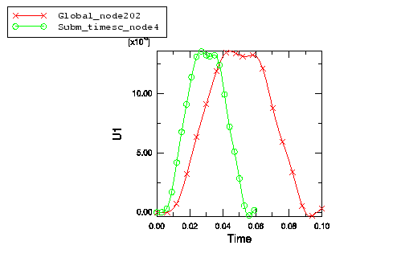

# 3.8.17 其他子模型测试

**产品：**Abaqus/Standard  Abaqus/Explicit  

### I. 在全局模型和子模型之间使用不同的程序

### 测试的单元

CAX4R    CPS3    CPS4R    C3D8R    C3D8RT    

### 测试的功能

子模型功能应用于全局模型和子模型之间的不同程序。全局程序可以在Abaqus/Explicit中执行，子模型程序在Abaqus/Standard中执行，反之亦然。当适用时，子模型边界条件用于调整驱动节点的时间变量以匹配子模型分析步骤时间。

### 问题描述

第一组问题基于["二维连续体应力/位移子模型，"第3.8.2节](ch03s08abv205.md)中描述的模型。然而，在这里使用的示例中，每个分析都有第二个压缩步骤。全局分析在Abaqus/Explicit中执行，子模型分析在Abaqus/Standard中执行。分析的步骤时间不同。由于Abaqus/Explicit作业是准静态的，而Abaqus/Standard作业是静态的，因此可以在子模型分析中使用TIMESCALE参数来调整驱动节点的时间变量以匹配子模型时间。

第二组测试基于["耦合温度-位移子模型，"第3.8.11节](ch03s08abv214.md)中描述的模型。全局模型使用C3D8R单元，问题是一个应力/位移分析。子模型使用C3D8RT单元，它是耦合温度-位移分析。此子模型分析的有效性基于温度效应在子模型层面相对较小的事实。

最后一组问题测试带有子模型的直接积分隐式动态程序。全局分析在Abaqus/Standard中执行，相应的子模型分析在Abaqus/Explicit中执行，反之亦然。

### 结果与讨论

所有驱动变量都从全局分析正确插值。[图3.8.17-1](ch03s08abv220.md#timescale)显示了TIMESCALE参数对在全局节点（非常靠近子模型节点）处形成的幅值的影响。如果分析的步骤时间相同，两条曲线将相同。

在第二组和第三组测试中，全局模型和子模型之间的结果非常一致。

### 输入文件

[submproc_g_quasi2static_xpl.inp](../eif/submproc_g_quasi2static_xpl.inp)

全局，TIMESCALE参数；Abaqus/Explicit准静态分析。

[submproc_s_quasi2static_std.inp](../eif/submproc_s_quasi2static_std.inp)

子模型，TIMESCALE参数；Abaqus/Standard静态分析。

[submproc_s_quasi2static_std_sb.inp](../eif/submproc_s_quasi2static_std_sb.inp)

子模型，TYPE=SURFACE参数；Abaqus/Standard静态分析。

[submproc_s_quasi2st_2nd_std.inp](../eif/submproc_s_quasi2st_2nd_std.inp)

子模型，TIMESCALE参数；二阶单元；Abaqus/Standard静态分析。

[submproc_g_dyn2tempdisp_xpl.inp](../eif/submproc_g_dyn2tempdisp_xpl.inp)

全局应力/位移分析；Abaqus/Explicit分析。

[submproc_s_dyn2tempdisp_xpl.inp](../eif/submproc_s_dyn2tempdisp_xpl.inp)

由应力/位移模型驱动的子模型耦合温度-位移；Abaqus/Explicit分析。

[submproc_s_dyn2tempdisp_std.inp](../eif/submproc_s_dyn2tempdisp_std.inp)

由应力/位移模型驱动的子模型耦合温度-位移；Abaqus/Standard分析。

[submodelaxielem_cax4r_gd_xpl.inp](../eif/submodelaxielem_cax4r_gd_xpl.inp)

全局[*DYNAMIC](../key/key-link.md#usb-kws-hdynamic)分析；Abaqus/Explicit分析。

[submodelaxielem_cax4r_sd_std.inp](../eif/submodelaxielem_cax4r_sd_std.inp)

子模型[*DYNAMIC](../key/key-link.md#usb-kws-hdynamic)分析；Abaqus/Standard分析。

[submodel2delem_cps4r_gd_std.inp](../eif/submodel2delem_cps4r_gd_std.inp)

全局[*DYNAMIC](../key/key-link.md#usb-kws-hdynamic)分析；Abaqus/Standard分析。

[submodel2delem_cps4r_sd_xpl.inp](../eif/submodel2delem_cps4r_sd_xpl.inp)

子模型[*DYNAMIC](../key/key-link.md#usb-kws-hdynamic)分析；Abaqus/Explicit分析。

### 图片

**图3.8.17-1** TIMESCALE参数对位于非常靠近子模型节点的全局节点处位移的影响。

### II. 声学-结构子模型

### 测试的单元

ACAX4R    AC2D4R    AC3D8R    AC3D20    AC3D8    

CAX4R    CPS4R    C3D8R    C3D8    C3D20    

SAX1    S4R    S8R    

### 测试的功能

子模型功能应用于耦合声学-结构模型。全局程序作为完全耦合声学-结构分析执行，其中两个介质通过使用绑定约束耦合。通过使用全局声学结构模型的声压对全局模型的 structural 分量执行子模型。

### 问题描述

在全局分析中，声压作用在平板的一侧或两侧。平板使用壳或实体单元建模。当压力作用在平板的两侧时，规定了声压应从中插值的正确侧面（参见["基于节点的子模型，"Abaqus分析用户指南第10.2.2节](../usb/usb-link.md#usb-anl-asubmodeldisp)）。全局模型中的流体和结构分别具有水和钢的材料特性。子模型具有钢的材料特性。对于Abaqus/Standard，直接积分隐式动态和稳态动态（直接和基于模式）程序已在单独测试中使用。

### 结果与讨论

从全局分析插值的声压产生的载荷正确地施加在单侧和双侧压力情况下的结构上。

### 输入文件

##### **Abaqus/Standard输入文件**

[ac2solid_g_c3d20_ac3d20_std.inp](../eif/ac2solid_g_c3d20_ac3d20_std.inp)

使用[*DYNAMIC](../key/key-link.md#usb-kws-hdynamic)的全局分析；流体在一侧；AC3D20和C3D20单元。

[ac2solid_s_c3d20_ac3d20_std.inp](../eif/ac2solid_s_c3d20_ac3d20_std.inp)

使用[*DYNAMIC](../key/key-link.md#usb-kws-hdynamic)的子模型分析；子模型在一侧由声压驱动，在第二侧由位移驱动；C3D20单元。

[ac2solid_g_c3d8_ac3d8_std.inp](../eif/ac2solid_g_c3d8_ac3d8_std.inp)

使用[*DYNAMIC](../key/key-link.md#usb-kws-hdynamic)的全局分析；流体在一侧；AC3D8和C3D8单元。

[ac2solid_s_c3d8_ac3d8_std.inp](../eif/ac2solid_s_c3d8_ac3d8_std.inp)

使用[*DYNAMIC](../key/key-link.md#usb-kws-hdynamic)的子模型分析；子模型在一侧由声压驱动，在第二侧由位移驱动；C3D8单元。

[ac2solid_g_s4_ac3d8_std.inp](../eif/ac2solid_g_s4_ac3d8_std.inp)

使用[*DYNAMIC](../key/key-link.md#usb-kws-hdynamic)的全局分析；流体在两侧；S4和AC3D8单元。

[ac2solid_s_s4_ac3d8_std.inp](../eif/ac2solid_s_s4_ac3d8_std.inp)

使用[*DYNAMIC](../key/key-link.md#usb-kws-hdynamic)的子模型分析；子模型在两侧由声压驱动；S4单元。

[ac2solid_s_s8r_ac3d8_std.inp](../eif/ac2solid_s_s8r_ac3d8_std.inp)

使用[*DYNAMIC](../key/key-link.md#usb-kws-hdynamic)的子模型分析；子模型在两侧由声压驱动；S8R单元。

[ac2solid_g_c3d8_ac3d8_ssd.inp](../eif/ac2solid_g_c3d8_ac3d8_ssd.inp)

使用[*STEADY STATE DYNAMICS](../key/key-link.md#usb-kws-hsteadystdyn)、DIRECT的全局分析；流体在一侧；AC3D8和C3D8单元。

[ac2solid_s_c3d8_ac3d8_ssd.inp](../eif/ac2solid_s_c3d8_ac3d8_ssd.inp)

使用[*STEADY STATE DYNAMICS](../key/key-link.md#usb-kws-hsteadystdyn)、DIRECT的子模型分析；子模型在一侧由声压驱动，在第二侧由位移驱动；C3D8单元。

##### **Abaqus/Explicit输入文件**

[ac2solid_g_c3d8r_ac3d8r_xpl.inp](../eif/ac2solid_g_c3d8r_ac3d8r_xpl.inp)

全局分析；流体在一侧；AC3D8R和C3D8R单元。

[ac2solid_s_c3d8r_ac3d8r_xpl.inp](../eif/ac2solid_s_c3d8r_ac3d8r_xpl.inp)

子模型分析；子模型在一侧由声压驱动，在第二侧由位移驱动；C3D8R单元。

[ac2solid_g_s4r_ac3d8r_xpl.inp](../eif/ac2solid_g_s4r_ac3d8r_xpl.inp)

全局分析；流体在两侧；S4R和AC3D8R单元。

[ac2solid_s_s4r_ac3d8r_xpl.inp](../eif/ac2solid_s_s4r_ac3d8r_xpl.inp)

子模型分析；子模型在两侧由声压驱动；S4R单元。

[ac2solid_g_cax4r_acax4r_xpl.inp](../eif/ac2solid_g_cax4r_acax4r_xpl.inp)

全局分析；流体在一侧；CAX4R和ACAX4R单元。

[ac2solid_s_cax4r_acax4r_xpl.inp](../eif/ac2solid_s_cax4r_acax4r_xpl.inp)

子模型分析；子模型在一侧由声压驱动，在第二侧由位移驱动；CAX4R单元。

[ac2solid_g_sax1_acax4r_xpl.inp](../eif/ac2solid_g_sax1_acax4r_xpl.inp)

全局分析；流体在两侧；SAX1和ACAX4R单元。

[ac2solid_s_sax1_acax4r_xpl.inp](../eif/ac2solid_s_sax1_acax4r_xpl.inp)

子模型分析；子模型在两侧由声压驱动；SAX1单元。

[ac2solid_g_cps4r_ac2d4r_xpl.inp](../eif/ac2solid_g_cps4r_ac2d4r_xpl.inp)

全局分析；流体在一侧；CPS4R和AC2D4R单元。

[ac2solid_s_cps4r_ac2d4r_xpl.inp](../eif/ac2solid_s_cps4r_ac2d4r_xpl.inp)

子模型分析；子模型在一侧由声压驱动，在第二侧由位移驱动；CPS4R单元。

### III. 仅交叉子模型

### 测试的单元

C3D8    C3D8P    C3D8R    

### 测试的功能

子模型功能使用仅交叉特征应用，其中在全局模型中找不到的节点被忽略而不是标记为错误。

### 问题描述

使用简单矩形棱柱模型。全局模型和子模型几何形状相同，但子模型在空间中偏移，因此模型的交叉代表子模型几何的子集。子模型中的所有节点都被识别为驱动节点。

### 结果与讨论

结果显示，子模型边界条件应用于位于全局模型内的驱动节点，而位于全局模型外的驱动节点没有施加子模型边界条件。

### 输入文件

##### **Abaqus/Standard输入文件**

[subm_intonly_g_c3d8_std.inp](../eif/subm_intonly_g_c3d8_std.inp)

使用C3D8单元的全局分析。

[subm_intonly_s_c3d8_std.inp](../eif/subm_intonly_s_c3d8_std.inp)

使用C3D8单元和驱动位移的子模型分析。

[subm_intonly_rs_c3d8_std.inp](../eif/subm_intonly_rs_c3d8_std.inp)

使用C3D8单元和驱动位移的子模型重启分析。

[subm_intonly_g_c3d8p_std.inp](../eif/subm_intonly_g_c3d8p_std.inp)

使用C3D8P单元的全局分析。

[subm_intonly_s_c3d8p_std.inp](../eif/subm_intonly_s_c3d8p_std.inp)

使用C3D8P单元以及驱动位移和孔隙压力的子模型分析。

##### **Abaqus/Explicit输入文件**

[subm_intonly_g_c3d8r_xpl.inp](../eif/subm_intonly_g_c3d8r_xpl.inp)

使用C3D8R单元的全局分析。

[subm_intonly_s_c3d8r_xpl.inp](../eif/subm_intonly_s_c3d8r_xpl.inp)

使用C3D8R单元和驱动位移的子模型分析。

