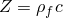
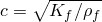
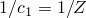
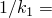
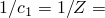
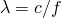
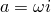
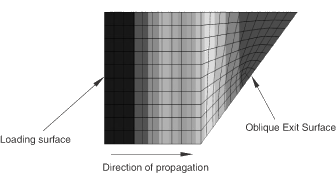

# 3.9.2 Impedance boundary conditions

**Products: **Abaqus/Standard  Abaqus/Explicit  

### I. Element-based and surface-based conditions

### Elements tested

AC1D2    AC1D3    

AC2D3    AC2D4    AC2D4R    AC2D6    AC2D8    

AC3D4    AC3D5    AC3D6    AC3D8    AC3D8R    AC3D10    AC3D15    AC3D20    

ACAX3    ACAX4    ACAX4R    ACAX6    ACAX8    

### Feature tested

Acoustic surface impedances on acoustic elements.

### Problem description

The impedance boundary conditions are tested in this verification set. The model consists of a column of fluid 10 meters high with a cross-sectional area of 1 m. The first-order element models consist of 20 acoustic elements: 20 high and one in the cross-section. The second-order element models consist of 10 elements along the height direction.

One end of the column has a surface impedance imposed on it that is set equal to the characteristic impedance of the fluid column, , where  is the density of the fluid and  is the speed of sound in the fluid. To simulate a nonreflecting boundary condition,  and  0 are set with an impedance boundary condition. The material used in these tests is air with the following properties: density,  1.293 kg/m3; bulk modulus,  1.42176  105 N/m2; and  2.3323  103 m2s/kg.

The other end of the column is excited by a harmonic pressure impulse of magnitude 1.0 N/m2. A steady-state dynamic analysis is performed in Abaqus/Standard over a range of frequencies from 0 to 100 Hz. Transient simulations are also performed in Abaqus/Explicit using an excitation frequency of 100 Hz. Different excitation frequencies can be tested by changing the parameters defined in the input files. The solution should represent a steady-state unattenuated wave moving in the positive *y*-direction. No resonating frequencies should result; the maximum pressure throughout the column should consistently remain at a magnitude of 1.0 N/m2, and the phase should drop by 2 radians over the distance of a wavelength, , where *f* is the excitation frequency in cycles per time.

### Results and discussion

With the meshes used in these tests, the results lie within 8% of the analytical solution for the first-order models and within 2% of the analytical solution for the second-order models. Finer meshes yield more accurate results.

### Input files

##### **Abaqus/Standard input files**

[ec12afar.inp](../eif/ec12afar.inp)

AC1D2 elements.

[ec13afar.inp](../eif/ec13afar.inp)

AC1D3 elements.

[ec23afar.inp](../eif/ec23afar.inp)

AC2D3 elements.

[ec24afar.inp](../eif/ec24afar.inp)

AC2D4 elements.

[ec26afar.inp](../eif/ec26afar.inp)

AC2D6 elements.

[ec28afar.inp](../eif/ec28afar.inp)

AC2D8 elements.

[ec34afar.inp](../eif/ec34afar.inp)

AC3D4 elements.

[ec35afar.inp](../eif/ec35afar.inp)

AC3D5 elements.

[ec36afar.inp](../eif/ec36afar.inp)

AC3D6 elements.

[ec38afar.inp](../eif/ec38afar.inp)

AC3D8 elements.

[ec3aafar.inp](../eif/ec3aafar.inp)

AC3D10 elements.

[ec3fafar.inp](../eif/ec3fafar.inp)

AC3D15 elements.

[ec3kafar.inp](../eif/ec3kafar.inp)

AC3D20 elements.

[eca3afar.inp](../eif/eca3afar.inp)

ACAX3 elements.

[eca4afar.inp](../eif/eca4afar.inp)

ACAX4 elements.

[eca6afar.inp](../eif/eca6afar.inp)

ACAX6 elements.

[eca8afar.inp](../eif/eca8afar.inp)

ACAX8 elements.

##### **Abaqus/Explicit input files**

[eca3afar_trans_xpl.inp](../eif/eca3afar_trans_xpl.inp)

ACAX3 elements.

[eca4arar_trans_xpl.inp](../eif/eca4arar_trans_xpl.inp)

ACAX4R elements.

[ec23afar_trans_xpl.inp](../eif/ec23afar_trans_xpl.inp)

AC2D3 elements.

[ec24arar_trans_xpl.inp](../eif/ec24arar_trans_xpl.inp)

AC2D4R elements.

[ec34afar_trans_xpl.inp](../eif/ec34afar_trans_xpl.inp)

AC3D4 elements.

[ec36afar_trans_xpl.inp](../eif/ec36afar_trans_xpl.inp)

AC3D6 elements.

[ec38arar_trans_xpl.inp](../eif/ec38arar_trans_xpl.inp)

AC3D8R elements.

### II. Nonreflective boundaries

### Elements tested

AC1D2    AC1D3    

AC2D3    AC2D4    AC2D6    AC2D8    

AC3D4    AC3D5    AC3D6    AC3D8    AC3D10    AC3D15    AC3D20    

### Feature tested

Nonreflective boundaries on each of the acoustic elements, using nonreflective impedance default conditions for steady-state dynamic analyses in Abaqus/Standard. All elements are tested using the direct-solution steady-state dynamic prodecure; the AC2D4, AC2D8, and AC3D8 elements are also tested using the subspace-based steady-state dynamic procedure.

### Problem description

These tests model a sound source at  0 m in a tube with significant volumetric drag (air properties with  1400 Ns/m4) and a nonreflective end condition at  0.5 m at a frequency of 100 Hz. The complex density of the acoustic medium is specified in a second part in these analyses. In each model the inward acceleration of the sound source is specified as the complex value , giving an inward velocity of 1 m/s. (The inward acceleration on a face is distributed to the nodes of the face as concentrated loads representing inward volume accelerations in the same way as pressure on a face would be distributed to the nodes of the face as concentrated loads representing nodal forces.) Because of the large drag, for good results at this frequency the constants  and  must both be nonzero and must be based on the complex impedance of the medium.

### Results and discussion

The results are within 1% of the analytical results, which are given as comments in the input files. The analytical result for the high-drag tests predicts exponential decay of pressure magnitude and linear dependence of pressure phase.

### Input files

[ec12afaw.inp](../eif/ec12afaw.inp)

AC1D2 elements.

[ec13afaw.inp](../eif/ec13afaw.inp)

AC1D3 elements.

[ec23afaw.inp](../eif/ec23afaw.inp)

AC2D3 elements.

[ec24afaw.inp](../eif/ec24afaw.inp)

AC2D4 elements.

[ec26afaw.inp](../eif/ec26afaw.inp)

AC2D6 elements.

[ec28afaw.inp](../eif/ec28afaw.inp)

AC2D8 elements.

[ec34afaw.inp](../eif/ec34afaw.inp)

AC3D4 elements.

[ec35afaw.inp](../eif/ec35afaw.inp)

AC3D5 elements.

[ec36afaw.inp](../eif/ec36afaw.inp)

AC3D6 elements.

[ec38afaw.inp](../eif/ec38afaw.inp)

AC3D8 elements.

[ec3aafaw.inp](../eif/ec3aafaw.inp)

AC3D10 elements.

[ec3fafaw.inp](../eif/ec3fafaw.inp)

AC3D15 elements.

[ec3kafaw.inp](../eif/ec3kafaw.inp)

AC3D20 elements.

[ec34afaw_ams.inp](../eif/ec34afaw_ams.inp)

AC3D4 elements, Abaqus/AMS.

[ec36afaw_ams.inp](../eif/ec36afaw_ams.inp)

AC3D6 elements, Abaqus/AMS.

[ec38afaw_ams.inp](../eif/ec38afaw_ams.inp)

AC3D8 elements, Abaqus/AMS.

[ec3aafaw_ams.inp](../eif/ec3aafaw_ams.inp)

AC3D10 elements, Abaqus/AMS.

[ec3fafaw_ams.inp](../eif/ec3fafaw_ams.inp)

AC3D15 elements, Abaqus/AMS.

[ec3kafaw_ams.inp](../eif/ec3kafaw_ams.inp)

AC3D20 elements, Abaqus/AMS.

[ec34afaw_sim.inp](../eif/ec34afaw_sim.inp)

AC3D4 elements.

[ec3aafaw_sim.inp](../eif/ec3aafaw_sim.inp)

AC3D10 elements.

### III. Improved planar boundary condition

### Elements tested

AC3D8    AC3D4    AC3D5    AC3D6    

AC2D4    AC2D3    

AC3D8R    AC2D4R    

### Features tested

Nonreflective boundaries on each of the acoustic elements, using the nonreflective impedance condition for transient dynamic analyses in Abaqus/Standard and Abaqus/Explicit. All elements are tested using either the direct-integration implicit dynamic procedure in Abaqus/Standard or the explicit dynamic procedure in Abaqus/Explicit.

### Problem description

These tests model one-dimensional propagation of sound in situations where the acoustic waves exit the acoustic domain through oblique boundaries. Various elementary geometric shapes are tested. In all models sinusoidal acoustic pressure boundary conditions are applied on one face of the acoustic domain, resulting in one-dimensional acoustic wave propagation in the model. The models are created so as to force the acoustic waves to exit from the model via surfaces that possess either continuously varying normals or normals that are not oriented in the same direction as the propagation of the waves. On the exit surface an impedance condition is used. The objective in all the models tested is to ensure that the problem remains one-dimensional and that there is no reflection of the acoustic waves back into the domain from the oblique boundary.

### Results and discussion

By studying the contour plots of the acoustic pressure (POR), it can be seen that the acoustic waves retain their directionality (one-dimensional and normal to the loading surface) even in the regions adjacent to the oblique boundary. For example, [Figure 3.9.2--1](ch03s09abv222.md#ver-imp-pl-rad) shows the contours of acoustic pressure in the case of a wedge-shaped model (brick45.inp) at the end of the analysis. As can be seen, the acoustic waves exit the boundary of the domain in exactly the same manner as they would if the boundary were normal to the outgoing plane waves.

**Figure 3.9.2–1** Acoustic pressure contours illustrating the effect of using an impedance condition to simulate a nonreflective boundary condition on an oblique surface.

### Input files

##### **Abaqus/Standard input files**

[brick45.inp](../eif/brick45.inp)

AC3D8 elements, oblique planar boundary.

[bricksphere.inp](../eif/bricksphere.inp)

AC3D8 elements, spherical boundary.

[quad45.inp](../eif/quad45.inp)

AC2D4 elements, oblique planar boundary.

[quadcirc.inp](../eif/quadcirc.inp)

AC2D4 elements, circular boundary.

[tet45.inp](../eif/tet45.inp)

AC3D4 elements, oblique planar boundary.

[tetsphere.inp](../eif/tetsphere.inp)

AC3D4 elements, spherical boundary.

[pyramid45.inp](../eif/pyramid45.inp)

AC3D5 elements, oblique planar boundary.

[pyramidsphere.inp](../eif/pyramidsphere.inp)

AC3D5 elements, spherical boundary.

[tri45.inp](../eif/tri45.inp)

AC2D3 elements, oblique planar boundary.

[triacirc.inp](../eif/triacirc.inp)

AC2D3 elements, circular boundary.

[wed45.inp](../eif/wed45.inp)

AC3D6 elements, oblique planar boundary.

##### **Abaqus/Explicit input files**

[brick45_xpl.inp](../eif/brick45_xpl.inp)

AC3D8 elements, oblique planar boundary.

[bricksphere_xpl.inp](../eif/bricksphere_xpl.inp)

AC3D8 elements, spherical boundary.

[quad45_xpl.inp](../eif/quad45_xpl.inp)

AC2D4 elements, oblique planar boundary.

[quadcirc_xpl.inp](../eif/quadcirc_xpl.inp)

AC2D4 elements, circular boundary.

[tet45_xpl.inp](../eif/tet45_xpl.inp)

AC3D4 elements, oblique planar boundary.

[tetsphere_xpl.inp](../eif/tetsphere_xpl.inp)

AC3D4 elements, spherical boundary.

[tri45_xpl.inp](../eif/tri45_xpl.inp)

AC2D3 elements, oblique planar boundary.

[triacirc_xpl.inp](../eif/triacirc_xpl.inp)

AC2D3 elements, circular boundary.

[wed45_xpl.inp](../eif/wed45_xpl.inp)

AC3D6 elements, oblique planar boundary.

### IV. Acoustic interface elements

### Elements tested

ASI1    ASI2    ASI3    

ASI2A    ASI3A    

ASI4    ASI8    

AC1D2    AC1D3    

AC2D4    AC2D8    

ACAX4    ACAX8    

AC3D8    AC3D20    

### Feature tested

Acoustic interface elements in Abaqus/Standard.

### Problem description

For the ASI element tests the physical problem is similar to the nonreflective boundary test. Here, however, there is no volumetric drag, and a portion of the length of the body of air in the tube is modeled with truss elements. These are given Young's modulus and density to match the bulk modulus,  1.424  105 N/m2, and density,  1.21 kg/m3, of air. The rest of the tube is modeled with acoustic elements that have the properties of air. Acoustic-structural coupling is set up between the structural region and the acoustic region using ASI elements, and a nonreflective end condition is applied.

This problem is analyzed for the one-dimensional case using ASI1 elements, for the two-dimensional case using ASI2 and ASI3 elements, for the axisymmetric case using ASI2A and ASI3A elements, and for the three-dimensional case using ASI4 and ASI8 elements. All the nodes in these models are constrained such that they have only the horizontal translation degree of freedom to simulate one-dimensional wave propagation.

### Results and discussion

The results are within 1% of the analytical results, which are given as comments in the input files.

### Input files

[ec12afai.inp](../eif/ec12afai.inp)

ASI1/AC1D2 elements.

[ec13afai.inp](../eif/ec13afai.inp)

ASI1/AC1D3 elements.

[ec22afai.inp](../eif/ec22afai.inp)

ASI2/AC2D4 elements.

[ec23afai.inp](../eif/ec23afai.inp)

ASI3/AC2D8 elements.

[eca2afai.inp](../eif/eca2afai.inp)

ASI2A/ACAX4 elements.

[eca3afai.inp](../eif/eca3afai.inp)

ASI3A/ACAX8 elements.

[ec34afai.inp](../eif/ec34afai.inp)

ASI4/AC3D8 elements.

[ec38afai.inp](../eif/ec38afai.inp)

ASI8/AC3D20 elements.

### V. Impedance conditions on the semi-infinite sides of acoustic infinite elements

### Elements tested

ACIN2D2    ACIN2D3    

ACIN3D3    ACIN3D4    ACIN3D6    ACIN3D8    

ACINAX2    ACINAX3    

### Feature tested

Tabular impedance properties on each of the acoustic infinite elements for transient and steady-state dynamic analyses in Abaqus/Standard.

### Problem description

These tests compare the behavior of acoustic infinite elements with and without impedance conditions defined on the semi-infinite sides. In all models the acoustic infinite elements are coupled directly to structural elements using steel material properties. The acoustic infinite elements use air properties and an impedance condition on one semi-infinite side with a tabular value corresponding to one-half the material impedance. In the steady-state dynamic analyses the frequency is varied from 1 to 200 Hz. In the transient dynamic analyses the elements are excited using a sinusoidal amplitude with an angular frequency of 5.

### Results and discussion

The reductions in pressure amplitude due to the presence of the impedance condition on the acoustic infinite element sides are apparent in contour plots of the acoustic pressure.

### Input files

##### **Abaqus/Standard input files**

[ec2dafar_acin.inp](../eif/ec2dafar_acin.inp)

ACIN2D2 and ACIN2D3 elements, semi-infinite side impedance.

[ec2dafas_acin.inp](../eif/ec2dafas_acin.inp)

ACIN2D2 and ACIN2D3 elements, semi-infinite side impedance.

[ec3dafar_acin.inp](../eif/ec3dafar_acin.inp)

ACIN3D3, ACIN3D4, ACIN3D6, and ACIN3D8 elements, semi-infinite side impedance.

[ec3dafas_acin.inp](../eif/ec3dafas_acin.inp)

ACIN3D3, ACIN3D4, ACIN3D6, and ACIN3D8 elements, semi-infinite side impedance.

[ecaxafar_acin.inp](../eif/ecaxafar_acin.inp)

ACINAX2 and ACINAX3 elements, semi-infinite side impedance.

[ecaxafas_acin.inp](../eif/ecaxafas_acin.inp)

ACINAX2 and ACINAX3 elements, semi-infinite side impedance.

##### **Abaqus/Explicit input files**

[ec2dafas_acin_xpl.inp](../eif/ec2dafas_acin_xpl.inp)

ACIN2D2 elements, semi-infinite side impedance.

[ec3dafas_acin_xpl.inp](../eif/ec3dafas_acin_xpl.inp)

ACIN3D3 and ACIN3D4 elements, semi-infinite side impedance.

[ecaxafas_acin_xpl.inp](../eif/ecaxafas_acin_xpl.inp)

ACINAX2 elements, semi-infinite side impedance.

