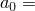
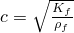
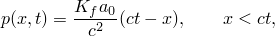
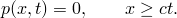

# 3.9.3 瞬态声波传播

**产品：**Abaqus/Standard  Abaqus/Explicit  

### 测试的单元

AC1D2    AC1D3    

AC2D3    AC2D4    AC2D4R    AC2D6    AC2D8    

AC3D4    AC3D5    AC3D6    AC3D8    AC3D8R    AC3D10    AC3D15    AC3D20    

ACAX3    ACAX4    ACAX4R    ACAX6    ACAX8    

ASI1    ASI2D2    ASI2D3    

ASI3D3    ASI3D4    ASI3D6    ASI3D8    

ASIAX2    ASIAX3    

### 测试的功能

具有无反射端条件的声学介质中的瞬态波传播。

### 问题描述

模型由一根长度为1 m、截面积恒定的流体柱组成。管水平放置（沿*x*轴），声学介质在 0 m处具有规定的恒定向内粒子加速度 1 m/s^2。在 1 m处使用无反射阻抗条件指定无反射边界。

柱中的声学材料是空气，体积模量 1.424×10^5 N/m^2，密度 1.21 kg/m^3。声速计算为 = 343.05 m/s。压力的解析结果为

柱使用100个一阶或50个二阶声学单元建模。对于每个测试的声学单元，加速度以两种方式指定：

1. 没有ASI单元或绑定约束，向内体积加速度在自由度8上指定为集中载荷（"afav"文件）。
2. 在Abaqus/Standard中，在 0处放置一个ASI单元，其法线指向流体（这激活了 0处节点上的位移自由度），而在Abaqus/Explicit中，使用具有绑定约束的结构单元来定义流体和结构之间的相互作用。加速度直接用边界条件规定（"afas"文件）。在这些情况下，分析的第一个时间间隔使用边界阻抗执行；分析继续使用表面阻抗进行

执行瞬态动态分析的时间足够长，以允许波传播通过无反射边界。

### 结果与讨论

对于Abaqus/Standard和Abaqus/Explicit，所有测试的压力结果与分析结果的误差在0.4%以内，线性四面体除外，其与分析结果的误差在3%以内。

### 输入文件

##### **Abaqus/Standard输入文件**

[ec12afav.inp](../eif/ec12afav.inp)

AC1D2单元。

[ec13afav.inp](../eif/ec13afav.inp)

AC1D3单元。

[ec23afav.inp](../eif/ec23afav.inp)

AC2D3单元。

[ec24afav.inp](../eif/ec24afav.inp)

AC2D4单元。

[ec26afav.inp](../eif/ec26afav.inp)

AC2D6单元。

[ec28afav.inp](../eif/ec28afav.inp)

AC2D8单元。

[ec34afav.inp](../eif/ec34afav.inp)

AC3D4单元。

[ec35afav.inp](../eif/ec35afav.inp)

AC3D5单元。

[ec36afav.inp](../eif/ec36afav.inp)

AC3D6单元。

[ec38afav.inp](../eif/ec38afav.inp)

AC3D8单元。

[ec3aafav.inp](../eif/ec3aafav.inp)

AC3D10单元。

[ec3fafav.inp](../eif/ec3fafav.inp)

AC3D15单元。

[ec3kafav.inp](../eif/ec3kafav.inp)

AC3D20单元。

[eca3afav.inp](../eif/eca3afav.inp)

ACAX3单元。

[eca4afav.inp](../eif/eca4afav.inp)

ACAX4单元。

[eca6afav.inp](../eif/eca6afav.inp)

ACAX6单元。

[eca8afav.inp](../eif/eca8afav.inp)

ACAX8单元。

[ec12afas.inp](../eif/ec12afas.inp)

ASI1/AC1D2单元。

[ec13afas.inp](../eif/ec13afas.inp)

ASI1/AC1D3单元。

[ec23afas.inp](../eif/ec23afas.inp)

ASI2D2/AC2D3单元。

[ec24afas.inp](../eif/ec24afas.inp)

ASI2D3/AC2D4单元。

[ec26afas.inp](../eif/ec26afas.inp)

ASI2D3/AC2D6单元。

[ec28afas.inp](../eif/ec28afas.inp)

ASI2D3/AC2D8单元。

[ec34afas.inp](../eif/ec34afas.inp)

ASI3D4/AC3D4单元。

[ec34afas_po.inp](../eif/ec34afas_po.inp)

[*POST OUTPUT](../key/key-link.md#usb-kws-hpostoutput)分析。

[ec36afas.inp](../eif/ec36afas.inp)

ASI3D3/ASI3D4/AC3D6单元。

[ec35afas.inp](../eif/ec35afas.inp)

ASI3D4/AC3D5单元。

[ec38afas.inp](../eif/ec38afas.inp)

ASI3D4/AC3D8单元。

[ec3aafas.inp](../eif/ec3aafas.inp)

ASI3D6/AC3D10单元。

[ec3fafas.inp](../eif/ec3fafas.inp)

ASI3D6/AC3D15单元。

[ec3kafas.inp](../eif/ec3kafas.inp)

ASI3D8/AC3D20单元。

[eca3afas.inp](../eif/eca3afas.inp)

ASIAX2/ACAX3单元。

[eca4afas.inp](../eif/eca4afas.inp)

ASIAX2/ACAX4单元。

[eca6afas.inp](../eif/eca6afas.inp)

ASIAX3/ACAX6单元。

[eca8afas.inp](../eif/eca8afas.inp)

ASIAX3/ACAX8单元。

##### **Abaqus/Explicit输入文件**

[eca3afav_xpl.inp](../eif/eca3afav_xpl.inp)

ACAX3单元。

[eca4arav_xpl.inp](../eif/eca4arav_xpl.inp)

ACAX4R单元。

[ec23afav_xpl.inp](../eif/ec23afav_xpl.inp)

AC2D3单元。

[ec24arav_xpl.inp](../eif/ec24arav_xpl.inp)

AC2D4R单元。

[ec34afav_xpl.inp](../eif/ec34afav_xpl.inp)

AC3D4单元。

[ec36afav_xpl.inp](../eif/ec36afav_xpl.inp)

AC3D6单元。

[ec38arav_xpl.inp](../eif/ec38arav_xpl.inp)

AC3D8R单元。

[eca3afas_xpl.inp](../eif/eca3afas_xpl.inp)

ACAX3单元。

[eca4aras_xpl.inp](../eif/eca4aras_xpl.inp)

ACAX4R单元。

[ec23afas_xpl.inp](../eif/ec23afas_xpl.inp)

AC2D3单元。

[ec24aras_xpl.inp](../eif/ec24aras_xpl.inp)

AC2D4R单元。

[ec34afas_xpl.inp](../eif/ec34afas_xpl.inp)

AC3D4单元。

[ec36afas_xpl.inp](../eif/ec36afas_xpl.inp)

AC3D6单元。

[ec38aras_xpl.inp](../eif/ec38aras_xpl.inp)

AC3D8R单元。

