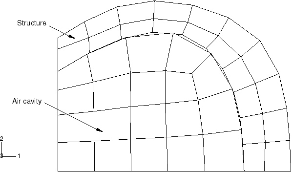
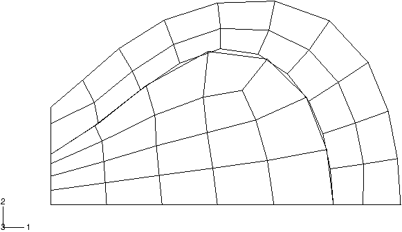
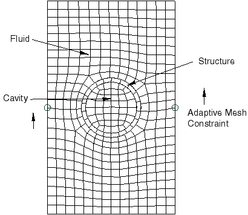
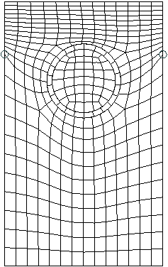
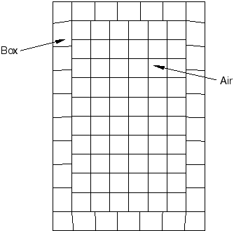
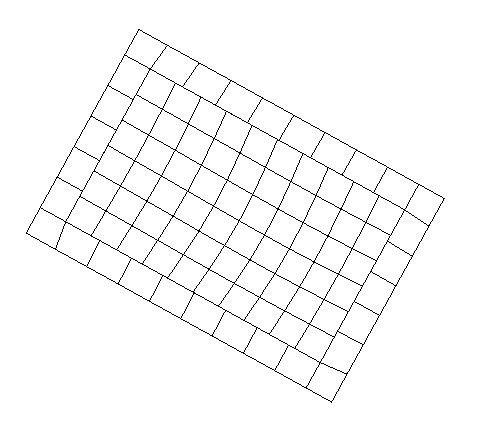

# 3.9.4 Adaptive meshing applied to coupled structural-acoustic problems

**Product: **Abaqus/Standard  

### I. Tire deflation with adaptive meshing

### Elements tested

ACAX4    ACAX8    

AC3D8    AC3D20    

### Features tested

Adaptive meshing, user-specified normal definition at a node, symmetric model generation, and symmetric boundary conditions.

### Problem description

**Model: **

A simple tire filled with air is analyzed, as shown in [Figure 3.9.4--1](ch03s09abv224.md#ver-am-tire-geom). We model half of the cross-section. A negative pressure is applied to the inside of the structure, causing a significant decrease in the volume of the acoustic domain. We apply adaptive mesh smoothing after each converged structural load increment to compute a new acoustic mesh. We extract the eigenvalues of the coupled system after the preloading is applied. These eigenvalues are compared with the eigenvalues obtained in an independent analysis in which no adaptive mesh smoothing is performed. In this reference analysis both the acoustic mesh and structural mesh are defined in the displaced configuration. We apply an initial stress state that is in equilibrium with the pressure load so that no deformation takes place. The displaced configuration for the acoustic mesh is extracted from the results file. The displaced configuration for the structural mesh as well as the associated solution state that serves as the initial condition are obtained when the reference configuration is updated.

We also perform the same analysis using a three-dimensional model. We generate the model using symmetric model generation.

This example tests a number of adaptive mesh smoothing features. The adaptive mesh domain contains different node types, including interior nodes, corner nodes, surface nodes, nodes tied to the structure, as well as acoustic nodes that are connected using a tie constraint. The different updating rules associated with each of these node types are tested. In addition, application of the pressure load causes the volume of the acoustic elements to become negative. This, in turn, causes geometric feature changes (a corner develops) along the vertical surface. To avoid the development of corners, we transfer the structural displacement over a series of sub-increments to the acoustic domain. Adaptive meshing is applied after each sub-increment. The development of the corner can also be avoided by applying adaptive mesh controls. Both features are tested. Finally, the normal direction on the surface between the acoustic domain and structural domain is not computed correctly by Abaqus on a symmetry plane. The correct normal can be defined by using an alternative normal definition of contact surfaces or by applying symmetry boundary conditions. This example verifies that both these features are applied correctly during adaptive mesh smoothing.

### Results and discussion

[Figure 3.9.4--2](ch03s09abv224.md#ver-am-tire-deform) shows the displaced configuration. The eigenvalues agree closely with the reference solution, indicating that the geometry of the acoustic domain is updated correctly. The response of the system to harmonic excitation is obtained using mode-based, direct-solution, and subspace-based steady-state dynamic analysis. The results agree well between the three analysis types.

### Input files

[am_tireair_acax4.inp](../eif/am_tireair_acax4.inp)

Axisymmetric tire-air model with ACAX4 elements and symmetric boundary conditions.

[am_tireair_acax4_normal.inp](../eif/am_tireair_acax4_normal.inp)

Axisymmetric tire-air model with ACAX4 elements and [*NORMAL](../key/key-link.md#usb-kws-mnormal).

[am_tireair_acax4_tie.inp](../eif/am_tireair_acax4_tie.inp)

Axisymmetric model with two acoustic regions connected using [*TIE](../key/key-link.md#usb-kws-mtie).

[am_tire_acax4.inp](../eif/am_tire_acax4.inp)

Axisymmetric tire problem used as base state for the reference solution.

[am_tireair_acax4_ver.inp](../eif/am_tireair_acax4_ver.inp)

Axisymmetric tire-air problem used as a reference solution.

[am_tireair_ac3d8.inp](../eif/am_tireair_ac3d8.inp)

Three-dimensional tire-air interaction with AC3D8 elements.

[am_tire_ac3d8.inp](../eif/am_tire_ac3d8.inp)

Three-dimensional tire problem used as base state for obtaining the reference solution.

[am_tireair_ac3d8_ver.inp](../eif/am_tireair_ac3d8_ver.inp)

Reference solution for three-dimensional model.

[am_tireair_acax8.inp](../eif/am_tireair_acax8.inp)

Axisymmetric tire-air interaction with ACAX8 elements.

[am_tire_acax8.inp](../eif/am_tire_acax8.inp)

Axisymmetric tire problem used as base state for reference solution.

[am_tireair_acax8_ver.inp](../eif/am_tireair_acax8_ver.inp)

Axisymmetric model used as reference solution for second-order elements.

[am_tireair_ac3d20.inp](../eif/am_tireair_ac3d20.inp)

Three-dimensional model with AC3D20 elements.

### Figures

**Figure 3.9.4–1** Initial tire-air mesh.

**Figure 3.9.4–2** Deformed tire-air mesh.

### II. Adaptive meshing applied to rigid body motion of a ring in a tank

### Elements tested

ACAX3    ACAX6    

ACAX4    ACAX8    

AC3D8    

### Features tested

Adaptive mesh controls, adaptive mesh constraints, rigid body motion, and nodal transformations.

### Problem description

This example consists of a circular structure filled with fluid. The structure is contained in a tank filled with fluid, as shown in [Figure 3.9.4--3](ch03s09abv224.md#ver-am-tank-init). A rigid body motion is applied to the structure, resulting in deformation of the fluid in the tank; while the fluid contained in the structure undergoes rigid body motion with the structure.

This example verifies a number of adaptive mesh smoothing features. To accommodate the large geometry changes of the fluid in the tank, nodes must slide along the vertical exterior surfaces of the tank. However, when the default adaptive mesh smoothing algorithm is applied to the exterior boundary region, no update takes place along the surface. This restricts the overall deformation of the acoustic domain. The reason for this is that the forcing function that drives adaptive smoothing is the displacement of the structure. Since the exterior of the acoustic surface is not connected to the structure, and since the update of a surface node is based entirely on the configuration of neighboring surface nodes, the exterior nodes decouple from the remaining nodes in the adaptive mesh smoothing equations. As a consequence, the exterior surface nodes are not updated. To overcome this problem, we define adaptive mesh constraints to specify a vertical displacement on two midsurface nodes as shown in [Figure 3.9.4--3](ch03s09abv224.md#ver-am-tank-init). We also use adaptive mesh controls to ensure that no geometric features develop on this sliding boundary.

This example further tests the different types of adaptive mesh smoothing rules applied to different element types, as well as the nodal transformations applied to different node types.

### Results and discussion

[Figure 3.9.4--4](ch03s09abv224.md#ver-am-tank-deform) shows the displaced configuration. The interior fluid domain undergoes rigid body motion without significant distortion.

### Input files

[am_tank_acax4.inp](../eif/am_tank_acax4.inp)

ACAX4 elements with [*TRANSFORM](../key/key-link.md#usb-kws-mtransform) applied on the interior nodes.

[am_tank_acax8.inp](../eif/am_tank_acax8.inp)

ACAX8 elements with [*TRANSFORM](../key/key-link.md#usb-kws-mtransform) applied on the surface nodes.

[am_tank_acax3.inp](../eif/am_tank_acax3.inp)

ACAX3 elements.

[am_tank_acax6.inp](../eif/am_tank_acax6.inp)

ACAX6 elements.

[am_tank_ac3d8.inp](../eif/am_tank_ac3d8.inp)

AC3D8 elements.

### Figures

**Figure 3.9.4–3** Initial tank mesh.

**Figure 3.9.4–4** Tank mesh with rigid body displacement.

### III. Rigid body motion of box filled with air

### Elements tested

AC2D4    AC2D8    

AC3D4    

### Features tested

Eigenfrequency extraction and rigid body motion.

### Problem description

This example consists of a box filled with fluid, as shown in [Figure 3.9.4--5](ch03s09abv224.md#ver-am-box). A large rigid body rotation is applied to the structure.

The example verifies that the geometric quantities associated with the fluid are updated correctly during adaptive mesh smoothing. We extract eigenvalues of the coupled system before and after the rigid body motion is applied. Since the rigid body motion is applied so that no strain develops in the structure, the eigenvalues before and after the loading must be identical.

### Results and discussion

[Figure 3.9.4--6](ch03s09abv224.md#ver-am-box-deform) shows the displaced configuration. The acoustic mesh undergoes large rigid body motion without significant distortion of the mesh. The eigenvalues before the structural load is applied are identical to the eigenvalues obtained after application of the load, indicating that the geometric quantities in the acoustic domain are updated correctly.

### Input files

[am_box_ac2d4.inp](../eif/am_box_ac2d4.inp)

AC2D4 elements.

[am_box_ac2d8.inp](../eif/am_box_ac2d8.inp)

AC2D8 elements.

[am_box_ac3d4.inp](../eif/am_box_ac3d4.inp)

AC3D4 elements.

### Figures

**Figure 3.9.4–5** Initial configuration.

**Figure 3.9.4–6** Displaced configuration.

