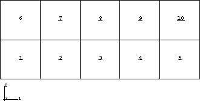
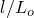
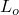
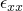
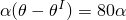
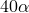
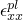

# 3.10.2 应力/位移模型变化：静态

**产品：**Abaqus/Standard  

### 测试的单元

C3D8    C3D8I    C3D8R    

CAX4H    CGAX3HT    CGAX4HT    CGAX4RH    

CGAX6M    CGAX6MH    CGAX8HT    CGAX8RHT    

CPE4    CPE4I    CPE4R    CPE4RT    CPE4RHT    CPE8    CPS4    CPS4R    CPS4RT    

CPEG4RT    CPEG4RHT    CPEG6M    CPEG6MH    

DCOUP2D    S4    SC8R    SC6R    T2D2    

### 测试的功能

在静态分析期间移除和添加连续体应力/位移单元。使用弹性、超弹性和塑性材料特性测试通用非线性和线性扰动步骤。结合单元移除/重新激活测试各种建模功能，如多点约束和变换的节点和单元变量。

### 问题描述

**模型：**

所有模型在*x*–*y*平面中的尺寸为5.0×2.0，平面外尺寸为1.0（平面应力/应变分析）。轴对称模型在*z*方向上为5.0个单位，内半径为1.0个单位。

**材料：**

除弹塑性测试外，材料假定为可压缩橡胶。材料常数没有以任何特定单位组给出。橡胶既被建模为超弹性材料，也被建模为在小应变时与超弹性材料匹配的线弹性材料。

**弹性材料：**

杨氏模量 = 4.064385×10^6

泊松比 = 0.451566

**超弹性材料：**

 = 56.00×10^4

 = 14.00×10^4

 = 1.43×10^7

**弹塑性材料：**

杨氏模量 = 3.0×10^6

泊松比 = 0.3

塑性强化：

| 屈服应力 | 塑性应变 |
| --- | --- |
| 0.15×10^5 | 0.0000 |
| 0.60×10^5 | 2.027×10^4 |

**载荷和边界条件：**

**通用测试：**

步骤1中的载荷是将模型的右侧在*x*方向上压缩0.1个单位，而左侧在*x*方向上固定。在步骤2中，移除由单元2–4和7–9组成的模型中间部分（参见[图3.10.2-1](ch03s10abv227.md#vermodelchangestatic-mesh)）。这释放了剩余单元中的载荷。在步骤3中，将移除单元的节点重新定位到其在*y*方向上的原始位置，以及适用的*z*方向。在步骤4中，将单元重新添加到模型中，右侧节点位移到位置*x* = 5.1，对应0.1个单位的位移。轴对称模型的载荷在*z*方向上。

**图3.10.2-1** 通用静态测试中使用的网格。

**特定测试：**

特定测试的载荷与通用测试中使用的载荷相同，但有以下例外：[pmce_cpe8_se1.inp](../eif/pmce_cpe8_se1.inp)和[pmce_cpe8_sh1.inp](../eif/pmce_cpe8_sh1.inp)，在整个分析步骤中都有体载荷活动；[pmce_c3d8_se1.inp](../eif/pmce_c3d8_se1.inp)，具有预定义温度载荷但没有位移边界条件（除了约束刚体运动）；[pmce_cpe4i_se1.inp](../eif/pmce_cpe4i_se1.inp)，其中规定位移是其他测试的10^2倍；以及[pmce_cpe4_sp.inp](../eif/pmce_cpe4_sp.inp)和[pmce_cpe4_sp1.inp](../eif/pmce_cpe4_sp1.inp)，其中第四步骤中的位移使得只有新引入的单元发生屈服。

**pmce_c3d8_se1.inp**

初始温度为 = 20。模型的中间部分在步骤1中被移除。在步骤2中，移除单元节点处的温度重置为 = 100。在步骤3中，移除单元的节点温度设置为 = 180，模型中其他节点的温度重置为 = 60。中间单元的热膨胀系数是其他单元的一半。

**pmce_cpe4_sp.inp**

在步骤4中，右侧节点被给定*x*位移 = 0.005，使得只有重新激活的单元在此步骤中发生屈服（由于被退火，它们没有像其他单元那样硬化）。

**pmce_cpe4_sp1.inp**

这个问题与[pmce_cpe4_sp.inp](../eif/pmce_cpe4_sp.inp)相同，不同之处在于在步骤1中移除了DCOUP2D单元，在步骤4中重新添加以施加*x*位移 = 0.005。

**pmce_cpe4i_se1.inp**

这些单元的刚度是其他测试中单元的100倍。每个单元有一条钢筋，穿过单元中间平行于*x*轴。钢筋占其切割面的单元横截面积的1%。它在平面应力中的刚度是单元平面应变模量的100倍。这确保了钢筋恰好使单元的刚度加倍。该模型使用小位移验证，以避免钢筋横截面在拉伸时变薄的影响。

**pmce_cpe8_se1.inp和pmce_cpe8_sh1.inp**

每个模型上的体载荷在*x*方向上等于70000个单位。

### 参考解

这些模型（除了[pmce_cps4_se1.inp](../eif/pmce_cps4_se1.inp)、[pmce_cps4r_se1.inp](../eif/pmce_cps4r_se1.inp)、[pmce_cgax4rh_se1.inp](../eif/pmce_cgax4rh_se1.inp)和[pmce_c3d8r_se1.inp](../eif/pmce_c3d8r_se1.inp)）包含几何非线性项。这个载荷状态使模型在平面应力、轴对称和三维模型中处于单轴应力状态；在平面应变模型中，它处于双轴应力状态。因此，应力可以通过将应变乘以弹性模量来找到，或者在平面应变的情况下，乘以。只列出应变值。

**通用测试：**

**步骤1**

所有测试在此步骤中都应存在均匀轴向应变。值应为ln ()，其中*l* = 4.9， = 5.0。这些值给出 = 2.0203×10^-2。

**步骤2**

未移除单元中的应力和应变应变为零。单元1和6上的节点应有 = 0.0，单元5和10上的节点应有 = 0.1。

**步骤3**

此步骤中节点的位移应对步骤2中获得的结果没有影响。

**步骤4**

对于平面应变、轴对称和三维模型，此步骤中将处于均匀轴向应变状态。幅值将为 = 4.0005×10^-2（ln ()，其中*l* = 5.1， = 4.9）。

对于平面应力和桁架单元，步骤1中单元的厚度会发生变化。移除单元时厚度不变。因此，在此步骤中重新添加到模型中的单元将不会具有与未移除单元相同的轴向刚度（因此轴向应变也不同）。的变化如下：单元1、5、6和10的 = 4.07×10^-2；单元2、4、7和9的 = 3.92×10^-2；单元3和8的 = 3.99×10^-2。

轴对称模型在*z*方向上加载。

**特定测试：**

具有与通用测试相同载荷的模型具有相同的解析解。

**pmce_cps4_se1.inp**

因为这是没有NLGEOM的测试，应变始终基于位移变化除以原始长度。这在步骤1中产生 = 2×10^-2，在步骤4中产生4×10^-2。

**pmce_c3d8_se1.inp**

在步骤1和步骤2中模型应有零响应。在步骤3中，模型应有等于中间单元的和其他单元的的热应变。（这些热应变是相同的值，因为中间单元的值是其他单元的一半。）模型中应没有弹性应变也没有应力。

**pmce_cpe4_sp.inp和pmce_cpe4_sp1.inp**

在步骤1中，模型将均匀屈服。 = 1.879×10^-4。在步骤4中，只有模型的中间单元将屈服。大约为1.76×10^-4。

**pmce_cpe4i_se1.inp**

步骤1和4中的应变分别为 = 2×10^-4和4×10^-4。这适用于钢筋和单元。

**pmce_cpe8_se1.inp和pmce_cpe8_sh1.inp**

在步骤1中，模型中将有的梯度。在步骤2中，单元1和6将处于拉伸状态，单元5和10将处于压缩状态。在步骤4中，模型中将有的梯度。

### 结果与讨论

所有模型产生的结果与预期理论值一致。

### 输入文件

##### **通用测试**

[pmce_c3d8i_se.inp](../eif/pmce_c3d8i_se.inp)

C3D8I单元，弹性材料。

[pmce_c3d8i_sh.inp](../eif/pmce_c3d8i_sh.inp)

C3D8I单元，超弹性材料。

[pmce_c3d8r_se.inp](../eif/pmce_c3d8r_se.inp)

C3D8R单元，弹性材料。

[pmce_cax4h_se.inp](../eif/pmce_cax4h_se.inp)

CAX4H单元，弹性材料。

[pmce_cax4h_sh.inp](../eif/pmce_cax4h_sh.inp)

CAX4H单元，超弹性材料。

[pmce_cgax3ht_sh.inp](../eif/pmce_cgax3ht_sh.inp)

CGAX3HT单元，超弹性材料。

[pmce_cgax4ht_sh.inp](../eif/pmce_cgax4ht_sh.inp)

CGAX4HT单元，超弹性材料。

[pmce_cgax4rh_sh.inp](../eif/pmce_cgax4rh_sh.inp)

CGAX4RH单元，超弹性材料。

[pmce_cgax6m_sh.inp](../eif/pmce_cgax6m_sh.inp)

CGAX6M单元，超弹性材料。

[pmce_cgax6mh_sh.inp](../eif/pmce_cgax6mh_sh.inp)

CGAX6MH单元，超弹性材料。

[pmce_cgax8ht_sh.inp](../eif/pmce_cgax8ht_sh.inp)

CGAX8HT单元，超弹性材料。

[pmce_cgax8rht_sh.inp](../eif/pmce_cgax8rht_sh.inp)

CGAX8RHT单元，超弹性材料。

[pmce_cpe4r_sh.inp](../eif/pmce_cpe4r_sh.inp)

CPE4R单元，超弹性材料。

[pmce_cpe4rt_se.inp](../eif/pmce_cpe4rt_se.inp)

CPE4RT单元，弹性材料。

[pmce_cpe4rt_sh.inp](../eif/pmce_cpe4rt_sh.inp)

CPE4RT单元，超弹性材料。

[pmce_cpe4rht_se.inp](../eif/pmce_cpe4rht_se.inp)

CPE4RHT单元，弹性材料。

[pmce_cpe4rht_sh.inp](../eif/pmce_cpe4rht_sh.inp)

CPE4RHT单元，超弹性材料。

[pmce_cpeg4rt_se.inp](../eif/pmce_cpeg4rt_se.inp)

CPEG4RT单元，弹性材料。

[pmce_cpeg4rt_sh.inp](../eif/pmce_cpeg4rt_sh.inp)

CPEG4RT单元，超弹性材料。

[pmce_cpeg4rht_se.inp](../eif/pmce_cpeg4rht_se.inp)

CPEG4RHT单元，弹性材料。

[pmce_cpeg4rht_sh.inp](../eif/pmce_cpeg4rht_sh.inp)

CPEG4RHT单元，超弹性材料。

[pmce_cpe8_se.inp](../eif/pmce_cpe8_se.inp)

CPE8单元，弹性材料。

[pmce_cpe8_sh.inp](../eif/pmce_cpe8_sh.inp)

CPE8单元，超弹性材料。

[pmce_cps4_se.inp](../eif/pmce_cps4_se.inp)

CPS4单元，弹性材料。

[pmce_cps4_sh.inp](../eif/pmce_cps4_sh.inp)

CPS4单元，超弹性材料。

[pmce_cps4rt_se.inp](../eif/pmce_cps4rt_se.inp)

CPS4RT单元，弹性材料。

[pmce_cps4rt_sh.inp](../eif/pmce_cps4rt_sh.inp)

CPS4RT单元，超弹性材料。

[pmce_cpeg6m_sh.inp](../eif/pmce_cpeg6m_sh.inp)

CPEG6M单元，超弹性材料。

[pmce_cpeg6mh_sh.inp](../eif/pmce_cpeg6mh_sh.inp)

CPEG6MH单元，超弹性材料。

[pmce_s4_se.inp](../eif/pmce_s4_se.inp)

S4单元，弹性材料。

[pmce_sc8r_se.inp](../eif/pmce_sc8r_se.inp)

SC8R单元，弹性材料。

[pmce_sc6r_se.inp](../eif/pmce_sc6r_se.inp)

SC6R单元，弹性材料。

[pmce_t2d2_se.inp](../eif/pmce_t2d2_se.inp)

T2D2单元，弹性材料。

##### **特定测试**

[pmce_c3d8_se1.inp](../eif/pmce_c3d8_se1.inp)

具有[*TEMPERATURE](../key/key-link.md#usb-kws-htemperature)的C3D8单元。

[pmce_c3d8i_sh1.inp](../eif/pmce_c3d8i_sh1.inp)

在所有节点上具有[*TRANSFORM](../key/key-link.md#usb-kws-mtransform)的C3D8I单元。

[pmce_c3d8r_se1.inp](../eif/pmce_c3d8r_se1.inp)

无NLGEOM的C3D8R单元。

[pmce_cgax4rh_se1.inp](../eif/pmce_cgax4rh_se1.inp)

无NLGEOM的CGAX4RH单元。

[pmce_cpe4_se1.inp](../eif/pmce_cpe4_se1.inp)

具有[*ORIENTATION](../key/key-link.md#usb-kws-morientation)的CPE4单元。

[pmce_cpe4_sh1.inp](../eif/pmce_cpe4_sh1.inp)

具有[`UHYPER`](../sub/sub-link.md#sub-xsl-uhyper)和扰动步骤的CPE4单元。

[pmce_cpe4_sh1.f](../eif/pmce_cpe4_sh1.f)

pmce_cpe4_sh1.inp中使用的用户子程序[`UHYPER`](../sub/sub-link.md#sub-xsl-uhyper)。

[pmce_cpe4_sp.inp](../eif/pmce_cpe4_sp.inp)

具有弹塑性材料的CPE4单元。

[pmce_cpe4_sp1.inp](../eif/pmce_cpe4_sp1.inp)

具有弹塑性材料的CPE4和DCOUP2D单元。

[pmce_cpe4i_se1.inp](../eif/pmce_cpe4i_se1.inp)

带钢筋的CPE4I单元。

[pmce_cpe8_se1.inp](../eif/pmce_cpe8_se1.inp)

具有GRAV型[*DLOAD](../key/key-link.md#usb-kws-hdload)的CPE8单元。

[pmce_cpe8_sh1.inp](../eif/pmce_cpe8_sh1.inp)

具有BX型[*DLOAD](../key/key-link.md#usb-kws-hdload)的CPE8单元。

[pmce_cps4_se1.inp](../eif/pmce_cps4_se1.inp)

无NLGEOM的CPS4单元。

[pmce_cps4_sh1.inp](../eif/pmce_cps4_sh1.inp)

具有[*MPC](../key/key-link.md#usb-kws-mmpc)的CPS4单元。

[pmce_cps4r_se1.inp](../eif/pmce_cps4r_se1.inp)

无NLGEOM的CPS4R单元。

