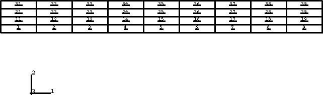
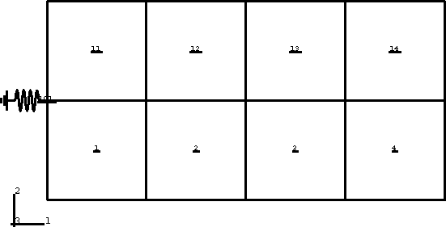
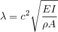
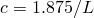
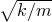

# 3.10.3 Stress/displacement model change: dynamic

**Product: **Abaqus/Standard  

### Element tested

CPS4

### Features tested

We examine how the natural frequencies of two different systems change when their mass and geometry change with element removal. The removed elements are also added back so that the response of the original system is recovered. The dominant mode is computed with a frequency extraction run, as well as by using direct-integration dynamics.

### Problem description

The frequency extraction and dynamic analyses are discussed below.

#### Frequency analysis

A natural frequency extraction is carried out on a cantilevered beam. Elements are removed to shorten the length of the beam, thereby changing the frequency content.

**Material properties:**

Hyperelastic material, polynomial, N=1

 = 56.0  104,  = 14.0  104,  = 1.43  107

**Dimensions:**

10.0  1.0 in the *x*–*y* plane, 1.0 out-of-plane.

**Loading and boundary conditions:**

The beam is cantilevered at one end. Step 1 is a null step to establish the base state. In Step 2 the first five eigenvalues are extracted. In Step 3 elements 4–6,14–16, 24–26, and 34–36 are removed. In Step 4 the end of the beam is shortened by 0.5 units ( = 0.5). The removed elements are added back into the model in Step 5. The first five eigenvalues are obtained for the shortened beam in Step 6. [Figure 3.10.3--1](ch03s10abv228.md#vermodelchangedyn-mesh-freq) shows the mesh used in this test.

**Figure 3.10.3–1** Mesh used in frequency procedure test.

#### Dynamic analysis

A block of eight elements attached to a grounded spring is given an initial displacement out of static equilibrium and is allowed to vibrate. The response is compared to that of the same system vibrating with one-quarter of the original mass.

**Material properties:**

Elastic modulus = 207.0  1012

Poisson's ratio = 0.3

Density = 7800.0

Spring stiffness = 9.8538  106

**Dimensions:**

The models have dimensions 8.0  4.0 in the *x*–*y* plane, 1.0 out-of-plane.

**Loading and boundary conditions:**

The nodes at the right-hand side of the model are displaced by 1.0 units along the 1-direction in Step 1. In Step 2 they are released. All nodes are constrained to slide along the 1-direction only. In Step 3 all of the nodes are held fixed and elements 2–4 and 12–14 are removed. The remaining elements are allowed to move in Step 4. During this step the free nodes (i.e., no mass contributed by any elements) on the removed elements are held fixed. In Step 5 the entire model is again held fixed and the elements are added back into the model. In Step 6 all of the nodes are released. The mesh for this test is shown in [Figure 3.10.3--2](ch03s10abv228.md#vermodelchangedyn-mesh-dyn).

**Figure 3.10.3–2** Mesh used in dynamic procedure test.

### Reference solution

The natural frequencies for a cantilever beam are given by

in rad s1. For the first mode , where *L* is the beam length.

The natural frequency for the spring-mass system is given by , where *k* is the spring stiffness and *m* is the total mass of the block.

### Results and discussion

The first natural frequency of the cantilever beam was found to be within 2% of the analytical solution. The period for the spring-mass system in transient dynamics matches the expected analytical solution shown above for all of the dynamic steps (Steps 2, 4, and 6). The total force on the vertical left edge is output.

### Input files

[pmce_cps4_f.inp](../eif/pmce_cps4_f.inp)

CPS4 elements in a frequency extraction analysis.

[pmce_cps4_d.inp](../eif/pmce_cps4_d.inp)

CPS4 elements in a dynamic analysis.

