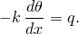
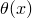
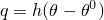
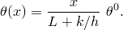

# 3.10.5 Heat transfer model change: steady state

**Product: **Abaqus/Standard  

### Elements tested

DC2D4    DS3    

### Features tested

Continuum and shell heat transfer elements are removed and added during a steady-state heat transfer analysis.

### Problem description

**Model: **

The models have dimensions 5.0  2.0 in the *x*–*y* plane, with an out-of-plane dimension of 1.0.

**Material: **

| Conductivity | 7.872 104 |
| --- | --- |
| Density | 0.2829 |

**Loading and boundary conditions: **

The left side of the model is held at  = 0.0. There is a film condition on the right side of the model for the simulation with DC2D4 elements and a temperature boundary condition for the simulation with DS3 shell elements. The sink temperature is  = 100.0, and the film coefficient, *h*, is 1.0. For the shell problem the temperature boundary condition is 100.0 on the right-hand edge. A steady-state solution is obtained. Then two-thirds of the model is removed. When the elements are removed, the temperatures along the new external boundary are held fixed. The removed elements are added back into the model in the last step, and a new film condition is applied on the right-hand side for the continuum model and a temperature boundary condition for the shell model. The new sink temperature is  = 200.0, and the same film coefficient is used. The temperature boundary condition is 200.0.

### Reference solution

The one-dimensional heat balance equation for steady-state heat transfer is 

This equation can be integrated to give . Using the boundary conditions that  = 0.0 at *x* = 0 and that  at , the solution for the continuum model is

This expression can be used to calculate the temperature distribution in the model for the first and third steps. For the shell model the boundary conditions and the integration yield a linear temperature profile along the length of the model.

### Results and discussion

The model gives the theoretical results in both the first and third steps.

### Input files

[pmce_dc2d4_h.inp](../eif/pmce_dc2d4_h.inp)

General test of DC2D4 elements in steady-state analysis.

[pmce_ds3_h.inp](../eif/pmce_ds3_h.inp)

Test of element type DS3 in steady-state analysis.

