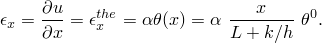
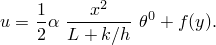
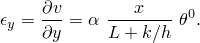
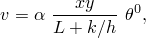
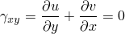
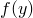
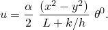
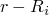
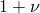

# 3.10.6 耦合温度-位移模型变化：稳态

**产品：**Abaqus/Standard  

### 测试的单元

C3D8HT    C3D8RT    C3D8RHT    C3D8T    C3D10MT    C3D10MHT    CAX4RHT    CAX4RT    CAX6MHT    CAX6MT    CGAX3HT    CGAX3T    CGAX4HT    CGAX4RT    CGAX4RHT    CGAX4T    CGAX6MHT    CGAX6MT    CGAX8HT    CGAX8RT    CGAX8RHT    CGAX8T    CPE4RT    CPE4RHT    CPE4T    CPE6MHT    CPE6MT    CPEG3HT    CPEG3T    CPEG4HT    CPEG4RT    CPEG4RHT    CPEG4T    CPEG6MHT    CPEG6MT    CPEG8HT    CPEG8RHT    CPEG8T    CPS4RT    CPS4T    CPS6MT    CPS8RT    CPS8T    

### 测试的功能

在稳态分析期间移除和添加连续体耦合温度-位移单元。

### 问题描述

**模型：**

模型在*x*–*y*平面中的尺寸为5.0×2.0，平面外尺寸为1.0。在轴对称情况下，模型在*r*–*z*平面中的尺寸为2.0×5.0，内半径等于10^5。内半径很大以确保周向应变大致均匀，这允许将分析中获得的结果与分析获得的解进行比较。

**材料：**

| 导热率 | 7.872×10^4 |
| --- | --- |
| 密度 | 0.2829 |
| 热膨胀系数 | 1.0×10^-6 |
| 弹性模量 | 100×10^4 |
| 泊松比 | 0.25 |

**载荷和边界条件：**

模型的左侧保持在=0.0。模型的右侧存在膜条件。环境温度为=100.0，膜系数*h*为1.0。获得稳态解后，移除模型中的一些单元。沿新外部边界的温度保持固定。移除的单元在最后一步中重新添加到模型中，在右侧施加新的膜条件。新的环境温度为=200.0，使用相同的*h*。

在所有三个步骤中保持以下机械边界条件：在*y*=0的所有点上=0.0；在点(0,0)处=0.0。

### 参考解

一维稳态热传递问题的解在["热传递模型变化：稳态"，第3.10.5节](ch03s10abv230.md)中给出。模型机械响应的解为

的表达式积分得到

*y*方向的应变给出为

对*v*积分得到

其中使用*y*=0处*v*=0的边界条件来消除仅是*x*函数的项。条件

用于求，*x*位移给出为

这些表达式用于计算模型中的位移。温度分布可以使用["热传递模型变化：稳态"，第3.10.5节](ch03s10abv230.md)中的表达式计算。轴对称情况的结果通过在温度和位移的关系中将*x*替换为*z*，将*y*替换为()获得。此外，位移乘以系数()，其中是泊松比。这考虑了周向大致恒定应变的贡献。

### 结果与讨论

模型在第一和第三步骤中对单元温度和二次单元位移产生理论结果。使用线性单元模型的位移与分析结果不匹配，但仍然是合理的。

### 输入文件

[pmce_c3d8ht_ctd.inp](../eif/pmce_c3d8ht_ctd.inp)

稳态分析中C3D8HT单元的通用测试。

[pmce_c3d8rht_ctd.inp](../eif/pmce_c3d8rht_ctd.inp)

稳态分析中C3D8RHT单元的通用测试。

[pmce_c3d8rt_ctd.inp](../eif/pmce_c3d8rt_ctd.inp)

稳态分析中C3D8RT单元的通用测试。

[pmce_c3d8t_ctd.inp](../eif/pmce_c3d8t_ctd.inp)

稳态分析中C3D8T单元的通用测试。

[pmce_c3d10mht_ctd.inp](../eif/pmce_c3d10mht_ctd.inp)

稳态分析中C3D10MHT单元的通用测试。

[pmce_c3d10mt_ctd.inp](../eif/pmce_c3d10mt_ctd.inp)

稳态分析中C3D10MT单元的通用测试。

[pmce_cax4rht_ctd.inp](../eif/pmce_cax4rht_ctd.inp)

稳态分析中CAX4RHT单元的通用测试。

[pmce_cax4rt_ctd.inp](../eif/pmce_cax4rt_ctd.inp)

稳态分析中CAX4RT单元的通用测试。

[pmce_cax6mht_ctd.inp](../eif/pmce_cax6mht_ctd.inp)

稳态分析中CAX6MHT单元的通用测试。

[pmce_cax6mt_ctd.inp](../eif/pmce_cax6mt_ctd.inp)

稳态分析中CAX6MT单元的通用测试。

[pmce_cgax3ht_ctd.inp](../eif/pmce_cgax3ht_ctd.inp)

稳态分析中CGAX3HT单元的通用测试。

[pmce_cgax3t_ctd.inp](../eif/pmce_cgax3t_ctd.inp)

稳态分析中CGAX3T单元的通用测试。

[pmce_cgax4ht_ctd.inp](../eif/pmce_cgax4ht_ctd.inp)

稳态分析中CGAX4HT单元的通用测试。

[pmce_cgax4rht_ctd.inp](../eif/pmce_cgax4rht_ctd.inp)

稳态分析中CGAX4RHT单元的通用测试。

[pmce_cgax4rt_ctd.inp](../eif/pmce_cgax4rt_ctd.inp)

稳态分析中CGAX4RT单元的通用测试。

[pmce_cgax4t_ctd.inp](../eif/pmce_cgax4t_ctd.inp)

稳态分析中CGAX4T单元的通用测试。

[pmce_cgax6mht_ctd.inp](../eif/pmce_cgax6mht_ctd.inp)

稳态分析中CGAX6MHT单元的通用测试。

[pmce_cgax6mt_ctd.inp](../eif/pmce_cgax6mt_ctd.inp)

稳态分析中CGAX6MT单元的通用测试。

[pmce_cgax8ht_ctd.inp](../eif/pmce_cgax8ht_ctd.inp)

稳态分析中CGAX8HT单元的通用测试。

[pmce_cgax8rht_ctd.inp](../eif/pmce_cgax8rht_ctd.inp)

稳态分析中CGAX8RHT单元的通用测试。

[pmce_cgax8rt_ctd.inp](../eif/pmce_cgax8rt_ctd.inp)

稳态分析中CGAX8RT单元的通用测试。

[pmce_cgax8t_ctd.inp](../eif/pmce_cgax8t_ctd.inp)

稳态分析中CGAX8T单元的通用测试。

[pmce_cpe4rht_ctd.inp](../eif/pmce_cpe4rht_ctd.inp)

稳态分析中CPE4RHT单元的通用测试。

[pmce_cpe4rt_ctd.inp](../eif/pmce_cpe4rt_ctd.inp)

稳态分析中CPE4RT单元的通用测试。

[pmce_cpe4t_ctd.inp](../eif/pmce_cpe4t_ctd.inp)

稳态分析中CPE4T单元的通用测试。

[pmce_cpe6mht_ctd.inp](../eif/pmce_cpe6mht_ctd.inp)

稳态分析中CPE6MHT单元的通用测试。

[pmce_cpe6mt_ctd.inp](../eif/pmce_cpe6mt_ctd.inp)

稳态分析中CPE6MT单元的通用测试。

[pmce_cpeg3ht_ctd.inp](../eif/pmce_cpeg3ht_ctd.inp)

稳态分析中CPEG3HT单元的通用测试。

[pmce_cpeg3t_ctd.inp](../eif/pmce_cpeg3t_ctd.inp)

稳态分析中CPEG3T单元的通用测试。

[pmce_cpeg4ht_ctd.inp](../eif/pmce_cpeg4ht_ctd.inp)

稳态分析中CPEG4HT单元的通用测试。

[pmce_cpeg4rht_ctd.inp](../eif/pmce_cpeg4rht_ctd.inp)

稳态分析中CPEG4RHT单元的通用测试。

[pmce_cpeg4rt_ctd.inp](../eif/pmce_cpeg4rt_ctd.inp)

稳态分析中CPEG4RT单元的通用测试。

[pmce_cpeg4t_ctd.inp](../eif/pmce_cpeg4t_ctd.inp)

稳态分析中CPEG4T单元的通用测试。

[pmce_cpeg6mht_ctd.inp](../eif/pmce_cpeg6mht_ctd.inp)

稳态分析中CPEG6MHT单元的通用测试。

[pmce_cpeg6mt_ctd.inp](../eif/pmce_cpeg6mt_ctd.inp)

稳态分析中CPEG6MT单元的通用测试。

[pmce_cpeg8ht_ctd.inp](../eif/pmce_cpeg8ht_ctd.inp)

稳态分析中CPEG8HT单元的通用测试。

[pmce_cpeg8rht_ctd.inp](../eif/pmce_cpeg8rht_ctd.inp)

稳态分析中CPEG8RHT单元的通用测试。

[pmce_cpeg8t_ctd.inp](../eif/pmce_cpeg8t_ctd.inp)

稳态分析中CPEG8T单元的通用测试。

[pmce_cps4rt_ctd.inp](../eif/pmce_cps4rt_ctd.inp)

稳态分析中CPS4RT单元的通用测试。

[pmce_cps4t_ctd.inp](../eif/pmce_cps4t_ctd.inp)

稳态分析中CPS4T单元的通用测试。

[pmce_cps6mt_ctd.inp](../eif/pmce_cps6mt_ctd.inp)

稳态分析中CPS6MT单元的通用测试。

[pmce_cps8rt_ctd.inp](../eif/pmce_cps8rt_ctd.inp)

稳态分析中CPS8RT单元的通用测试。

[pmce_cps8t_ctd.inp](../eif/pmce_cps8t_ctd.inp)

稳态分析中CPS8T单元的通用测试。

