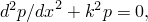
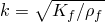
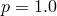
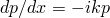
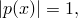

# 3.10.8 声学模型变化：稳态

**产品：**Abaqus/Standard  

### 测试的单元

AC1D2    AC1D3    

AC2D3    AC2D4    AC2D6    AC2D8    

AC3D4    AC3D5    AC3D6    AC3D8    AC3D10    AC3D15    AC3D20    

ACAX3    ACAX4    ACAX6    ACAX8    

ACINAX2    ACINAX3    ACIN2D2    ACIN2D3    ACIN3D3    ACIN3D4    ACIN3D6    ACIN3D6    

### 测试的功能

在稳态声学分析期间移除连续体声学单元。

### 问题描述

**模型：**

模型在*x*–*y*平面中的尺寸为10.0×1.0，平面外尺寸为1.0。

**材料：**

| 体积模量， | 1.42176×10^5 |
| --- | --- |
| 密度， | 1.293 |

**载荷和边界条件：**

模型左侧的压力被约束等于1；模型右侧存在平面波辐射条件。获得单位频率的稳态解。然后，移除模型的一半。当移除单元时，辐射条件沿新外部边界施加。

### 参考解

稳态声学的一维Helmholtz方程为

其中是声波数。使用边界条件：在处，在处，连续体模型的解为

而相位与指定频率1赫兹的正弦波一致。

### 结果与讨论

模型在第一和第二步骤中都给出理论结果。

### 输入文件

[pmcp_ac1d2.inp](../eif/pmcp_ac1d2.inp)

稳态分析中AC1D2单元的通用测试。

[pmcp_ac1d3.inp](../eif/pmcp_ac1d3.inp)

AC1D3单元。

[pmcp_ac2d3.inp](../eif/pmcp_ac2d3.inp)

AC2D3单元。

[pmcp_ac2d4.inp](../eif/pmcp_ac2d4.inp)

AC2D4单元。

[pmcp_ac2d6.inp](../eif/pmcp_ac2d6.inp)

AC2D6单元。

[pmcp_ac2d8.inp](../eif/pmcp_ac2d8.inp)

AC2D8单元。

[pmcp_ac3d4.inp](../eif/pmcp_ac3d4.inp)

AC3D4单元。

[pmcp_ac3d5.inp](../eif/pmcp_ac3d5.inp)

AC3D5单元。

[pmcp_ac3d6.inp](../eif/pmcp_ac3d6.inp)

AC3D6单元。

[pmcp_ac3d8.inp](../eif/pmcp_ac3d8.inp)

AC3D8单元。

[pmcp_ac3d10.inp](../eif/pmcp_ac3d10.inp)

AC3D10单元。

[pmcp_ac3d15.inp](../eif/pmcp_ac3d15.inp)

AC3D15单元。

[pmcp_ac3d20.inp](../eif/pmcp_ac3d20.inp)

AC3D20单元。

[pmcp_acax3.inp](../eif/pmcp_acax3.inp)

ACAX3单元。

[pmcp_acax4.inp](../eif/pmcp_acax4.inp)

ACAX4单元。

[pmcp_acax6.inp](../eif/pmcp_acax6.inp)

ACAX6单元。

[pmcp_acax8.inp](../eif/pmcp_acax8.inp)

ACAX8单元。

[pmcp_acinax2.inp](../eif/pmcp_acinax2.inp)

ACINAX2单元。

[pmcp_acinax3.inp](../eif/pmcp_acinax3.inp)

ACINAX3单元。

[pmcp_acin2d2.inp](../eif/pmcp_acin2d2.inp)

ACIN2D2单元。

[pmcp_acin2d3.inp](../eif/pmcp_acin2d3.inp)

ACIN2D3单元。

[pmcp_acin3d3.inp](../eif/pmcp_acin3d3.inp)

ACIN3D3单元。

[pmcp_acin3d4.inp](../eif/pmcp_acin3d4.inp)

ACIN3D4单元。

[pmcp_acin3d6.inp](../eif/pmcp_acin3d6.inp)

ACIN3D6单元。

[pmcp_acin3d8.inp](../eif/pmcp_acin3d8.inp)

ACIN3D8单元。

