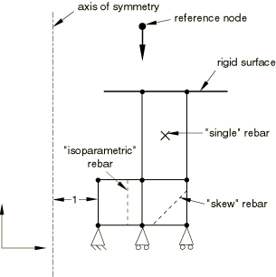
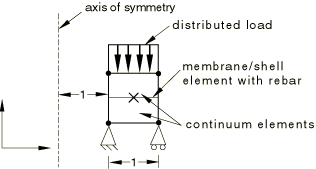
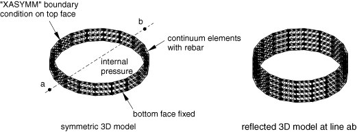
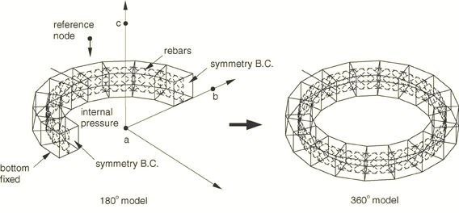
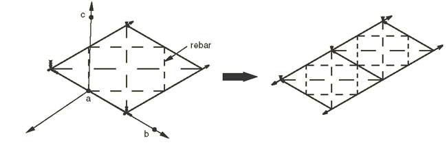
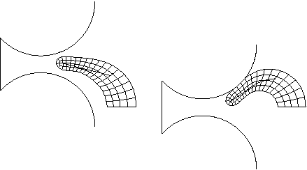
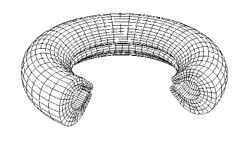

# 3.11.1 对称模型生成和结果传递

**产品：**Abaqus/Standard  

### I. 通过绕对称轴旋转轴对称网格的横截面来生成对称模型

### 测试的单元

**连续体单元**
CAX3    CAX3H    CAX4    CAX4H    CAX4I    CAX4IH    CAX4R    CAX4RH    CAX6    CAX6H    CAX8    CAX8H    CAX8R    CGAX3    CGAX3H    CGAX4    CGAX4H    CGAX4R    CGAX4RH    CGAX6    CGAX6H    CGAX8    CGAX8H    CGAX8RH    CAX4T    CAX4RT    CAX4HT    CAX8T    CAX8RT    CAX8HT    CAX8RHT    CGAX4T    CGAX8T    DCAX4    

**壳和膜单元**
SAX1    SAX2    MAX1    MAX2    MGAX1    MGAX2    DSAX1    DSAX2    

**嵌入连续体单元的表面单元**
SFMAX1    SFMAX2    SFMGAX1    SFMGAX2    

### 测试的功能

通过绕对称轴旋转轴对称网格的横截面来生成对称模型，以及对称结果传递。

### 问题描述

**材料：**

| 杨氏模量 | 1×10^4 |
| --- | --- |
| 泊松比 | 0.3 |
| C10（超弹性，仅混合单元） | 1.9×10^3 |
| D11（超弹性，仅混合单元） | 2.4×10^-4 |
| 杨氏模量（钢筋） | 1×10^6 |
| 泊松比（钢筋） | 0.3 |

**载荷和边界条件：**

轴对称连续体单元模型上的载荷和边界条件如图[图3.11.1-1](ch03s11abv235.md#versymmodelgen-revolve-cont)所示。轴对称壳和膜单元模型上的载荷和边界条件如图[图3.11.1-2](ch03s11abv235.md#versymmodelgen-revolve-shell)所示。

**图3.11.1-1** 具有钢筋的轴对称模型，以及连续体单元规定的载荷和边界条件。

**图3.11.1-2** 具有钢筋的轴对称模型，以及壳和膜单元规定的载荷和边界条件。

沿负轴方向向连续体单元的刚体参考节点规定位移0.1。使用对称模型生成生成360度模型。使用对称结果传递将轴对称结果作为初始条件读取。等参、斜和单钢筋与大多数单元一起验证。嵌入表面单元中的钢筋也经过测试。三角形和楔形单元在没有钢筋的情况下进行验证。

### 结果与讨论

生成的三维模型被验证为正确。轴对称分析的结果被正确地传递到三维模型上。

### 输入文件

[pca3sfrev1.inp](../eif/pca3sfrev1.inp)

CAX3单元；二维模型。

[pc36sfrev1.inp](../eif/pc36sfrev1.inp)

CAX3单元；三维模型。

[pca3shrev1.inp](../eif/pca3shrev1.inp)

CAX3H单元；二维模型。

[pc36shrev1.inp](../eif/pc36shrev1.inp)

CAX3H单元；三维模型。

[pca4sfrev1.inp](../eif/pca4sfrev1.inp)

CAX4与SFMAX1单元；二维模型。

[pc38sfrev1.inp](../eif/pc38sfrev1.inp)

CAX4与SFM3D4R单元；三维模型。

[pca4shrev1.inp](../eif/pca4shrev1.inp)

CAX4H与SFMAX1单元；二维模型。

[pc38shrev1.inp](../eif/pc38shrev1.inp)

CAX4H与SFM3D4R单元；三维模型。

[pca4sirev1.inp](../eif/pca4sirev1.inp)

CAX4I与SFMAX1单元；二维模型。

[pc38sirev1.inp](../eif/pc38sirev1.inp)

CAX4I与SFM3D4R单元；三维模型。

[pca4sjrev1.inp](../eif/pca4sjrev1.inp)

CAX4IH与SFMAX1单元；二维模型。

[pc38sjrev1.inp](../eif/pc38sjrev1.inp)

CAX4IH与SFM3D4R单元；三维模型。

[pca4srrev1.inp](../eif/pca4srrev1.inp)

CAX4R与SFMAX1单元；二维模型。

[pc38srrev1.inp](../eif/pc38srrev1.inp)

CAX4R与SFM3D4R单元；三维模型。

[pca4syrev1.inp](../eif/pca4syrev1.inp)

CAX4RH与SFMAX1单元；二维模型。

[pc38syrev1.inp](../eif/pc38syrev1.inp)

CAX4RH与SFM3D4R单元；三维模型。

[pca6sfrev1.inp](../eif/pca6sfrev1.inp)

CAX6单元；二维模型。

[pc3fsfrev1.inp](../eif/pc3fsfrev1.inp)

CAX6单元；三维模型。

[pca6shrev1.inp](../eif/pca6shrev1.inp)

CAX6H单元；二维模型。

[pc3fshrev1.inp](../eif/pc3fshrev1.inp)

CAX6H单元；三维模型。

[pca8sfrev1.inp](../eif/pca8sfrev1.inp)

CAX8与SFMAX2单元；二维模型。

[pc3ksfrev1.inp](../eif/pc3ksfrev1.inp)

CAX8与SFM3D8R单元；三维模型。

[pca8shrev1.inp](../eif/pca8shrev1.inp)

CAX8H与SFMAX2单元；二维模型。

[pc3kshrev1.inp](../eif/pc3kshrev1.inp)

CAX8H与SFM3D8R单元；三维模型。

[pca8srrev1.inp](../eif/pca8srrev1.inp)

CAX8R与SFMAX2单元；二维模型。

[pc3ksrrev1.inp](../eif/pc3ksrrev1.inp)

CAX8R与SFM3D8R单元；三维模型。

[pca3gfrev2.inp](../eif/pca3gfrev2.inp)

CGAX3单元；二维模型。

[pc36sfrev2.inp](../eif/pc36sfrev2.inp)

CGAX3单元；三维模型。

[pca3ghrev2.inp](../eif/pca3ghrev2.inp)

CGAX3H单元；二维模型。

[pc36shrev2.inp](../eif/pc36shrev2.inp)

CGAX3H单元；三维模型。

[pca4gfrev2.inp](../eif/pca4gfrev2.inp)

CGAX4与SFMGAX1单元；二维模型。

[pc38sfrev2.inp](../eif/pc38sfrev2.inp)

CGAX4与SFM3D4R单元；三维模型。

[pca4ghrev2.inp](../eif/pca4ghrev2.inp)

CGAX4H与SFMGAX1单元；二维模型。

[pc38shrev2.inp](../eif/pc38shrev2.inp)

CGAX4H与SFM3D4R单元；三维模型。

[pca4grrev2.inp](../eif/pca4grrev2.inp)

CGAX4R与SFMGAX1单元；二维模型。

[pc38srrev2.inp](../eif/pc38srrev2.inp)

CGAX4R与SFM3D4R单元；三维模型。

[pca4gyrev2.inp](../eif/pca4gyrev2.inp)

CGAX4RH与SFMGAX1单元；二维模型。

[pc38syrev2.inp](../eif/pc38syrev2.inp)

CGAX4RH与SFM3D4R单元；三维模型。

[pca6gfrev2.inp](../eif/pca6gfrev2.inp)

CGAX6单元；二维模型。

[pc3fsfrev2.inp](../eif/pc3fsfrev2.inp)

CGAX6单元；三维模型。

[pca6ghrev2.inp](../eif/pca6ghrev2.inp)

CGAX6H单元；二维模型。

[pc3fshrev2.inp](../eif/pc3fshrev2.inp)

CGAX6H单元；三维模型。

[pca8gfrev2.inp](../eif/pca8gfrev2.inp)

CGAX8与SFMGAX2单元；二维模型。

[pc3ksfrev2.inp](../eif/pc3ksfrev2.inp)

CGAX8与SFM3D8R单元；三维模型。

[pca8ghrev2.inp](../eif/pca8ghrev2.inp)

CGAX8H与SFMGAX2单元；二维模型。

[pc3kshrev2.inp](../eif/pc3kshrev2.inp)

CGAX8H与SFM3D8R单元；三维模型。

[pca8gyrev2.inp](../eif/pca8gyrev2.inp)

CGAX8RH与SFMGAX2单元；二维模型。

[pc3ksyrev2.inp](../eif/pc3ksyrev2.inp)

CGAX8RH与SFM3D8R单元；三维模型。

[pma2srrev1.inp](../eif/pma2srrev1.inp)

MAX1单元；二维模型。

[pm34srrev1.inp](../eif/pm34srrev1.inp)

MAX1单元；三维模型。

[pma3srrev1.inp](../eif/pma3srrev1.inp)

MAX2单元；二维模型。

[pm38srrev1.inp](../eif/pm38srrev1.inp)

MAX2单元；三维模型。

[pmg2srrev2.inp](../eif/pmg2srrev2.inp)

MGAX1单元；二维模型。

[pm34srrev2.inp](../eif/pm34srrev2.inp)

MGAX1单元；三维模型。

[pmg3srrev2.inp](../eif/pmg3srrev2.inp)

MGAX2单元；二维模型。

[pm38srrev2.inp](../eif/pm38srrev2.inp)

MGAX2单元；三维模型。

[psa2sxrev1.inp](../eif/psa2sxrev1.inp)

SAX1单元；二维模型。

[psf4sxrev1.inp](../eif/psf4sxrev1.inp)

SAX1单元；三维模型。

[psa3sxrev1.inp](../eif/psa3sxrev1.inp)

SAX2单元；二维模型。

[ps68sxrev1.inp](../eif/ps68sxrev1.inp)

SAX2单元；三维模型。

[psa2dxrev1.inp](../eif/psa2dxrev1.inp)

DSAX1单元；二维模型。

[psf4dxrev1.inp](../eif/psf4dxrev1.inp)

DSAX1单元；三维模型。

[psa3dxrev1.inp](../eif/psa3dxrev1.inp)

DSAX2单元；二维模型。

[ps68dxrev1.inp](../eif/ps68dxrev1.inp)

DSAX2单元；三维模型。

[pca4tfrev1.inp](../eif/pca4tfrev1.inp)

CAX4T与SFMAX1单元；二维模型。

[pc38tfrev1.inp](../eif/pc38tfrev1.inp)

CAX4T与SFM3D4R单元；三维模型。

[pca4threv1.inp](../eif/pca4threv1.inp)

CAX4HT与SFMAX1单元；二维模型。

[pc38threv1.inp](../eif/pc38threv1.inp)

CAX4HT与SFM3D4R单元；三维模型。

[pca4trrev1.inp](../eif/pca4trrev1.inp)

CAX4RT与SFMAX1单元；二维模型。

[pc38trrev1.inp](../eif/pc38trrev1.inp)

CAX4RT与SFM3D4R单元；三维模型。

[pca8tfrev1.inp](../eif/pca8tfrev1.inp)

CAX8T与SFMAX2单元；二维模型。

[pc3ktfrev1.inp](../eif/pc3ktfrev1.inp)

CAX8T与SFM3D8R单元；三维模型。

[pca8threv1.inp](../eif/pca8threv1.inp)

CAX8HT与SFMAX2单元；二维模型。

[pc3kthrev1.inp](../eif/pc3kthrev1.inp)

CAX8HT与SFM3D8R单元；三维模型。

[pca8trrev1.inp](../eif/pca8trrev1.inp)

CAX8RT与SFMAX2单元；二维模型。

[pc3ktrrev1.inp](../eif/pc3ktrrev1.inp)

CAX8RT与SFM3D8R单元；三维模型。

[pca8tyrev1.inp](../eif/pca8tyrev1.inp)

CAX8RHT与SFMAX2单元；二维模型。

[pc3ktyrev1.inp](../eif/pc3ktyrev1.inp)

CAX8RHT与SFM3D8R单元；三维模型。

[pca4dfrev1.inp](../eif/pca4dfrev1.inp)

DCAX4单元；二维模型。

[pc38dfrev1.inp](../eif/pc38dfrev1.inp)

DCAX4单元；三维模型。

[pca4tfrev2.inp](../eif/pca4tfrev2.inp)

CGAX4T与SFMGAX1单元；二维模型。

[pc38tfrev2.inp](../eif/pc38tfrev2.inp)

CGAX4T与SFM3D4R单元；三维模型。

[pca8tfrev2.inp](../eif/pca8tfrev2.inp)

CGAX8T与SFMGAX2单元；二维模型。

[pc3ktfrev2.inp](../eif/pc3ktfrev2.inp)

CGAX8T与SFM3D8R单元；三维模型。

### II. 通过对称线反射部分三维模型来生成对称模型

### 测试的单元

C3D6    C3D8I    C3D8R    C3D15    C3D20    C3D20R    S4R    DC3D8    C3D8RT    

### 测试的功能

通过对称线反射部分三维模型来生成对称模型，以及对称结果传递。

### 问题描述

**材料：**

| 杨氏模量 | 5×10^3 |
| --- | --- |
| 泊松比 | 0.3 |
| 杨氏模量（钢筋） | 2.5×10^5 |
| 泊松比（钢筋） | 0.0 |

**载荷和边界条件：**

对称三维模型上的载荷和边界条件如图[图3.11.1-3](ch03s11abv235.md#versymmodelgen-reflectline)所示。内压10个单位施加在圆柱模型上，而圆柱的顶部和底部边缘被夹紧。通过反射所示的对称三维模型生成完整的三维模型。对称结果作为初始条件读取到完整的三维模型中。楔形单元在没有钢筋的情况下进行验证。

**图3.11.1-3** 具有钢筋的对称三维模型，以及规定的载荷和边界条件。

### 结果与讨论

反射的三维模型被验证为正确。对称三维分析的结果被正确地传递到反射的三维模型上。

### 输入文件

[pca3sflin0.inp](../eif/pca3sflin0.inp)

C3D6单元；二维模型。

[pc36sflin1.inp](../eif/pc36sflin1.inp)

C3D6单元；对称三维模型，带[*LOAD CASE](../key/key-link.md#usb-kws-hloadcase)的扰动步骤。

[pc36sflin2.inp](../eif/pc36sflin2.inp)

C3D6单元；反射三维模型，带[*LOAD CASE](../key/key-link.md#usb-kws-hloadcase)的扰动步骤。

[pca4silin0.inp](../eif/pca4silin0.inp)

C3D8I单元；二维模型。

[pc38silin1.inp](../eif/pc38silin1.inp)

C3D8I单元；对称三维模型。

[pc38silin2.inp](../eif/pc38silin2.inp)

C3D8I单元；反射三维模型。

[pca4srlin0.inp](../eif/pca4srlin0.inp)

C3D8R单元；二维模型。

[pc38srlin1.inp](../eif/pc38srlin1.inp)

C3D8R单元；对称三维模型。

[pc38srlin2.inp](../eif/pc38srlin2.inp)

C3D8R单元；反射三维模型。

[pca6sflin0.inp](../eif/pca6sflin0.inp)

C3D15单元；二维模型。

[pc3fsflin1.inp](../eif/pc3fsflin1.inp)

C3D15单元；对称三维模型。

[pc3fsflin2.inp](../eif/pc3fsflin2.inp)

C3D15单元；反射三维模型。

[pca8sflin0.inp](../eif/pca8sflin0.inp)

C3D20单元；二维模型。

[pc3ksflin1.inp](../eif/pc3ksflin1.inp)

C3D20单元；对称三维模型。

[pc3ksflin2.inp](../eif/pc3ksflin2.inp)

C3D20单元；反射三维模型。

[pca8srlin0.inp](../eif/pca8srlin0.inp)

C3D20R单元；二维模型。

[pc3ksrlin1.inp](../eif/pc3ksrlin1.inp)

C3D20R单元；对称三维模型。

[pc3ksrlin2.inp](../eif/pc3ksrlin2.inp)

C3D20R单元；反射三维模型。

[psa2sslin0.inp](../eif/psa2sslin0.inp)

S4R单元；二维模型。

[psf4sslin1.inp](../eif/psf4sslin1.inp)

S4R单元；对称三维模型。

[psf4sslin2.inp](../eif/psf4sslin2.inp)

S4R单元；反射三维模型。

[pca4trlin0.inp](../eif/pca4trlin0.inp)

C3D8RT单元；二维模型。

[pc38trlin1.inp](../eif/pc38trlin1.inp)

C3D8RT单元；对称三维模型。

[pc38trlin2.inp](../eif/pc38trlin2.inp)

C3D8RT单元；反射三维模型。

[pca4dflin0.inp](../eif/pca4dflin0.inp)

DC3D8单元；二维模型。

[pc38dflin1.inp](../eif/pc38dflin1.inp)

DC3D8单元；对称三维模型。

[pc38dflin2.inp](../eif/pc38dflin2.inp)

DC3D8单元；反射三维模型。

### III. 通过对称平面反射部分三维模型来生成对称模型

### 测试的单元

**连续体单元**
C3D6H    C3D8H    C3D8RH    C3D15H    C3D20H    C3D20RH    DC3D8    C3D8HT    

**壳和膜单元**
M3D3    M3D4    M3D4R    M3D6    M3D8    M3D8R    M3D9    M3D9R    S3    S3R    S4    S4R    S4R5    S8R    S8R5    STRI3    STRI65    

**嵌入连续体单元的表面单元**
SFM3D4R    SFM3D8R    

### 测试的功能

通过对称平面反射部分三维模型来生成对称模型，以及对称结果传递。

### 问题描述

**连续体单元的材料特性：**

| 杨氏模量 | 5×10^3 |
| --- | --- |
| 泊松比 | 0.4 |
| 杨氏模量（钢筋） | 1×10^6 |
| 泊松比（钢筋） | 0.0 |

**壳和膜单元的材料特性：**

| 杨氏模量 | 1×10^4 |
| --- | --- |
| 泊松比 | 0.3 |
| 杨氏模量（钢筋） | 2.5×10^5 |
| 泊松比（钢筋） | 0.0 |

**连续体单元模型的载荷和边界条件：**

对称三维模型上的载荷和边界条件如图[图3.11.1-4](ch03s11abv235.md#versymmodelgen-reflectplane-cont)所示。

**图3.11.1-4** 具有规定边界条件的对称和反射三维连续体单元模型。

刚体表面参考节点沿负轴方向位移0.05个单位。通过绕*x*–*z*平面对称反射生成完整的三维模型。对称结果作为初始条件读取到完整的三维模型中。楔形单元在没有钢筋的情况下进行验证。

**壳和膜单元模型的载荷和边界条件：**

对称模型上的载荷和边界条件如图[图3.11.1-5](ch03s11abv235.md#versymmodelgen-reflectplane-shel)所示。通过绕*y*–*z*平面对称反射生成完整的三维模型。对称结果作为初始条件读取到完整的三维模型中。验证了S3/S3R、S4R5、S8R5、STRI3和STRI65单元。三角形单元中未定义钢筋。

**图3.11.1-5** 具有钢筋的对称壳和膜模型，以及规定的边界条件。

### 结果与讨论

反射的三维模型被验证为正确。对称三维分析的结果被正确地传递到反射的三维模型上。

### 输入文件

[pca3shpln0.inp](../eif/pca3shpln0.inp)

C3D6H单元；二维模型。

[pca3shpln0_surf.inp](../eif/pca3shpln0_surf.inp)

C3D6H单元；使用表面到表面接触的二维模型。

[pc36shpln1.inp](../eif/pc36shpln1.inp)

C3D6H单元；对称三维模型。

[pc36shpln2.inp](../eif/pc36shpln2.inp)

C3D6H单元；反射三维模型。

[pca4shpln0.inp](../eif/pca4shpln0.inp)

C3D8H与SFMAX1单元；二维模型。

[pc38shpln1.inp](../eif/pc38shpln1.inp)

C3D8H与SFM3D4R单元；对称三维模型。

[pc38shpln2.inp](../eif/pc38shpln2.inp)

C3D8H与SFM3D4R单元；反射三维模型。

[pca4sypln0.inp](../eif/pca4sypln0.inp)

C3D8RH与SFMAX1单元；二维模型。

[pc38sypln1.inp](../eif/pc38sypln1.inp)

C3D8RH与SFM3D4R单元；对称三维模型。

[pc38sypln2.inp](../eif/pc38sypln2.inp)

C3D8RH与SFM3D4R单元；反射三维模型。

[pca6shpln0.inp](../eif/pca6shpln0.inp)

C3D15H单元；二维模型。

[pc3fshpln1.inp](../eif/pc3fshpln1.inp)

C3D15H单元；对称三维模型。

[pc3fshpln2.inp](../eif/pc3fshpln2.inp)

C3D15H单元；反射三维模型。

[pca8shpln0.inp](../eif/pca8shpln0.inp)

C3D20H与SFMAX2单元；二维模型。

[pc3kshpln1.inp](../eif/pc3kshpln1.inp)

C3D20H与SFM3D8R单元；对称三维模型。

[pc3kshpln2.inp](../eif/pc3kshpln2.inp)

C3D20H与SFM3D8R单元；反射三维模型。

[pca8sypln0.inp](../eif/pca8sypln0.inp)

C3D20RH与SFMAX2单元；二维模型。

[pc3ksypln1.inp](../eif/pc3ksypln1.inp)

C3D20RH与SFM3D8R单元；对称三维模型。

[pc3ksypln2.inp](../eif/pc3ksypln2.inp)

C3D20RH与SFM3D8R单元；反射三维模型。

[pm33sfpln1.inp](../eif/pm33sfpln1.inp)

M3D3单元；对称三维模型。

[pm33sfpln2.inp](../eif/pm33sfpln2.inp)

M3D3单元；反射三维模型。

[pm34sfpln1.inp](../eif/pm34sfpln1.inp)

M3D4单元；对称三维模型。

[pm34sfpln2.inp](../eif/pm34sfpln2.inp)

M3D4单元；反射三维模型。

[pm34srpln1.inp](../eif/pm34srpln1.inp)

M3D4R单元；对称三维模型。

[pm34srpln2.inp](../eif/pm34srpln2.inp)

M3D4R单元；反射三维模型。

[pm36sfpln1.inp](../eif/pm36sfpln1.inp)

M3D6单元；对称三维模型。

[pm36sfpln2.inp](../eif/pm36sfpln2.inp)

M3D6单元；反射三维模型。

[pm3dsfpln1.inp](../eif/pm3dsfpln1.inp)

M3D8单元；对称三维模型。

[pm3dsfpln2.inp](../eif/pm3dsfpln2.inp)

M3D8单元；反射三维模型。

[pm3dsrpln1.inp](../eif/pm3dsrpln1.inp)

M3D8R单元；对称三维模型。

[pm3dsrpln2.inp](../eif/pm3dsrpln2.inp)

M3D8R单元；反射三维模型。

[pm39sfpln1.inp](../eif/pm39sfpln1.inp)

M3D9单元；对称三维模型。

[pm39sfpln2.inp](../eif/pm39sfpln2.inp)

M3D9单元；反射三维模型。

[pm39srpln1.inp](../eif/pm39srpln1.inp)

M3D9R单元；对称三维模型。

[pm39srpln2.inp](../eif/pm39srpln2.inp)

M3D9R单元；反射三维模型。

[psf3sspln1.inp](../eif/psf3sspln1.inp)

S3/S3R单元；对称三维模型。

[psf3sspln2.inp](../eif/psf3sspln2.inp)

S3/S3R单元；反射三维模型。

[pse4sspln1.inp](../eif/pse4sspln1.inp)

S4单元；对称三维模型。

[pse4sspln2.inp](../eif/pse4sspln2.inp)

S4单元；反射三维模型。

[psf4sspln1.inp](../eif/psf4sspln1.inp)

S4R单元；对称三维模型。

[psf4sspln2.inp](../eif/psf4sspln2.inp)

S4R单元；反射三维模型。

[ps54sspln1.inp](../eif/ps54sspln1.inp)

S4R5单元；对称三维模型。

[ps54sspln2.inp](../eif/ps54sspln2.inp)

S4R5单元；反射三维模型。

[ps68sspln1.inp](../eif/ps68sspln1.inp)

S8R单元；对称三维模型。

[ps68sspln2.inp](../eif/ps68sspln2.inp)

S8R单元；反射三维模型。

[ps58sspln1.inp](../eif/ps58sspln1.inp)

S8R5单元；对称三维模型。

[ps58sspln2.inp](../eif/ps58sspln2.inp)

S8R5单元；反射三维模型。

[ps63sspln1.inp](../eif/ps63sspln1.inp)

STRI3单元；对称三维模型。

[ps63sspln2.inp](../eif/ps63sspln2.inp)

STRI3单元；反射三维模型。

[ps56sspln1.inp](../eif/ps56sspln1.inp)

STRI65单元；对称三维模型。

[ps56sspln2.inp](../eif/ps56sspln2.inp)

STRI65单元；反射三维模型。

[pca4thpln0.inp](../eif/pca4thpln0.inp)

C3D8HT单元；二维模型。

[pc38thpln1.inp](../eif/pc38thpln1.inp)

C3D8HT单元；对称三维模型。

[pc38thpln2.inp](../eif/pc38thpln2.inp)

C3D8HT单元；反射三维模型。

[pca4dfpln0.inp](../eif/pca4dfpln0.inp)

DC3D8单元；二维模型。

[pc38dfpln1.inp](../eif/pc38dfpln1.inp)

DC3D8单元；对称三维模型。

[pc38dfpln2.inp](../eif/pc38dfpln2.inp)

DC3D8单元；反射三维模型。

### IV. 通过绕对称轴旋转模型的单个三维扇区来生成对称模型

### 测试的单元

**连续体单元**
C3D8    C3D20    C3D8T    DC3D8    

**壳和膜单元**
S4    M3D4R    DS4    

### 测试的功能

通过绕对称轴旋转模型的单个三维扇区来生成对称模型，以及对称结果传递。

### 问题描述

这些测试验证了周期性结构的对称模型生成和结果传递能力。通过绕对称轴旋转三维重复扇区来生成三维周期模型。周期模型的底面被固定，而周期模型的顶面与承受分布载荷的垫片接触。如果原始扇区中的对称表面具有精确匹配的网格，则自动消除重复节点，以确保当原始扇区绕对称轴旋转以创建周期模型时，相邻扇区之间的网格正确连接。在所有其他情况下，当原始扇区绕对称轴旋转以创建周期模型时，自动生成的相应表面配对之间的约束随后使用自动生成的绑定约束施加。考虑了开放（结构有端边）和闭合回路周期结构。结果从原始扇区传递到周期模型。

**材料特性：**

| 杨氏模量 | 7×10^4 |
| --- | --- |
| 泊松比 | 0.33 |

### 结果与讨论

生成的三维周期模型被验证为正确，当原始扇区中的对称表面网格未精确匹配时，相邻相应表面配对之间的约束也是正确的。结果从原始扇区正确地传递到周期三维模型上。

### 输入文件

[smg_wedge.inp](../eif/smg_wedge.inp)

C3D8单元；具有完全匹配网格的单个三维扇区。

[smg_wedge_surf.inp](../eif/smg_wedge_surf.inp)

C3D8单元；具有完全匹配网格和表面到表面接触的单个三维扇区。

[smg_period_open.inp](../eif/smg_period_open.inp)

C3D8单元；具有开放端边的周期三维模型；需要smg_wedge.inp。

[smg_period_close.inp](../eif/smg_period_close.inp)

C3D8单元；闭合回路周期三维模型；需要smg_wedge.inp。

[smg_noperiod_open.inp](../eif/smg_noperiod_open.inp)

C3D8单元；具有开放端边的周期三维模型中的可变扇区角度；需要smg_wedge.inp。

[smg_noperiod_close.inp](../eif/smg_noperiod_close.inp)

C3D8单元；闭合回路周期三维模型中的可变扇区角度；需要smg_wedge.inp。

[smg_wedge_surf.inp](../eif/smg_wedge_surf.inp)

C3D8单元；使用表面到表面接触的具有完全匹配网格的单个三维扇区。

[smg_period_open_surf.inp](../eif/smg_period_open_surf.inp)

C3D8单元；使用基于表面到表面接触的具有开放端边的周期三维模型；需要smg_wedge_surf.inp。

[smg_period_close_surf.inp](../eif/smg_period_close_surf.inp)

C3D8单元；使用基于表面到表面接触的闭合回路周期三维模型；需要smg_wedge_surf.inp。

[smg_wedge2.inp](../eif/smg_wedge2.inp)

C3D8与S4单元；具有完全匹配网格的单个三维扇区。

[smg_period_open2.inp](../eif/smg_period_open2.inp)

C3D8与S4单元；具有开放端边的周期三维模型；需要smg_wedge2.inp。

[smg_period_close2.inp](../eif/smg_period_close2.inp)

C3D8与S4单元；闭合回路周期三维模型；需要smg_wedge2.inp。

[smg_wedge3.inp](../eif/smg_wedge3.inp)

C3D8与M3D4R单元；具有完全匹配网格的单个三维扇区。

[smg_period_open3.inp](../eif/smg_period_open3.inp)

C3D8与M3D4R单元；具有开放端边的周期三维模型；需要smg_wedge3.inp。

[smg_period_close3.inp](../eif/smg_period_close3.inp)

C3D8与M3D4R单元；闭合回路周期三维模型；需要smg_wedge3.inp。

[smg_wedge4.inp](../eif/smg_wedge4.inp)

C3D20单元；具有完全匹配网格的单个三维扇区。

[smg_period_open4.inp](../eif/smg_period_open4.inp)

C3D20单元；具有开放端边的周期三维模型；需要smg_wedge4.inp。

[smg_period_close4.inp](../eif/smg_period_close4.inp)

C3D20单元；闭合回路周期三维模型；需要smg_wedge4.inp。

[smg_noperiod_open4.inp](../eif/smg_noperiod_open4.inp)

C3D20单元；具有开放端边的周期三维模型中的可变扇区角度；需要smg_wedge4.inp。

[smg_noperiod_close4.inp](../eif/smg_noperiod_close4.inp)

C3D20单元；闭合回路周期三维模型中的可变扇区角度；需要smg_wedge4.inp。

[smg_wedge4_surf.inp](../eif/smg_wedge4_surf.inp)

C3D20单元；使用基于表面到表面接触的具有完全匹配网格的单个三维扇区。

[smg_period_open4_surf.inp](../eif/smg_period_open4_surf.inp)

C3D20单元；使用基于表面到表面接触的具有开放端边的周期三维模型；需要smg_wedge4_surf.inp。

[smg_period_close4_surf.inp](../eif/smg_period_close4_surf.inp)

C3D20单元；使用基于表面到表面接触的闭合回路周期三维模型；需要smg_wedge4_surf.inp。

[smg_wedge_mismap.inp](../eif/smg_wedge_mismap.inp)

C3D8单元；具有不匹配网格的单个三维扇区。

[smg_wedge_mismap_surf.inp](../eif/smg_wedge_mismap_surf.inp)

C3D8单元；具有不匹配网格和表面到表面接触的单个三维扇区。

[smg_period_open_mismap1.inp](../eif/smg_period_open_mismap1.inp)

C3D8单元；具有不匹配网格和开放端边的周期三维模型；需要smg_wedge_mismap.inp。

[smg_period_open_mismap2.inp](../eif/smg_period_open_mismap2.inp)

C3D8单元；具有不匹配网格和开放端边的周期三维模型；需要smg_wedge_mismap.inp。

[smg_period_close_mismap1.inp](../eif/smg_period_close_mismap1.inp)

C3D8单元；具有不匹配网格和闭合回路的周期三维模型；需要smg_wedge_mismap.inp。

[smg_period_close_mismap2.inp](../eif/smg_period_close_mismap2.inp)

C3D8单元；具有不匹配网格和闭合回路的周期三维模型；需要smg_wedge_mismap.inp。

[smg_noperiod_open_mismap1.inp](../eif/smg_noperiod_open_mismap1.inp)

C3D8单元；具有不匹配网格和开放端边的周期三维模型中的可变扇区角度；需要smg_wedge_mismap.inp。

[smg_noperiod_open_mismap2.inp](../eif/smg_noperiod_open_mismap2.inp)

C3D8单元；具有不匹配网格和开放端边的周期三维模型中的可变扇区角度；需要smg_wedge_mismap.inp。

[smg_noperiod_close_mismap1.inp](../eif/smg_noperiod_close_mismap1.inp)

C3D8单元；具有不匹配网格和闭合回路的周期三维模型中的可变扇区角度；需要smg_wedge_mismap.inp。

[smg_noperiod_close_mismap2.inp](../eif/smg_noperiod_close_mismap2.inp)

C3D8单元；具有不匹配网格和闭合回路的周期三维模型中的可变扇区角度；需要smg_wedge_mismap.inp。

[smg_wedge_mismap_surf.inp](../eif/smg_wedge_mismap_surf.inp)

C3D8单元；使用基于表面到表面接触的具有不匹配网格的单个三维扇区。

[smg_period_open_mismap1_surf.inp](../eif/smg_period_open_mismap1_surf.inp)

C3D8单元；使用基于表面到表面接触的具有不匹配网格和开放端边的周期三维模型；需要smg_wedge_mismap_surf.inp。

[smg_period_open_mismap2_surf.inp](../eif/smg_period_open_mismap2_surf.inp)

C3D8单元；使用基于表面到表面接触的具有不匹配网格和开放端边的周期三维模型；需要smg_wedge_mismap_surf.inp。

[smg_period_close_mismap1_surf.inp](../eif/smg_period_close_mismap1_surf.inp)

C3D8单元；使用基于表面到表面接触的具有不匹配网格和闭合回路的周期三维模型；需要smg_wedge_mismap_surf.inp。

[smg_period_close_mismap2_surf.inp](../eif/smg_period_close_mismap2_surf.inp)

C3D8单元；使用基于表面到表面接触的具有不匹配网格和闭合回路的周期三维模型；需要smg_wedge_mismap_surf.inp。

[smg_wedge-d1.inp](../eif/smg_wedge-d1.inp)

DC3D8与DS4单元；具有完全匹配网格的单个三维扇区。

[smg_period_open-d1.inp](../eif/smg_period_open-d1.inp)

DC3D8与DS4单元；具有开放端边的周期三维模型；需要smg_wedge-d1.inp。

[smg_wedge_mismap-d1.inp](../eif/smg_wedge_mismap-d1.inp)

DC3D8单元；具有不匹配网格的单个三维扇区。

[smg_period_open_mismap-d1.inp](../eif/smg_period_open_mismap-d1.inp)

DC3D8单元；具有不匹配网格和开放端边的周期三维模型；需要smg_wedge_mismap-d1.inp。

[smg_wedge_mismap-t1.inp](../eif/smg_wedge_mismap-t1.inp)

C3D8T单元；具有不匹配网格的单个三维扇区。

[smg_period_open_mismap-t1.inp](../eif/smg_period_open_mismap-t1.inp)

C3D8T单元；具有不匹配网格和开放端边的周期三维模型；需要smg_wedge_mismap-t1.inp。

### V. 大变形下的对称模型生成和结果传递

### 测试的单元

**连续体单元**
CGAX4    CGAX4H    CGAX4RH    

**膜和表面单元**
MGAX1    SFMGAX1    

### 测试的功能

涉及大变形、带曲面摩擦接触、钢筋、嵌入单元和带钢筋层的表面单元的模型的对称模型生成和结果传递。

### 问题描述

这些测试验证了由刚性股线增强的超弹性橡胶状材料的对称模型生成和结果传递能力。股线直接建模为连续体单元中的钢筋，或建模为嵌入连续体单元的膜单元中的钢筋层，或建模为嵌入连续体单元的表面单元中的钢筋层。该模型由Mooney-Rivlin材料组成，增强股线为线弹性。股线的横截面积为0.5平方毫米，铺设在单层中，间距为5毫米，在轴对称模型中相对于*r*–*z*平面倾斜50度。然后，增强体沿*z*方向被刚性曲面压缩，导致材料产生大变形。股线不在*r*–*z*平面上；因此，这种压缩导致材料绕对称轴扭转。

从轴对称模型生成三维旋转模型，轴对称分析的结果被传递到旋转模型。然后通过一条线反射三维旋转模型，结果被传递到这个反射模型。

**材料：**

| C10 | 2.0×10^6 Pa |
| --- | --- |
| C01 | 1.5×10^6 Pa |
| D1（不可压缩） | 0.0 |
| D1（可压缩） | 1.452×10^-8 Pa^-1 |
| 摩擦系数 | 0.1 |
| 杨氏模量（钢筋） | 2.0×10^11 Pa |

### 结果与讨论

未变形和变形的轴对称模型如图[图3.11.1-6](ch03s11abv235.md#def-axi-2)所示。刚体参考节点沿负轴方向规定了0.08的位移。变形的三维旋转和反射模型的切片如图[图3.11.1-7](ch03s11abv235.md#deformed-1-rev)所示。三维模型和传递的结果被验证为正确。

**图3.11.1-6** 具有钢筋层的未变形和变形轴对称模型。

**图3.11.1-7** 旋转和反射的三维模型的切片。

### 输入文件

[pca4gfreb0.inp](../eif/pca4gfreb0.inp)

CGAX4单元；带钢筋的轴对称模型。

[pc38sfreb1.inp](../eif/pc38sfreb1.inp)

C3D8单元；三维旋转模型。

[pc38sfreb2.inp](../eif/pc38sfreb2.inp)

C3D8单元；三维反射模型。

[pca4ghreb0.inp](../eif/pca4ghreb0.inp)

CGAX4H单元；带钢筋的轴对称模型。

[pc38shreb1.inp](../eif/pc38shreb1.inp)

C3D8H单元；三维旋转模型。

[pc38shreb2.inp](../eif/pc38shreb2.inp)

C3D8H单元；三维反射模型。

[pca4gyreb0.inp](../eif/pca4gyreb0.inp)

CGAX4RH单元；带钢筋的轴对称模型。

[pc38syreb1.inp](../eif/pc38syreb1.inp)

C3D8RH单元；三维旋转模型。

[pc38syreb2.inp](../eif/pc38syreb2.inp)

C3D8RH单元；三维反射模型。

[pca4gfmem0.inp](../eif/pca4gfmem0.inp)

CGAX4单元；带嵌入膜中钢筋层的轴对称模型。

[pc38sfmem1.inp](../eif/pc38sfmem1.inp)

C3D8单元；三维旋转模型。

[pc38sfmem2.inp](../eif/pc38sfmem2.inp)

C3D8单元；三维反射模型。

[pc38sfmem5.inp](../eif/pc38sfmem5.inp)

CCL12单元；三维旋转模型。

[pc38sfmem6.inp](../eif/pc38sfmem6.inp)

CCL12单元；三维反射模型。

[pca4ghmem0.inp](../eif/pca4ghmem0.inp)

CGAX4H单元；带嵌入膜中钢筋层的轴对称模型。

[pc38shmem1.inp](../eif/pc38shmem1.inp)

C3D8H单元；三维旋转模型。

[pc38shmem2.inp](../eif/pc38shmem2.inp)

C3D8H单元；三维反射模型。

[pc38shmem5.inp](../eif/pc38shmem5.inp)

CCL12H单元；三维旋转模型。

[pc38shmem6.inp](../eif/pc38shmem6.inp)

CCL12H单元；三维反射模型。

[pca4gymem0.inp](../eif/pca4gymem0.inp)

CGAX4RH单元；带嵌入膜中钢筋层的轴对称模型。

[pc38symem1.inp](../eif/pc38symem1.inp)

C3D8RH单元；三维旋转模型。

[pc38symem2.inp](../eif/pc38symem2.inp)

C3D8RH单元；三维反射模型。

[pca4gfsrf0.inp](../eif/pca4gfsrf0.inp)

CGAX4单元；带嵌入表面单元中钢筋层的轴对称模型。

[pc38sfsrf1.inp](../eif/pc38sfsrf1.inp)

C3D8单元；三维旋转模型。

[pc38sfsrf2.inp](../eif/pc38sfsrf2.inp)

C3D8单元；三维反射模型。

[pc38sfsrf5.inp](../eif/pc38sfsrf5.inp)

CCL12单元；三维旋转模型。

[pc38sfsrf6.inp](../eif/pc38sfsrf6.inp)

CCL12单元；三维反射模型。

[pca4ghsrf0.inp](../eif/pca4ghsrf0.inp)

CGAX4H单元；带嵌入表面单元中钢筋层的轴对称模型。

[pc38shsrf1.inp](../eif/pc38shsrf1.inp)

C3D8H单元；三维旋转模型。

[pc38shsrf2.inp](../eif/pc38shsrf2.inp)

C3D8H单元；三维反射模型。

[pc38shsrf5.inp](../eif/pc38shsrf5.inp)

CCL12H单元；三维旋转模型。

[pc38shsrf6.inp](../eif/pc38shsrf6.inp)

CCL12H单元；三维反射模型。

[pca4gysrf0.inp](../eif/pca4gysrf0.inp)

CGAX4RH单元；带嵌入表面单元中钢筋层的轴对称模型。

[pc38sysrf1.inp](../eif/pc38sysrf1.inp)

C3D8RH单元；三维旋转模型。

[pc38sysrf2.inp](../eif/pc38sysrf2.inp)

C3D8RH单元；三维反射模型。

