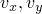
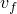
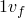
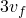
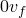
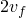
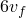

# 3.12.1 Aqua load cases

**Products: **Abaqus/Standard  Abaqus/Explicit  

### I. Full submergence of structural members

### Elements tested

B21    B21H    B22    B22H    B23    B23H    B31    B31H    B32    B32H    B33    B33H    

ELBOW31    ELBOW31B    ELBOW31C    ELBOW32    

PIPE21    PIPE21H    PIPE22    PIPE22H    PIPE31    PIPE31H    PIPE32    PIPE32H    

RB2D2    RB3D2    R3D3    R3D4    

T2D2    T2D2H    T2D3    T2D3H    T3D2    T3D2H    T3D3    T3D3H    

### Problem description

The structural member (beam, pipe, elbow, or truss) is kept straight and constrained, and it is moved to different positions and orientations in different steps; where appropriate, it is given a uniform velocity and acceleration. The structural member is subjected to various drag and buoyancy loads in the different steps. The problems are described in detail in the input files. The concentrated and distributed load procedures are tested in these problems. The effective axial force (output variable ESF1) for beam, pipe, and truss elements is also tested.

The features and load types tested in each problem in the various steps are: 

1. Buoyancy, PB.
2. Normal drag, static, FDD.
3. Tangential drag, static, FDT.
4. Normal drag, dynamic, FDD.
5. Tangential drag, dynamic, FDT.
6. Inertial drag, FI.
7. Normal drag, dynamic, partial immersion, FDD.
8. End-drag, dynamic, FD1, FD2.
9. End-drag, dynamic, TFD (concentrated load).
10. Inertial end-drag, FI1, FI2.
11. Inertial end-drag, TSI (concentrated load).
12. Transition-section buoyancy, TSB.
13. End-drag, dynamic, (additional test), FD1, FD2.
14. End-drag, dynamic, (additional test), TFD (concentrated load).
15. Wind-drag, dynamic, WDD.
16. Wind end-drag, dynamic, WD1, WD2.
17. Wind end-drag, dynamic, TWD (concentrated load).

The individual steps are named alphabetically as listed above. These names appear in the step headings.

**Model: **

| Length | 10 |
| --- | --- |
| Orientation | 45 with horizontal axis |
| Pipe section data | *r* = 1.0, *t* = 0.05 |

**Material: **

| Young's modulus | 30 109 |
| --- | --- |
| Poisson's ratio | 0.3 |

**Aqua – environment: **

| Seabed elevation | 0.0 |
| --- | --- |
| Mean water elevation | 40.0 |
| Max. water elevation | 40.0 |
| Min. water elevation | 40.0 |
| Gravitational constant | 32.2 |
| Fluid mass density | 1.987 |
| Steady velocity specification: two-dimensional |
| (, elevation) | (2.0, 1.0, 0.0) |
| (, elevation) | (2.0, 1.0, 2000.0) |
| Steady velocity specification: three-dimensional |
| (, , elevation) | (2.0, 1.0, 0.0) |
| (, , elevation) | (2.0, 1.0, 2000.0) |
| ( = 0.0) |

### Results and discussion

The correct total force can be determined analytically for the simple case of a straight structural member under drag or buoyancy loads, subjected to a uniform structural velocity or acceleration immersed in water with a constant velocity field. In all cases the reaction force at the beam nodes produced by Abaqus matches the analytical solution.

The analytically determined results are listed in the headings for each step in the input files.

### Input files

[eb22pxdb.inp](../eif/eb22pxdb.inp)

B21 elements.

[eb2hpxdb.inp](../eif/eb2hpxdb.inp)

B21H elements.

[eb23pxdb.inp](../eif/eb23pxdb.inp)

B22 elements.

[eb2ipxdb.inp](../eif/eb2ipxdb.inp)

B22H elements.

[eb2apxdb.inp](../eif/eb2apxdb.inp)

B23 elements.

[eb2jpxdb.inp](../eif/eb2jpxdb.inp)

B23H elements.

[eb32pxdb.inp](../eif/eb32pxdb.inp)

B31 elements.

[eb3hpxdb.inp](../eif/eb3hpxdb.inp)

B31H elements.

[eb33pxdb.inp](../eif/eb33pxdb.inp)

B32 elements.

[eb3ipxdb.inp](../eif/eb3ipxdb.inp)

B32H elements.

[eb3apxdb.inp](../eif/eb3apxdb.inp)

B33 elements.

[eb3jpxdb.inp](../eif/eb3jpxdb.inp)

B33H elements.

[exel1xdb.inp](../eif/exel1xdb.inp)

ELBOW31 elements.

[exelbxdb.inp](../eif/exelbxdb.inp)

ELBOW31B elements.

[exelbxdb.inp](../eif/exelbxdb.inp)

ELBOW31C elements.

[exel2xdb.inp](../eif/exel2xdb.inp)

ELBOW32 elements.

[ep22pxdb.inp](../eif/ep22pxdb.inp)

PIPE21 elements.

[ep2hpxdb.inp](../eif/ep2hpxdb.inp)

PIPE21H elements.

[ep23pxdb.inp](../eif/ep23pxdb.inp)

PIPE22 elements.

[ep2ipxdb.inp](../eif/ep2ipxdb.inp)

PIPE22H elements.

[ep32pxdb.inp](../eif/ep32pxdb.inp)

PIPE31 elements.

[ep3hpxdb.inp](../eif/ep3hpxdb.inp)

PIPE31H elements.

[ep33pxdb.inp](../eif/ep33pxdb.inp)

PIPE32 elements.

[ep3ipxdb.inp](../eif/ep3ipxdb.inp)

PIPE32H elements.

[er22sxdb.inp](../eif/er22sxdb.inp)

RB2D2 elements.

[er32sxdb.inp](../eif/er32sxdb.inp)

RB3D2 elements.

[er33sxdb.inp](../eif/er33sxdb.inp)

R3D3 elements.

[er34sxdb.inp](../eif/er34sxdb.inp)

R3D4 elements.

[et22sxdb.inp](../eif/et22sxdb.inp)

T2D2 elements.

[et2hsxdb.inp](../eif/et2hsxdb.inp)

T2D2H elements.

[et23sxdb.inp](../eif/et23sxdb.inp)

T2D3 elements.

[et2isxdb.inp](../eif/et2isxdb.inp)

T2D3H elements.

[et32sxdb.inp](../eif/et32sxdb.inp)

T3D2 elements.

[et3hsxdb.inp](../eif/et3hsxdb.inp)

T3D2H elements.

[et33sxdb.inp](../eif/et33sxdb.inp)

T3D3 elements.

[et3isxdb.inp](../eif/et3isxdb.inp)

T3D3H elements.

### II. Partial submergence of structural members

### Elements tested

B21    B21H    B22    B22H    B23    B23H    B31    B31H    B32    B32H    B33    B33H    

ELBOW31C    RB2D2    RB3D2    

T2D2    T2D2H    T2D3    T2D3H    T3D2    T3D2H    T3D3    T3D3H    

### Problem description

The structural member is positioned vertically in both the two- and three-dimensional cases, such that one-half of the structure is below the seabed and only the top half is subject to fluid loads.

Nodes of each element are constrained to a single node whose reaction force is monitored.

The features and load types tested in each problem in the various steps are:

1. Static analysis with drag load FDD and no wave loads.
2. Static analysis: dummy step to zero out the loads.
3. Dynamic analysis with inertial load FI.

**Model: **

| Height of the structure | 2 |
| --- | --- |
| Section data | *r* = 1.0 for beams, *A* = 1.0 for trusses |

**Material: **

| Young's modulus | 1 106 |
| --- | --- |

**Aqua – environment: **

| Seabed elevation | 0.0 |
| --- | --- |
| Mean water elevation | 2.0 |
| Gravitational constant | 32.2 |
| Fluid mass density | 1.99 |
| Steady velocity specification: 2D/3D |
| (, , , elevation) | (1.0, 0.0, 0.0, 0.0) |
| (, , , elevation) | (1.0, 0.0, 0.0, 2.0) |

**Airy wave parameters: **

| Amplitude | 0.1 |
| --- | --- |
| Period | 10.0 |
| Phase angle | 0.0 |
| Direction of travel | (1.0, 0.0) |

### Results and discussion

The results match the analytically determined reaction force.

### Input files

[eb22cxd1.inp](../eif/eb22cxd1.inp)

B21 elements.

[ebxxcxd1.inp](../eif/ebxxcxd1.inp)

All beam elements.

[exelcxd1.inp](../eif/exelcxd1.inp)

ELBOW31C elements.

[etxxcxd1.inp](../eif/etxxcxd1.inp)

All truss elements.

### III. Submergence of a rigid box

### Elements tested

R3D3    R3D4    

### Problem description

A box composed of three-dimensional rigid elements is immersed in water subject to a buoyancy load (PB). The buoyancy forces and moments produced are measured by the reaction force at the rigid body reference node in four distinct configurations: in the initial configuration, as well as in the configurations produced when the body is given 60 of heel and then followed by 10 and 20 of trim.

### Results and discussion

The Abaqus values for the buoyancy forces match the analytical values exactly. Because analytical values are not readily available at the moment, these values are compared with values produced by an independent code and agree to within one-quarter of 1%. The expected results are listed in the input files.

### Input files

[er33sxdb.inp](../eif/er33sxdb.inp)

R3D3 elements.

[er34sxdb.inp](../eif/er34sxdb.inp)

R3D4 elements.

### IV. Eigenfrequency extraction with added mass

### Elements tested

B21    T3D2    

### Problem description

Frequencies of natural vibration are computed for slender structures with different boundary conditions, with and without the effect of added mass.

**Model: **

| Length | 1000 |
| --- | --- |
| Beam section data (circular) | *r* = 3 |

**Material: **

| Young's modulus | 4.32 109 |
| --- | --- |
| Density |  = 14.91 |

**Aqua – environment: **

| Seabed elevation | 100 |
| --- | --- |
| Mean water elevation | 100 |
| Gravitational constant | 32.2 |
| Fluid mass density | 2 |

### Results and discussion

The analytically determined results and those given by Abaqus are listed at the top of each of the input files.

### Input files

[eb22cxd1.inp](../eif/eb22cxd1.inp)

Transverse vibration of simply supported beam.

[eb22cxd2.inp](../eif/eb22cxd2.inp)

Transverse vibration of clamped-free cantilever beam.

[eb22cxd3.inp](../eif/eb22cxd3.inp)

Longitudinal vibration of clamped-free cantilever beam.

[et32pxdb.inp](../eif/et32pxdb.inp)

Longitudinal vibration of clamped-free truss.

### V. Spatial variation of steady current velocity

### Elements tested

PIPE21    PIPE31    

### Problem description

Vertical structural members, fully submerged and constrained, are subjected to a steady current velocity that is uniform with respect to elevation but varies with position (*x*-coordinate for two-dimensional cases, and *x*- and *y*-coordinate for three-dimensional cases). The drag forces on the individual members can be determined analytically and compared to the nodal reaction forces.

The fluid velocity  is equal to 2.8961.

**Model: **

| Height of the structure | 10 |
| --- | --- |
| Pipe section data | *r* = 1.0, *t* = 0.05 |

**Material: **

| Young's modulus | 30 106 |
| --- | --- |

**Aqua – environment: **

| Seabed elevation | 0.0 |
| --- | --- |
| Mean water elevation | 40.0 |
| Gravitational constant | 32.2 |
| Fluid mass density | 1.987 |

**Steady velocity specification: two-dimensional case: **

| (, , , *x*-coord.) | (, 0.0, 0.0, 100.0) |
| --- | --- |
| (, , , *x*-coord.) | (, 0.0, 0.0, 300.0) |
| (, , , *x*-coord.) | (, 0.0, 0.0, 600.0) |
| (, , , *x*-coord.) | (, 0.0, 0.0, 900.0) |

**Steady velocity specification: three-dimensional case: **

| (, , , *x*-coord., *y*-coord.) | (, 0.0, 0.0, 100.0, 200.0) |
| --- | --- |
| (, , , *x*-coord., *y*-coord.) | (, 0.0, 0.0, 300.0, 200.0) |
| (, , , *x*-coord., *y*-coord.) | (, 0.0, 0.0, 600.0, 200.0) |
| (, , , *x*-coord., *y*-coord.) | (, 0.0, 0.0, 900.0, 200.0) |
| (, , , *x*-coord., *y*-coord.) | (, 0.0, 0.0, 100.0, 800.0) |
| (, , , *x*-coord., *y*-coord.) | (, 0.0, 0.0, 300.0, 800.0) |
| (, , , *x*-coord., *y*-coord.) | (, 0.0, 0.0, 600.0, 800.0) |
| (, , , *x*-coord., *y*-coord.) | (, 0.0, 0.0, 900.0, 800.0) |

### Results and discussion

The results match the analytically determined reaction forces at select locations.

### Input files

[ep22pxd5.inp](../eif/ep22pxd5.inp)

PIPE21 elements.

[ep32pxd5.inp](../eif/ep32pxd5.inp)

PIPE31 elements.

[ep22pxd5_xpl.inp](../eif/ep22pxd5_xpl.inp)

PIPE21 elements in Abaqus/Explicit.

[ep32pxd5_xpl.inp](../eif/ep32pxd5_xpl.inp)

PIPE31 elements in Abaqus/Explicit.

### VI. Dynamic pressure, closed-end buoyancy loads

### Elements tested

PIPE21    PIPE22    PIPE31    

### Problem description

This problem tests the dynamic pressure implementation and closed-end buoyancy loading for the three Abaqus/Aqua wave options. A vertical pile is fully constrained and subjected to buoyancy loading. The Airy, Stokes, and gridded wave options are used to calculate the total reaction force on the structure during a direct-integration implicit dynamic analysis procedure. Distributed load type PB is used with a 50-element model, and concentrated load type TSB is used with a one-element model.

**Model: **

| Height of the structure | 175.0 (100.0 below and 75.0 above mean water elevation) |
| --- | --- |
| Pipe section data | *r* = 1.0, *t* = 0.25 |

**Material: **

| Young's modulus | 1 106 |
| --- | --- |

**Aqua – environment: **

| Seabed elevation | 100.0 |
| --- | --- |
| Mean water elevation | 1100.0 |
| Gravitational constant | 32.2 |
| Fluid mass density | 2.0 |

### Results and discussion

The results agree well with the analytically determined peak total reaction force.

### Input files

[ep32pxx1.inp](../eif/ep32pxx1.inp)

Airy waves, PIPE31 elements.

[ep23pxx2.inp](../eif/ep23pxx2.inp)

Stokes waves, PIPE22 elements.

[ep32pxx3.inp](../eif/ep32pxx3.inp)

Gridded wave data with linear interpolation, PIPE31 elements.

[ep23pxx3.inp](../eif/ep23pxx3.inp)

Gridded wave data with quadratic interpolation, PIPE22 elements.

[pb_airy_p31_xpl.inp](../eif/pb_airy_p31_xpl.inp)

Airy waves, PIPE31 elements in Abaqus/Explicit.

[pb_airy_p21_xpl.inp](../eif/pb_airy_p21_xpl.inp)

Airy waves, PIPE21 elements in Abaqus/Explicit.

### VII. Gridded wave file

### Problem description

This problem illustrates the creation of the gridded wave file. The unformatted binary gridded wave files used in ["Dynamic pressure, closed-end buoyancy loads" in "Aqua load cases," Section 3.12.1](ch03s12abv237.md#ver-prc-dynpressbuoy)” ([ep32pxx3.inp](../eif/ep32pxx3.inp) and [ep23pxx3.inp](../eif/ep23pxx3.inp)) are created from ASCII format files containing the gridded wave data using a FORTRAN program.

### Results and discussion

The files gridwave_3d.binary and gridwave_2d.binary are created for use in ["Dynamic pressure, closed-end buoyancy loads" in "Aqua load cases," Section 3.12.1](ch03s12abv237.md#ver-prc-dynpressbuoy).”

### Input files

[gridwave_2d.inp](../eif/gridwave_2d.inp)

ASCII format file containing two-dimensional gridded wave data.

[gridwave_3d.inp](../eif/gridwave_3d.inp)

ASCII format file containing three-dimensional gridded wave data.

[gridfile_2d.f](../eif/gridfile_2d.f)

FORTRAN program to convert the two-dimensional ASCII data file to a binary gridded wave file.

[gridfile_3d.f](../eif/gridfile_3d.f)

FORTRAN program to convert the three-dimensional ASCII data file to a binary gridded wave file.

### VIII. Miscellaneous partial submergence tests for Stokes waves

### Elements tested

B21    PIPE21    

### Problem description

This problem tests the implementation of the effective axial force output quantity ESF1. Coincident, one-element, vertical piles are partially submerged in a Stokes wave field such that the element integration points change between unsubmerged and submerged conditions during the analysis. The piles are fully constrained and subjected to distributed load type PB including internal fluid pressure. One pile is completely filled with internal fluid (Case A), and one is partially filled with internal fluid such that the element integration point is above the internal fluid free surface elevation (Case B). An amplitude variation is added to the distributed load definition in Cases A and B to produce, respectively, Cases C and D. Cases A and C use PIPE21 elements, and Cases B and D use B21 elements with general beam section to define the element properties. With the results from this analysis, the effective axial force output is tested using the postprocessing analysis procedure option.

### Results and discussion

The effective axial force, ESF1, agrees with the analytical results for each case. The results are documented at the top of the [xesf1gen.inp](../eif/xesf1gen.inp) input file.

### Input files

[xesf1gen.inp](../eif/xesf1gen.inp)

Input file for this analysis.

[xesf1gep.inp](../eif/xesf1gep.inp)

Input file that tests the postprocessing analysis procedure option.

### IX. Miscellaneous buoyancy loading

### Element tested

PIPE21    

### Problem description

This problem tests loading types PB and  TSB when the fluid properties are prescribed as part of the loading. A general beam section procedure is used to describe the section properties.

### Results and discussion

The results match the analytical solution.

### Input file

[pipepbtsb.inp](../eif/pipepbtsb.inp)

Input file for this analysis.

