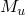
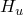

# 3.12.2 自升式基础分析

**产品：**Abaqus/Standard  

### I. 初始嵌入分析

### 测试的单元

JOINT2D    JOINT3D    

### 问题描述

验证了作为预荷载函数的砂土和粘土模型的初始嵌入计算。对不同模型执行给定自升式基础预荷载的两步单单元弹性分析。使用JOINT3D单元。在第一步中，基底节点被固定，顶端节点承受集中力和力矩。第二步是关于前一步的静力扰动分析。对下面描述的六种模型进行分析。验证嵌入值是正确的，且弹性模量对嵌入有正确的依赖性。

力的单位为kN，长度单位为米。

1. 砂土模型，筒形桩靴： | 桩靴直径 | 10.9 | | --- | --- | | 桩靴锥角 | 180° | | 基础预荷载 | 50600 | | 基础抗拉能力 | 0.0 | | 土体水下单位重量 | 10.0 | | 土体内摩擦角 | 33° | | 土体泊松比 | 0.2 | | 基础弹性剪切模量， | 5.14×10^4 | |  | 3.87×10^3 | |  | 2.04×10^4 | | 常数系数， | 1.0 | | 常数系数， | 0.5 |
2. 砂土模型，锥形桩靴—嵌入大于临界值： 土体属性与情况a相同。 | 桩靴直径 | 10.9 | | --- | --- | | 桩靴锥角 | 150° | | 基础预荷载 | 50,000 | | 基础抗拉能力 | 0 |
3. 砂土模型，锥形桩靴—嵌入小于临界值： 桩靴和土体的属性与情况b相同。此情况的基础预荷载为15000。
4. 粘土模型，筒形桩靴： | 桩靴直径 | 20.0 | | --- | --- | | 桩靴锥角 | 180° | | 基础预荷载 | 1.3×10^5 | | 基础抗拉能力 | 0.0 | | 土体水下单位重量 | 10.0 | | 土体不排水剪切强度 | 150.0 | | 土体泊松比 | 0.5 | | 基础弹性剪切模量， | 1.56×10^4 | |  | 2.34×10^3 | |  | 6.38×10^4 | | 硬化参数，*a* | 7.204×10^4 | | 硬化参数，*b* | 1.978×10^3 |
5. 粘土模型，锥形桩靴—嵌入大于临界值： | 桩靴直径 | 20.0 | | --- | --- | | 桩靴锥角 | 150° | | 基础预荷载 | 8.5×10^5 | | 基础抗拉能力 | 0.0 | | 土体水下单位重量 | 10.0 | | 土体不排水剪切强度 | 50.0 | | 土体泊松比 | 0.5 | | 基础弹性剪切模量， | 1.56×10^4 | |  | 2.34×10^3 | |  | 6.38×10^4 | | 硬化参数，*a* | 2.395×10^5 | | 硬化参数，*b* | 8.777×10^6 | | 硬化参数，*c* | 2.9294 |
6. 粘土模型，锥形桩靴—嵌入小于临界值： 土体和桩靴的属性与情况e相同。基础预荷载为1.3×10^5。

另外六个单元测试材料属性的初始场变量依赖性。在场变量的指定值下，这些单元具有模型a、b、c、d、e和f的属性。

### 结果与讨论

每个模型的初始嵌入与分析结果一致。

### 输入文件

[paqajembed.inp](../eif/paqajembed.inp)

初始嵌入分析。

### II. 推覆分析：砂土模型

### 问题描述

测试的结构是一个四角柱方形平台，每个腿角处有一个底座。由于对称性，模型可以简化为二维。模型投影到垂直于平台对角切割的垂直平面上。腿用B21梁单元建模，基础用JOINT2D单元建模。平台建模为二维门架，有一个迎风腿、一个背风腿和两个中间腿。平台被视为刚性的，用RB2D2单元建模。执行四种具有不同基础承载能力的推覆分析。

力的单位为kN，长度单位为米。

| 腿长度 | 59 |
| --- | --- |
| 腿EI | 1.0×10^15 |
| 腿AE | 3.0×10^15 |
| 腿GA | 2.0×10^15 |
| 从平台重心到背风腿的水平距离 | 29.33 |
| 从平台重心到迎风腿的水平距离 | 29.33 |
| 从平台重心到中间腿的水平距离 | 0 |
| 桩靴直径 | 14.0 |
| 桩靴锥角 | 180° |
| 基础预荷载，四种情况 | 387500、530000、650000、775000 |
| 基础抗拉能力 | 40000 |
| 桩靴初始垂直荷载 | 52250 |
| 从重心到荷载施加点的垂直距离 | 0 |
| 土体水下单位重量 | 10.0 |
| 土体内摩擦角 | 35° |
| 土体泊松比 | 0.2 |
| 基础弹性剪切模量， | 1.63×10^5 |
|  | 2.92×10^4 |
|  | 2.10×10^4 |
| 常数系数， | 0.3 |
| 常数系数， | 0.3 |

极限承载力通过在时间周期为1的静力步骤中施加大于承载力的荷载来确定。此荷载在步骤中增加，当达到承载力时分析无法收敛。承载力通过将参考荷载（在这些情况中为200000 kN）乘以完成的时间步长的分数来确定。

对于推覆分析的准确结果，经验表明应使用小时间增量来准确积分塑性方程。这些分析各自使用三种不同的固定时间增量运行。

### 结果与讨论

四种基础预荷载情况的极限承载力与使用外部代码计算的以下参考承载力非常一致。

|  | 参考 | Abaqus承载力 |
| --- | --- | --- |
| 预荷载 | 承载力 |  = 1×10^2 |  = 1×10^3 |  = 1×10^4 |
| 387.5×10^3 | 126×10^3 | 30×10^3 | 125×10^3 | 124×10^3 |
| 530×10^3 | 137×10^3 | 140×10^3 | 136×10^3 | 136×10^3 |
| 650×10^3 | 145×10^3 | 146×10^3 | 143×10^3 | 143×10^3 |
| 775×10^3 | 150×10^3 | 152×10^3 | 153×10^3 | 150×10^3 |

输入文件[paqajsandp.inp](../eif/paqajsandp.inp)建模了775000 kN预荷载情况，在100个增量步骤中施加了极限承载力150000 kN的95%的荷载。

### 输入文件

[paqajsandp.inp](../eif/paqajsandp.inp)

砂土模型的推覆分析。

### III. 单调加载分析：粘土模型

### 问题描述

测试问题是三角三腿自升式钻井平台在粘土上的单调水平加载分析。平台建模为由刚性单元组成的框架，有两个迎风腿和一个背风腿。对于二维分析，模型投影在对称的垂直平面上。二维和三维分析的加载都在此平面内，因此两种分析产生相同的结果。加载包括在刚性框架下方某点施加的水平荷载。腿用B21单元建模，接头用JOINT2D单元建模。

土体和桩靴的属性如初始嵌入分析情况d中所述。

| 腿长度 | 110.6 |
| --- | --- |
| 腿EI | 2.48×10^9 |
| 腿AE | 1.54×10^15 |
| 腿GA | 3.61×10^15 |
| 从平台重心到背风腿的水平距离 | 37.0 |
| 从平台重心到迎风腿的水平距离 | 18.0 |
| 桩靴初始垂直荷载 | 6.6×10^4 |
| 从重心到荷载施加点的垂直距离 | 55.0 |

### 结果与讨论

迎风腿和背风腿的估计荷载路径与从外部代码计算的荷载路径一致。

### 输入文件

[paqajclaym.inp](../eif/paqajclaym.inp)

粘土模型的单调加载分析。

[paqajclaym3d.inp](../eif/paqajclaym3d.inp)

粘土模型的单调加载分析，三维。

### IV. 带锥形桩靴的粘土模型

### 问题描述

测试结构与["单调加载分析：粘土模型"中"自升式基础分析，"第3.12.2节](ch03s12abv238.md#ver-prc-jackup-monoclay)相同。土体塑性属性不同，桩靴是锥形的。在这种情况下，锥形桩靴产生相当不同的结果，即使在弹性区域也是如此，模型验证了弹性属性通过嵌入对塑性属性有正确的依赖性。分析包括将平台的水平加载至18000 kN。

土体和桩靴属性如初始嵌入分析情况e中所述。平台尺寸与单调加载分析相同。

### 结果与讨论

平台重心的荷载-位移曲线以及迎风和背风桩靴的弯矩-水平荷载曲线与从外部代码获得的结果进行了比较，且一致。

### 输入文件

[paqajclaymc.inp](../eif/paqajclaymc.inp)

带锥形桩靴的粘土模型的单调加载分析。

### V. 单调加载：构件

### 问题描述

测试结构是一个四角方形平台的半模型，投影在垂直的非对角对称平面上。水平和垂直荷载施加在平台重心处。腿的剪切刚度不包括在模型中；使用B23单元。在此情况下，桩靴建模为理想弹塑性的，使用"构件"型塑性模型。垂直荷载在第一步中从20增加到100，然后保持恒定直到步骤结束。在下一步中，水平荷载增加到14。

平面内平台的尺寸、梁属性和桩靴的弹性属性如粘土推覆分析中所述。构件的塑性属性如下所示：

| 抛物线屈服函数参数： |
| --- |
|  | 100 |
|  | 100 |
|  | 2400 |
|  | 10^15 |

### 结果与讨论

计算并绘制了背风桩靴和构件的弯矩-轴向相互作用，确定其沿固定屈服面正确进行。

### 输入文件

[paqajmembm.inp](../eif/paqajmembm.inp)

理想塑性"构件"模型的单调加载。

