# 3.12.3 弹塑性接头单元

**产品：**Abaqus/Standard  

### 测试的单元

JOINT2D    JOINT3D    

### 问题描述

对二维和三维接头单元执行四步单单元测试。测试包括锥形和圆柱形截面，以及对角线和完全填充的弹性刚度材料情况。接头单元的行为在局部坐标系中定义，结果也在同一坐标系中输出。

使用了七种不同的桩靴模型：

1. 二维筒形桩靴，*D* = 1.6，一般模量， = 2000，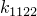 = 1000， = 3000，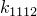 = 2000，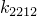 = 0.0，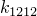 = 6000。
2. 二维筒形桩靴，*D* = 1.25，桩靴模量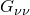 = 840.0， = 1643.0， = 2150.4，泊松比， = 0.3。
3. 二维锥形桩靴，*D* = 1.25， = 60°，桩靴模量和泊松比与情况b相同，初始嵌入为0.5 m（小于临界嵌入）。
4. 二维锥形桩靴，*D* = 1.25， = 60°，桩靴模量和泊松比与情况b相同，初始嵌入为2.5 m（大于临界嵌入）。
5. 三维筒形桩靴，*D* = 1.1，一般模量， = 1000， = 0.0， = 2000，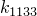 = 0.0，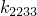 = 1200， = 3000， = 0.0， = 0.0，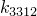 = 0.0， = 5000，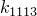 = 0.0，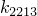 = 0.0，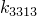 = 1000，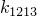 = 0.0， = 6000，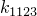 = 0.0，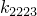 = 1000，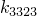 = 0.0，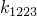 = 0.0，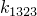 = 0.0， = 2000。
6. 三维筒形桩靴，*D* = 1.5，桩靴模量， = 700， = 1095.2， = 4666.3，扭转弹性弹簧刚度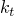 = 5000，泊松比， = 0.3。
7. 三维锥形桩靴，*D* = 1.5， = 60°，桩靴模量 = 202.1， = 474.3， = 176.83，扭转弹性弹簧刚度 = 4500，泊松比， = 0.3，*D* = 1.5，初始嵌入 = 0.321（小于临界）。

另外四个单元测试材料属性的场变量依赖性。在场变量的指定值下，这些单元具有模型a、b、e和f的属性。

**边界条件和荷载：**

在第一步中，基底节点和顶端节点都承受规定的位移和旋转。在第二步中，移除先前的边界条件，通过规定位移和旋转使基底节点产生位移。顶端节点可以自由移动，在这种情况下应该跟随基底节点。在第三步中，基底节点被固定，顶端节点承受集中力和力矩。第四步是关于前一步的扰动步骤，荷载扰动量为前一步一般步骤中荷载的50%。

### 结果与讨论

获得的结果与分析结果一致。

### 输入文件

[exepxlx1.inp](../eif/exepxlx1.inp)

弹塑性接头单元的线弹性测试。

