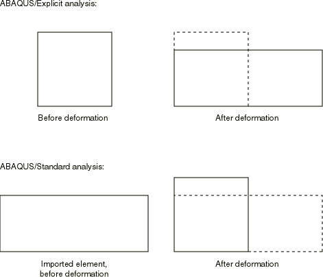

# 3.14.1 Transferring results between Abaqus/Explicit and Abaqus/Standard

**Products: **Abaqus/Standard  Abaqus/Explicit  

### I. Transferring stress/displacement results from Abaqus/Explicit to Abaqus/Standard

### Elements tested

B21    B22    B31    B32    C3D4    C3D6    C3D8R    C3D8    CAX3    CAX4R    

CPE3    CPE4R    CPS3    CPS4R    M3D3    M3D4    M3D4R    

S3R    S4R    S4    SAX1    T2D2    T3D2    

C3D10M    CPE6M    CPS6M    CAX6M    SC6R    SC8R    

COH2D4    COHAX4    COH3D8    COH3D6    

### Problem description

The verification tests in this section consist of one-element models that are subjected to tensile, pure shear, or bending loads in Abaqus/Explicit. The analyses in Abaqus/Explicit are followed by analyses in Abaqus/Standard in which the results are imported from the Abaqus/Explicit analysis and the loading is removed. Nearly all the tests involve purely elastic materials. The tests are performed for all combinations of parameters to check whether the reference configuration is reset to be the imported configuration, and the material state is to be imported upon importing information from a previous Abaqus analysis. To verify that the results from the Abaqus/Explicit analyses are imported correctly into Abaqus/Standard, the results of the Abaqus/Standard analyses should show that the elements return to their original configuration before the loading in the Abaqus/Explicit analysis, except when the material state is not imported, in which case the elements remain in the deformed configuration.

The sequence of loading in Abaqus/Explicit and unloading in Abaqus/Standard is illustrated in [Figure 3.14.1--1](ch03s14abv241.md#exximport-loadsequence)

**Figure 3.14.1–1** Sequence of loading and unloading.

 for an S4R element loaded in tension when the reference configuration is updated to be the imported configuration, and the current material state is imported.

The loading is applied in the Abaqus/Explicit analyses by prescribing the appropriate displacements. In the Abaqus/Standard analyses all the boundary conditions must be redefined, and in all cases only the fixed boundary conditions are defined. The shell and membrane elements are loaded so that the maximum displacements are 2. The remaining elements are loaded so that the maximum displacements are 0.2.

Analyses with reduced-integration elements require hourglass control to remove singular (hourglass) modes. However, differences in the hourglass forces computed in Abaqus/Explicit and Abaqus/Standard affect the force equilibrium for imported problems. Using enhanced hourglass control for both the Abaqus/Explicit and Abaqus/Standard analyses minimizes the differences in the hourglass forces upon import. Verification tests with enhanced hourglass control for both the Abaqus/Explicit and Abaqus/Standard analyses are included to test the performance of import problems.

The material model used for nearly all the tests is isotropic linear elasticity. One test consists of a plastic material modeled with Mises plasticity. The material properties used are as follows:

| Young's modulus = 200 109 |
| --- |
| Poisson's ratio = 0.3 |
| Density = 1000. |
| Yield stress = 500 106 |
| Hardening = 500 106 |

For the tests using cohesive elements, some use elasticity with uncoupled traction behavior, some use hyperelasticity, some include damage, and the tests with pure shear loading also use additional transverse shear stiffness.

### Results and discussion

In all the elastic tests that involve tensile loading, shear loading, and bending, the elements return to their original configuration. In some cases tighter controls for the convergence criteria are enforced for the Abaqus/Standard analyses to obtain more accurate results.

The elastic tests for shell and membrane elements show differences when comparing the section thickness that is computed by Abaqus/Standard and the original thickness. In Abaqus/Explicit the changes in shell and membrane thickness are computed using the material Poisson's ratio, while in Abaqus/Standard the default is to compute the thickness based on the assumption of no volume change. In most practical cases the thickness change during unloading or springback will be small: the differences observed in these tests occur because the material is assumed to remain elastic for very large deformations.

### Input files

##### **Abaqus/Explicit analysis files**

#### B21 element tests:

[xs_x_b21_t.inp](../eif/xs_x_b21_t.inp)

Model loaded in tension.

[xs_x_b21_s.inp](../eif/xs_x_b21_s.inp)

Model loaded in shear.

[xs_x_b21_b.inp](../eif/xs_x_b21_b.inp)

Model loaded in bending.

#### B22 element tests:

[xs_x_b22_t.inp](../eif/xs_x_b22_t.inp)

Model loaded in tension.

[xs_x_b22_s.inp](../eif/xs_x_b22_s.inp)

Model loaded in shear.

[xs_x_b22_b.inp](../eif/xs_x_b22_b.inp)

Model loaded in bending.

#### B31 element tests:

[xs_x_b31_t.inp](../eif/xs_x_b31_t.inp)

Model loaded in tension.

[xs_x_b31_s.inp](../eif/xs_x_b31_s.inp)

Model loaded in shear.

[xs_x_b31_b.inp](../eif/xs_x_b31_b.inp)

Model loaded in bending.

[xs_x_b31_w.inp](../eif/xs_x_b31_w.inp)

Model loaded in twist.

#### B32 element tests:

[xs_x_b32_t.inp](../eif/xs_x_b32_t.inp)

Model loaded in tension.

[xs_x_b32_s.inp](../eif/xs_x_b32_s.inp)

Model loaded in shear.

[xs_x_b32_b.inp](../eif/xs_x_b32_b.inp)

Model loaded in bending.

[xs_x_b32_w.inp](../eif/xs_x_b32_w.inp)

Model loaded in twist.

#### C3D4 element tests:

[xs_x_c3d4_s.inp](../eif/xs_x_c3d4_s.inp)

Model loaded in shear.

[xs_x_c3d4_t.inp](../eif/xs_x_c3d4_t.inp)

Model loaded in tension.

#### C3D6 element tests:

[xs_x_c3d6_s.inp](../eif/xs_x_c3d6_s.inp)

Model loaded in shear.

[xs_x_c3d6_t.inp](../eif/xs_x_c3d6_t.inp)

Model loaded in tension.

#### C3D8R element tests:

[xs_x_c3d8r_s.inp](../eif/xs_x_c3d8r_s.inp)

Model loaded in shear.

[xs_x_c3d8r_t.inp](../eif/xs_x_c3d8r_t.inp)

Model loaded in tension.

#### C3D8 element tests:

[xs_x_c3d8_s.inp](../eif/xs_x_c3d8_s.inp)

Model loaded in shear.

[xs_x_c3d8_t.inp](../eif/xs_x_c3d8_t.inp)

Model loaded in tension.

#### CAX3 element tests:

[xs_x_cax3_s.inp](../eif/xs_x_cax3_s.inp)

Model loaded in shear.

[xs_x_cax3_t.inp](../eif/xs_x_cax3_t.inp)

Model loaded in tension.

#### CAX4R element tests:

[xs_x_cax4r_s.inp](../eif/xs_x_cax4r_s.inp)

Model loaded in shear.

[xs_x_cax4r_t.inp](../eif/xs_x_cax4r_t.inp)

Model loaded in tension.

#### CPE3 element tests:

[xs_x_cpe3_s.inp](../eif/xs_x_cpe3_s.inp)

Model loaded in shear.

[xs_x_cpe3_t.inp](../eif/xs_x_cpe3_t.inp)

Model loaded in tension.

#### CPE4R element tests:

[xs_x_cpe4r_s.inp](../eif/xs_x_cpe4r_s.inp)

Model loaded in shear.

[xs_x_cpe4r_t.inp](../eif/xs_x_cpe4r_t.inp)

Model loaded in tension.

#### CPS3 element tests:

[xs_x_cps3_s.inp](../eif/xs_x_cps3_s.inp)

Model loaded in shear.

[xs_x_cps3_t.inp](../eif/xs_x_cps3_t.inp)

Model loaded in tension.

#### CPS4R element tests:

[xs_x_cps4r_s.inp](../eif/xs_x_cps4r_s.inp)

Model loaded in shear.

[xs_x_cps4r_t.inp](../eif/xs_x_cps4r_t.inp)

Model loaded in tension.

#### C3D10M element tests:

[xs_x_c3d10m_s.inp](../eif/xs_x_c3d10m_s.inp)

Model loaded in shear.

[xs_x_c3d10m_t.inp](../eif/xs_x_c3d10m_t.inp)

Model loaded in tension.

#### CPE6M element tests:

[xs_x_cpe6m_s.inp](../eif/xs_x_cpe6m_s.inp)

Model loaded in shear.

[xs_x_cpe6m_t.inp](../eif/xs_x_cpe6m_t.inp)

Model loaded in tension.

#### CPS6M element tests:

[xs_x_cps6m_s.inp](../eif/xs_x_cps6m_s.inp)

Model loaded in shear.

[xs_x_cps6m_t.inp](../eif/xs_x_cps6m_t.inp)

Model loaded in tension.

#### CAX6M element tests:

[xs_x_cax6m_s.inp](../eif/xs_x_cax6m_s.inp)

Model loaded in shear.

[xs_x_cax6m_t.inp](../eif/xs_x_cax6m_t.inp)

Model loaded in tension.

#### M3D3 element tests:

[xs_x_m3d3_s.inp](../eif/xs_x_m3d3_s.inp)

Model loaded in shear.

[xs_x_m3d3_t.inp](../eif/xs_x_m3d3_t.inp)

Model loaded in tension.

#### M3D4 element tests:

[xs_x_m3d4_s.inp](../eif/xs_x_m3d4_s.inp)

Model loaded in shear.

[xs_x_m3d4_t.inp](../eif/xs_x_m3d4_t.inp)

Model loaded in tension.

#### M3D4R element tests:

[xs_x_m3d4r_s.inp](../eif/xs_x_m3d4r_s.inp)

Model loaded in shear.

[xs_x_m3d4r_t.inp](../eif/xs_x_m3d4r_t.inp)

Model loaded in tension.

[xs_x_m3d4r_t_enhg.inp](../eif/xs_x_m3d4r_t_enhg.inp)

Model loaded in tension with enhanced hourglass control.

#### S3R element tests:

[xs_x_s3r_s.inp](../eif/xs_x_s3r_s.inp)

Model loaded in shear.

[xs_x_s3r_t.inp](../eif/xs_x_s3r_t.inp)

Model loaded in tension.

#### S4R element tests:

[xs_x_s4r_b.inp](../eif/xs_x_s4r_b.inp)

Model loaded in bending.

[xs_x_s4r_b_pl.inp](../eif/xs_x_s4r_b_pl.inp)

Model loaded in bending with the plasticity material model.

[xs_x_s4r_b_pl_enhg.inp](../eif/xs_x_s4r_b_pl_enhg.inp)

Model loaded in bending with the plasticity material model and enhanced hourglass control.

[xs_x_s4r_s.inp](../eif/xs_x_s4r_s.inp)

Model loaded in shear.

[xs_x_s4r_t.inp](../eif/xs_x_s4r_t.inp)

Model loaded in tension.

[xs_x_s4r_t_pl.inp](../eif/xs_x_s4r_t_pl.inp)

Model loaded in tension with the plasticity material model.

#### S4 element test:

[xs_x_s4_b_pl.inp](../eif/xs_x_s4_b_pl.inp)

Model loaded in bending with the plasticity material model.

#### SAX1 element test:

[xs_x_sax1_t.inp](../eif/xs_x_sax1_t.inp)

Model loaded in tension.

#### T2D2 element test:

[xs_x_t2d2_t.inp](../eif/xs_x_t2d2_t.inp)

Model loaded in tension.

#### T3D2 element test:

[xs_x_t3d2_t.inp](../eif/xs_x_t3d2_t.inp)

Model loaded in tension.

#### SC6R element test:

[xs_x_sc6r_b_pl.inp](../eif/xs_x_sc6r_b_pl.inp)

Model loaded in bending.

#### SC8R element tests:

[xs_x_sc8r_b_pl.inp](../eif/xs_x_sc8r_b_pl.inp)

Model loaded in bending.

[xs_x_sc8r_ini.inp](../eif/xs_x_sc8r_ini.inp)

Model loaded in tension.

[xs_x_sc8r_com_or.inp](../eif/xs_x_sc8r_com_or.inp)

Model loaded in tension.

[xs_x_sc8r_contact.inp](../eif/xs_x_sc8r_contact.inp)

Model loaded in tension.

[xs_x_sc8r_sgm.inp](../eif/xs_x_sc8r_sgm.inp)

Model loaded in tension.

#### COH2D4 , COHAX4, COH3D8, and COH3D6 element tests:

[xs_x_coh_tra_s.inp](../eif/xs_x_coh_tra_s.inp)

Model loaded in shear, RESPONSE=TRACTION SEPARATION.

[xs_x_coh_tra_t.inp](../eif/xs_x_coh_tra_t.inp)

Model loaded in tension, RESPONSE=TRACTION SEPARATION.

[xs_x_coh_con_s.inp](../eif/xs_x_coh_con_s.inp)

Model loaded in shear, RESPONSE=CONTINUUM.

[xs_x_coh_con_t.inp](../eif/xs_x_coh_con_t.inp)

Model loaded in tension, RESPONSE=CONTINUUM.

[xs_x_coh_gas_s.inp](../eif/xs_x_coh_gas_s.inp)

Model loaded in shear, RESPONSE=GASKET.

[xs_x_coh_gas_t.inp](../eif/xs_x_coh_gas_t.inp)

Model loaded in tension, RESPONSE=GASKET.

[xs_x_coh_con_hyper.inp](../eif/xs_x_coh_con_hyper.inp)

Model loaded in tension, hyperelastic, RESPONSE=CONTINUUM.

[xs_x_coh_gas_hyper.inp](../eif/xs_x_coh_gas_hyper.inp)

Model loaded in tension, hyperelastic, RESPONSE=GASKET.

[xs_x_coh_dam.inp](../eif/xs_x_coh_dam.inp)

Model with damage.

##### **Abaqus/Standard analysis files**

#### B21 element tests:

[xs_s_b21_t_n_n.inp](../eif/xs_s_b21_t_n_n.inp)

Model loaded in tension, UPDATE=NO, STATE=NO.

[xs_s_b21_t_n_y.inp](../eif/xs_s_b21_t_n_y.inp)

Model loaded in tension, UPDATE=NO, STATE=YES.

[xs_s_b21_t_y_n.inp](../eif/xs_s_b21_t_y_n.inp)

Model loaded in tension, UPDATE=YES, STATE=NO.

[xs_s_b21_t_y_y.inp](../eif/xs_s_b21_t_y_y.inp)

Model loaded in tension, UPDATE=YES, STATE=YES.

[xs_s_b21_s_n_n.inp](../eif/xs_s_b21_s_n_n.inp)

Model loaded in shear, UPDATE=NO, STATE=NO.

[xs_s_b21_s_n_y.inp](../eif/xs_s_b21_s_n_y.inp)

Model loaded in shear, UPDATE=NO, STATE=YES.

[xs_s_b21_s_y_n.inp](../eif/xs_s_b21_s_y_n.inp)

Model loaded in shear, UPDATE=YES, STATE=NO.

[xs_s_b21_s_y_y.inp](../eif/xs_s_b21_s_y_y.inp)

Model loaded in shear, UPDATE=YES, STATE=YES.

[xs_s_b21_b_n_n.inp](../eif/xs_s_b21_b_n_n.inp)

Model loaded in bending, UPDATE=NO, STATE=NO.

[xs_s_b21_b_n_y.inp](../eif/xs_s_b21_b_n_y.inp)

Model loaded in bending, UPDATE=NO, STATE=YES.

[xs_s_b21_b_y_n.inp](../eif/xs_s_b21_b_y_n.inp)

Model loaded in bending, UPDATE=YES, STATE=NO.

[xs_s_b21_b_y_y.inp](../eif/xs_s_b21_b_y_y.inp)

Model loaded in bending, UPDATE=YES, STATE=YES.

#### B22 element tests:

[xs_s_b22_t_n_n.inp](../eif/xs_s_b22_t_n_n.inp)

Model loaded in tension, UPDATE=NO, STATE=NO.

[xs_s_b22_t_n_y.inp](../eif/xs_s_b22_t_n_y.inp)

Model loaded in tension, UPDATE=NO, STATE=YES.

[xs_s_b22_t_y_n.inp](../eif/xs_s_b22_t_y_n.inp)

Model loaded in tension, UPDATE=YES, STATE=NO.

[xs_s_b22_t_y_y.inp](../eif/xs_s_b22_t_y_y.inp)

Model loaded in tension, UPDATE=YES, STATE=YES.

[xs_s_b22_s_n_n.inp](../eif/xs_s_b22_s_n_n.inp)

Model loaded in shear, UPDATE=NO, STATE=NO.

[xs_s_b22_s_n_y.inp](../eif/xs_s_b22_s_n_y.inp)

Model loaded in shear, UPDATE=NO, STATE=YES.

[xs_s_b22_s_y_n.inp](../eif/xs_s_b22_s_y_n.inp)

Model loaded in shear, UPDATE=YES, STATE=NO.

[xs_s_b22_s_y_y.inp](../eif/xs_s_b22_s_y_y.inp)

Model loaded in shear, UPDATE=YES, STATE=YES.

[xs_s_b22_b_n_n.inp](../eif/xs_s_b22_b_n_n.inp)

Model loaded in bending, UPDATE=NO, STATE=NO.

[xs_s_b22_b_n_y.inp](../eif/xs_s_b22_b_n_y.inp)

Model loaded in bending, UPDATE=NO, STATE=YES.

[xs_s_b22_b_y_n.inp](../eif/xs_s_b22_b_y_n.inp)

Model loaded in bending, UPDATE=YES, STATE=NO.

[xs_s_b22_b_y_y.inp](../eif/xs_s_b22_b_y_y.inp)

Model loaded in bending, UPDATE=YES, STATE=YES.

#### B31 element tests:

[xs_s_b31_t_n_n.inp](../eif/xs_s_b31_t_n_n.inp)

Model loaded in tension, UPDATE=NO, STATE=NO.

[xs_s_b31_t_n_y.inp](../eif/xs_s_b31_t_n_y.inp)

Model loaded in tension, UPDATE=NO, STATE=YES.

[xs_s_b31_t_y_n.inp](../eif/xs_s_b31_t_y_n.inp)

Model loaded in tension, UPDATE=YES, STATE=NO.

[xs_s_b31_t_y_y.inp](../eif/xs_s_b31_t_y_y.inp)

Model loaded in tension, UPDATE=YES, STATE=YES.

[xs_s_b31_s_n_n.inp](../eif/xs_s_b31_s_n_n.inp)

Model loaded in shear, UPDATE=NO, STATE=NO.

[xs_s_b31_s_n_y.inp](../eif/xs_s_b31_s_n_y.inp)

Model loaded in shear, UPDATE=NO, STATE=YES.

[xs_s_b31_s_y_n.inp](../eif/xs_s_b31_s_y_n.inp)

Model loaded in shear, UPDATE=YES, STATE=NO.

[xs_s_b31_s_y_y.inp](../eif/xs_s_b31_s_y_y.inp)

Model loaded in shear, UPDATE=YES, STATE=YES.

[xs_s_b31_b_n_n.inp](../eif/xs_s_b31_b_n_n.inp)

Model loaded in bending, UPDATE=NO, STATE=NO.

[xs_s_b31_b_n_y.inp](../eif/xs_s_b31_b_n_y.inp)

Model loaded in bending, UPDATE=NO, STATE=YES.

[xs_s_b31_b_y_n.inp](../eif/xs_s_b31_b_y_n.inp)

Model loaded in bending, UPDATE=YES, STATE=NO.

[xs_s_b31_b_y_y.inp](../eif/xs_s_b31_b_y_y.inp)

Model loaded in bending, UPDATE=YES, STATE=YES.

[xs_s_b31_w_n_n.inp](../eif/xs_s_b31_w_n_n.inp)

Model loaded in twist, UPDATE=NO, STATE=NO.

[xs_s_b31_w_n_y.inp](../eif/xs_s_b31_w_n_y.inp)

Model loaded in twist, UPDATE=NO, STATE=YES.

[xs_s_b31_w_y_n.inp](../eif/xs_s_b31_w_y_n.inp)

Model loaded in twist, UPDATE=YES, STATE=NO.

[xs_s_b31_w_y_y.inp](../eif/xs_s_b31_w_y_y.inp)

Model loaded in twist, UPDATE=YES, STATE=YES.

#### B32 element tests:

[xs_s_b32_t_n_n.inp](../eif/xs_s_b32_t_n_n.inp)

Model loaded in tension, UPDATE=NO, STATE=NO.

[xs_s_b32_t_n_y.inp](../eif/xs_s_b32_t_n_y.inp)

Model loaded in tension, UPDATE=NO, STATE=YES.

[xs_s_b32_t_y_n.inp](../eif/xs_s_b32_t_y_n.inp)

Model loaded in tension, UPDATE=YES, STATE=NO.

[xs_s_b32_t_y_y.inp](../eif/xs_s_b32_t_y_y.inp)

Model loaded in tension, UPDATE=YES, STATE=YES.

[xs_s_b32_s_n_n.inp](../eif/xs_s_b32_s_n_n.inp)

Model loaded in shear, UPDATE=NO, STATE=NO.

[xs_s_b32_s_n_y.inp](../eif/xs_s_b32_s_n_y.inp)

Model loaded in shear, UPDATE=NO, STATE=YES.

[xs_s_b32_s_y_n.inp](../eif/xs_s_b32_s_y_n.inp)

Model loaded in shear, UPDATE=YES, STATE=NO.

[xs_s_b32_s_y_y.inp](../eif/xs_s_b32_s_y_y.inp)

Model loaded in shear, UPDATE=YES, STATE=YES.

[xs_s_b32_b_n_n.inp](../eif/xs_s_b32_b_n_n.inp)

Model loaded in bending, UPDATE=NO, STATE=NO.

[xs_s_b32_b_n_y.inp](../eif/xs_s_b32_b_n_y.inp)

Model loaded in bending, UPDATE=NO, STATE=YES.

[xs_s_b32_b_y_n.inp](../eif/xs_s_b32_b_y_n.inp)

Model loaded in bending, UPDATE=YES, STATE=NO.

[xs_s_b32_b_y_y.inp](../eif/xs_s_b32_b_y_y.inp)

Model loaded in bending, UPDATE=YES, STATE=YES.

[xs_s_b32_w_n_n.inp](../eif/xs_s_b32_w_n_n.inp)

Model loaded in twist, UPDATE=NO, STATE=NO.

[xs_s_b32_w_n_y.inp](../eif/xs_s_b32_w_n_y.inp)

Model loaded in twist, UPDATE=NO, STATE=YES.

[xs_s_b32_w_y_n.inp](../eif/xs_s_b32_w_y_n.inp)

Model loaded in twist, UPDATE=YES, STATE=NO.

[xs_s_b32_w_y_y.inp](../eif/xs_s_b32_w_y_y.inp)

Model loaded in twist, UPDATE=YES, STATE=YES.

#### C3D4 element test:

[xs_s_c3d4_s_n_n.inp](../eif/xs_s_c3d4_s_n_n.inp)

Model loaded in shear, UPDATE=NO, STATE=NO.

[xs_s_c3d4_s_n_y.inp](../eif/xs_s_c3d4_s_n_y.inp)

Model loaded in shear, UPDATE=NO, STATE=YES.

[xs_s_c3d4_s_y_n.inp](../eif/xs_s_c3d4_s_y_n.inp)

Model loaded in shear, UPDATE=YES, STATE=NO.

[xs_s_c3d4_s_y_y.inp](../eif/xs_s_c3d4_s_y_y.inp)

Model loaded in shear, UPDATE=YES, STATE=YES.

[xs_s_c3d4_t_n_n.inp](../eif/xs_s_c3d4_t_n_n.inp)

Model loaded in tension, UPDATE=NO, STATE=NO.

[xs_s_c3d4_t_n_y.inp](../eif/xs_s_c3d4_t_n_y.inp)

Model loaded in tension, UPDATE=NO, STATE=YES.

[xs_s_c3d4_t_y_n.inp](../eif/xs_s_c3d4_t_y_n.inp)

Model loaded in tension, UPDATE=YES, STATE=NO.

[xs_s_c3d4_t_y_y.inp](../eif/xs_s_c3d4_t_y_y.inp)

Model loaded in tension, UPDATE=YES, STATE=YES.

#### C3D6 element tests:

[xs_s_c3d6_s_n_n.inp](../eif/xs_s_c3d6_s_n_n.inp)

Model loaded in shear, UPDATE=NO, STATE=NO.

[xs_s_c3d6_s_n_y.inp](../eif/xs_s_c3d6_s_n_y.inp)

Model loaded in shear, UPDATE=NO, STATE=YES.

[xs_s_c3d6_s_y_n.inp](../eif/xs_s_c3d6_s_y_n.inp)

Model loaded in shear, UPDATE=YES, STATE=NO.

[xs_s_c3d6_s_y_y.inp](../eif/xs_s_c3d6_s_y_y.inp)

Model loaded in shear, UPDATE=YES, STATE=YES.

[xs_s_c3d6_t_n_n.inp](../eif/xs_s_c3d6_t_n_n.inp)

Model loaded in tension, UPDATE=NO, STATE=NO.

[xs_s_c3d6_t_n_y.inp](../eif/xs_s_c3d6_t_n_y.inp)

Model loaded in tension, UPDATE=NO, STATE=YES.

[xs_s_c3d6_t_y_n.inp](../eif/xs_s_c3d6_t_y_n.inp)

Model loaded in tension, UPDATE=YES, STATE=NO.

[xs_s_c3d6_t_y_y.inp](../eif/xs_s_c3d6_t_y_y.inp)

Model loaded in tension, UPDATE=YES, STATE=YES.

#### C3D8R element tests:

[xs_s_c3d8r_s_n_n.inp](../eif/xs_s_c3d8r_s_n_n.inp)

Model loaded in shear, UPDATE=NO, STATE=NO.

[xs_s_c3d8r_s_n_y.inp](../eif/xs_s_c3d8r_s_n_y.inp)

Model loaded in shear, UPDATE=NO, STATE=YES.

[xs_s_c3d8r_s_y_n.inp](../eif/xs_s_c3d8r_s_y_n.inp)

Model loaded in shear, UPDATE=YES, STATE=NO.

[xs_s_c3d8r_s_y_y.inp](../eif/xs_s_c3d8r_s_y_y.inp)

Model loaded in shear, UPDATE=YES, STATE=YES.

[xs_s_c3d8r_t_n_n.inp](../eif/xs_s_c3d8r_t_n_n.inp)

Model loaded in tension, UPDATE=NO, STATE=NO.

[xs_s_c3d8r_t_n_y.inp](../eif/xs_s_c3d8r_t_n_y.inp)

Model loaded in tension, UPDATE=NO, STATE=YES.

[xs_s_c3d8r_t_y_n.inp](../eif/xs_s_c3d8r_t_y_n.inp)

Model loaded in tension, UPDATE=YES, STATE=NO.

[xs_s_c3d8r_t_y_y.inp](../eif/xs_s_c3d8r_t_y_y.inp)

Model loaded in tension, UPDATE=YES, STATE=YES.

#### C3D8 element tests:

[xs_s_c3d8_s_n_n.inp](../eif/xs_s_c3d8_s_n_n.inp)

Model loaded in shear, UPDATE=NO, STATE=NO.

[xs_s_c3d8_s_n_y.inp](../eif/xs_s_c3d8_s_n_y.inp)

Model loaded in shear, UPDATE=NO, STATE=YES.

[xs_s_c3d8_s_y_n.inp](../eif/xs_s_c3d8_s_y_n.inp)

Model loaded in shear, UPDATE=YES, STATE=NO.

[xs_s_c3d8_s_y_y.inp](../eif/xs_s_c3d8_s_y_y.inp)

Model loaded in shear, UPDATE=YES, STATE=YES.

[xs_s_c3d8_t_n_n.inp](../eif/xs_s_c3d8_t_n_n.inp)

Model loaded in tension, UPDATE=NO, STATE=NO.

[xs_s_c3d8_t_n_y.inp](../eif/xs_s_c3d8_t_n_y.inp)

Model loaded in tension, UPDATE=NO, STATE=YES.

[xs_s_c3d8_t_y_n.inp](../eif/xs_s_c3d8_t_y_n.inp)

Model loaded in tension, UPDATE=YES, STATE=NO.

[xs_s_c3d8_t_y_y.inp](../eif/xs_s_c3d8_t_y_y.inp)

Model loaded in tension, UPDATE=YES, STATE=YES.

#### CAX3 element tests:

[xs_s_cax3_s_n_n.inp](../eif/xs_s_cax3_s_n_n.inp)

Model loaded in shear, UPDATE=NO, STATE=NO.

[xs_s_cax3_s_n_y.inp](../eif/xs_s_cax3_s_n_y.inp)

Model loaded in shear, UPDATE=NO, STATE=YES.

[xs_s_cax3_s_y_n.inp](../eif/xs_s_cax3_s_y_n.inp)

Model loaded in shear, UPDATE=YES, STATE=NO.

[xs_s_cax3_s_y_y.inp](../eif/xs_s_cax3_s_y_y.inp)

Model loaded in shear, UPDATE=YES, STATE=YES.

[xs_s_cax3_t_n_n.inp](../eif/xs_s_cax3_t_n_n.inp)

Model loaded in tension, UPDATE=NO, STATE=NO.

[xs_s_cax3_t_n_y.inp](../eif/xs_s_cax3_t_n_y.inp)

Model loaded in tension, UPDATE=NO, STATE=YES.

[xs_s_cax3_t_y_n.inp](../eif/xs_s_cax3_t_y_n.inp)

Model loaded in tension, UPDATE=YES, STATE=NO.

[xs_s_cax3_t_y_y.inp](../eif/xs_s_cax3_t_y_y.inp)

Model loaded in tension, UPDATE=YES, STATE=YES.

#### CAX4R element tests:

[xs_s_cax4r_s_n_n.inp](../eif/xs_s_cax4r_s_n_n.inp)

Model loaded in shear, UPDATE=NO, STATE=NO.

[xs_s_cax4r_s_n_y.inp](../eif/xs_s_cax4r_s_n_y.inp)

Model loaded in shear, UPDATE=NO, STATE=YES.

[xs_s_cax4r_s_y_n.inp](../eif/xs_s_cax4r_s_y_n.inp)

Model loaded in shear, UPDATE=YES, STATE=NO.

[xs_s_cax4r_s_y_y.inp](../eif/xs_s_cax4r_s_y_y.inp)

Model loaded in shear, UPDATE=YES, STATE=YES.

[xs_s_cax4r_t_n_n.inp](../eif/xs_s_cax4r_t_n_n.inp)

Model loaded in tension, UPDATE=NO, STATE=NO.

[xs_s_cax4r_t_n_y.inp](../eif/xs_s_cax4r_t_n_y.inp)

Model loaded in tension, UPDATE=NO, STATE=YES.

[xs_s_cax4r_t_y_n.inp](../eif/xs_s_cax4r_t_y_n.inp)

Model loaded in tension, UPDATE=YES, STATE=NO.

[xs_s_cax4r_t_y_y.inp](../eif/xs_s_cax4r_t_y_y.inp)

Model loaded in tension, UPDATE=YES, STATE=YES.

#### CPE3 element tests:

[xs_s_cpe3_s_n_n.inp](../eif/xs_s_cpe3_s_n_n.inp)

Model loaded in shear, UPDATE=NO, STATE=NO.

[xs_s_cpe3_s_n_y.inp](../eif/xs_s_cpe3_s_n_y.inp)

Model loaded in shear, UPDATE=NO, STATE=YES.

[xs_s_cpe3_s_y_n.inp](../eif/xs_s_cpe3_s_y_n.inp)

Model loaded in shear, UPDATE=YES, STATE=NO.

[xs_s_cpe3_s_y_y.inp](../eif/xs_s_cpe3_s_y_y.inp)

Model loaded in shear, UPDATE=YES, STATE=YES.

[xs_s_cpe3_t_n_n.inp](../eif/xs_s_cpe3_t_n_n.inp)

Model loaded in tension, UPDATE=NO, STATE=NO.

[xs_s_cpe3_t_n_y.inp](../eif/xs_s_cpe3_t_n_y.inp)

Model loaded in tension, UPDATE=NO, STATE=YES.

[xs_s_cpe3_t_y_n.inp](../eif/xs_s_cpe3_t_y_n.inp)

Model loaded in tension, UPDATE=YES, STATE=NO.

[xs_s_cpe3_t_y_y.inp](../eif/xs_s_cpe3_t_y_y.inp)

Model loaded in tension, UPDATE=YES, STATE=YES.

#### CPE4R element tests:

[xs_s_cpe4r_s_n_n.inp](../eif/xs_s_cpe4r_s_n_n.inp)

Model loaded in shear, UPDATE=NO, STATE=NO.

[xs_s_cpe4r_s_n_y.inp](../eif/xs_s_cpe4r_s_n_y.inp)

Model loaded in shear, UPDATE=NO, STATE=YES.

[xs_s_cpe4r_s_y_n.inp](../eif/xs_s_cpe4r_s_y_n.inp)

Model loaded in shear, UPDATE=YES, STATE=NO.

[xs_s_cpe4r_s_y_y.inp](../eif/xs_s_cpe4r_s_y_y.inp)

Model loaded in shear, UPDATE=YES, STATE=YES.

[xs_s_cpe4r_t_n_n.inp](../eif/xs_s_cpe4r_t_n_n.inp)

Model loaded in tension, UPDATE=NO, STATE=NO.

[xs_s_cpe4r_t_n_y.inp](../eif/xs_s_cpe4r_t_n_y.inp)

Model loaded in tension, UPDATE=NO, STATE=YES.

[xs_s_cpe4r_t_y_n.inp](../eif/xs_s_cpe4r_t_y_n.inp)

Model loaded in tension, UPDATE=YES, STATE=NO.

[xs_s_cpe4r_t_y_y.inp](../eif/xs_s_cpe4r_t_y_y.inp)

Model loaded in tension, UPDATE=YES, STATE=YES.

#### CPS3 element tests:

[xs_s_cps3_s_n_n.inp](../eif/xs_s_cps3_s_n_n.inp)

Model loaded in shear, UPDATE=NO, STATE=NO.

[xs_s_cps3_s_n_y.inp](../eif/xs_s_cps3_s_n_y.inp)

Model loaded in shear, UPDATE=NO, STATE=YES.

[xs_s_cps3_s_y_n.inp](../eif/xs_s_cps3_s_y_n.inp)

Model loaded in shear, UPDATE=YES, STATE=NO.

[xs_s_cps3_s_y_y.inp](../eif/xs_s_cps3_s_y_y.inp)

Model loaded in shear, UPDATE=YES, STATE=YES.

[xs_s_cps3_t_n_n.inp](../eif/xs_s_cps3_t_n_n.inp)

Model loaded in tension, UPDATE=NO, STATE=NO.

[xs_s_cps3_t_n_y.inp](../eif/xs_s_cps3_t_n_y.inp)

Model loaded in tension, UPDATE=NO, STATE=YES.

[xs_s_cps3_t_y_n.inp](../eif/xs_s_cps3_t_y_n.inp)

Model loaded in tension, UPDATE=YES, STATE=NO.

[xs_s_cps3_t_y_y.inp](../eif/xs_s_cps3_t_y_y.inp)

Model loaded in tension, UPDATE=YES, STATE=YES.

#### CPS4R element tests:

[xs_s_cps4r_s_n_n.inp](../eif/xs_s_cps4r_s_n_n.inp)

Model loaded in shear, UPDATE=NO, STATE=NO.

[xs_s_cps4r_s_n_y.inp](../eif/xs_s_cps4r_s_n_y.inp)

Model loaded in shear, UPDATE=NO, STATE=YES.

[xs_s_cps4r_s_y_n.inp](../eif/xs_s_cps4r_s_y_n.inp)

Model loaded in shear, UPDATE=YES, STATE=NO.

[xs_s_cps4r_s_y_y.inp](../eif/xs_s_cps4r_s_y_y.inp)

Model loaded in shear, UPDATE=YES, STATE=YES.

[xs_s_cps4r_t_n_n.inp](../eif/xs_s_cps4r_t_n_n.inp)

Model loaded in tension, UPDATE=NO, STATE=NO.

[xs_s_cps4r_t_n_y.inp](../eif/xs_s_cps4r_t_n_y.inp)

Model loaded in tension, UPDATE=NO, STATE=YES.

[xs_s_cps4r_t_y_n.inp](../eif/xs_s_cps4r_t_y_n.inp)

Model loaded in tension, UPDATE=YES, STATE=NO.

[xs_s_cps4r_t_y_y.inp](../eif/xs_s_cps4r_t_y_y.inp)

Model loaded in tension, UPDATE=YES, STATE=YES.

#### C3D10M element tests:

[xs_s_c3d10m_s_n_n.inp](../eif/xs_s_c3d10m_s_n_n.inp)

Model loaded in shear, UPDATE=NO, STATE=NO.

[xs_s_c3d10m_s_n_y.inp](../eif/xs_s_c3d10m_s_n_y.inp)

Model loaded in shear, UPDATE=NO, STATE=YES.

[xs_s_c3d10m_s_y_n.inp](../eif/xs_s_c3d10m_s_y_n.inp)

Model loaded in shear, UPDATE=YES, STATE=NO.

[xs_s_c3d10m_s_y_y.inp](../eif/xs_s_c3d10m_s_y_y.inp)

Model loaded in shear, UPDATE=YES, STATE=YES.

[xs_s_c3d10m_t_n_n.inp](../eif/xs_s_c3d10m_t_n_n.inp)

Model loaded in tension, UPDATE=NO, STATE=NO.

[xs_s_c3d10m_t_n_y.inp](../eif/xs_s_c3d10m_t_n_y.inp)

Model loaded in tension, UPDATE=NO, STATE=YES.

[xs_s_c3d10m_t_y_n.inp](../eif/xs_s_c3d10m_t_y_n.inp)

Model loaded in tension, UPDATE=YES, STATE=NO.

[xs_s_c3d10m_t_y_y.inp](../eif/xs_s_c3d10m_t_y_y.inp)

Model loaded in tension, UPDATE=YES, STATE=YES.

#### CPE6M element tests:

[xs_s_cpe6m_s_n_n.inp](../eif/xs_s_cpe6m_s_n_n.inp)

Model loaded in shear, UPDATE=NO, STATE=NO.

[xs_s_cpe6m_s_n_y.inp](../eif/xs_s_cpe6m_s_n_y.inp)

Model loaded in shear, UPDATE=NO, STATE=YES.

[xs_s_cpe6m_s_y_n.inp](../eif/xs_s_cpe6m_s_y_n.inp)

Model loaded in shear, UPDATE=YES, STATE=NO.

[xs_s_cpe6m_s_y_y.inp](../eif/xs_s_cpe6m_s_y_y.inp)

Model loaded in shear, UPDATE=YES, STATE=YES.

[xs_s_cpe6m_t_n_n.inp](../eif/xs_s_cpe6m_t_n_n.inp)

Model loaded in tension, UPDATE=NO, STATE=NO.

[xs_s_cpe6m_t_n_y.inp](../eif/xs_s_cpe6m_t_n_y.inp)

Model loaded in tension, UPDATE=NO, STATE=YES.

[xs_s_cpe6m_t_y_n.inp](../eif/xs_s_cpe6m_t_y_n.inp)

Model loaded in tension, UPDATE=YES, STATE=NO.

[xs_s_cpe6m_t_y_y.inp](../eif/xs_s_cpe6m_t_y_y.inp)

Model loaded in tension, UPDATE=YES, STATE=YES.

#### CPS6M element tests:

[xs_s_cps6m_s_n_n.inp](../eif/xs_s_cps6m_s_n_n.inp)

Model loaded in shear, UPDATE=NO, STATE=NO.

[xs_s_cps6m_s_n_y.inp](../eif/xs_s_cps6m_s_n_y.inp)

Model loaded in shear, UPDATE=NO, STATE=YES.

[xs_s_cps6m_s_y_n.inp](../eif/xs_s_cps6m_s_y_n.inp)

Model loaded in shear, UPDATE=YES, STATE=NO.

[xs_s_cps6m_s_y_y.inp](../eif/xs_s_cps6m_s_y_y.inp)

Model loaded in shear, UPDATE=YES, STATE=YES.

[xs_s_cps6m_t_n_n.inp](../eif/xs_s_cps6m_t_n_n.inp)

Model loaded in tension, UPDATE=NO, STATE=NO.

[xs_s_cps6m_t_n_y.inp](../eif/xs_s_cps6m_t_n_y.inp)

Model loaded in tension, UPDATE=NO, STATE=YES.

[xs_s_cps6m_t_y_n.inp](../eif/xs_s_cps6m_t_y_n.inp)

Model loaded in tension, UPDATE=YES, STATE=NO.

[xs_s_cps6m_t_y_y.inp](../eif/xs_s_cps6m_t_y_y.inp)

Model loaded in tension, UPDATE=YES, STATE=YES.

#### CAX6M element tests:

[xs_s_cax6m_s_n_n.inp](../eif/xs_s_cax6m_s_n_n.inp)

Model loaded in shear, UPDATE=NO, STATE=NO.

[xs_s_cax6m_s_n_y.inp](../eif/xs_s_cax6m_s_n_y.inp)

Model loaded in shear, UPDATE=NO, STATE=YES.

[xs_s_cax6m_s_y_n.inp](../eif/xs_s_cax6m_s_y_n.inp)

Model loaded in shear, UPDATE=YES, STATE=NO.

[xs_s_cax6m_s_y_y.inp](../eif/xs_s_cax6m_s_y_y.inp)

Model loaded in shear, UPDATE=YES, STATE=YES.

[xs_s_cax6m_t_n_n.inp](../eif/xs_s_cax6m_t_n_n.inp)

Model loaded in tension, UPDATE=NO, STATE=NO.

[xs_s_cax6m_t_n_y.inp](../eif/xs_s_cax6m_t_n_y.inp)

Model loaded in tension, UPDATE=NO, STATE=YES.

[xs_s_cax6m_t_y_n.inp](../eif/xs_s_cax6m_t_y_n.inp)

Model loaded in tension, UPDATE=YES, STATE=NO.

[xs_s_cax6m_t_y_y.inp](../eif/xs_s_cax6m_t_y_y.inp)

Model loaded in tension, UPDATE=YES, STATE=YES.

#### M3D3 element tests:

[xs_s_m3d3_s_n_n.inp](../eif/xs_s_m3d3_s_n_n.inp)

Model loaded in shear, UPDATE=NO, STATE=NO.

[xs_s_m3d3_s_n_y.inp](../eif/xs_s_m3d3_s_n_y.inp)

Model loaded in shear, UPDATE=NO, STATE=YES.

[xs_s_m3d3_s_y_n.inp](../eif/xs_s_m3d3_s_y_n.inp)

Model loaded in shear, UPDATE=YES, STATE=NO.

[xs_s_m3d3_s_y_y.inp](../eif/xs_s_m3d3_s_y_y.inp)

Model loaded in shear, UPDATE=YES, STATE=YES.

[xs_s_m3d3_t_n_n.inp](../eif/xs_s_m3d3_t_n_n.inp)

Model loaded in tension, UPDATE=NO, STATE=NO.

[xs_s_m3d3_t_n_y.inp](../eif/xs_s_m3d3_t_n_y.inp)

Model loaded in tension, UPDATE=NO, STATE=YES.

[xs_s_m3d3_t_y_n.inp](../eif/xs_s_m3d3_t_y_n.inp)

Model loaded in tension, UPDATE=YES, STATE=NO.

[xs_s_m3d3_t_y_y.inp](../eif/xs_s_m3d3_t_y_y.inp)

Model loaded in tension, UPDATE=YES, STATE=YES.

#### M3D4 element tests:

[xs_s_m3d4_s_n_n.inp](../eif/xs_s_m3d4_s_n_n.inp)

Model loaded in shear, UPDATE=NO, STATE=NO.

[xs_s_m3d4_s_n_y.inp](../eif/xs_s_m3d4_s_n_y.inp)

Model loaded in shear, UPDATE=NO, STATE=YES.

[xs_s_m3d4_s_y_n.inp](../eif/xs_s_m3d4_s_y_n.inp)

Model loaded in shear, UPDATE=YES, STATE=NO.

[xs_s_m3d4_s_y_y.inp](../eif/xs_s_m3d4_s_y_y.inp)

Model loaded in shear, UPDATE=YES, STATE=YES.

[xs_s_m3d4_t_n_n.inp](../eif/xs_s_m3d4_t_n_n.inp)

Model loaded in tension, UPDATE=NO, STATE=NO.

[xs_s_m3d4_t_n_y.inp](../eif/xs_s_m3d4_t_n_y.inp)

Model loaded in tension, UPDATE=NO, STATE=YES.

[xs_s_m3d4_t_y_n.inp](../eif/xs_s_m3d4_t_y_n.inp)

Model loaded in tension, UPDATE=YES, STATE=NO.

[xs_s_m3d4_t_y_y.inp](../eif/xs_s_m3d4_t_y_y.inp)

Model loaded in tension, UPDATE=YES, STATE=YES.

#### M3D4R element tests:

[xs_s_m3d4r_s_n_n.inp](../eif/xs_s_m3d4r_s_n_n.inp)

Model loaded in shear, UPDATE=NO, STATE=NO.

[xs_s_m3d4r_s_n_y.inp](../eif/xs_s_m3d4r_s_n_y.inp)

Model loaded in shear, UPDATE=NO, STATE=YES.

[xs_s_m3d4r_s_y_n.inp](../eif/xs_s_m3d4r_s_y_n.inp)

Model loaded in shear, UPDATE=YES, STATE=NO.

[xs_s_m3d4r_s_y_y.inp](../eif/xs_s_m3d4r_s_y_y.inp)

Model loaded in shear, UPDATE=YES, STATE=YES.

[xs_s_m3d4r_t_n_n.inp](../eif/xs_s_m3d4r_t_n_n.inp)

Model loaded in tension, UPDATE=NO, STATE=NO.

[xs_s_m3d4r_t_n_n_enhg.inp](../eif/xs_s_m3d4r_t_n_n_enhg.inp)

Model loaded in tension, UPDATE=NO, STATE=NO with enhanced hourglass control.

[xs_s_m3d4r_t_n_y.inp](../eif/xs_s_m3d4r_t_n_y.inp)

Model loaded in tension, UPDATE=NO, STATE=YES.

[xs_s_m3d4r_t_y_n.inp](../eif/xs_s_m3d4r_t_y_n.inp)

Model loaded in tension, UPDATE=YES, STATE=NO.

[xs_s_m3d4r_t_y_n_enhg.inp](../eif/xs_s_m3d4r_t_y_n_enhg.inp)

Model loaded in tension, UPDATE=YES, STATE=NO with enhanced hourglass control.

[xs_s_m3d4r_t_y_y.inp](../eif/xs_s_m3d4r_t_y_y.inp)

Model loaded in tension, UPDATE=YES, STATE=YES.

#### S3R element tests:

[xs_s_s3r_s_n_n.inp](../eif/xs_s_s3r_s_n_n.inp)

Model loaded in shear, UPDATE=NO, STATE=NO.

[xs_s_s3r_s_n_y.inp](../eif/xs_s_s3r_s_n_y.inp)

Model loaded in shear, UPDATE=NO, STATE=YES.

[xs_s_s3r_s_y_n.inp](../eif/xs_s_s3r_s_y_n.inp)

Model loaded in shear, UPDATE=YES, STATE=NO.

[xs_s_s3r_s_y_y.inp](../eif/xs_s_s3r_s_y_y.inp)

Model loaded in shear, UPDATE=YES, STATE=YES.

[xs_s_s3r_t_n_n.inp](../eif/xs_s_s3r_t_n_n.inp)

Model loaded in tension, UPDATE=NO, STATE=NO.

[xs_s_s3r_t_n_y.inp](../eif/xs_s_s3r_t_n_y.inp)

Model loaded in tension, UPDATE=NO, STATE=YES.

[xs_s_s3r_t_y_n.inp](../eif/xs_s_s3r_t_y_n.inp)

Model loaded in tension, UPDATE=YES, STATE=NO.

[xs_s_s3r_t_y_y.inp](../eif/xs_s_s3r_t_y_y.inp)

Model loaded in tension, UPDATE=YES, STATE=YES.

#### S4R element tests:

[xs_s_s4r_b_n_n.inp](../eif/xs_s_s4r_b_n_n.inp)

Model loaded in bending, UPDATE=NO, STATE=NO.

[xs_s_s4r_b_n_n_pl.inp](../eif/xs_s_s4r_b_n_n_pl.inp)

Model loaded in bending with the plasticity material model, UPDATE=NO, STATE=NO.

[xs_s_s4r_b_n_n_pl_enhg.inp](../eif/xs_s_s4r_b_n_n_pl_enhg.inp)

Model loaded in bending with the plasticity material model, UPDATE=NO, STATE=NO with enhanced hourglass control.

[xs_s_s4r_b_n_y.inp](../eif/xs_s_s4r_b_n_y.inp)

Model loaded in bending, UPDATE=NO, STATE=YES.

[xs_s_s4r_b_n_y_pl.inp](../eif/xs_s_s4r_b_n_y_pl.inp)

Model loaded in bending with the plasticity material model, UPDATE=NO, STATE=YES.

[xs_s_s4r_b_n_y_pl_enhg.inp](../eif/xs_s_s4r_b_n_y_pl_enhg.inp)

Model loaded in bending with the plasticity material model, UPDATE=NO, STATE=YES with enhanced hourglass control.

[xs_s_s4r_b_y_n.inp](../eif/xs_s_s4r_b_y_n.inp)

Model loaded in bending, UPDATE=YES, STATE=NO.

[xs_s_s4r_b_y_n_pl.inp](../eif/xs_s_s4r_b_y_n_pl.inp)

Model loaded in bending with the plasticity material model, UPDATE=YES, STATE=NO.

[xs_s_s4r_b_y_n_pl_enhg.inp](../eif/xs_s_s4r_b_y_n_pl_enhg.inp)

Model loaded in bending with the plasticity material model, UPDATE=YES, STATE=NO with enhanced hourglass control.

[xs_s_s4r_b_y_y.inp](../eif/xs_s_s4r_b_y_y.inp)

Model loaded in bending, UPDATE=YES, STATE=YES.

[xs_s_s4r_b_y_y_pl.inp](../eif/xs_s_s4r_b_y_y_pl.inp)

Model loaded in bending with the plasticity material model, UPDATE=YES, STATE=YES.

[xs_s_s4r_b_y_y_pl_enhg.inp](../eif/xs_s_s4r_b_y_y_pl_enhg.inp)

Model loaded in bending with the plasticity material model, UPDATE=YES, STATE=YES with enhanced hourglass control.

[xs_s_s4r_s_n_n.inp](../eif/xs_s_s4r_s_n_n.inp)

Model loaded in shear, UPDATE=NO, STATE=NO.

[xs_s_s4r_s_n_y.inp](../eif/xs_s_s4r_s_n_y.inp)

Model loaded in shear, UPDATE=NO, STATE=YES.

[xs_s_s4r_s_y_n.inp](../eif/xs_s_s4r_s_y_n.inp)

Model loaded in shear, UPDATE=YES, STATE=NO.

[xs_s_s4r_s_y_y.inp](../eif/xs_s_s4r_s_y_y.inp)

Model loaded in shear, UPDATE=YES, STATE=YES.

[xs_s_s4r_t_n_n.inp](../eif/xs_s_s4r_t_n_n.inp)

Model loaded in tension, UPDATE=NO, STATE=NO.

[xs_s_s4r_t_n_n_offset.inp](../eif/xs_s_s4r_t_n_n_offset.inp)

Model loaded in tension using the OFFSET parameter, UPDATE=NO, STATE=NO.

[xs_s_s4r_t_n_n_pl.inp](../eif/xs_s_s4r_t_n_n_pl.inp)

Model loaded in tension with the plasticity material model, UPDATE=NO, STATE=NO.

[xs_s_s4r_t_n_y.inp](../eif/xs_s_s4r_t_n_y.inp)

Model loaded in tension, UPDATE=NO, STATE=YES.

[xs_s_s4r_t_n_y_offset.inp](../eif/xs_s_s4r_t_n_y_offset.inp)

Model loaded in tension using the OFFSET parameter, UPDATE=NO, STATE=YES.

[xs_s_s4r_t_n_y_pl.inp](../eif/xs_s_s4r_t_n_y_pl.inp)

Model loaded in tension with the plasticity material model, UPDATE=NO, STATE=YES.

[xs_s_s4r_t_y_n.inp](../eif/xs_s_s4r_t_y_n.inp)

Model loaded in tension, UPDATE=YES, STATE=NO.

[xs_s_s4r_t_y_n_offset.inp](../eif/xs_s_s4r_t_y_n_offset.inp)

Model loaded in tension using the OFFSET parameter, UPDATE=YES, STATE=NO.

[xs_s_s4r_t_y_n_pl.inp](../eif/xs_s_s4r_t_y_n_pl.inp)

Model loaded in tension with the plasticity material model, UPDATE=YES, STATE=NO.

[xs_s_s4r_t_y_y.inp](../eif/xs_s_s4r_t_y_y.inp)

Model loaded in tension, UPDATE=YES, STATE=YES.

[xs_s_s4r_t_y_y_offset.inp](../eif/xs_s_s4r_t_y_y_offset.inp)

Model loaded in tension using the OFFSET parameter, UPDATE=YES, STATE=YES.

[xs_s_s4r_t_y_y_pl.inp](../eif/xs_s_s4r_t_y_y_pl.inp)

Model loaded in tension with the plasticity material model, UPDATE=YES, STATE=YES.

#### S4 element tests:

[xs_s_s4_b_n_n_pl.inp](../eif/xs_s_s4_b_n_n_pl.inp)

Model loaded in bending with the plasticity material model, UPDATE=NO, STATE=NO.

[xs_s_s4_b_n_y_pl.inp](../eif/xs_s_s4_b_n_y_pl.inp)

Model loaded in bending with the plasticity material model, UPDATE=NO, STATE=YES.

[xs_s_s4_b_y_n_pl.inp](../eif/xs_s_s4_b_y_n_pl.inp)

Model loaded in bending with the plasticity material model, UPDATE=YES, STATE=NO.

[xs_s_s4_b_y_y_pl.inp](../eif/xs_s_s4_b_y_y_pl.inp)

Model loaded in bending with the plasticity material model, UPDATE=YES, STATE=YES.

#### SAX1 element tests:

[xs_s_sax1_t_n_n.inp](../eif/xs_s_sax1_t_n_n.inp)

Model loaded in tension, UPDATE=NO, STATE=NO.

[xs_s_sax1_t_n_y.inp](../eif/xs_s_sax1_t_n_y.inp)

Model loaded in tension, UPDATE=NO, STATE=YES.

[xs_s_sax1_t_y_n.inp](../eif/xs_s_sax1_t_y_n.inp)

Model loaded in tension, UPDATE=YES, STATE=NO.

[xs_s_sax1_t_y_y.inp](../eif/xs_s_sax1_t_y_y.inp)

Model loaded in tension, UPDATE=YES, STATE=YES.

#### T2D2 element tests:

[xs_s_t2d2_t_n_n.inp](../eif/xs_s_t2d2_t_n_n.inp)

Model loaded in tension, UPDATE=NO, STATE=NO.

[xs_s_t2d2_t_n_y.inp](../eif/xs_s_t2d2_t_n_y.inp)

Model loaded in tension, UPDATE=NO, STATE=YES.

[xs_s_t2d2_t_y_n.inp](../eif/xs_s_t2d2_t_y_n.inp)

Model loaded in tension, UPDATE=YES, STATE=NO.

[xs_s_t2d2_t_y_y.inp](../eif/xs_s_t2d2_t_y_y.inp)

Model loaded in tension, UPDATE=YES, STATE=YES.

#### T3D2 element tests:

[xs_s_t3d2_t_n_n.inp](../eif/xs_s_t3d2_t_n_n.inp)

Model loaded in tension, UPDATE=NO, STATE=NO.

[xs_s_t3d2_t_n_y.inp](../eif/xs_s_t3d2_t_n_y.inp)

Model loaded in tension, UPDATE=NO, STATE=YES.

[xs_s_t3d2_t_y_n.inp](../eif/xs_s_t3d2_t_y_n.inp)

Model loaded in tension, UPDATE=YES, STATE=NO.

[xs_s_t3d2_t_y_y.inp](../eif/xs_s_t3d2_t_y_y.inp)

Model loaded in tension, UPDATE=YES, STATE=YES.

#### SC6R element tests:

[xs_s_sc6r_b_n_n_pl.inp](../eif/xs_s_sc6r_b_n_n_pl.inp)

Model loaded in bending, UPDATE=NO, STATE=NO.

[xs_s_sc6r_b_y_n_pl.inp](../eif/xs_s_sc6r_b_y_n_pl.inp)

Model loaded in bending, UPDATE=YES, STATE=NO.

[xs_s_sc6r_b_n_y_pl.inp](../eif/xs_s_sc6r_b_n_y_pl.inp)

Model loaded in bending, UPDATE=NO, STATE=YES.

[xs_s_sc6r_b_y_y_pl.inp](../eif/xs_s_sc6r_b_y_y_pl.inp)

Model loaded in bending, UPDATE=YES, STATE=YES.

#### SC8R element tests:

[xs_s_sc8r_b_n_n_pl.inp](../eif/xs_s_sc8r_b_n_n_pl.inp)

Model loaded in bending, UPDATE=NO, STATE=NO.

[xs_s_sc8r_b_y_n_pl.inp](../eif/xs_s_sc8r_b_y_n_pl.inp)

Model loaded in bending, UPDATE=YES, STATE=NO.

[xs_s_sc8r_b_n_y_pl.inp](../eif/xs_s_sc8r_b_n_y_pl.inp)

Model loaded in bending, UPDATE=NO, STATE=YES.

[xs_s_sc8r_b_y_y_pl.inp](../eif/xs_s_sc8r_b_y_y_pl.inp)

Model loaded in bending, UPDATE=YES, STATE=YES.

[xs_s_sc8r_com_or.inp](../eif/xs_s_sc8r_com_or.inp)

Model loaded in tension, UPDATE=NO, STATE=YES.

[xs_s_sc8r_ini.inp](../eif/xs_s_sc8r_ini.inp)

Model loaded in tension, UPDATE=NO, STATE=YES.

[xs_s_sc8r_contact.inp](../eif/xs_s_sc8r_contact.inp)

Model loaded in tension, UPDATE=NO, STATE=YES.

[xs_s_sc8r_sgm.inp](../eif/xs_s_sc8r_sgm.inp)

Model loaded in tension, UPDATE=NO, STATE=YES.

#### COH2D4, COHAX4, COH3D8, and COH3D6 element tests:

[xs_s_coh_tra_s_n_n.inp](../eif/xs_s_coh_tra_s_n_n.inp)

Model loaded in shear, UPDATE=NO, STATE=NO, RESPONSE=TRACTION SEPARATION.

[xs_s_coh_tra_s_n_y.inp](../eif/xs_s_coh_tra_s_n_y.inp)

Model loaded in shear, UPDATE=NO, STATE=YES, RESPONSE=TRACTION SEPARATION.

[xs_s_coh_tra_s_y_n.inp](../eif/xs_s_coh_tra_s_y_n.inp)

Model loaded in shear, UPDATE=YES, STATE=NO, RESPONSE=TRACTION SEPARATION.

[xs_s_coh_tra_s_y_y.inp](../eif/xs_s_coh_tra_s_y_y.inp)

Model loaded in shear, UPDATE=YES, STATE=YES, RESPONSE=TRACTION SEPARATION.

[xs_s_coh_tra_t_n_n.inp](../eif/xs_s_coh_tra_t_n_n.inp)

Model loaded in tension, UPDATE=NO, STATE=NO, RESPONSE=TRACTION SEPARATION.

[xs_s_coh_tra_t_n_y.inp](../eif/xs_s_coh_tra_t_n_y.inp)

Model loaded in tension, UPDATE=NO, STATE=YES, RESPONSE=TRACTION SEPARATION.

[xs_s_coh_tra_t_y_n.inp](../eif/xs_s_coh_tra_t_y_n.inp)

Model loaded in tension, UPDATE=YES, STATE=NO, RESPONSE=TRACTION SEPARATION.

[xs_s_coh_tra_t_y_y.inp](../eif/xs_s_coh_tra_t_y_y.inp)

Model loaded in tension, UPDATE=YES, STATE=YES, RESPONSE=TRACTION SEPARATION.

[xs_s_coh_con_s_n_n.inp](../eif/xs_s_coh_con_s_n_n.inp)

Model loaded in shear, UPDATE=NO, STATE=NO, RESPONSE=CONTINUUM.

[xs_s_coh_con_s_n_y.inp](../eif/xs_s_coh_con_s_n_y.inp)

Model loaded in shear, UPDATE=NO, STATE=YES, RESPONSE=CONTINUUM.

[xs_s_coh_con_s_y_n.inp](../eif/xs_s_coh_con_s_y_n.inp)

Model loaded in shear, UPDATE=YES, STATE=NO, RESPONSE=CONTINUUM.

[xs_s_coh_con_s_y_y.inp](../eif/xs_s_coh_con_s_y_y.inp)

Model loaded in shear, UPDATE=YES, STATE=YES, RESPONSE=CONTINUUM.

[xs_s_coh_con_t_n_n.inp](../eif/xs_s_coh_con_t_n_n.inp)

Model loaded in tension, UPDATE=NO, STATE=NO, RESPONSE=CONTINUUM.

[xs_s_coh_con_t_n_y.inp](../eif/xs_s_coh_con_t_n_y.inp)

Model loaded in tension, UPDATE=NO, STATE=YES, RESPONSE=CONTINUUM.

[xs_s_coh_con_t_y_n.inp](../eif/xs_s_coh_con_t_y_n.inp)

Model loaded in tension, UPDATE=YES, STATE=NO, RESPONSE=CONTINUUM.

[xs_s_coh_con_t_y_y.inp](../eif/xs_s_coh_con_t_y_y.inp)

Model loaded in tension, UPDATE=YES, STATE=YES, RESPONSE=CONTINUUM.

[xs_s_coh_gas_s_n_n.inp](../eif/xs_s_coh_gas_s_n_n.inp)

Model loaded in shear, UPDATE=NO, STATE=NO, RESPONSE=GASKET.

[xs_s_coh_gas_s_n_y.inp](../eif/xs_s_coh_gas_s_n_y.inp)

Model loaded in shear, UPDATE=NO, STATE=YES, RESPONSE=GASKET.

[xs_s_coh_gas_s_y_n.inp](../eif/xs_s_coh_gas_s_y_n.inp)

Model loaded in shear, UPDATE=YES, STATE=NO, RESPONSE=GASKET.

[xs_s_coh_gas_s_y_y.inp](../eif/xs_s_coh_gas_s_y_y.inp)

Model loaded in shear, UPDATE=YES, STATE=YES, RESPONSE=GASKET.

[xs_s_coh_gas_t_n_n.inp](../eif/xs_s_coh_gas_t_n_n.inp)

Model loaded in tension, UPDATE=NO, STATE=NO, RESPONSE=GASKET.

[xs_s_coh_gas_t_n_y.inp](../eif/xs_s_coh_gas_t_n_y.inp)

Model loaded in tension, UPDATE=NO, STATE=YES, RESPONSE=GASKET.

[xs_s_coh_gas_t_y_n.inp](../eif/xs_s_coh_gas_t_y_n.inp)

Model loaded in tension, UPDATE=YES, STATE=NO, RESPONSE=GASKET.

[xs_s_coh_gas_t_y_y.inp](../eif/xs_s_coh_gas_t_y_y.inp)

Model loaded in tension, UPDATE=YES, STATE=YES, RESPONSE=GASKET.

[xs_s_coh_con_hyper_n_n.inp](../eif/xs_s_coh_con_hyper_n_n.inp)

Model loaded in tension, hyperelastic, UPDATE=NO, STATE=NO, RESPONSE=CONTINUUM.

[xs_s_coh_con_hyper_n_y.inp](../eif/xs_s_coh_con_hyper_n_y.inp)

Model loaded in tension, hyperelastic, UPDATE=NO, STATE=YES, RESPONSE=CONTINUUM.

[xs_s_coh_con_hyper_y_n.inp](../eif/xs_s_coh_con_hyper_y_n.inp)

Model loaded in tension, hyperelastic, UPDATE=YES, STATE=NO, RESPONSE=CONTINUUM.

[xs_s_coh_con_hyper_y_y.inp](../eif/xs_s_coh_con_hyper_y_y.inp)

Model loaded in tension, hyperelastic, UPDATE=YES, STATE=YES, RESPONSE=CONTINUUM.

[xs_s_coh_gas_hyper_n_n.inp](../eif/xs_s_coh_gas_hyper_n_n.inp)

Model loaded in tension, hyperelastic, UPDATE=NO, STATE=NO, RESPONSE=GASKET.

[xs_s_coh_gas_hyper_n_y.inp](../eif/xs_s_coh_gas_hyper_n_y.inp)

Model loaded in tension, hyperelastic, UPDATE=NO, STATE=YES, RESPONSE=GASKET.

[xs_s_coh_gas_hyper_y_n.inp](../eif/xs_s_coh_gas_hyper_y_n.inp)

Model loaded in tension, hyperelastic, UPDATE=YES, STATE=NO, RESPONSE=GASKET.

[xs_s_coh_gas_hyper_y_y.inp](../eif/xs_s_coh_gas_hyper_y_y.inp)

Model loaded in tension, hyperelastic, UPDATE=YES, STATE=YES, RESPONSE=GASKET.

[xs_s_coh_dam_n_n.inp](../eif/xs_s_coh_dam_n_n.inp)

Model with damage, UPDATE=NO, STATE=NO.

[xs_s_coh_dam_n_y.inp](../eif/xs_s_coh_dam_n_y.inp)

Model with damage, UPDATE=NO, STATE=YES.

[xs_s_coh_dam_y_n.inp](../eif/xs_s_coh_dam_y_n.inp)

Model with damage, UPDATE=YES, STATE=NO.

[xs_s_coh_dam_y_y.inp](../eif/xs_s_coh_dam_y_y.inp)

Model with damage, UPDATE=YES, STATE=YES.

### II. Transferring acoustic results from Abaqus/Explicit to Abaqus/Standard

### Elements tested

AC2D3    AC2D4R    AC3D4    AC3D6    AC3D8R    

ACAX3    ACAX4R    ACIN2D2    ACIN3D3    ACIN3D4    ACINAX2    

### Problem description

Compatible solid elements and acoustic elements are tied together. The solid elements are constrained on the face that is opposite to the face tied to the acoustic elements. The acoustic elements are subjected to a pressure loading with a sinusoidal amplitude. After import, the analysis is continued as a dynamic analysis in Abaqus/Standard. Since acoustic elements have no material state and have only pressure degrees of freedom, the pressure values will be imported if the reference configuration is updated to be the imported configuration. If not, they will be set to zero.

### Results and discussion

The import analysis is verified by comparing the results from the zero increment of the imported analysis to the last increment of the previous analysis. The results are further verified by continuing the original analysis for a certain period of time after import and checking those results against the imported analysis.

### Input files

[xs_x_ac3d8_y_n.inp](../eif/xs_x_ac3d8_y_n.inp)

Pressure load, STATE=YES, UPDATE=NO.

[xs_s_ac3d8_y_n.inp](../eif/xs_s_ac3d8_y_n.inp)

Pressure load, STATE=YES, UPDATE=NO.

[xs_x_ac3d4_y_n.inp](../eif/xs_x_ac3d4_y_n.inp)

Pressure load, STATE=YES, UPDATE=NO.

[xs_s_ac3d4_y_n.inp](../eif/xs_s_ac3d4_y_n.inp)

Pressure load, STATE=YES, UPDATE=NO.

[xs_x_ac3d6_y_y.inp](../eif/xs_x_ac3d6_y_y.inp)

Pressure load, STATE=YES, UPDATE=YES.

[xs_s_ac3d6_y_y.inp](../eif/xs_s_ac3d6_y_y.inp)

Pressure load, STATE=YES, UPDATE=YES.

[xs_x_acin3d3_y_n.inp](../eif/xs_x_acin3d3_y_n.inp)

Pressure load, STATE=YES, UPDATE=NO.

[xs_s_acin3d3_y_n.inp](../eif/xs_s_acin3d3_y_n.inp)

Pressure load, STATE=YES, UPDATE=NO.

[xs_x_acin3d4_y_n.inp](../eif/xs_x_acin3d4_y_n.inp)

Pressure load, STATE=YES, UPDATE=NO.

[xs_s_acin3d4_y_n.inp](../eif/xs_s_acin3d4_y_n.inp)

Pressure load, STATE=YES, UPDATE=NO.

[xs_x_ac2d4_y_n.inp](../eif/xs_x_ac2d4_y_n.inp)

Pressure load, STATE=YES, UPDATE=NO.

[xs_s_ac2d4_y_n.inp](../eif/xs_s_ac2d4_y_n.inp)

Pressure load, STATE=YES, UPDATE=NO.

[xs_x_acax4_y_n.inp](../eif/xs_x_acax4_y_n.inp)

Pressure load, STATE=YES, UPDATE=NO.

[xs_s_acax4_y_n.inp](../eif/xs_s_acax4_y_n.inp)

Pressure load, STATE=YES, UPDATE=NO.

[xs_x_ac2d4_freq.inp](../eif/xs_x_ac2d4_freq.inp)

Pressure load, STATE=YES, UPDATE=NO.

[xs_s_ac2d4_freq_y_n.inp](../eif/xs_s_ac2d4_freq_y_n.inp)

Frequency analysis, STATE=YES, UPDATE=NO.

### III. Transferring stress/displacement results from Abaqus/Standard to Abaqus/Explicit

### Elements tested

B21    B22    B31    B32    C3D4    C3D6    C3D8    C3D8R    CAX3    CAX4R    

CPE3    CPE4R    CPS3    CPS4R    M3D3    M3D4    M3D4R    

PIPE21    PIPE31    S3R    S4    S4R    SAX1    T2D2    T3D2    

C3D10M    CPE6M    CPS6M    CAX6M    

### Problem description

The verification tests in this section are similar to the ones performed in the first section. One-element models are subjected to tensile, pure shear, or bending loads in Abaqus/Standard. The results of these analyses are then imported into Abaqus/Explicit, and the loading is removed. Nearly all the tests involve purely elastic materials. The tests are performed for all combinations of the import capability. To verify that the results from the Abaqus/Standard analyses are imported correctly into Abaqus/Explicit, the results of the Abaqus/Explicit analysis should show that the model oscillates about a mean position when importing the material state. This mean position is the original configuration before the loading in the Abaqus/Standard analysis.

The loading is applied in the Abaqus/Standard analyses by prescribing the appropriate displacements. In the Abaqus/Explicit analyses all the boundary conditions must be redefined, and in all cases only the fixed boundary conditions are defined. All elements are loaded so that the maximum displacements are 0.2.

Verification tests with enhanced hourglass control for both the Abaqus/Explicit and Abaqus/Standard analyses are included to test the performance of import problems.

The material model used is the same as the one used in the previous section.

### Results and discussion

In all cases the stresses are found to be continuous across the respective Abaqus/Standard and Abaqus/Explicit analyses when importing the material state. The displacements, strains, and energy quantities such as the recoverable strain energy are verified to be continuous across the two analyses when the reference configuration is not updated. At the beginning of the Abaqus/Explicit analysis the displacements and strains start from zero when the reference configuration is updated, whereas the stresses are set to zero if the material state is not imported.

### Input files

##### **Abaqus/Standard analysis files**

#### B21 and PIPE21 element tests:

[sx_s_b21_t.inp](../eif/sx_s_b21_t.inp)

Beam and pipe elements loaded in tension with an additional internal/external pressure load on the pipes.

[sx_s_b21_s.inp](../eif/sx_s_b21_s.inp)

Beam and pipe elements loaded in shear with an additional internal/external pressure load on the pipes. 

[sx_s_b21_b.inp](../eif/sx_s_b21_b.inp)

Beam and pipe elements loaded in bending with an additional internal/external pressure load on the pipes.

#### B22 element tests:

[sx_s_b22_t.inp](../eif/sx_s_b22_t.inp)

Model loaded in tension.

[sx_s_b22_s.inp](../eif/sx_s_b22_s.inp)

Model loaded in shear.

[sx_s_b22_b.inp](../eif/sx_s_b22_b.inp)

Model loaded in bending.

#### B31 and PIPE31 element tests:

[sx_s_b31_t.inp](../eif/sx_s_b31_t.inp)

Beam and pipe elements loaded in tension with an additional internal/external pressure load on the pipes. 

[sx_s_b31_s.inp](../eif/sx_s_b31_s.inp)

Beam and pipe elements loaded in shear with an additional internal/external pressure load on the pipes. 

[sx_s_b31_b.inp](../eif/sx_s_b31_b.inp)

Beam and pipe elements loaded in bending with an additional internal/external pressure load on the pipes. 

[sx_s_b31_w.inp](../eif/sx_s_b31_w.inp)

Beam and pipe elements loaded in twist with an additional internal/external pressure load on the pipes. 

#### B32 element tests:

[sx_s_b32_t.inp](../eif/sx_s_b32_t.inp)

Model loaded in tension.

[sx_s_b32_s.inp](../eif/sx_s_b32_s.inp)

Model loaded in shear.

[sx_s_b32_b.inp](../eif/sx_s_b32_b.inp)

Model loaded in bending.

[sx_s_b32_w.inp](../eif/sx_s_b32_w.inp)

Model loaded in twist.

#### C3D4 element tests:

[sx_s_c3d4_s.inp](../eif/sx_s_c3d4_s.inp)

Model loaded in shear.

[sx_s_c3d4_t.inp](../eif/sx_s_c3d4_t.inp)

Model loaded in tension.

#### C3D6 element tests:

[sx_s_c3d6_s.inp](../eif/sx_s_c3d6_s.inp)

Model loaded in shear.

[sx_s_c3d6_t.inp](../eif/sx_s_c3d6_t.inp)

Model loaded in tension.

#### C3D8 element tests:

[sx_s_c3d8_s.inp](../eif/sx_s_c3d8_s.inp)

Model loaded in shear.

[sx_s_c3d8_t.inp](../eif/sx_s_c3d8_t.inp)

Model loaded in tension.

#### C3D8R element tests:

[sx_s_c3d8r_s.inp](../eif/sx_s_c3d8r_s.inp)

Model loaded in shear.

[sx_s_c3d8r_t.inp](../eif/sx_s_c3d8r_t.inp)

Model loaded in tension.

[sx_s_c3d8r_t_enhg.inp](../eif/sx_s_c3d8r_t_enhg.inp)

Model loaded in tension.

#### CAX3 element tests:

[sx_s_cax3_s.inp](../eif/sx_s_cax3_s.inp)

Model loaded in shear.

[sx_s_cax3_t.inp](../eif/sx_s_cax3_t.inp)

Model loaded in tension.

#### CAX4R element tests:

[sx_s_cax4r_s.inp](../eif/sx_s_cax4r_s.inp)

Model loaded in shear.

[sx_s_cax4r_s_enhg.inp](../eif/sx_s_cax4r_s_enhg.inp)

Model loaded in shear with enhanced hourglass control.

[sx_s_cax4r_t.inp](../eif/sx_s_cax4r_t.inp)

Model loaded in tension.

#### CPE3 element tests:

[sx_s_cpe3_s.inp](../eif/sx_s_cpe3_s.inp)

Model loaded in shear.

[sx_s_cpe3_t.inp](../eif/sx_s_cpe3_t.inp)

Model loaded in tension.

#### CPE4R element tests:

[sx_s_cpe4r_s.inp](../eif/sx_s_cpe4r_s.inp)

Model loaded in shear.

[sx_s_cpe4r_t.inp](../eif/sx_s_cpe4r_t.inp)

Model loaded in tension.

#### CPS3 element tests:

[sx_s_cps3_s.inp](../eif/sx_s_cps3_s.inp)

Model loaded in shear.

[sx_s_cps3_t.inp](../eif/sx_s_cps3_t.inp)

Model loaded in tension.

#### CPS4R element tests:

[sx_s_cps4r_s.inp](../eif/sx_s_cps4r_s.inp)

Model loaded in shear.

[sx_s_cps4r_s_enhg.inp](../eif/sx_s_cps4r_s_enhg.inp)

Model loaded in shear with enhanced hourglass control.

[sx_s_cps4r_t.inp](../eif/sx_s_cps4r_t.inp)

Model loaded in tension.

#### C3D10M element tests:

[sx_s_c3d10m_s.inp](../eif/sx_s_c3d10m_s.inp)

Model loaded in shear.

[sx_s_c3d10m_t.inp](../eif/sx_s_c3d10m_t.inp)

Model loaded in tension.

#### CPE6M element tests:

[sx_s_cpe6m_s.inp](../eif/sx_s_cpe6m_s.inp)

Model loaded in shear.

[sx_s_cpe6m_t.inp](../eif/sx_s_cpe6m_t.inp)

Model loaded in tension.

#### CPS6M element tests:

[sx_s_cps6m_s.inp](../eif/sx_s_cps6m_s.inp)

Model loaded in shear.

[sx_s_cps6m_t.inp](../eif/sx_s_cps6m_t.inp)

Model loaded in tension.

#### CAX6M element tests:

[sx_s_cax6m_s.inp](../eif/sx_s_cax6m_s.inp)

Model loaded in shear.

[sx_s_cax6m_t.inp](../eif/sx_s_cax6m_t.inp)

Model loaded in tension.

#### M3D3 element tests:

[sx_s_m3d3_s.inp](../eif/sx_s_m3d3_s.inp)

Model loaded in shear.

[sx_s_m3d3_t.inp](../eif/sx_s_m3d3_t.inp)

Model loaded in tension.

#### M3D4 element tests:

[sx_s_m3d4_s.inp](../eif/sx_s_m3d4_s.inp)

Model loaded in shear.

[sx_s_m3d4_t.inp](../eif/sx_s_m3d4_t.inp)

Model loaded in tension.

#### M3D4R element tests:

[sx_s_m3d4r_s.inp](../eif/sx_s_m3d4r_s.inp)

Model loaded in shear.

[sx_s_m3d4r_t.inp](../eif/sx_s_m3d4r_t.inp)

Model loaded in tension.

#### S3R element tests:

[sx_s_s3r_s.inp](../eif/sx_s_s3r_s.inp)

Model loaded in shear.

[sx_s_s3r_t.inp](../eif/sx_s_s3r_t.inp)

Model loaded in tension.

#### S4 element tests:

[sx_s_s4_b.inp](../eif/sx_s_s4_b.inp)

Model loaded in bending.

[sx_s_s4_s.inp](../eif/sx_s_s4_s.inp)

Model loaded in shear.

[sx_s_s4_t.inp](../eif/sx_s_s4_t.inp)

Model loaded in tension.

#### S4R element tests:

[sx_s_s4r_b.inp](../eif/sx_s_s4r_b.inp)

Model loaded in bending.

[sx_s_s4r_b_enhg.inp](../eif/sx_s_s4r_b_enhg.inp)

Model loaded in bending with enhanced hourglass control.

[sx_s_s4r_s.inp](../eif/sx_s_s4r_s.inp)

Model loaded in shear.

[sx_s_s4r_t.inp](../eif/sx_s_s4r_t.inp)

Model loaded in tension.

#### SAX1 element test:

[sx_s_sax1_t.inp](../eif/sx_s_sax1_t.inp)

Model loaded in tension.

#### T2D2 element test:

[sx_s_t2d2_t.inp](../eif/sx_s_t2d2_t.inp)

Model loaded in tension.

#### T3D2 element test:

[sx_s_t3d2_t.inp](../eif/sx_s_t3d2_t.inp)

Model loaded in tension.

#### COH2D4 , COHAX4, COH3D8, and COH3D6 element tests:

[sx_s_coh_tra_s.inp](../eif/sx_s_coh_tra_s.inp)

Model loaded in shear, RESPONSE=TRACTION SEPARATION.

[sx_s_coh_tra_t.inp](../eif/sx_s_coh_tra_t.inp)

Model loaded in tension, RESPONSE=TRACTION SEPARATION.

[sx_s_coh_con_s.inp](../eif/sx_s_coh_con_s.inp)

Model loaded in shear, RESPONSE=CONTINUUM.

[sx_s_coh_con_t.inp](../eif/sx_s_coh_con_t.inp)

Model loaded in tension, RESPONSE=CONTINUUM.

[sx_s_coh_gas_s.inp](../eif/sx_s_coh_gas_s.inp)

Model loaded in shear, RESPONSE=GASKET.

[sx_s_coh_gas_t.inp](../eif/sx_s_coh_gas_t.inp)

Model loaded in tension, RESPONSE=GASKET.

[sx_s_coh_con_hyper.inp](../eif/sx_s_coh_con_hyper.inp)

Model loaded in tension, hyperelastic, RESPONSE=CONTINUUM.

[sx_s_coh_gas_hyper.inp](../eif/sx_s_coh_gas_hyper.inp)

Model loaded in tension, hyperelastic, RESPONSE=GASKET.

[sx_s_coh_dam.inp](../eif/sx_s_coh_dam.inp)

Model with damage.

##### **Abaqus/Explicit analysis files**

#### B21 and PIPE21 element tests:

[sx_x_b21_t_n_n.inp](../eif/sx_x_b21_t_n_n.inp)

Model loaded in tension, UPDATE=NO, STATE=NO.

[sx_x_b21_t_n_y.inp](../eif/sx_x_b21_t_n_y.inp)

Model loaded in tension, UPDATE=NO, STATE=YES.

[sx_x_b21_t_y_n.inp](../eif/sx_x_b21_t_y_n.inp)

Model loaded in tension, UPDATE=YES, STATE=NO.

[sx_x_b21_t_y_y.inp](../eif/sx_x_b21_t_y_y.inp)

Model loaded in tension, UPDATE=YES, STATE=YES.

[sx_x_b21_s_n_n.inp](../eif/sx_x_b21_s_n_n.inp)

Model loaded in shear, UPDATE=NO, STATE=NO.

[sx_x_b21_s_n_y.inp](../eif/sx_x_b21_s_n_y.inp)

Model loaded in shear, UPDATE=NO, STATE=YES.

[sx_x_b21_s_y_n.inp](../eif/sx_x_b21_s_y_n.inp)

Model loaded in shear, UPDATE=YES, STATE=NO.

[sx_x_b21_s_y_y.inp](../eif/sx_x_b21_s_y_y.inp)

Model loaded in shear, UPDATE=YES, STATE=YES.

[sx_x_b21_b_n_n.inp](../eif/sx_x_b21_b_n_n.inp)

Model loaded in bending, UPDATE=NO, STATE=NO.

[sx_x_b21_b_n_y.inp](../eif/sx_x_b21_b_n_y.inp)

Model loaded in bending, UPDATE=NO, STATE=YES.

[sx_x_b21_b_y_n.inp](../eif/sx_x_b21_b_y_n.inp)

Model loaded in bending, UPDATE=YES, STATE=NO.

[sx_x_b21_b_y_y.inp](../eif/sx_x_b21_b_y_y.inp)

Model loaded in bending, UPDATE=YES, STATE=YES.

#### B22 element tests:

[sx_x_b22_t_n_n.inp](../eif/sx_x_b22_t_n_n.inp)

Model loaded in tension, UPDATE=NO, STATE=NO.

[sx_x_b22_t_n_y.inp](../eif/sx_x_b22_t_n_y.inp)

Model loaded in tension, UPDATE=NO, STATE=YES.

[sx_x_b22_t_y_n.inp](../eif/sx_x_b22_t_y_n.inp)

Model loaded in tension, UPDATE=YES, STATE=NO.

[sx_x_b22_t_y_y.inp](../eif/sx_x_b22_t_y_y.inp)

Model loaded in tension, UPDATE=YES, STATE=YES.

[sx_x_b22_s_n_n.inp](../eif/sx_x_b22_s_n_n.inp)

Model loaded in shear, UPDATE=NO, STATE=NO.

[sx_x_b22_s_n_y.inp](../eif/sx_x_b22_s_n_y.inp)

Model loaded in shear, UPDATE=NO, STATE=YES.

[sx_x_b22_s_y_n.inp](../eif/sx_x_b22_s_y_n.inp)

Model loaded in shear, UPDATE=YES, STATE=NO.

[sx_x_b22_s_y_y.inp](../eif/sx_x_b22_s_y_y.inp)

Model loaded in shear, UPDATE=YES, STATE=YES.

[sx_x_b22_b_n_n.inp](../eif/sx_x_b22_b_n_n.inp)

Model loaded in bending, UPDATE=NO, STATE=NO.

[sx_x_b22_b_n_y.inp](../eif/sx_x_b22_b_n_y.inp)

Model loaded in bending, UPDATE=NO, STATE=YES.

[sx_x_b22_b_y_n.inp](../eif/sx_x_b22_b_y_n.inp)

Model loaded in bending, UPDATE=YES, STATE=NO.

[sx_x_b22_b_y_y.inp](../eif/sx_x_b22_b_y_y.inp)

Model loaded in bending, UPDATE=YES, STATE=YES.

#### B31 and PIPE31 element tests:

[sx_x_b31_t_n_n.inp](../eif/sx_x_b31_t_n_n.inp)

Model loaded in tension, UPDATE=NO, STATE=NO.

[sx_x_b31_t_n_y.inp](../eif/sx_x_b31_t_n_y.inp)

Model loaded in tension, UPDATE=NO, STATE=YES.

[sx_x_b31_t_y_n.inp](../eif/sx_x_b31_t_y_n.inp)

Model loaded in tension, UPDATE=YES, STATE=NO.

[sx_x_b31_t_y_y.inp](../eif/sx_x_b31_t_y_y.inp)

Model loaded in tension, UPDATE=YES, STATE=YES.

[sx_x_b31_s_n_n.inp](../eif/sx_x_b31_s_n_n.inp)

Model loaded in shear, UPDATE=NO, STATE=NO.

[sx_x_b31_s_n_y.inp](../eif/sx_x_b31_s_n_y.inp)

Model loaded in shear, UPDATE=NO, STATE=YES.

[sx_x_b31_s_y_n.inp](../eif/sx_x_b31_s_y_n.inp)

Model loaded in shear, UPDATE=YES, STATE=NO.

[sx_x_b31_s_y_y.inp](../eif/sx_x_b31_s_y_y.inp)

Model loaded in shear, UPDATE=YES, STATE=YES.

[sx_x_b31_b_n_n.inp](../eif/sx_x_b31_b_n_n.inp)

Model loaded in bending, UPDATE=NO, STATE=NO.

[sx_x_b31_b_n_y.inp](../eif/sx_x_b31_b_n_y.inp)

Model loaded in bending, UPDATE=NO, STATE=YES.

[sx_x_b31_b_y_n.inp](../eif/sx_x_b31_b_y_n.inp)

Model loaded in bending, UPDATE=YES, STATE=NO.

[sx_x_b31_b_y_y.inp](../eif/sx_x_b31_b_y_y.inp)

Model loaded in bending, UPDATE=YES, STATE=YES.

[sx_x_b31_w_n_n.inp](../eif/sx_x_b31_w_n_n.inp)

Model loaded in twist, UPDATE=NO, STATE=NO.

[sx_x_b31_w_n_y.inp](../eif/sx_x_b31_w_n_y.inp)

Model loaded in twist, UPDATE=NO, STATE=YES.

[sx_x_b31_w_y_n.inp](../eif/sx_x_b31_w_y_n.inp)

Model loaded in twist, UPDATE=YES, STATE=NO.

[sx_x_b31_w_y_y.inp](../eif/sx_x_b31_w_y_y.inp)

Model loaded in twist, UPDATE=YES, STATE=YES.

#### B32 element tests:

[sx_x_b32_t_n_n.inp](../eif/sx_x_b32_t_n_n.inp)

Model loaded in tension, UPDATE=NO, STATE=NO.

[sx_x_b32_t_n_y.inp](../eif/sx_x_b32_t_n_y.inp)

Model loaded in tension, UPDATE=NO, STATE=YES.

[sx_x_b32_t_y_n.inp](../eif/sx_x_b32_t_y_n.inp)

Model loaded in tension, UPDATE=YES, STATE=NO.

[sx_x_b32_t_y_y.inp](../eif/sx_x_b32_t_y_y.inp)

Model loaded in tension, UPDATE=YES, STATE=YES.

[sx_x_b32_s_n_n.inp](../eif/sx_x_b32_s_n_n.inp)

Model loaded in shear, UPDATE=NO, STATE=NO.

[sx_x_b32_s_n_y.inp](../eif/sx_x_b32_s_n_y.inp)

Model loaded in shear, UPDATE=NO, STATE=YES.

[sx_x_b32_s_y_n.inp](../eif/sx_x_b32_s_y_n.inp)

Model loaded in shear, UPDATE=YES, STATE=NO.

[sx_x_b32_s_y_y.inp](../eif/sx_x_b32_s_y_y.inp)

Model loaded in shear, UPDATE=YES, STATE=YES.

[sx_x_b32_b_n_n.inp](../eif/sx_x_b32_b_n_n.inp)

Model loaded in bending, UPDATE=NO, STATE=NO.

[sx_x_b32_b_n_y.inp](../eif/sx_x_b32_b_n_y.inp)

Model loaded in bending, UPDATE=NO, STATE=YES.

[sx_x_b32_b_y_n.inp](../eif/sx_x_b32_b_y_n.inp)

Model loaded in bending, UPDATE=YES, STATE=NO.

[sx_x_b32_b_y_y.inp](../eif/sx_x_b32_b_y_y.inp)

Model loaded in bending, UPDATE=YES, STATE=YES.

[sx_x_b32_w_n_n.inp](../eif/sx_x_b32_w_n_n.inp)

Model loaded in twist, UPDATE=NO, STATE=NO.

[sx_x_b32_w_n_y.inp](../eif/sx_x_b32_w_n_y.inp)

Model loaded in twist, UPDATE=NO, STATE=YES.

[sx_x_b32_w_y_n.inp](../eif/sx_x_b32_w_y_n.inp)

Model loaded in twist, UPDATE=YES, STATE=NO.

[sx_x_b32_w_y_y.inp](../eif/sx_x_b32_w_y_y.inp)

Model loaded in twist, UPDATE=YES, STATE=YES.

#### C3D4 element tests:

[sx_x_c3d4_s_n_n.inp](../eif/sx_x_c3d4_s_n_n.inp)

Model loaded in shear, UPDATE=NO, STATE=NO.

[sx_x_c3d4_s_n_y.inp](../eif/sx_x_c3d4_s_n_y.inp)

Model loaded in shear, UPDATE=NO, STATE=YES.

[sx_x_c3d4_s_y_n.inp](../eif/sx_x_c3d4_s_y_n.inp)

Model loaded in shear, UPDATE=YES, STATE=NO.

[sx_x_c3d4_s_y_y.inp](../eif/sx_x_c3d4_s_y_y.inp)

Model loaded in shear, UPDATE=YES, STATE=YES.

[sx_x_c3d4_t_n_n.inp](../eif/sx_x_c3d4_t_n_n.inp)

Model loaded in tension, UPDATE=NO, STATE=NO.

[sx_x_c3d4_t_n_y.inp](../eif/sx_x_c3d4_t_n_y.inp)

Model loaded in tension, UPDATE=NO, STATE=YES.

[sx_x_c3d4_t_y_n.inp](../eif/sx_x_c3d4_t_y_n.inp)

Model loaded in tension, UPDATE=YES, STATE=NO.

[sx_x_c3d4_t_y_y.inp](../eif/sx_x_c3d4_t_y_y.inp)

Model loaded in tension, UPDATE=YES, STATE=YES.

#### C3D6 element tests:

[sx_x_c3d6_s_n_n.inp](../eif/sx_x_c3d6_s_n_n.inp)

Model loaded in shear, UPDATE=NO, STATE=NO.

[sx_x_c3d6_s_n_y.inp](../eif/sx_x_c3d6_s_n_y.inp)

Model loaded in shear, UPDATE=NO, STATE=YES.

[sx_x_c3d6_s_y_n.inp](../eif/sx_x_c3d6_s_y_n.inp)

Model loaded in shear, UPDATE=YES, STATE=NO.

[sx_x_c3d6_s_y_y.inp](../eif/sx_x_c3d6_s_y_y.inp)

Model loaded in shear, UPDATE=YES, STATE=YES.

[sx_x_c3d6_t_n_n.inp](../eif/sx_x_c3d6_t_n_n.inp)

Model loaded in tension, UPDATE=NO, STATE=NO.

[sx_x_c3d6_t_n_y.inp](../eif/sx_x_c3d6_t_n_y.inp)

Model loaded in tension, UPDATE=NO, STATE=YES.

[sx_x_c3d6_t_y_n.inp](../eif/sx_x_c3d6_t_y_n.inp)

Model loaded in tension, UPDATE=YES, STATE=NO.

[sx_x_c3d6_t_y_y.inp](../eif/sx_x_c3d6_t_y_y.inp)

Model loaded in tension, UPDATE=YES, STATE=YES.

#### C3D8 element tests:

[sx_x_c3d8_s_n_n.inp](../eif/sx_x_c3d8_s_n_n.inp)

Model loaded in shear, UPDATE=NO, STATE=NO.

[sx_x_c3d8_s_n_y.inp](../eif/sx_x_c3d8_s_n_y.inp)

Model loaded in shear, UPDATE=NO, STATE=YES.

[sx_x_c3d8_s_y_n.inp](../eif/sx_x_c3d8_s_y_n.inp)

Model loaded in shear, UPDATE=YES, STATE=NO.

[sx_x_c3d8_s_y_y.inp](../eif/sx_x_c3d8_s_y_y.inp)

Model loaded in shear, UPDATE=YES, STATE=YES.

[sx_x_c3d8_t_n_n.inp](../eif/sx_x_c3d8_t_n_n.inp)

Model loaded in tension, UPDATE=NO, STATE=NO.

[sx_x_c3d8_t_n_y.inp](../eif/sx_x_c3d8_t_n_y.inp)

Model loaded in tension, UPDATE=NO, STATE=YES.

[sx_x_c3d8_t_y_n.inp](../eif/sx_x_c3d8_t_y_n.inp)

Model loaded in tension, UPDATE=YES, STATE=NO.

[sx_x_c3d8_t_y_y.inp](../eif/sx_x_c3d8_t_y_y.inp)

Model loaded in tension, UPDATE=YES, STATE=YES.

#### C3D8R element tests:

[sx_x_c3d8r_s_n_n.inp](../eif/sx_x_c3d8r_s_n_n.inp)

Model loaded in shear, UPDATE=NO, STATE=NO.

[sx_x_c3d8r_s_n_y.inp](../eif/sx_x_c3d8r_s_n_y.inp)

Model loaded in shear, UPDATE=NO, STATE=YES.

[sx_x_c3d8r_s_y_n.inp](../eif/sx_x_c3d8r_s_y_n.inp)

Model loaded in shear, UPDATE=YES, STATE=NO.

[sx_x_c3d8r_s_y_y.inp](../eif/sx_x_c3d8r_s_y_y.inp)

Model loaded in shear, UPDATE=YES, STATE=YES.

[sx_x_c3d8r_t_n_n.inp](../eif/sx_x_c3d8r_t_n_n.inp)

Model loaded in tension, UPDATE=NO, STATE=NO.

[sx_x_c3d8r_t_n_n_enhg.inp](../eif/sx_x_c3d8r_t_n_n_enhg.inp)

Model loaded in tension, UPDATE=NO, STATE=NO with enhanced hourglass control.

[sx_x_c3d8r_t_n_y.inp](../eif/sx_x_c3d8r_t_n_y.inp)

Model loaded in tension, UPDATE=NO, STATE=YES.

[sx_x_c3d8r_t_n_y_enhg.inp](../eif/sx_x_c3d8r_t_n_y_enhg.inp)

Model loaded in tension, UPDATE=NO, STATE=YES with enhanced hourglass control.

[sx_x_c3d8r_t_y_n.inp](../eif/sx_x_c3d8r_t_y_n.inp)

Model loaded in tension, UPDATE=YES, STATE=NO.

[sx_x_c3d8r_t_y_n_enhg.inp](../eif/sx_x_c3d8r_t_y_n_enhg.inp)

Model loaded in tension, UPDATE=YES, STATE=NO with enhanced hourglass control.

[sx_x_c3d8r_t_y_y.inp](../eif/sx_x_c3d8r_t_y_y.inp)

Model loaded in tension, UPDATE=YES, STATE=YES.

[sx_x_c3d8r_t_y_y_enhg.inp](../eif/sx_x_c3d8r_t_y_y_enhg.inp)

Model loaded in tension, UPDATE=YES, STATE=YES with enhanced hourglass control.

#### CAX3 element tests:

[sx_x_cax3_s_n_n.inp](../eif/sx_x_cax3_s_n_n.inp)

Model loaded in shear, UPDATE=NO, STATE=NO.

[sx_x_cax3_s_n_y.inp](../eif/sx_x_cax3_s_n_y.inp)

Model loaded in shear, UPDATE=NO, STATE=YES.

[sx_x_cax3_s_y_n.inp](../eif/sx_x_cax3_s_y_n.inp)

Model loaded in shear, UPDATE=YES, STATE=NO.

[sx_x_cax3_s_y_y.inp](../eif/sx_x_cax3_s_y_y.inp)

Model loaded in shear, UPDATE=YES, STATE=YES.

[sx_x_cax3_t_n_n.inp](../eif/sx_x_cax3_t_n_n.inp)

Model loaded in tension, UPDATE=NO, STATE=NO.

[sx_x_cax3_t_n_y.inp](../eif/sx_x_cax3_t_n_y.inp)

Model loaded in tension, UPDATE=NO, STATE=YES.

[sx_x_cax3_t_y_n.inp](../eif/sx_x_cax3_t_y_n.inp)

Model loaded in tension, UPDATE=YES, STATE=NO.

[sx_x_cax3_t_y_y.inp](../eif/sx_x_cax3_t_y_y.inp)

Model loaded in tension, UPDATE=YES, STATE=YES.

#### CAX4R element tests:

[sx_x_cax4r_s_n_n.inp](../eif/sx_x_cax4r_s_n_n.inp)

Model loaded in shear, UPDATE=NO, STATE=NO.

[sx_x_cax4r_s_n_n_enhg.inp](../eif/sx_x_cax4r_s_n_n_enhg.inp)

Model loaded in shear, UPDATE=NO, STATE=NO with enhanced hourglass control.

[sx_x_cax4r_s_n_y.inp](../eif/sx_x_cax4r_s_n_y.inp)

Model loaded in shear, UPDATE=NO, STATE=YES.

[sx_x_cax4r_s_n_y_enhg.inp](../eif/sx_x_cax4r_s_n_y_enhg.inp)

Model loaded in shear, UPDATE=NO, STATE=YES with enhanced hourglass control.

[sx_x_cax4r_s_y_n.inp](../eif/sx_x_cax4r_s_y_n.inp)

Model loaded in shear, UPDATE=YES, STATE=NO.

[sx_x_cax4r_s_y_n_enhg.inp](../eif/sx_x_cax4r_s_y_n_enhg.inp)

Model loaded in shear, UPDATE=YES, STATE=NO with enhanced hourglass control.

[sx_x_cax4r_s_y_y.inp](../eif/sx_x_cax4r_s_y_y.inp)

Model loaded in shear, UPDATE=YES, STATE=YES.

[sx_x_cax4r_s_y_y_enhg.inp](../eif/sx_x_cax4r_s_y_y_enhg.inp)

Model loaded in shear, UPDATE=YES, STATE=YES with enhanced hourglass control.

[sx_x_cax4r_t_n_n.inp](../eif/sx_x_cax4r_t_n_n.inp)

Model loaded in tension, UPDATE=NO, STATE=NO.

[sx_x_cax4r_t_n_y.inp](../eif/sx_x_cax4r_t_n_y.inp)

Model loaded in tension, UPDATE=NO, STATE=YES.

[sx_x_cax4r_t_y_n.inp](../eif/sx_x_cax4r_t_y_n.inp)

Model loaded in tension, UPDATE=YES, STATE=NO.

[sx_x_cax4r_t_y_y.inp](../eif/sx_x_cax4r_t_y_y.inp)

Model loaded in tension, UPDATE=YES, STATE=YES.

#### CPE3 element tests:

[sx_x_cpe3_s_n_n.inp](../eif/sx_x_cpe3_s_n_n.inp)

Model loaded in shear, UPDATE=NO, STATE=NO.

[sx_x_cpe3_s_n_y.inp](../eif/sx_x_cpe3_s_n_y.inp)

Model loaded in shear, UPDATE=NO, STATE=YES.

[sx_x_cpe3_s_y_n.inp](../eif/sx_x_cpe3_s_y_n.inp)

Model loaded in shear, UPDATE=YES, STATE=NO.

[sx_x_cpe3_s_y_y.inp](../eif/sx_x_cpe3_s_y_y.inp)

Model loaded in shear, UPDATE=YES, STATE=YES.

[sx_x_cpe3_t_n_n.inp](../eif/sx_x_cpe3_t_n_n.inp)

Model loaded in tension, UPDATE=NO, STATE=NO.

[sx_x_cpe3_t_n_y.inp](../eif/sx_x_cpe3_t_n_y.inp)

Model loaded in tension, UPDATE=NO, STATE=YES.

[sx_x_cpe3_t_y_n.inp](../eif/sx_x_cpe3_t_y_n.inp)

Model loaded in tension, UPDATE=YES, STATE=NO.

[sx_x_cpe3_t_y_y.inp](../eif/sx_x_cpe3_t_y_y.inp)

Model loaded in tension, UPDATE=YES, STATE=YES.

#### CPE4R element tests:

[sx_x_cpe4r_s_n_n.inp](../eif/sx_x_cpe4r_s_n_n.inp)

Model loaded in shear, UPDATE=NO, STATE=NO.

[sx_x_cpe4r_s_n_y.inp](../eif/sx_x_cpe4r_s_n_y.inp)

Model loaded in shear, UPDATE=NO, STATE=YES.

[sx_x_cpe4r_s_y_n.inp](../eif/sx_x_cpe4r_s_y_n.inp)

Model loaded in shear, UPDATE=YES, STATE=NO.

[sx_x_cpe4r_s_y_y.inp](../eif/sx_x_cpe4r_s_y_y.inp)

Model loaded in shear, UPDATE=YES, STATE=YES.

[sx_x_cpe4r_t_n_n.inp](../eif/sx_x_cpe4r_t_n_n.inp)

Model loaded in tension, UPDATE=NO, STATE=NO.

[sx_x_cpe4r_t_n_y.inp](../eif/sx_x_cpe4r_t_n_y.inp)

Model loaded in tension, UPDATE=NO, STATE=YES.

[sx_x_cpe4r_t_y_n.inp](../eif/sx_x_cpe4r_t_y_n.inp)

Model loaded in tension, UPDATE=YES, STATE=NO.

[sx_x_cpe4r_t_y_y.inp](../eif/sx_x_cpe4r_t_y_y.inp)

Model loaded in tension, UPDATE=YES, STATE=YES.

#### CPS3 element tests:

[sx_x_cps3_s_n_n.inp](../eif/sx_x_cps3_s_n_n.inp)

Model loaded in shear, UPDATE=NO, STATE=NO.

[sx_x_cps3_s_n_y.inp](../eif/sx_x_cps3_s_n_y.inp)

Model loaded in shear, UPDATE=NO, STATE=YES.

[sx_x_cps3_s_y_n.inp](../eif/sx_x_cps3_s_y_n.inp)

Model loaded in shear, UPDATE=YES, STATE=NO.

[sx_x_cps3_s_y_y.inp](../eif/sx_x_cps3_s_y_y.inp)

Model loaded in shear, UPDATE=YES, STATE=YES.

[sx_x_cps3_t_n_n.inp](../eif/sx_x_cps3_t_n_n.inp)

Model loaded in tension, UPDATE=NO, STATE=NO.

[sx_x_cps3_t_n_y.inp](../eif/sx_x_cps3_t_n_y.inp)

Model loaded in tension, UPDATE=NO, STATE=YES.

[sx_x_cps3_t_y_n.inp](../eif/sx_x_cps3_t_y_n.inp)

Model loaded in tension, UPDATE=YES, STATE=NO.

[sx_x_cps3_t_y_y.inp](../eif/sx_x_cps3_t_y_y.inp)

Model loaded in tension, UPDATE=YES, STATE=YES.

#### CPS4R element tests:

[sx_x_cps4r_s_n_n.inp](../eif/sx_x_cps4r_s_n_n.inp)

Model loaded in shear, UPDATE=NO, STATE=NO.

[sx_x_cps4r_s_n_n_enhg.inp](../eif/sx_x_cps4r_s_n_n_enhg.inp)

Model loaded in shear, UPDATE=NO, STATE=NO with enhanced hourglass control.

[sx_x_cps4r_s_n_y.inp](../eif/sx_x_cps4r_s_n_y.inp)

Model loaded in shear, UPDATE=NO, STATE=YES.

[sx_x_cps4r_s_n_y_enhg.inp](../eif/sx_x_cps4r_s_n_y_enhg.inp)

Model loaded in shear, UPDATE=NO, STATE=YES with enhanced hourglass control.

[sx_x_cps4r_s_y_n.inp](../eif/sx_x_cps4r_s_y_n.inp)

Model loaded in shear, UPDATE=YES, STATE=NO.

[sx_x_cps4r_s_y_n_enhg.inp](../eif/sx_x_cps4r_s_y_n_enhg.inp)

Model loaded in shear, UPDATE=YES, STATE=NO with enhanced hourglass control.

[sx_x_cps4r_s_y_y.inp](../eif/sx_x_cps4r_s_y_y.inp)

Model loaded in shear, UPDATE=YES, STATE=YES.

[sx_x_cps4r_s_y_y_enhg.inp](../eif/sx_x_cps4r_s_y_y_enhg.inp)

Model loaded in shear, UPDATE=YES, STATE=YES with enhanced hourglass control.

[sx_x_cps4r_t_n_n.inp](../eif/sx_x_cps4r_t_n_n.inp)

Model loaded in tension, UPDATE=NO, STATE=NO.

[sx_x_cps4r_t_n_y.inp](../eif/sx_x_cps4r_t_n_y.inp)

Model loaded in tension, UPDATE=NO, STATE=YES.

[sx_x_cps4r_t_y_n.inp](../eif/sx_x_cps4r_t_y_n.inp)

Model loaded in tension, UPDATE=YES, STATE=NO.

[sx_x_cps4r_t_y_y.inp](../eif/sx_x_cps4r_t_y_y.inp)

Model loaded in tension, UPDATE=YES, STATE=YES.

#### C3D10M element tests:

[sx_x_c3d10m_s_n_n.inp](../eif/sx_x_c3d10m_s_n_n.inp)

Model loaded in shear, UPDATE=NO, STATE=NO.

[sx_x_c3d10m_s_n_y.inp](../eif/sx_x_c3d10m_s_n_y.inp)

Model loaded in shear, UPDATE=NO, STATE=YES.

[sx_x_c3d10m_s_y_n.inp](../eif/sx_x_c3d10m_s_y_n.inp)

Model loaded in shear, UPDATE=YES, STATE=NO.

[sx_x_c3d10m_s_y_y.inp](../eif/sx_x_c3d10m_s_y_y.inp)

Model loaded in shear, UPDATE=YES, STATE=YES.

[sx_x_c3d10m_t_n_n.inp](../eif/sx_x_c3d10m_t_n_n.inp)

Model loaded in tension, UPDATE=NO, STATE=NO.

[sx_x_c3d10m_t_n_y.inp](../eif/sx_x_c3d10m_t_n_y.inp)

Model loaded in tension, UPDATE=NO, STATE=YES.

[sx_x_c3d10m_t_y_n.inp](../eif/sx_x_c3d10m_t_y_n.inp)

Model loaded in tension, UPDATE=YES, STATE=NO.

[sx_x_c3d10m_t_y_y.inp](../eif/sx_x_c3d10m_t_y_y.inp)

Model loaded in tension, UPDATE=YES, STATE=YES.

#### CPE6M element tests:

[sx_x_cpe6m_s_n_n.inp](../eif/sx_x_cpe6m_s_n_n.inp)

Model loaded in shear, UPDATE=NO, STATE=NO.

[sx_x_cpe6m_s_n_y.inp](../eif/sx_x_cpe6m_s_n_y.inp)

Model loaded in shear, UPDATE=NO, STATE=YES.

[sx_x_cpe6m_s_y_n.inp](../eif/sx_x_cpe6m_s_y_n.inp)

Model loaded in shear, UPDATE=YES, STATE=NO.

[sx_x_cpe6m_s_y_y.inp](../eif/sx_x_cpe6m_s_y_y.inp)

Model loaded in shear, UPDATE=YES, STATE=YES.

[sx_x_cpe6m_t_n_n.inp](../eif/sx_x_cpe6m_t_n_n.inp)

Model loaded in tension, UPDATE=NO, STATE=NO.

[sx_x_cpe6m_t_n_y.inp](../eif/sx_x_cpe6m_t_n_y.inp)

Model loaded in tension, UPDATE=NO, STATE=YES.

[sx_x_cpe6m_t_y_n.inp](../eif/sx_x_cpe6m_t_y_n.inp)

Model loaded in tension, UPDATE=YES, STATE=NO.

[sx_x_cpe6m_t_y_y.inp](../eif/sx_x_cpe6m_t_y_y.inp)

Model loaded in tension, UPDATE=YES, STATE=YES.

#### CPS6M element tests:

[sx_x_cps6m_s_n_n.inp](../eif/sx_x_cps6m_s_n_n.inp)

Model loaded in shear, UPDATE=NO, STATE=NO.

[sx_x_cps6m_s_n_y.inp](../eif/sx_x_cps6m_s_n_y.inp)

Model loaded in shear, UPDATE=NO, STATE=YES.

[sx_x_cps6m_s_y_n.inp](../eif/sx_x_cps6m_s_y_n.inp)

Model loaded in shear, UPDATE=YES, STATE=NO.

[sx_x_cps6m_s_y_y.inp](../eif/sx_x_cps6m_s_y_y.inp)

Model loaded in shear, UPDATE=YES, STATE=YES.

[sx_x_cps6m_t_n_n.inp](../eif/sx_x_cps6m_t_n_n.inp)

Model loaded in tension, UPDATE=NO, STATE=NO.

[sx_x_cps6m_t_n_y.inp](../eif/sx_x_cps6m_t_n_y.inp)

Model loaded in tension, UPDATE=NO, STATE=YES.

[sx_x_cps6m_t_y_n.inp](../eif/sx_x_cps6m_t_y_n.inp)

Model loaded in tension, UPDATE=YES, STATE=NO.

[sx_x_cps6m_t_y_y.inp](../eif/sx_x_cps6m_t_y_y.inp)

Model loaded in tension, UPDATE=YES, STATE=YES.

#### CAX6M element tests:

[sx_x_cax6m_s_n_n.inp](../eif/sx_x_cax6m_s_n_n.inp)

Model loaded in shear, UPDATE=NO, STATE=NO.

[sx_x_cax6m_s_n_y.inp](../eif/sx_x_cax6m_s_n_y.inp)

Model loaded in shear, UPDATE=NO, STATE=YES.

[sx_x_cax6m_s_y_n.inp](../eif/sx_x_cax6m_s_y_n.inp)

Model loaded in shear, UPDATE=YES, STATE=NO.

[sx_x_cax6m_s_y_y.inp](../eif/sx_x_cax6m_s_y_y.inp)

Model loaded in shear, UPDATE=YES, STATE=YES.

[sx_x_cax6m_t_n_n.inp](../eif/sx_x_cax6m_t_n_n.inp)

Model loaded in tension, UPDATE=NO, STATE=NO.

[sx_x_cpe6m_t_n_y.inp](../eif/sx_x_cpe6m_t_n_y.inp)

Model loaded in tension, UPDATE=NO, STATE=YES.

[sx_x_cax6m_t_y_n.inp](../eif/sx_x_cax6m_t_y_n.inp)

Model loaded in tension, UPDATE=YES, STATE=NO.

[sx_x_cax6m_t_y_y.inp](../eif/sx_x_cax6m_t_y_y.inp)

Model loaded in tension, UPDATE=YES, STATE=YES.

#### M3D3 element tests:

[sx_x_m3d3_s_n_n.inp](../eif/sx_x_m3d3_s_n_n.inp)

Model loaded in shear, UPDATE=NO, STATE=NO.

[sx_x_m3d3_s_n_y.inp](../eif/sx_x_m3d3_s_n_y.inp)

Model loaded in shear, UPDATE=NO, STATE=YES.

[sx_x_m3d3_s_y_n.inp](../eif/sx_x_m3d3_s_y_n.inp)

Model loaded in shear, UPDATE=YES, STATE=NO.

[sx_x_m3d3_s_y_y.inp](../eif/sx_x_m3d3_s_y_y.inp)

Model loaded in shear, UPDATE=YES, STATE=YES.

[sx_x_m3d3_t_n_n.inp](../eif/sx_x_m3d3_t_n_n.inp)

Model loaded in tension, UPDATE=NO, STATE=NO.

[sx_x_m3d3_t_n_y.inp](../eif/sx_x_m3d3_t_n_y.inp)

Model loaded in tension, UPDATE=NO, STATE=YES.

[sx_x_m3d3_t_y_n.inp](../eif/sx_x_m3d3_t_y_n.inp)

Model loaded in tension, UPDATE=YES, STATE=NO.

[sx_x_m3d3_t_y_y.inp](../eif/sx_x_m3d3_t_y_y.inp)

Model loaded in tension, UPDATE=YES, STATE=YES.

#### M3D4 element tests:

[sx_x_m3d4_s_n_n.inp](../eif/sx_x_m3d4_s_n_n.inp)

Model loaded in shear, UPDATE=NO, STATE=NO.

[sx_x_m3d4_s_n_y.inp](../eif/sx_x_m3d4_s_n_y.inp)

Model loaded in shear, UPDATE=NO, STATE=YES.

[sx_x_m3d4_s_y_n.inp](../eif/sx_x_m3d4_s_y_n.inp)

Model loaded in shear, UPDATE=YES, STATE=NO.

[sx_x_m3d4_s_y_y.inp](../eif/sx_x_m3d4_s_y_y.inp)

Model loaded in shear, UPDATE=YES, STATE=YES.

[sx_x_m3d4_t_n_n.inp](../eif/sx_x_m3d4_t_n_n.inp)

Model loaded in tension, UPDATE=NO, STATE=NO.

[sx_x_m3d4_t_n_y.inp](../eif/sx_x_m3d4_t_n_y.inp)

Model loaded in tension, UPDATE=NO, STATE=YES.

[sx_x_m3d4_t_y_n.inp](../eif/sx_x_m3d4_t_y_n.inp)

Model loaded in tension, UPDATE=YES, STATE=NO.

[sx_x_m3d4_t_y_y.inp](../eif/sx_x_m3d4_t_y_y.inp)

Model loaded in tension, UPDATE=YES, STATE=YES.

#### M3D4R element tests:

[sx_x_m3d4r_s_n_n.inp](../eif/sx_x_m3d4r_s_n_n.inp)

Model loaded in shear, UPDATE=NO, STATE=NO.

[sx_x_m3d4r_s_n_y.inp](../eif/sx_x_m3d4r_s_n_y.inp)

Model loaded in shear, UPDATE=NO, STATE=YES.

[sx_x_m3d4r_s_y_n.inp](../eif/sx_x_m3d4r_s_y_n.inp)

Model loaded in shear, UPDATE=YES, STATE=NO.

[sx_x_m3d4r_s_y_y.inp](../eif/sx_x_m3d4r_s_y_y.inp)

Model loaded in shear, UPDATE=YES, STATE=YES.

[sx_x_m3d4r_t_n_n.inp](../eif/sx_x_m3d4r_t_n_n.inp)

Model loaded in tension, UPDATE=NO, STATE=NO.

[sx_x_m3d4r_t_n_y.inp](../eif/sx_x_m3d4r_t_n_y.inp)

Model loaded in tension, UPDATE=NO, STATE=YES.

[sx_x_m3d4r_t_y_n.inp](../eif/sx_x_m3d4r_t_y_n.inp)

Model loaded in tension, UPDATE=YES, STATE=NO.

[sx_x_m3d4r_t_y_y.inp](../eif/sx_x_m3d4r_t_y_y.inp)

Model loaded in tension, UPDATE=YES, STATE=YES.

#### S3R element tests:

[sx_x_s3r_s_n_n.inp](../eif/sx_x_s3r_s_n_n.inp)

Model loaded in shear, UPDATE=NO, STATE=NO.

[sx_x_s3r_s_n_y.inp](../eif/sx_x_s3r_s_n_y.inp)

Model loaded in shear, UPDATE=NO, STATE=YES.

[sx_x_s3r_s_y_n.inp](../eif/sx_x_s3r_s_y_n.inp)

Model loaded in shear, UPDATE=YES, STATE=NO.

[sx_x_s3r_s_y_y.inp](../eif/sx_x_s3r_s_y_y.inp)

Model loaded in shear, UPDATE=YES, STATE=YES.

[sx_x_s3r_t_n_n.inp](../eif/sx_x_s3r_t_n_n.inp)

Model loaded in tension, UPDATE=NO, STATE=NO.

[sx_x_s3r_t_n_y.inp](../eif/sx_x_s3r_t_n_y.inp)

Model loaded in tension, UPDATE=NO, STATE=YES.

[sx_x_s3r_t_y_n.inp](../eif/sx_x_s3r_t_y_n.inp)

Model loaded in tension, UPDATE=YES, STATE=NO.

[sx_x_s3r_t_y_y.inp](../eif/sx_x_s3r_t_y_y.inp)

Model loaded in tension, UPDATE=YES, STATE=YES.

#### S4 element tests:

[sx_x_s4_b_n_n.inp](../eif/sx_x_s4_b_n_n.inp)

Model loaded in bending, UPDATE=NO, STATE=NO.

[sx_x_s4_b_n_y.inp](../eif/sx_x_s4_b_n_y.inp)

Model loaded in bending, UPDATE=NO, STATE=YES.

[sx_x_s4_b_y_n.inp](../eif/sx_x_s4_b_y_n.inp)

Model loaded in bending, UPDATE=YES, STATE=NO.

[sx_x_s4_b_y_y.inp](../eif/sx_x_s4_b_y_y.inp)

Model loaded in bending, UPDATE=YES, STATE=YES.

[sx_x_s4_s_n_n.inp](../eif/sx_x_s4_s_n_n.inp)

Model loaded in shear, UPDATE=NO, STATE=NO.

[sx_x_s4_s_n_y.inp](../eif/sx_x_s4_s_n_y.inp)

Model loaded in shear, UPDATE=NO, STATE=YES.

[sx_x_s4_s_y_n.inp](../eif/sx_x_s4_s_y_n.inp)

Model loaded in shear, UPDATE=YES, STATE=NO.

[sx_x_s4_s_y_y.inp](../eif/sx_x_s4_s_y_y.inp)

Model loaded in shear, UPDATE=YES, STATE=YES.

[sx_x_s4_t_n_n.inp](../eif/sx_x_s4_t_n_n.inp)

Model loaded in tension, UPDATE=NO, STATE=NO.

[sx_x_s4_t_n_y.inp](../eif/sx_x_s4_t_n_y.inp)

Model loaded in tension, UPDATE=NO, STATE=YES.

[sx_x_s4_t_y_n.inp](../eif/sx_x_s4_t_y_n.inp)

Model loaded in tension, UPDATE=YES, STATE=NO.

[sx_x_s4_t_y_y.inp](../eif/sx_x_s4_t_y_y.inp)

Model loaded in tension, UPDATE=YES, STATE=YES.

#### S4R element tests:

[sx_x_s4r_b_n_n.inp](../eif/sx_x_s4r_b_n_n.inp)

Model loaded in bending, UPDATE=NO, STATE=NO.

[sx_x_s4r_b_n_n_enhg.inp](../eif/sx_x_s4r_b_n_n_enhg.inp)

Model loaded in bending, UPDATE=NO, STATE=NO with enhanced hourglass control.

[sx_x_s4r_b_n_y.inp](../eif/sx_x_s4r_b_n_y.inp)

Model loaded in bending, UPDATE=NO, STATE=YES.

[sx_x_s4r_b_n_y_enhg.inp](../eif/sx_x_s4r_b_n_y_enhg.inp)

Model loaded in bending, UPDATE=NO, STATE=YES with enhanced hourglass control.

[sx_x_s4r_b_y_n.inp](../eif/sx_x_s4r_b_y_n.inp)

Model loaded in bending, UPDATE=YES, STATE=NO.

[sx_x_s4r_b_y_n_enhg.inp](../eif/sx_x_s4r_b_y_n_enhg.inp)

Model loaded in bending, UPDATE=YES, STATE=NO with enhanced hourglass control.

[sx_x_s4r_b_y_y.inp](../eif/sx_x_s4r_b_y_y.inp)

Model loaded in bending, UPDATE=YES, STATE=YES.

[sx_x_s4r_b_y_y_enhg.inp](../eif/sx_x_s4r_b_y_y_enhg.inp)

Model loaded in bending, UPDATE=YES, STATE=YES with enhanced hourglass control.

[sx_x_s4r_s_n_n.inp](../eif/sx_x_s4r_s_n_n.inp)

Model loaded in shear, UPDATE=NO, STATE=NO.

[sx_x_s4r_s_n_y.inp](../eif/sx_x_s4r_s_n_y.inp)

Model loaded in shear, UPDATE=NO, STATE=YES.

[sx_x_s4r_s_y_n.inp](../eif/sx_x_s4r_s_y_n.inp)

Model loaded in shear, UPDATE=YES, STATE=NO.

[sx_x_s4r_s_y_y.inp](../eif/sx_x_s4r_s_y_y.inp)

Model loaded in shear, UPDATE=YES, STATE=YES.

[sx_x_s4r_t_n_n.inp](../eif/sx_x_s4r_t_n_n.inp)

Model loaded in tension, UPDATE=NO, STATE=NO.

[sx_x_s4r_t_n_y.inp](../eif/sx_x_s4r_t_n_y.inp)

Model loaded in tension, UPDATE=NO, STATE=YES.

[sx_x_s4r_t_y_n.inp](../eif/sx_x_s4r_t_y_n.inp)

Model loaded in tension, UPDATE=YES, STATE=NO.

[sx_x_s4r_t_y_y.inp](../eif/sx_x_s4r_t_y_y.inp)

Model loaded in tension, UPDATE=YES, STATE=YES.

#### SAX1 element tests:

[sx_x_sax1_t_n_n.inp](../eif/sx_x_sax1_t_n_n.inp)

Model loaded in tension, UPDATE=NO, STATE=NO.

[sx_x_sax1_t_n_y.inp](../eif/sx_x_sax1_t_n_y.inp)

Model loaded in tension, UPDATE=NO, STATE=YES.

[sx_x_sax1_t_y_n.inp](../eif/sx_x_sax1_t_y_n.inp)

Model loaded in tension, UPDATE=YES, STATE=NO.

[sx_x_sax1_t_y_y.inp](../eif/sx_x_sax1_t_y_y.inp)

Model loaded in tension, UPDATE=YES, STATE=YES.

#### T2D2 element tests:

[sx_x_t2d2_t_n_n.inp](../eif/sx_x_t2d2_t_n_n.inp)

Model loaded in tension, UPDATE=NO, STATE=NO.

[sx_x_t2d2_t_n_y.inp](../eif/sx_x_t2d2_t_n_y.inp)

Model loaded in tension, UPDATE=NO, STATE=YES.

[sx_x_t2d2_t_y_n.inp](../eif/sx_x_t2d2_t_y_n.inp)

Model loaded in tension, UPDATE=YES, STATE=NO.

[sx_x_t2d2_t_y_y.inp](../eif/sx_x_t2d2_t_y_y.inp)

Model loaded in tension, UPDATE=YES, STATE=YES.

#### T3D2 element tests:

[sx_x_t3d2_t_n_n.inp](../eif/sx_x_t3d2_t_n_n.inp)

Model loaded in tension, UPDATE=NO, STATE=NO.

[sx_x_t3d2_t_n_y.inp](../eif/sx_x_t3d2_t_n_y.inp)

Model loaded in tension, UPDATE=NO, STATE=YES.

[sx_x_t3d2_t_y_n.inp](../eif/sx_x_t3d2_t_y_n.inp)

Model loaded in tension, UPDATE=YES, STATE=NO.

[sx_x_t3d2_t_y_y.inp](../eif/sx_x_t3d2_t_y_y.inp)

Model loaded in tension, UPDATE=YES, STATE=YES.

#### COH2D4, COHAX4, COH3D8, and COH3D6 element tests:

[sx_x_coh_tra_s_n_n.inp](../eif/sx_x_coh_tra_s_n_n.inp)

Model loaded in shear, UPDATE=NO, STATE=NO, RESPONSE=TRACTION SEPARATION.

[sx_x_coh_tra_s_n_y.inp](../eif/sx_x_coh_tra_s_n_y.inp)

Model loaded in shear, UPDATE=NO, STATE=YES, RESPONSE=TRACTION SEPARATION.

[sx_x_coh_tra_s_y_n.inp](../eif/sx_x_coh_tra_s_y_n.inp)

Model loaded in shear, UPDATE=YES, STATE=NO, RESPONSE=TRACTION SEPARATION.

[sx_x_coh_tra_s_y_y.inp](../eif/sx_x_coh_tra_s_y_y.inp)

Model loaded in shear, UPDATE=YES, STATE=YES, RESPONSE=TRACTION SEPARATION.

[sx_x_coh_tra_t_n_n.inp](../eif/sx_x_coh_tra_t_n_n.inp)

Model loaded in tension, UPDATE=NO, STATE=NO, RESPONSE=TRACTION SEPARATION.

[sx_x_coh_tra_t_n_y.inp](../eif/sx_x_coh_tra_t_n_y.inp)

Model loaded in tension, UPDATE=NO, STATE=YES, RESPONSE=TRACTION SEPARATION.

[sx_x_coh_tra_t_y_n.inp](../eif/sx_x_coh_tra_t_y_n.inp)

Model loaded in tension, UPDATE=YES, STATE=NO, RESPONSE=TRACTION SEPARATION.

[sx_x_coh_tra_t_y_y.inp](../eif/sx_x_coh_tra_t_y_y.inp)

Model loaded in tension, UPDATE=YES, STATE=YES, RESPONSE=TRACTION SEPARATION.

[sx_x_coh_con_s_n_n.inp](../eif/sx_x_coh_con_s_n_n.inp)

Model loaded in shear, UPDATE=NO, STATE=NO, RESPONSE=CONTINUUM.

[sx_x_coh_con_s_n_y.inp](../eif/sx_x_coh_con_s_n_y.inp)

Model loaded in shear, UPDATE=NO, STATE=YES, RESPONSE=CONTINUUM.

[sx_x_coh_con_s_y_n.inp](../eif/sx_x_coh_con_s_y_n.inp)

Model loaded in shear, UPDATE=YES, STATE=NO, RESPONSE=CONTINUUM.

[sx_x_coh_con_s_y_y.inp](../eif/sx_x_coh_con_s_y_y.inp)

Model loaded in shear, UPDATE=YES, STATE=YES, RESPONSE=CONTINUUM.

[sx_x_coh_con_t_n_n.inp](../eif/sx_x_coh_con_t_n_n.inp)

Model loaded in tension, UPDATE=NO, STATE=NO, RESPONSE=CONTINUUM.

[sx_x_coh_con_t_n_y.inp](../eif/sx_x_coh_con_t_n_y.inp)

Model loaded in tension, UPDATE=NO, STATE=YES, RESPONSE=CONTINUUM.

[sx_x_coh_con_t_y_n.inp](../eif/sx_x_coh_con_t_y_n.inp)

Model loaded in tension, UPDATE=YES, STATE=NO, RESPONSE=CONTINUUM.

[sx_x_coh_con_t_y_y.inp](../eif/sx_x_coh_con_t_y_y.inp)

Model loaded in tension, UPDATE=YES, STATE=YES, RESPONSE=CONTINUUM.

[sx_x_coh_gas_s_n_n.inp](../eif/sx_x_coh_gas_s_n_n.inp)

Model loaded in shear, UPDATE=NO, STATE=NO, RESPONSE=GASKET.

[sx_x_coh_gas_s_n_y.inp](../eif/sx_x_coh_gas_s_n_y.inp)

Model loaded in shear, UPDATE=NO, STATE=YES, RESPONSE=GASKET.

[sx_x_coh_gas_s_y_n.inp](../eif/sx_x_coh_gas_s_y_n.inp)

Model loaded in shear, UPDATE=YES, STATE=NO, RESPONSE=GASKET.

[sx_x_coh_gas_s_y_y.inp](../eif/sx_x_coh_gas_s_y_y.inp)

Model loaded in shear, UPDATE=YES, STATE=YES, RESPONSE=GASKET.

[sx_x_coh_gas_t_n_n.inp](../eif/sx_x_coh_gas_t_n_n.inp)

Model loaded in tension, UPDATE=NO, STATE=NO, RESPONSE=GASKET.

[sx_x_coh_gas_t_n_y.inp](../eif/sx_x_coh_gas_t_n_y.inp)

Model loaded in tension, UPDATE=NO, STATE=YES, RESPONSE=GASKET.

[sx_x_coh_gas_t_y_n.inp](../eif/sx_x_coh_gas_t_y_n.inp)

Model loaded in tension, UPDATE=YES, STATE=NO, RESPONSE=GASKET.

[sx_x_coh_gas_t_y_y.inp](../eif/sx_x_coh_gas_t_y_y.inp)

Model loaded in tension, UPDATE=YES, STATE=YES, RESPONSE=GASKET.

[sx_x_coh_con_hyper_n_n.inp](../eif/sx_x_coh_con_hyper_n_n.inp)

Model loaded in tension, hyperelastic, UPDATE=NO, STATE=NO, RESPONSE=CONTINUUM.

[sx_x_coh_con_hyper_n_y.inp](../eif/sx_x_coh_con_hyper_n_y.inp)

Model loaded in tension, hyperelastic, UPDATE=NO, STATE=YES, RESPONSE=CONTINUUM.

[sx_x_coh_con_hyper_y_n.inp](../eif/sx_x_coh_con_hyper_y_n.inp)

Model loaded in tension, hyperelastic, UPDATE=YES, STATE=NO, RESPONSE=CONTINUUM.

[sx_x_coh_con_hyper_y_y.inp](../eif/sx_x_coh_con_hyper_y_y.inp)

Model loaded in tension, hyperelastic, UPDATE=YES, STATE=YES, RESPONSE=CONTINUUM.

[sx_x_coh_gas_hyper_n_n.inp](../eif/sx_x_coh_gas_hyper_n_n.inp)

Model loaded in tension, hyperelastic, UPDATE=NO, STATE=NO, RESPONSE=GASKET.

[sx_x_coh_gas_hyper_n_y.inp](../eif/sx_x_coh_gas_hyper_n_y.inp)

Model loaded in tension, hyperelastic, UPDATE=NO, STATE=YES, RESPONSE=GASKET.

[sx_x_coh_gas_hyper_y_n.inp](../eif/sx_x_coh_gas_hyper_y_n.inp)

Model loaded in tension, hyperelastic, UPDATE=YES, STATE=NO, RESPONSE=GASKET.

[sx_x_coh_gas_hyper_y_y.inp](../eif/sx_x_coh_gas_hyper_y_y.inp)

Model loaded in tension, hyperelastic, UPDATE=YES, STATE=YES, RESPONSE=GASKET.

[sx_x_coh_dam_n_n.inp](../eif/sx_x_coh_dam_n_n.inp)

Model with damage, UPDATE=NO, STATE=NO.

[sx_x_coh_dam_n_y.inp](../eif/sx_x_coh_dam_n_y.inp)

Model with damage, UPDATE=NO, STATE=YES.

[sx_x_coh_dam_y_n.inp](../eif/sx_x_coh_dam_y_n.inp)

Model with damage, UPDATE=YES, STATE=NO.

[sx_x_coh_dam_y_y.inp](../eif/sx_x_coh_dam_y_y.inp)

Model with damage, UPDATE=YES, STATE=YES.

### IV. Transferring acoustic results from Abaqus/Standard to Abaqus/Explicit

### Elements tested

AC2D3    AC2D4    AC3D4    AC3D6    AC3D8    

ACAX3    ACAX4    ACIN2D2    ACIN3D3    ACIN3D4    ACINAX2    

### Problem description

Compatible solid elements and acoustic elements are tied together. The solid elements are constrained on the face that is opposite to the face tied to the acoustic elements. The acoustic elements are subjected to a pressure loading with a sinusoidal amplitude. After import, the analysis is continued as a dynamic analysis in Abaqus/Standard. Since acoustic elements have no material state and have only pressure degrees of freedom, importing the material state will have no effect, while updating the reference configuration to be the imported configuration will import the pressure values. If the reference configuration is not updated, the pressure values will be set to zero.

### Results and discussion

The import analysis is verified by comparing the results from the zero increment of the imported analysis to the last increment of the previous analysis. The results are further verified by continuing the original analysis for a certain period of time after import and checking those results against the imported analysis.

### Input files

[sx_s_ac3d8_y_n.inp](../eif/sx_s_ac3d8_y_n.inp)

Pressure load, STATE=YES, UPDATE=NO.

[sx_x_ac3d8_y_n.inp](../eif/sx_x_ac3d8_y_n.inp)

Pressure load, STATE=YES, UPDATE=NO.

[sx_s_ac3d4_y_n.inp](../eif/sx_s_ac3d4_y_n.inp)

Pressure load, STATE=YES, UPDATE=NO.

[sx_x_ac3d4_y_n.inp](../eif/sx_x_ac3d4_y_n.inp)

Pressure load, STATE=YES, UPDATE=NO.

[sx_s_ac3d6_y_y.inp](../eif/sx_s_ac3d6_y_y.inp)

Pressure load, STATE=YES, UPDATE=YES.

[sx_x_ac3d6_y_y.inp](../eif/sx_x_ac3d6_y_y.inp)

Pressure load, STATE=YES, UPDATE=YES.

[sx_s_acin3d3_y_n.inp](../eif/sx_s_acin3d3_y_n.inp)

Pressure load, STATE=YES, UPDATE=NO.

[sx_x_acin3d3_y_n.inp](../eif/sx_x_acin3d3_y_n.inp)

Pressure load, STATE=YES, UPDATE=NO.

[sx_s_acin3d4_y_n.inp](../eif/sx_s_acin3d4_y_n.inp)

Pressure load, STATE=YES, UPDATE=NO.

[sx_x_acin3d4_y_n.inp](../eif/sx_x_acin3d4_y_n.inp)

Pressure load, STATE=YES, UPDATE=NO.

[sx_s_ac2d4_y_n.inp](../eif/sx_s_ac2d4_y_n.inp)

Pressure load, STATE=YES, UPDATE=NO.

[sx_x_ac2d4_y_n.inp](../eif/sx_x_ac2d4_y_n.inp)

Pressure load, STATE=YES, UPDATE=NO.

[sx_s_acax4_y_n.inp](../eif/sx_s_acax4_y_n.inp)

Pressure load, STATE=YES, UPDATE=NO.

[sx_x_acax4_y_n.inp](../eif/sx_x_acax4_y_n.inp)

Pressure load, STATE=YES, UPDATE=NO.

