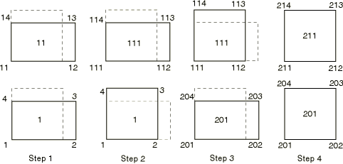

# 3.14.6 Adding and removing elements during results transfer

**Products: **Abaqus/Standard  Abaqus/Explicit  

### I. Transferring results between Abaqus/Explicit and Abaqus/Standard

### Elements tested

C3D8R    CPE4R    S4R    

### Problem description

The verification problems outlined in this section test the addition and the removal of elements in a sequential import analysis. The problems also test the application of initial stresses and velocities on imported elements that can be applied only under certain conditions (see ["Transferring results between Abaqus/Explicit and Abaqus/Standard," Section 9.2.2 of the Abaqus Analysis User's Guide](../usb/usb-link.md#usb-anl-aexptostd)).

The finite element model in these verification problems consists of two elements that are not connected to each other, as shown in [Figure 3.14.6--1](ch03s14abv246.md#exximport-add-rem). The elastic, elastic-plastic, hyperelastic, and hyperelastic foam material models are used.

**Figure 3.14.6–1** Sequence of loading when adding and removing elements in an import analysis.

Each analysis, for a given combination of an element type and material model, consists of four steps, with the first step being an Abaqus/Explicit analysis. In this step the two elements, 1 and 11, are loaded in tension for all material models except for the hyperelastic foam model, where the elements are loaded in compression.

The second step is an import analysis, with the results being imported into Abaqus/Standard. In this case the results of element 1 only are imported with the reference configuration updated and the material state not imported. Since the material state is not imported, initial stresses can be prescribed for the imported element. In addition, a new element, 111, is defined in the import analysis and subjected to loading in tension (compression when the hyperelastic foam material model is used).

The third step is another import analysis, with the results now being imported into Abaqus/Explicit from the previous Abaqus/Standard analysis. The material state is imported, and the reference configuration is updated. The results for element 111 are imported into the Abaqus/Explicit analysis, while the results for element 1 are not imported. Initial velocities are prescribed at the nodes of the imported element. A new element, 201, is defined in this import analysis and subjected to a tensile load (compressive load when the hyperelastic foam material model is used).

The results of element 201 at the end of the third step are then imported into Abaqus/Standard, with the reference configuration updated and the material state not imported. A new element, 211, is defined in this step. When the reference configuration is updated and the material state is not imported, the nodal definitions and the element connectivities of the imported nodes and elements can be redefined. This feature is tested in the fourth step by modifying the connectivity of element 201 and redefining nodes 203 and 204.

### Results and discussion

The tests performed in this section verify that elements can be successfully added and removed in a sequential import analysis.

### Input files

#### C3D8R element tests with an elastic material:

[xs_x_c3d8r_ar_el.inp](../eif/xs_x_c3d8r_ar_el.inp)

First Abaqus/Explicit analysis.

[xs_s_c3d8r_ar_el.inp](../eif/xs_s_c3d8r_ar_el.inp)

First Abaqus/Standard analysis.

[sx_x_c3d8r_ar_el.inp](../eif/sx_x_c3d8r_ar_el.inp)

Second Abaqus/Explicit analysis.

[sx_s_c3d8r_ar_el.inp](../eif/sx_s_c3d8r_ar_el.inp)

Second Abaqus/Standard analysis.

#### CPE4R element tests with an elastic material:

[xs_x_cpe4r_ar_el.inp](../eif/xs_x_cpe4r_ar_el.inp)

First Abaqus/Explicit analysis.

[xs_s_cpe4r_ar_el.inp](../eif/xs_s_cpe4r_ar_el.inp)

First Abaqus/Standard analysis.

[sx_x_cpe4r_ar_el.inp](../eif/sx_x_cpe4r_ar_el.inp)

Second Abaqus/Explicit analysis.

[sx_s_cpe4r_ar_el.inp](../eif/sx_s_cpe4r_ar_el.inp)

Second Abaqus/Standard analysis.

#### S4R element tests with an elastic material:

[xs_x_s4r_ar_el.inp](../eif/xs_x_s4r_ar_el.inp)

First Abaqus/Explicit analysis.

[xs_s_s4r_ar_el.inp](../eif/xs_s_s4r_ar_el.inp)

First Abaqus/Standard analysis.

[sx_x_s4r_ar_el.inp](../eif/sx_x_s4r_ar_el.inp)

Second Abaqus/Explicit analysis.

[sx_s_s4r_ar_el.inp](../eif/sx_s_s4r_ar_el.inp)

Second Abaqus/Standard analysis.

#### C3D8R element tests with an elastic-plastic material:

[xs_x_c3d8r_ar_ep.inp](../eif/xs_x_c3d8r_ar_ep.inp)

First Abaqus/Explicit analysis.

[xs_s_c3d8r_ar_ep.inp](../eif/xs_s_c3d8r_ar_ep.inp)

First Abaqus/Standard analysis.

[sx_x_c3d8r_ar_ep.inp](../eif/sx_x_c3d8r_ar_ep.inp)

Second Abaqus/Explicit analysis.

[sx_s_c3d8r_ar_ep.inp](../eif/sx_s_c3d8r_ar_ep.inp)

Second Abaqus/Standard analysis.

#### CPE4R element tests with an elastic-plastic material:

[xs_x_cpe4r_ar_ep.inp](../eif/xs_x_cpe4r_ar_ep.inp)

First Abaqus/Explicit analysis.

[xs_s_cpe4r_ar_ep.inp](../eif/xs_s_cpe4r_ar_ep.inp)

First Abaqus/Standard analysis.

[sx_x_cpe4r_ar_ep.inp](../eif/sx_x_cpe4r_ar_ep.inp)

Second Abaqus/Explicit analysis.

[sx_s_cpe4r_ar_ep.inp](../eif/sx_s_cpe4r_ar_ep.inp)

Second Abaqus/Standard analysis.

#### S4R element tests with an elastic-plastic material:

[xs_x_s4r_ar_ep.inp](../eif/xs_x_s4r_ar_ep.inp)

First Abaqus/Explicit analysis.

[xs_s_s4r_ar_ep.inp](../eif/xs_s_s4r_ar_ep.inp)

First Abaqus/Standard analysis.

[sx_x_s4r_ar_ep.inp](../eif/sx_x_s4r_ar_ep.inp)

Second Abaqus/Explicit analysis.

[sx_s_s4r_ar_ep.inp](../eif/sx_s_s4r_ar_ep.inp)

Second Abaqus/Standard analysis.

#### C3D8R element tests with a hyperelastic material:

[xs_x_c3d8r_ar_he.inp](../eif/xs_x_c3d8r_ar_he.inp)

First Abaqus/Explicit analysis.

[xs_s_c3d8r_ar_he.inp](../eif/xs_s_c3d8r_ar_he.inp)

First Abaqus/Standard analysis.

[sx_x_c3d8r_ar_he.inp](../eif/sx_x_c3d8r_ar_he.inp)

Second Abaqus/Explicit analysis.

[sx_s_c3d8r_ar_he.inp](../eif/sx_s_c3d8r_ar_he.inp)

Second Abaqus/Standard analysis.

#### CPE4R element tests with a hyperelastic material:

[xs_x_cpe4r_ar_he.inp](../eif/xs_x_cpe4r_ar_he.inp)

First Abaqus/Explicit analysis.

[xs_s_cpe4r_ar_he.inp](../eif/xs_s_cpe4r_ar_he.inp)

First Abaqus/Standard analysis.

[sx_x_cpe4r_ar_he.inp](../eif/sx_x_cpe4r_ar_he.inp)

Second Abaqus/Explicit analysis.

[sx_s_cpe4r_ar_he.inp](../eif/sx_s_cpe4r_ar_he.inp)

Second Abaqus/Standard analysis.

#### S4R element tests with a hyperelastic material:

[xs_x_s4r_ar_he.inp](../eif/xs_x_s4r_ar_he.inp)

First Abaqus/Explicit analysis.

[xs_s_s4r_ar_he.inp](../eif/xs_s_s4r_ar_he.inp)

First Abaqus/Standard analysis.

[sx_x_s4r_ar_he.inp](../eif/sx_x_s4r_ar_he.inp)

Second Abaqus/Explicit analysis.

[sx_s_s4r_ar_he.inp](../eif/sx_s_s4r_ar_he.inp)

Second Abaqus/Standard analysis.

#### C3D8R element tests with hyperelastic foam:

[xs_x_c3d8r_ar_hf.inp](../eif/xs_x_c3d8r_ar_hf.inp)

First Abaqus/Explicit analysis.

[xs_s_c3d8r_ar_hf.inp](../eif/xs_s_c3d8r_ar_hf.inp)

First Abaqus/Standard analysis.

[sx_x_c3d8r_ar_hf.inp](../eif/sx_x_c3d8r_ar_hf.inp)

Second Abaqus/Explicit analysis.

[sx_s_c3d8r_ar_hf.inp](../eif/sx_s_c3d8r_ar_hf.inp)

Second Abaqus/Standard analysis.

#### CPE4R element tests with hyperelastic foam:

[xs_x_cpe4r_ar_hf.inp](../eif/xs_x_cpe4r_ar_hf.inp)

First Abaqus/Explicit analysis.

[xs_s_cpe4r_ar_hf.inp](../eif/xs_s_cpe4r_ar_hf.inp)

First Abaqus/Standard analysis.

[sx_x_cpe4r_ar_hf.inp](../eif/sx_x_cpe4r_ar_hf.inp)

Second Abaqus/Explicit analysis.

[sx_s_cpe4r_ar_hf.inp](../eif/sx_s_cpe4r_ar_hf.inp)

Second Abaqus/Standard analysis.

#### S4R element tests with hyperelastic foam:

[xs_x_s4r_ar_hf.inp](../eif/xs_x_s4r_ar_hf.inp)

First Abaqus/Explicit analysis.

[xs_s_s4r_ar_hf.inp](../eif/xs_s_s4r_ar_hf.inp)

First Abaqus/Standard analysis.

[sx_x_s4r_ar_hf.inp](../eif/sx_x_s4r_ar_hf.inp)

Second Abaqus/Explicit analysis.

[sx_s_s4r_ar_hf.inp](../eif/sx_s_s4r_ar_hf.inp)

Second Abaqus/Standard analysis.

### II. Transferring results from one Abaqus/Standard analysis to another Abaqus/Standard analysis

### Elements tested

C3D8    CPE4    S4R    

### Problem description

The verification problems outlined in this section test the addition and the removal of elements in a sequential import analysis. The problems also test the application of initial stresses and velocities on imported elements that can be applied only under certain conditions (see ["Transferring results between Abaqus/Explicit and Abaqus/Standard," Section 9.2.2 of the Abaqus Analysis User's Guide](../usb/usb-link.md#usb-anl-aexptostd)).

The finite element model in these verification problems consists of two elements that are not connected to each other, as shown in [Figure 3.14.6--1](ch03s14abv246.md#exximport-add-rem). Hyperelastic and hyperelastic foam material models are used in the verification problems.

Each analysis, for a given combination of an element type and material model, consists of four steps. In the first step the two elements, 1 and 11, are loaded in tension for the hyperelastic model, while for the hyperelastic foam model the elements are loaded in compression.

The second step is an import analysis, with the results being imported into another Abaqus/Standard static analysis. In this case the results for element 1 only are imported with the updated reference configuration, but the material state is not imported. Since the material state is not imported, initial stresses can be prescribed for the imported element. In addition, a new element, 111, is defined in the import analysis and subjected to loading in tension (compression when the hyperelastic foam material model is used).

The third step is another import analysis, with the results now being imported from the second analysis into an Abaqus/Standard direct-integration implicit dynamic analysis. The material state is imported, and the reference configuration is updated. The results for element 111 are imported into the current analysis, while the results for element 1 are not imported. Initial velocities are prescribed at the nodes of the imported element. A new element, 201, is defined in this import analysis and subjected to a tensile load (a compressive load when the hyperelastic foam material model is used) using the direct-integration implicit dynamic procedure.

The results for element 201 at the end of the third step are then imported into Abaqus/Standard, with the reference configuration updated and the material state not imported. A new element, 211, is defined in this step. When the reference configuration is updated and the material state is not imported, the nodal definitions and the element connectivities for the imported nodes and elements can be redefined. This feature is tested in the fourth step by modifying the connectivity of element 201 and redefining nodes 203 and 204.

The addition and removal of S4R elements with enhanced hourglass control is also tested.

### Results and discussion

The tests performed in this section verify that elements can be added and removed successfully in a sequential import analysis.

### Input files

#### C3D8 element tests with a hyperelastic material:

[ss1_c3d8_ar_he.inp](../eif/ss1_c3d8_ar_he.inp)

First Abaqus/Standard analysis.

[ss2_c3d8_ar_he.inp](../eif/ss2_c3d8_ar_he.inp)

Second Abaqus/Standard analysis.

[ss3_c3d8_ar_he.inp](../eif/ss3_c3d8_ar_he.inp)

Third Abaqus/Standard analysis.

[ss4_c3d8_ar_he.inp](../eif/ss4_c3d8_ar_he.inp)

Fourth Abaqus/Standard analysis.

#### CPE4 element tests with a hyperelastic material:

[ss1_cpe4_ar_he.inp](../eif/ss1_cpe4_ar_he.inp)

First Abaqus/Standard analysis.

[ss2_cpe4_ar_he.inp](../eif/ss2_cpe4_ar_he.inp)

Second Abaqus/Standard analysis.

[ss3_cpe4_ar_he.inp](../eif/ss3_cpe4_ar_he.inp)

Third Abaqus/Standard analysis.

[ss4_cpe4_ar_he.inp](../eif/ss4_cpe4_ar_he.inp)

Fourth Abaqus/Standard analysis.

#### S4R element tests with a hyperelastic material:

[ss1_s4r_ar_he.inp](../eif/ss1_s4r_ar_he.inp)

First Abaqus/Standard analysis.

[ss1_s4r_ar_he_enhg.inp](../eif/ss1_s4r_ar_he_enhg.inp)

First Abaqus/Standard analysis with enhanced hourglass control.

[ss2_s4r_ar_he.inp](../eif/ss2_s4r_ar_he.inp)

Second Abaqus/Standard analysis.

[ss2_s4r_ar_he_enhg.inp](../eif/ss2_s4r_ar_he_enhg.inp)

Second Abaqus/Standard analysis with enhanced hourglass control.

[ss3_s4r_ar_he.inp](../eif/ss3_s4r_ar_he.inp)

Third Abaqus/Standard analysis.

[ss3_s4r_ar_he_enhg.inp](../eif/ss3_s4r_ar_he_enhg.inp)

Third Abaqus/Standard analysis with enhanced hourglass control.

[ss4_s4r_ar_he.inp](../eif/ss4_s4r_ar_he.inp)

Fourth Abaqus/Standard analysis.

[ss4_s4r_ar_he_enhg.inp](../eif/ss4_s4r_ar_he_enhg.inp)

Fourth Abaqus/Standard analysis with enhanced hourglass control.

#### C3D8 element tests with hyperelastic foam:

[ss1_c3d8_ar_hf.inp](../eif/ss1_c3d8_ar_hf.inp)

First Abaqus/Standard analysis.

[ss2_c3d8_ar_hf.inp](../eif/ss2_c3d8_ar_hf.inp)

Second Abaqus/Standard analysis.

[ss3_c3d8_ar_hf.inp](../eif/ss3_c3d8_ar_hf.inp)

Third Abaqus/Standard analysis.

[ss4_c3d8_ar_hf.inp](../eif/ss4_c3d8_ar_hf.inp)

Fourth Abaqus/Standard analysis.

#### CPE4 element tests with hyperelastic foam:

[ss1_cpe4_ar_hf.inp](../eif/ss1_cpe4_ar_hf.inp)

First Abaqus/Standard analysis.

[ss2_cpe4_ar_hf.inp](../eif/ss2_cpe4_ar_hf.inp)

Second Abaqus/Standard analysis.

[ss3_cpe4_ar_hf.inp](../eif/ss3_cpe4_ar_hf.inp)

Third Abaqus/Standard analysis.

[ss4_cpe4_ar_hf.inp](../eif/ss4_cpe4_ar_hf.inp)

Fourth Abaqus/Standard analysis.

#### S4R element tests with hyperelastic foam:

[ss1_s4r_ar_hf.inp](../eif/ss1_s4r_ar_hf.inp)

First Abaqus/Standard analysis.

[ss2_s4r_ar_hf.inp](../eif/ss2_s4r_ar_hf.inp)

Second Abaqus/Standard analysis.

[ss3_s4r_ar_hf.inp](../eif/ss3_s4r_ar_hf.inp)

Third Abaqus/Standard analysis.

[ss4_s4r_ar_hf.inp](../eif/ss4_s4r_ar_hf.inp)

Fourth Abaqus/Standard analysis.

