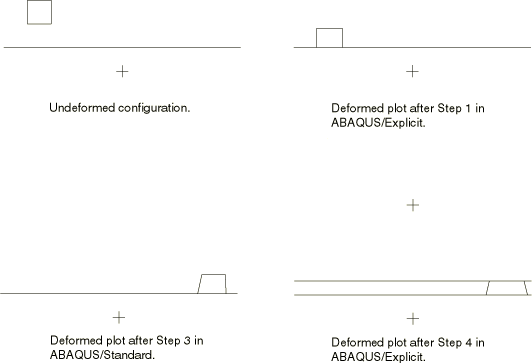

# 3.14.7 传递刚性单元

**产品：**Abaqus/Standard  Abaqus/Explicit

### I. 在Abaqus/Explicit和Abaqus/Standard之间传递结果

### 测试的单元

R2D2    R3D3    R3D4

### 问题描述

本节概述的验证问题测试了刚性单元在Abaqus/Explicit和Abaqus/Standard之间的传递。原始分析中指定的接触定义不会被导入；它们必须在导入分析中重新指定。

这些验证问题由一个可变形块和一个刚性表面组成，如图3.14.7-1所示。分析包括四个步骤。第一步在Abaqus/Explicit中执行。在这一步中，块被移动，直到在块和刚性表面之间建立接触。

**图3.14.7-1** 刚性单元测试的加载序列。

然后将Abaqus/Explicit分析结束时的结果导入到Abaqus/Standard中，材料状态被导入，参考构型未被更新。接触条件被重新定义，因为它们没有被导入。在第二步中，块和刚性表面之间的接触被求解。在第三步中，块在刚性表面上滑动。在接触界面处定义了0.1的摩擦系数。

然后将分析第三步结束时的结果导入到Abaqus/Explicit中，材料状态被导入，参考构型未被更新。在这一步中，沿着块的顶面定义了另一个刚性表面。在Abaqus/Explicit导入分析过程中，块在两个刚性表面之间被压缩。加载序列如图3.14.7-1所示。

### 结果与讨论

从这些测试可以看出，刚性单元及其刚性体和参考节点定义可以在Abaqus/Explicit和Abaqus/Standard之间传递。此外，在导入分析中可以定义新的刚性单元。

### 输入文件

#### R2D2单元测试：

[xs_x_r2d2.inp](../eif/xs_x_r2d2.inp)

第一个Abaqus/Explicit分析。

[xs_s_r2d2.inp](../eif/xs_s_r2d2.inp)

Abaqus/Standard分析。

[sx_x_r2d2.inp](../eif/sx_x_r2d2.inp)

第二个Abaqus/Explicit分析。

#### R3D3单元测试：

[xs_x_r3d3.inp](../eif/xs_x_r3d3.inp)

第一个Abaqus/Explicit分析。

[xs_x_r3d3_gcont.inp](../eif/xs_x_r3d3_gcont.inp)

使用通用接触功能的第一个Abaqus/Explicit分析。

[xs_s_r3d3.inp](../eif/xs_s_r3d3.inp)

Abaqus/Standard分析。

[sx_x_r3d3.inp](../eif/sx_x_r3d3.inp)

第二个Abaqus/Explicit分析。

[sx_x_r3d3_gcont.inp](../eif/sx_x_r3d3_gcont.inp)

使用通用接触功能的第二个Abaqus/Explicit分析。

#### R3D4单元测试：

[xs_x_r3d4.inp](../eif/xs_x_r3d4.inp)

第一个Abaqus/Explicit分析。

[xs_x_r3d4_gcont.inp](../eif/xs_x_r3d4_gcont.inp)

使用通用接触功能的第一个Abaqus/Explicit分析。

[xs_s_r3d4.inp](../eif/xs_s_r3d4.inp)

Abaqus/Standard分析。

[sx_x_r3d4.inp](../eif/sx_x_r3d4.inp)

第二个Abaqus/Explicit分析。

[sx_x_r3d4_gcont.inp](../eif/sx_x_r3d4_gcont.inp)

使用通用接触功能的第二个Abaqus/Explicit分析。

### II. 在一个Abaqus/Standard分析和另一个Abaqus/Standard分析之间传递结果

### 测试的单元

R2D2    R3D3    R3D4

### 问题描述

本节概述的验证问题测试了刚性单元和接触定义从一个Abaqus/Standard分析到另一个的传递。第一个分析的接触定义和接触状态被传递到导入分析。因此，接触定义不需要在导入分析中重新定义。

有限元模型由一个可变形材料块组成，初始位于刚性表面上方一小段距离。刚性表面使用列出的刚性单元类型之一定义。第一个分析的第一步是一个静态步骤，其中可变形块向下移动朝向刚性表面以建立接触。在该分析的第二步期间，块平行于刚性表面移动。接触表面之间的摩擦系数为0.1。

然后将该分析第一步结束时的结果导入到另一个Abaqus/Standard静态分析中，材料状态被导入，参考构型未被更新。在该导入分析期间，块以与第一个分析第二步完全相同的方式平行于刚性表面移动。该导入分析结束时的结果应与第一个分析结束时的结果相同。

然后仅通过在导入选项的数据行上指定仅包含可变形块的单元集，将可变形块的仅结果从第二个分析结束传递到第三个Abaqus/Standard分析。材料状态被导入，参考构型被更新。然后沿着可变形块的顶面定义一个新的刚性表面；还指定了刚性表面与块顶面之间相互作用的新接触定义。块的底部被固定，新定义的刚性表面向下移动压缩块。

### 结果与讨论

从这些测试可以看出，刚性单元及其刚性体参考节点定义和任何接触条件可以从一个Abaqus/Standard分析传递到另一个。此外，在导入分析中可以定义新的刚性单元和接触条件。

### 输入文件

#### R2D2单元测试：

[ss1_r2d2.inp](../eif/ss1_r2d2.inp)

第一个Abaqus/Standard分析。

[ss2_r2d2.inp](../eif/ss2_r2d2.inp)

第二个Abaqus/Standard分析。

[ss3_r2d2.inp](../eif/ss3_r2d2.inp)

第三个Abaqus/Standard分析。

#### R3D3单元测试：

[ss1_r3d3.inp](../eif/ss1_r3d3.inp)

第一个Abaqus/Standard分析。

[ss2_r3d3.inp](../eif/ss2_r3d3.inp)

第二个Abaqus/Standard分析。

[ss3_r3d3.inp](../eif/ss3_r3d3.inp)

第三个Abaqus/Standard分析。

#### R3D4单元测试：

[ss1_r3d4.inp](../eif/ss1_r3d4.inp)

第一个Abaqus/Standard分析。

[ss1_r3d4_surf.inp](../eif/ss1_r3d4_surf.inp)

第一个Abaqus/Standard分析（表面到表面接触）。

[ss2_r3d4.inp](../eif/ss2_r3d4.inp)

第二个Abaqus/Standard分析。

[ss2_r3d4_surf.inp](../eif/ss2_r3d4_surf.inp)

第二个Abaqus/Standard分析（表面到表面接触）。

[ss3_r3d4.inp](../eif/ss3_r3d4.inp)

第三个Abaqus/Standard分析。

