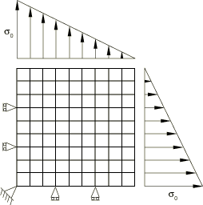
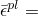

# 3.14.11 Changing the material definition during import

**Products: **Abaqus/Standard  Abaqus/Explicit  

### Element tested

CPE4R

### Problem description

The problem considered here demonstrates the ability to change the material definition and continue the analysis after import. An elastic-plastic material with Mises yield criterion is used in the Abaqus/Standard analysis. The analysis is continued in Abaqus/Explicit by introducing a ductile failure model using the shear failure model. The square cross-section of a prismatic bar under transverse biaxial tensile loading is modeled using CPE4R elements. Due to symmetry of the geometry and the loading, only one-quarter of the domain is modeled, as shown in [Figure 3.14.11--1](ch03s14abv251.md#exximport-matchange).

**Figure 3.14.11–1** Model for verification of change of material.

 In the Abaqus/Standard analysis the object is loaded so that part of the domain begins to yield. The loading is continued in the Abaqus/Explicit analysis so that the plastic strains reach into the failure regime. The results of the Abaqus/Explicit analysis are imported back into Abaqus/Standard to verify that the failed elements are not imported. The material properties used in Abaqus/Standard are as follows:

| Young's modulus = 207.8 109 |
| --- |
| Poisson's ratio = 0.3 |
| Density = 7800. |
| Yield stress = 1220. 106 |
| Flow stress = 1440. 106 when  1.0 |

In Abaqus/Explicit ductile failure is specified so that the failure starts when the equivalent plastic strain reaches 0.8 and the complete failure is reached when the equivalent plastic strain reaches a value of unity. The load is specified in Abaqus/Standard so that the maximum traction, , is 2.5 times the initial yield stress; and in Abaqus/Explicit it is increased to a value of 4 times the initial yield stress. The material state is imported, and the reference configuration is not updated.

### Results and discussion

This problem demonstrates the flexibility in changing the material definition judiciously and continuing the analysis after import. The stresses, strains, and energy quantities such as recoverable elastic strain energy are found to be continuous across the Abaqus/Standard and Abaqus/Explicit analyses. Failed elements are not imported from Abaqus/Explicit to Abaqus/Standard.

### Input files

[sx_s_cpe4r_f.inp](../eif/sx_s_cpe4r_f.inp)

First Abaqus/Standard analysis.

[sx_x_cpe4r_f_n_y.inp](../eif/sx_x_cpe4r_f_n_y.inp)

Abaqus/Explicit analysis.

[xs_s_cpe4r_f_n_y.inp](../eif/xs_s_cpe4r_f_n_y.inp)

Second Abaqus/Standard analysis.

