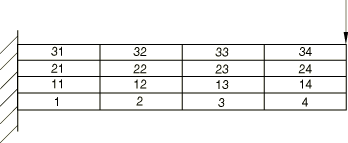
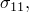
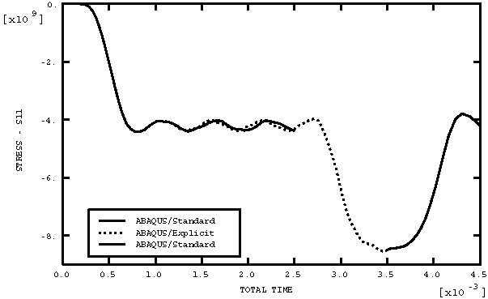

# 3.14.10 传递沙漏力

**产品：**Abaqus/Standard  Abaqus/Explicit

### 测试的单元

C3D8R    CPE4R    CPS4R    C3D10M    CPE6M    CPS6M

### 问题描述

本节概述的问题由一个悬臂梁组成，如图3.14.10-1所示。此问题执行两个测试。它测试在Abaqus/Standard的第一步中使用直接积分隐式动态过程，以及在Abaqus/Standard和Abaqus/Explicit之间传递沙漏力。以下材料定义用于此模型：

| 弹性模量 = 200 109 |
| --- |
| 泊松比 = 0.3 |
| 密度 = 1000. |

**图3.14.10-1** 弯曲测试使用的模型。

分析包括四个步骤：
- 第一步在Abaqus/Standard中使用直接积分隐式动态过程执行。在这一步中，通过在梁尖端施加位移边界条件来加载梁，如图3.14.10-1所示。
- 第一步结束时的结果被导入到Abaqus/Explicit中，材料状态被导入，参考构型未被更新。在这一步中，第一步结束时施加在梁尖端的位移被保持固定。
- 第三步也在Abaqus/Explicit中执行。在这一步中，通过在梁尖端施加额外的位移边界条件，使梁沿与之前相同的方向位移。
- 然后将分析第三步结束时的结果导入到Abaqus/Standard中，材料状态被导入，参考构型未被更新。在这一步中，在悬臂梁尖端施加与第一步结束时指定的相同的位移边界条件。此步骤使用直接积分隐式动态过程执行。

还包括增强沙漏控制方法的验证测试。

通过从第一步结束继续分析，也在Abaqus/Standard中执行分析的第二步。这允许比较Abaqus/Explicit和Abaqus/Standard之间的结果。

### 结果与讨论

图3.14.10-2显示了单元1积分点处应力分量  的时间历史（在此测试中使用CPE4R单元）。可以看出，从Abaqus/Explicit分析获得的第二步中的应力状态与从Abaqus/Standard分析获得的基本相同。在所有情况下都获得与图3.14.10-2中所示相似的结果。

**图3.14.10-2** 应力分量  的时间历史。

### 输入文件

#### C3D8R单元测试：

[sx_s_c3d8r_hg.inp](../eif/sx_s_c3d8r_hg.inp)

第一个Abaqus/Standard分析。

[sx_x_c3d8r_hg.inp](../eif/sx_x_c3d8r_hg.inp)

Abaqus/Explicit分析。

[xs_s_c3d8r_hg.inp](../eif/xs_s_c3d8r_hg.inp)

第二个Abaqus/Standard分析。

[sx_s_c3d8r_hg_enhg.inp](../eif/sx_s_c3d8r_hg_enhg.inp)

具有增强沙漏控制的第一个Abaqus/Standard分析。

[sx_x_c3d8r_hg_enhg.inp](../eif/sx_x_c3d8r_hg_enhg.inp)

具有增强沙漏控制的Abaqus/Explicit分析。

[xs_s_c3d8r_hg_enhg.inp](../eif/xs_s_c3d8r_hg_enhg.inp)

具有增强沙漏控制的第二个Abaqus/Standard分析。

#### CPE4R单元测试：

[sx_s_cpe4r_hg.inp](../eif/sx_s_cpe4r_hg.inp)

第一个Abaqus/Standard分析。

[sx_x_cpe4r_hg.inp](../eif/sx_x_cpe4r_hg.inp)

Abaqus/Explicit分析。

[xs_s_cpe4r_hg.inp](../eif/xs_s_cpe4r_hg.inp)

第二个Abaqus/Standard分析。

[sx_s_cpe4r_hg_enhg.inp](../eif/sx_s_cpe4r_hg_enhg.inp)

具有增强沙漏控制的第一个Abaqus/Standard分析。

[sx_x_cpe4r_hg_enhg.inp](../eif/sx_x_cpe4r_hg_enhg.inp)

具有增强沙漏控制的Abaqus/Explicit分析。

[xs_s_cpe4r_hg_enhg.inp](../eif/xs_s_cpe4r_hg_enhg.inp)

具有增强沙漏控制的第二个Abaqus/Standard分析。

#### CPS4R单元测试：

[sx_s_cps4r_hg.inp](../eif/sx_s_cps4r_hg.inp)

第一个Abaqus/Standard分析。

[sx_x_cps4r_hg.inp](../eif/sx_x_cps4r_hg.inp)

Abaqus/Explicit分析。

[xs_s_cps4r_hg.inp](../eif/xs_s_cps4r_hg.inp)

第二个Abaqus/Standard分析。

[sx_s_cps4r_hg_enhg.inp](../eif/sx_s_cps4r_hg_enhg.inp)

具有增强沙漏控制的第一个Abaqus/Standard分析。

[sx_x_cps4r_hg_enhg.inp](../eif/sx_x_cps4r_hg_enhg.inp)

具有增强沙漏控制的Abaqus/Explicit分析。

[xs_s_cps4r_hg_enhg.inp](../eif/xs_s_cps4r_hg_enhg.inp)

具有增强沙漏控制的第二个Abaqus/Standard分析。

#### C3D10M单元测试：

[sx_s_c3d10m_hg_enhg.inp](../eif/sx_s_c3d10m_hg_enhg.inp)

具有增强沙漏控制的第一个Abaqus/Standard分析。

[sx_x_c3d10m_hg_enhg.inp](../eif/sx_x_c3d10m_hg_enhg.inp)

具有增强沙漏控制的Abaqus/Explicit分析。

[xs_s_c3d10m_hg_enhg.inp](../eif/xs_s_c3d10m_hg_enhg.inp)

具有增强沙漏控制的第二个Abaqus/Standard分析。

#### CPE6M单元测试：

[sx_s_cpe6m_hg_enhg.inp](../eif/sx_s_cpe6m_hg_enhg.inp)

具有增强沙漏控制的第一个Abaqus/Standard分析。

[sx_x_cpe6m_hg_enhg.inp](../eif/sx_x_cpe6m_hg_enhg.inp)

具有增强沙漏控制的Abaqus/Explicit分析。

[xs_s_cpe6m_hg_enhg.inp](../eif/xs_s_cpe6m_hg_enhg.inp)

具有增强沙漏控制的第二个Abaqus/Standard分析。

#### CPS6M单元测试：

[sx_s_cps6m_hg_enhg.inp](../eif/sx_s_cps6m_hg_enhg.inp)

具有增强沙漏控制的第一个Abaqus/Standard分析。

[sx_x_cps6m_hg_enhg.inp](../eif/sx_x_cps6m_hg_enhg.inp)

具有增强沙漏控制的Abaqus/Explicit分析。

[xs_s_cps6m_hg_enhg.inp](../eif/xs_s_cps6m_hg_enhg.inp)

具有增强沙漏控制的第二个Abaqus/Standard分析。

#### 参考构型被更新的CPE4R单元测试：

[sx_s_cpe4r_hg.inp](../eif/sx_s_cpe4r_hg.inp)

第一个Abaqus/Standard分析。

[sx_x_cpe4r_hg_y.inp](../eif/sx_x_cpe4r_hg_y.inp)

Abaqus/Explicit分析。

[xs_s_cpe4r_hg_y.inp](../eif/xs_s_cpe4r_hg_y.inp)

第二个Abaqus/Standard分析。

[sx_s_cpe4r_hg_enhg.inp](../eif/sx_s_cpe4r_hg_enhg.inp)

具有增强沙漏控制的第一个Abaqus/Standard分析。

[sx_x_cpe4r_hg_y_enhg.inp](../eif/sx_x_cpe4r_hg_y_enhg.inp)

具有增强沙漏控制的Abaqus/Explicit分析。

[xs_s_cpe4r_hg_y_enhg.inp](../eif/xs_s_cpe4r_hg_y_enhg.inp)

具有增强沙漏控制的第二个Abaqus/Standard分析。

