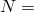

# 3.14.14 使用超弹性传递结果

**产品：**Abaqus/Standard  Abaqus/Explicit

### 测试的单元

CPS4R    CPS3    CPE4R    CPE3    CAX4R    CAX3    C3D8R    C3D4    C3D6

CPS6M    CPE6M    CAX6M    C3D10M

M3D4R    M3D3    S3R    S4R    SAX1

### 问题描述

本节的验证测试由在顺序导入分析中承受单调递增拉伸载荷的单元模型组成。分析中使用轻微可压缩的超弹性材料。测试序列包括从Abaqus/Standard到Abaqus/Explicit再到Abaqus/Standard的结果传递。

还包括了一些具有增强沙漏控制的一阶减缩积分单元的验证测试。

考虑了四种类型的超弹性应变能势：多项式、Ogden、Arruda-Boyce和van der Waals形式。对于使用多项式应变能势的测试，，材料性能为

|  80 |
| --- |
|  20 |
|  0.001 |

对于Ogden应变能势， 2，具有

|  160 |
| --- |
|  2 |
|  40 |
|  2 |
|  0.001 |
|  0.00025 |

对于Arruda-Boyce应变能势，材料性能为

|  200 |
| --- |
|  5 |
|  0.001 |

对于van der Waals应变能势，材料性能为

|  200 |
| --- |
|  10 |
|  0.1 |
|  0.0 |
|  0.001 |

### 结果与讨论

结果表明，超弹性材料模型在Abaqus/Explicit和Abaqus/Standard之间成功传递。

### 输入文件

#### CPS4R单元测试：

[sx_s_cps4r_hyper.inp](../eif/sx_s_cps4r_hyper.inp)

第一个Abaqus/Standard分析。

[sx_x_cps4r_hyper.inp](../eif/sx_x_cps4r_hyper.inp)

Abaqus/Explicit分析。

[xs_s_cps4r_hyper.inp](../eif/xs_s_cps4r_hyper.inp)

第二个Abaqus/Standard分析。

#### CPS3单元测试：

[sx_s_cps3_hyper.inp](../eif/sx_s_cps3_hyper.inp)

第一个Abaqus/Standard分析。

[sx_x_cps3_hyper.inp](../eif/sx_x_cps3_hyper.inp)

Abaqus/Explicit分析。

[xs_s_cps3_hyper.inp](../eif/xs_s_cps3_hyper.inp)

第二个Abaqus/Standard分析。

#### CPE4R单元测试：

[sx_s_cpe4r_hyper.inp](../eif/sx_s_cpe4r_hyper.inp)

第一个Abaqus/Standard分析。

[sx_x_cpe4r_hyper.inp](../eif/sx_x_cpe4r_hyper.inp)

Abaqus/Explicit分析。

[xs_s_cpe4r_hyper.inp](../eif/xs_s_cpe4r_hyper.inp)

第二个Abaqus/Standard分析。

#### CPE3单元测试：

[sx_s_cpe3_hyper.inp](../eif/sx_s_cpe3_hyper.inp)

第一个Abaqus/Standard分析。

[sx_x_cpe3_hyper.inp](../eif/sx_x_cpe3_hyper.inp)

Abaqus/Explicit分析。

[xs_s_cpe3_hyper.inp](../eif/xs_s_cpe3_hyper.inp)

第二个Abaqus/Standard分析。

#### CAX4R单元测试：

[sx_s_cax4r_hyper.inp](../eif/sx_s_cax4r_hyper.inp)

第一个Abaqus/Standard分析。

[sx_s_cax4r_hyper_enhg.inp](../eif/sx_s_cax4r_hyper_enhg.inp)

具有增强沙漏控制的第一个Abaqus/Standard分析。

[sx_x_cax4r_hyper.inp](../eif/sx_x_cax4r_hyper.inp)

Abaqus/Explicit分析。

[sx_x_cax4r_hyper_enhg.inp](../eif/sx_x_cax4r_hyper_enhg.inp)

具有增强沙漏控制的Abaqus/Explicit分析。

[xs_s_cax4r_hyper.inp](../eif/xs_s_cax4r_hyper.inp)

第二个Abaqus/Standard分析。

[xs_s_cax4r_hyper_enhg.inp](../eif/xs_s_cax4r_hyper_enhg.inp)

具有增强沙漏控制的第二个Abaqus/Standard分析。

#### CAX3单元测试：

[sx_s_cax3_hyper.inp](../eif/sx_s_cax3_hyper.inp)

第一个Abaqus/Standard分析。

[sx_x_cax3_hyper.inp](../eif/sx_x_cax3_hyper.inp)

Abaqus/Explicit分析。

[xs_s_cax3_hyper.inp](../eif/xs_s_cax3_hyper.inp)

第二个Abaqus/Standard分析。

#### C3D8R单元测试：

[sx_s_c3d8r_hyper.inp](../eif/sx_s_c3d8r_hyper.inp)

第一个Abaqus/Standard分析。

[sx_x_c3d8r_hyper.inp](../eif/sx_x_c3d8r_hyper.inp)

Abaqus/Explicit分析。

[xs_s_c3d8r_hyper.inp](../eif/xs_s_c3d8r_hyper.inp)

第二个Abaqus/Standard分析。

#### C3D4单元测试：

[sx_s_c3d4_hyper.inp](../eif/sx_s_c3d4_hyper.inp)

第一个Abaqus/Standard分析。

[sx_x_c3d4_hyper.inp](../eif/sx_x_c3d4_hyper.inp)

Abaqus/Explicit分析。

[xs_s_c3d4_hyper.inp](../eif/xs_s_c3d4_hyper.inp)

第二个Abaqus/Standard分析。

#### C3D6单元测试：

[sx_s_c3d6_hyper.inp](../eif/sx_s_c3d6_hyper.inp)

第一个Abaqus/Standard分析。

[sx_x_c3d6_hyper.inp](../eif/sx_x_c3d6_hyper.inp)

Abaqus/Explicit分析。

[xs_s_c3d6_hyper.inp](../eif/xs_s_c3d6_hyper.inp)

第二个Abaqus/Standard分析。

#### CPS6M单元测试：

[sx_s_cps6m_hyper.inp](../eif/sx_s_cps6m_hyper.inp)

第一个Abaqus/Standard分析。

[sx_x_cps6m_hyper.inp](../eif/sx_x_cps6m_hyper.inp)

Abaqus/Explicit分析。

[xs_s_cps6m_hyper.inp](../eif/xs_s_cps6m_hyper.inp)

第二个Abaqus/Standard分析。

#### CPE6M单元测试：

[sx_s_cpe6m_hyper.inp](../eif/sx_s_cpe6m_hyper.inp)

第一个Abaqus/Standard分析。

[sx_x_cpe6m_hyper.inp](../eif/sx_x_cpe6m_hyper.inp)

Abaqus/Explicit分析。

[xs_s_cpe6m_hyper.inp](../eif/xs_s_cpe6m_hyper.inp)

第二个Abaqus/Standard分析。

#### CAX6M单元测试：

[sx_s_cax6m_hyper.inp](../eif/sx_s_cax6m_hyper.inp)

第一个Abaqus/Standard分析。

[sx_x_cax6m_hyper.inp](../eif/sx_x_cax6m_hyper.inp)

Abaqus/Explicit分析。

[xs_s_cax6m_hyper.inp](../eif/xs_s_cax6m_hyper.inp)

第二个Abaqus/Standard分析。

#### C3D10M单元测试：

[sx_s_c3d10m_hyper.inp](../eif/sx_s_c3d10m_hyper.inp)

第一个Abaqus/Standard分析。

[sx_x_c3d10m_hyper.inp](../eif/sx_x_c3d10m_hyper.inp)

Abaqus/Explicit分析。

[xs_s_c3d10m_hyper.inp](../eif/xs_s_c3d10m_hyper.inp)

第二个Abaqus/Standard分析。

#### M3D4R单元测试：

[sx_s_m3d4r_hyper.inp](../eif/sx_s_m3d4r_hyper.inp)

第一个Abaqus/Standard分析。

[sx_x_m3d4r_hyper.inp](../eif/sx_x_m3d4r_hyper.inp)

Abaqus/Explicit分析。

[xs_s_m3d4r_hyper.inp](../eif/xs_s_m3d4r_hyper.inp)

第二个Abaqus/Standard分析。

#### M3D3单元测试：

[sx_s_m3d3_hyper.inp](../eif/sx_s_m3d3_hyper.inp)

第一个Abaqus/Standard分析。

[sx_x_m3d3_hyper.inp](../eif/sx_x_m3d3_hyper.inp)

Abaqus/Explicit分析。

[xs_s_m3d3_hyper.inp](../eif/xs_s_m3d3_hyper.inp)

第二个Abaqus/Standard分析。

#### S3R单元测试：

[sx_s_s3r_hyper.inp](../eif/sx_s_s3r_hyper.inp)

第一个Abaqus/Standard分析。

[sx_x_s3r_hyper.inp](../eif/sx_x_s3r_hyper.inp)

Abaqus/Explicit分析。

[xs_s_s3r_hyper.inp](../eif/xs_s_s3r_hyper.inp)

第二个Abaqus/Standard分析。

#### S4R单元测试：

[sx_s_s4r_hyper.inp](../eif/sx_s_s4r_hyper.inp)

第一个Abaqus/Standard分析。

[sx_s_s4r_hyper_enhg.inp](../eif/sx_s_s4r_hyper_enhg.inp)

具有增强沙漏控制的第一个Abaqus/Standard分析。

[sx_x_s4r_hyper.inp](../eif/sx_x_s4r_hyper.inp)

Abaqus/Explicit分析。

[sx_x_s4r_hyper_enhg.inp](../eif/sx_x_s4r_hyper_enhg.inp)

具有增强沙漏控制的Abaqus/Explicit分析。

[xs_s_s4r_hyper.inp](../eif/xs_s_s4r_hyper.inp)

第二个Abaqus/Standard分析。

[xs_s_s4r_hyper_enhg.inp](../eif/xs_s_s4r_hyper_enhg.inp)

具有增强沙漏控制的第二个Abaqus/Standard分析。

#### SAX1单元测试：

[sx_s_sax1_hyper.inp](../eif/sx_s_sax1_hyper.inp)

第一个Abaqus/Standard分析。

[sx_x_sax1_hyper.inp](../eif/sx_x_sax1_hyper.inp)

Abaqus/Explicit分析。

[xs_s_sax1_hyper.inp](../eif/xs_s_sax1_hyper.inp)

第二个Abaqus/Standard分析。

