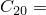
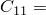
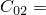
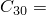
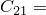
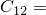
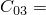
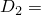
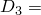

# 3.14.16 Transferring results for a hyperelastic sheet with a circular hole

**Products: **Abaqus/Standard  Abaqus/Explicit  

### Element tested

CPS4R

### Problem description

This test considers the uniform large stretching of a thin, initially square sheet containing a centrally located circular hole. The sheet is subjected to monotonically increasing loads as the analysis is carried out, first with Abaqus/Standard, then with Abaqus/Explicit, and finally with Abaqus/Standard again. The test is an additional demonstration of the use of the import capability when hyperelastic materials are used in the analysis.

The undeformed sheet is 2 mm (0.079 in) thick and 165 mm (6.5 in) on each side. It has a centrally located internal hole of radius 6.35 mm (0.25 in). CPS4R elements are used in the finite element model of the sheet. Plane stress conditions are assumed. The sheet is stretched in the *x*-direction while it is constrained from stretching in the *y*-direction. Symmetry conditions allow only a quarter of the sheet to be modeled.

A polynomial hyperelasticity model is used to describe the material behavior. The model is assumed to be slightly compressible since Abaqus/Explicit does not allow incompressible material behavior. Thus, the constants  are set to small values. The material parameters used in the analysis are:

|  27.02 |
| --- |
|  1.42 |
|  0.27 |
|  0.0 |
|  0.0 |
|  0.00654 |
|  0.0 |
|  0.0 |
|  0.0 |
|  0.001 |
|  0.001 |
|  0.001 |

The testing of the results transfer capability consists of three separate analyses. A static analysis is conducted in Abaqus/Standard, wherein the sheet is stretched to a width of 520.7 mm (20.5 in). Subsequent quasi-static stretching of the sheet by an additional amount of 55.6 mm (46.5 in) is analyzed in Abaqus/Explicit. The final phase of stretching to a total value of 1181 mm (46.5 in) is analyzed in an another static procedure in Abaqus/Standard.

### Results and discussion

The final results of the analysis using the results transfer capability agree well with the results of an analysis conducted entirely within Abaqus/Standard.

### Input files

[sx_s_holehyper.inp](../eif/sx_s_holehyper.inp)

First Abaqus/Standard analysis.

[sx_x_holehyper.inp](../eif/sx_x_holehyper.inp)

Abaqus/Explicit analysis.

[xs_s_holehyper.inp](../eif/xs_s_holehyper.inp)

Second Abaqus/Standard analysis.

