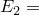

# 3.14.18 Transferring results with orientation

**Products: **Abaqus/Standard  Abaqus/Explicit  

### I. Transferring results between Abaqus/Explicit and Abaqus/Standard

### Elements tested

C3D8R    CPE4R    CPS4R    C3D10M    CPE6M    CPS6M    M3D4R    S4R    S4    

### Problem description

The verification tests in this section consist of testing the transfer of the orientation definitions between Abaqus/Standard and Abaqus/Explicit and vice versa. The tests involve single elements in simple shear subjected to monotonically increasing loads.

Verification tests are also included for some first-order reduced-integration elements with enhanced hourglass control.

The material model used for all the tests is orthotropic elasticity defined by specifying the generalized Young's moduli, the Poisson's ratios, and the shear moduli in the principal directions. The following material properties are used (the units are not important): 

|  200 109 |
| --- |
|  100 109 |
|  100 109 |
|  0.3 |
|  0.23 |
|  0.34 |
|  76.9 109 |
|  76.9 109 |
|  9.0 109 |
| Density = 7850. |

Since nonisotropic material behavior is defined, a local coordinate system is necessary for the anisotropic behavior to be associated with the material directions. Nondefault orientations are specified in the original analysis so that the local material directions are inclined at 45 to the element local directions. A large-displacement analysis is used, which results in the nondefault local coordinate system rotating with the average rigid body motion at the material point. The orientation definitions are transferred to the import analysis by default.

The resulting stresses, strains, section forces, and section strains, wherever applicable, are all reported in the local coordinate system by default.

A verification test is also carried out for a composite shell with three layers. An S4R element is used. A section orientation of 45 is defined with respect to the local directions. Additional orientations of 15, 30, and 45 with respect to the newly defined section orientation are defined for material calculations for individual layers. The material model used for the tests is orthotropic elasticity, which is defined above.

### Results and discussion

The results demonstrate that orientation definitions are transferred successfully between Abaqus/Explicit and Abaqus/Standard.

### Input files

##### **Transfer from Abaqus/Standard to Abaqus/Explicit**

#### C3D8R element tests:

[sx_s_c3d8r_or.inp](../eif/sx_s_c3d8r_or.inp)

Abaqus/Standard analysis.

[sx_x_c3d8r_or_n_y.inp](../eif/sx_x_c3d8r_or_n_y.inp)

Abaqus/Explicit analysis with UPDATE=NO and STATE=YES.

[sx_x_c3d8r_or_y_y.inp](../eif/sx_x_c3d8r_or_y_y.inp)

Abaqus/Explicit analysis with UPDATE=YES and STATE=YES.

#### Tests of three C3D8R elements:

[sx_s_c3d8r_3or.inp](../eif/sx_s_c3d8r_3or.inp)

Abaqus/Standard analysis.

[sx_x_c3d8r_3or_n_y.inp](../eif/sx_x_c3d8r_3or_n_y.inp)

Abaqus/Explicit analysis with UPDATE=NO and STATE=YES.

#### CPE4R element tests:

[sx_s_cpe4r_or.inp](../eif/sx_s_cpe4r_or.inp)

Abaqus/Standard analysis.

[sx_s_cpe4r_or_enhg.inp](../eif/sx_s_cpe4r_or_enhg.inp)

Abaqus/Standard analysis with enhanced hourglass control.

[sx_x_cpe4r_or_n_y.inp](../eif/sx_x_cpe4r_or_n_y.inp)

Abaqus/Explicit analysis with UPDATE=NO and STATE=YES.

[sx_x_cpe4r_or_n_y_enhg.inp](../eif/sx_x_cpe4r_or_n_y_enhg.inp)

Abaqus/Explicit analysis with UPDATE=NO, STATE=YES and enhanced hourglass control.

[sx_x_cpe4r_or_y_y.inp](../eif/sx_x_cpe4r_or_y_y.inp)

Abaqus/Explicit analysis with UPDATE=YES and STATE=YES.

[sx_x_cpe4r_or_y_y_enhg.inp](../eif/sx_x_cpe4r_or_y_y_enhg.inp)

Abaqus/Explicit analysis with UPDATE=YES, STATE=YES and enhanced hourglass control.

#### CPS4R element tests:

[sx_s_cps4r_or.inp](../eif/sx_s_cps4r_or.inp)

Abaqus/Standard analysis.

[sx_x_cps4r_or_n_y.inp](../eif/sx_x_cps4r_or_n_y.inp)

Abaqus/Explicit analysis with UPDATE=NO and STATE=YES.

[sx_x_cps4r_or_y_y.inp](../eif/sx_x_cps4r_or_y_y.inp)

Abaqus/Explicit analysis with UPDATE=YES and STATE=YES.

#### C3D10M element tests:

[sx_s_c3d10m_or.inp](../eif/sx_s_c3d10m_or.inp)

Abaqus/Standard analysis.

[sx_x_c3d10m_or_n_y.inp](../eif/sx_x_c3d10m_or_n_y.inp)

Abaqus/Explicit analysis with UPDATE=NO and STATE=YES.

[sx_x_c3d10m_or_y_y.inp](../eif/sx_x_c3d10m_or_y_y.inp)

Abaqus/Explicit analysis with UPDATE=YES and STATE=YES.

#### CPE6M element tests:

[sx_s_cpe6m_or.inp](../eif/sx_s_cpe6m_or.inp)

Abaqus/Standard analysis.

[sx_x_cpe6m_or_n_y.inp](../eif/sx_x_cpe6m_or_n_y.inp)

Abaqus/Explicit analysis with UPDATE=NO and STATE=YES.

[sx_x_cpe6m_or_y_y.inp](../eif/sx_x_cpe6m_or_y_y.inp)

Abaqus/Explicit analysis with UPDATE=YES and STATE=YES.

#### CPS6M element tests:

[sx_s_cps6m_or.inp](../eif/sx_s_cps6m_or.inp)

Abaqus/Standard analysis.

[sx_x_cps6m_or_n_y.inp](../eif/sx_x_cps6m_or_n_y.inp)

Abaqus/Explicit analysis with UPDATE=NO and STATE=YES.

[sx_x_cps6m_or_y_y.inp](../eif/sx_x_cps6m_or_y_y.inp)

Abaqus/Explicit analysis with UPDATE=YES and STATE=YES.

#### M3D4R element tests:

[sx_s_m3d4r_or.inp](../eif/sx_s_m3d4r_or.inp)

Abaqus/Standard analysis.

[sx_s_m3d4r_or_enhg.inp](../eif/sx_s_m3d4r_or_enhg.inp)

Abaqus/Standard analysis with enhanced hourglass control.

[sx_x_m3d4r_or_n_y.inp](../eif/sx_x_m3d4r_or_n_y.inp)

Abaqus/Explicit analysis with UPDATE=NO and STATE=YES.

[sx_x_m3d4r_or_n_y_enhg.inp](../eif/sx_x_m3d4r_or_n_y_enhg.inp)

Abaqus/Explicit analysis with UPDATE=NO, STATE=YES and enhanced hourglass control.

[sx_x_m3d4r_or_y_y.inp](../eif/sx_x_m3d4r_or_y_y.inp)

Abaqus/Explicit analysis with UPDATE=YES and STATE=YES.

[sx_x_m3d4r_or_y_y_enhg.inp](../eif/sx_x_m3d4r_or_y_y_enhg.inp)

Abaqus/Explicit analysis with UPDATE=YES, STATE=YES and enhanced hourglass control.

#### S4R element tests:

[sx_s_s4r_or.inp](../eif/sx_s_s4r_or.inp)

Abaqus/Standard analysis.

[sx_x_s4r_or_n_y.inp](../eif/sx_x_s4r_or_n_y.inp)

Abaqus/Explicit analysis with UPDATE=NO and STATE=YES.

[sx_x_s4r_or_y_y.inp](../eif/sx_x_s4r_or_y_y.inp)

Abaqus/Explicit analysis with UPDATE=YES and STATE=YES.

#### Composite shell tests:

[sx_s_s4r_com_or.inp](../eif/sx_s_s4r_com_or.inp)

Abaqus/Standard analysis.

[sx_s_s4r_com_or_enhg.inp](../eif/sx_s_s4r_com_or_enhg.inp)

Abaqus/Standard analysis with enhanced hourglass control.

[sx_x_s4r_com_or_n_y.inp](../eif/sx_x_s4r_com_or_n_y.inp)

Abaqus/Explicit analysis with UPDATE=NO and STATE=YES.

[sx_x_s4r_com_or_n_y_enhg.inp](../eif/sx_x_s4r_com_or_n_y_enhg.inp)

Abaqus/Explicit analysis with UPDATE=NO, STATE=YES and enhanced hourglass control.

[sx_x_s4r_com_or_y_y.inp](../eif/sx_x_s4r_com_or_y_y.inp)

Abaqus/Explicit analysis with UPDATE=YES and STATE=YES.

[sx_x_s4r_com_or_y_y_enhg.inp](../eif/sx_x_s4r_com_or_y_y_enhg.inp)

Abaqus/Explicit analysis with UPDATE=YES, STATE=YES and enhanced hourglass control.

##### **Transfer from Abaqus/Explicit to Abaqus/Standard**

#### C3D8R element tests:

[xs_x_c3d8r_or.inp](../eif/xs_x_c3d8r_or.inp)

Abaqus/Explicit analysis.

[xs_s_c3d8r_or_n_y.inp](../eif/xs_s_c3d8r_or_n_y.inp)

Abaqus/Standard analysis with UPDATE=NO and STATE=YES.

[xs_s_c3d8r_or_y_y.inp](../eif/xs_s_c3d8r_or_y_y.inp)

Abaqus/Standard analysis with UPDATE=YES and STATE=YES.

#### CPE4R element tests:

[xs_x_cpe4r_or.inp](../eif/xs_x_cpe4r_or.inp)

Abaqus/Explicit analysis.

[xs_s_cpe4r_or_n_y.inp](../eif/xs_s_cpe4r_or_n_y.inp)

Abaqus/Standard analysis with UPDATE=NO and STATE=YES.

[xs_s_cpe4r_or_y_y.inp](../eif/xs_s_cpe4r_or_y_y.inp)

Abaqus/Standard analysis with UPDATE=YES and STATE=YES.

#### CPS4R element tests:

[xs_x_cps4r_or.inp](../eif/xs_x_cps4r_or.inp)

Abaqus/Explicit analysis.

[xs_s_cps4r_or_n_y.inp](../eif/xs_s_cps4r_or_n_y.inp)

Abaqus/Standard analysis with UPDATE=NO and STATE=YES.

[xs_s_cps4r_or_y_y.inp](../eif/xs_s_cps4r_or_y_y.inp)

Abaqus/Standard analysis with UPDATE=YES and STATE=YES.

#### C3D10M element tests:

[xs_x_c3d10m_or.inp](../eif/xs_x_c3d10m_or.inp)

Abaqus/Explicit analysis.

[xs_s_c3d10m_or_n_y.inp](../eif/xs_s_c3d10m_or_n_y.inp)

Abaqus/Standard analysis with UPDATE=NO and STATE=YES.

[xs_s_c3d10m_or_y_y.inp](../eif/xs_s_c3d10m_or_y_y.inp)

Abaqus/Standard analysis with UPDATE=YES and STATE=YES.

#### CPE6M element tests:

[xs_x_cpe6m_or.inp](../eif/xs_x_cpe6m_or.inp)

Abaqus/Explicit analysis.

[xs_s_cpe6m_or_n_y.inp](../eif/xs_s_cpe6m_or_n_y.inp)

Abaqus/Standard analysis with UPDATE=NO and STATE=YES.

[xs_s_cpe6m_or_y_y.inp](../eif/xs_s_cpe6m_or_y_y.inp)

Abaqus/Standard analysis with UPDATE=YES and STATE=YES.

#### CPS6M element tests:

[xs_x_cps6m_or.inp](../eif/xs_x_cps6m_or.inp)

Abaqus/Explicit analysis.

[xs_s_cps6m_or_n_y.inp](../eif/xs_s_cps6m_or_n_y.inp)

Abaqus/Standard analysis with UPDATE=NO and STATE=YES.

[xs_s_cps6m_or_y_y.inp](../eif/xs_s_cps6m_or_y_y.inp)

Abaqus/Standard analysis with UPDATE=YES and STATE=YES.

#### M3D4R element tests:

[xs_x_m3d4r_or.inp](../eif/xs_x_m3d4r_or.inp)

Abaqus/Explicit analysis.

[xs_s_m3d4r_or_n_y.inp](../eif/xs_s_m3d4r_or_n_y.inp)

Abaqus/Standard analysis with UPDATE=NO and STATE=YES.

[xs_s_m3d4r_or_y_y.inp](../eif/xs_s_m3d4r_or_y_y.inp)

Abaqus/Standard analysis with UPDATE=YES and STATE=YES.

#### S4 element tests:

[xs_x_s4_or.inp](../eif/xs_x_s4_or.inp)

Abaqus/Explicit analysis.

[xs_s_s4_or_n_y.inp](../eif/xs_s_s4_or_n_y.inp)

Abaqus/Standard analysis with UPDATE=NO and STATE=YES.

[xs_s_s4_or_y_y.inp](../eif/xs_s_s4_or_y_y.inp)

Abaqus/Standard analysis with UPDATE=YES and STATE=YES.

#### S4R element tests:

[xs_x_s4r_or.inp](../eif/xs_x_s4r_or.inp)

Abaqus/Explicit analysis.

[xs_s_s4r_or_n_y.inp](../eif/xs_s_s4r_or_n_y.inp)

Abaqus/Standard analysis with UPDATE=NO and STATE=YES.

[xs_s_s4r_or_y_y.inp](../eif/xs_s_s4r_or_y_y.inp)

Abaqus/Standard analysis with UPDATE=YES and STATE=YES.

#### Composite shell tests:

[xs_x_s4r_com_or.inp](../eif/xs_x_s4r_com_or.inp)

Abaqus/Explicit analysis.

[xs_s_s4r_com_or_n_y.inp](../eif/xs_s_s4r_com_or_n_y.inp)

Abaqus/Standard analysis with UPDATE=NO and STATE=YES.

[xs_s_s4r_com_or_y_y.inp](../eif/xs_s_s4r_com_or_y_y.inp)

Abaqus/Standard analysis with UPDATE=YES and STATE=YES.

### II. Transferring results from one Abaqus/Standard analysis to another Abaqus/Standard analysis

### Elements tested

C3D8    C3D8R    CPE4    CPE4R    CPS4    CPS4R    C3D10M    CPE6M    CPS6M    M3D4R    S4R    

### Problem description

The verification tests in this section test the transfer of the orientation definitions from one Abaqus/Standard analysis to another. The tests involve single elements in simple shear subjected to monotonically increasing loads. The first analysis consists of two steps in which the element is subjected to simple shear loads. The second analysis imports the results from the end of the first step of the first analysis and subjects the element to the same loading as in the second step of the first analysis. The transfer of orientation is verified using the current material state import option with and without the reference configuration update option of the import feature in the second analysis.

The material model used for all the tests is the same as the one used in the previous section.

Since nonisotropic material behavior is defined, the local coordinate system is necessary for the anisotropic behavior to be associated with the material directions. Nondefault orientations are specified in the original analysis so that the local material directions are inclined at 45 to the element local directions. A large-displacement analysis is used, which results in the nondefault local coordinate system rotating with the average rigid body motion at the material point. The orientation definitions are transferred to the import analysis by default.

The resulting stresses, strains, section forces, and section strains, wherever applicable, are all reported in the local coordinate system by default.

A verification test is also carried out for a composite shell with three layers. An S4R element is used. A section orientation of 45 is defined with respect to the local directions. Additional orientations of 15, 30, and 45 with respect to the newly defined section orientation are defined for material calculations for individual layers. The material model used for the tests is orthotropic elasticity, as defined in the previous section.

Verification tests are also included for some first-order reduced-integration elements with enhanced hourglass control.

### Results and discussion

The results from the two Abaqus/Standard analyses are identical when the material state is imported and the reference configuration is not updated. The stresses and material orientations are identical when the material state is imported and the reference configuration is updated; the strains differ because the reference configuration is updated.

### Input files

#### C3D8 element tests:

[ss1_c3d8_or.inp](../eif/ss1_c3d8_or.inp)

First Abaqus/Standard analysis.

[ss2_c3d8_or_n_y.inp](../eif/ss2_c3d8_or_n_y.inp)

Abaqus/Standard [*IMPORT](../key/key-link.md#usb-kws-mimport) analysis, UPDATE=NO and STATE=YES.

[ss2_c3d8_or_y_y.inp](../eif/ss2_c3d8_or_y_y.inp)

Abaqus/Standard [*IMPORT](../key/key-link.md#usb-kws-mimport) analysis, UPDATE=YES and STATE=YES.

#### C3D8R element tests:

[ss1_c3d8r_or.inp](../eif/ss1_c3d8r_or.inp)

First Abaqus/Standard analysis.

[ss1_c3d8r_or_enhg.inp](../eif/ss1_c3d8r_or_enhg.inp)

First Abaqus/Standard analysis with enhanced hourglass control.

[ss2_c3d8r_or_n_y.inp](../eif/ss2_c3d8r_or_n_y.inp)

Abaqus/Standard [*IMPORT](../key/key-link.md#usb-kws-mimport) analysis, UPDATE=NO and STATE=YES.

[ss2_c3d8r_or_n_y_enhg.inp](../eif/ss2_c3d8r_or_n_y_enhg.inp)

Abaqus/Standard [*IMPORT](../key/key-link.md#usb-kws-mimport) analysis, UPDATE=NO and STATE=YES with enhanced hourglass control.

[ss2_c3d8r_or_y_y.inp](../eif/ss2_c3d8r_or_y_y.inp)

Abaqus/Standard [*IMPORT](../key/key-link.md#usb-kws-mimport) analysis, UPDATE=YES and STATE=YES.

[ss2_c3d8r_or_y_y_enhg.inp](../eif/ss2_c3d8r_or_y_y_enhg.inp)

Abaqus/Standard [*IMPORT](../key/key-link.md#usb-kws-mimport) analysis, UPDATE=YES and STATE=YES with enhanced hourglass control.

#### CPE4 element tests:

[ss1_cpe4_or.inp](../eif/ss1_cpe4_or.inp)

First Abaqus/Standard analysis.

[ss2_cpe4_or_n_y.inp](../eif/ss2_cpe4_or_n_y.inp)

Abaqus/Standard [*IMPORT](../key/key-link.md#usb-kws-mimport) analysis, UPDATE=NO and STATE=YES.

[ss2_cpe4_or_y_y.inp](../eif/ss2_cpe4_or_y_y.inp)

Abaqus/Standard [*IMPORT](../key/key-link.md#usb-kws-mimport) analysis, UPDATE=YES and STATE=YES.

#### CPE4R element tests:

[ss1_cpe4r_or.inp](../eif/ss1_cpe4r_or.inp)

First Abaqus/Standard analysis.

[ss1_cpe4r_or_enhg.inp](../eif/ss1_cpe4r_or_enhg.inp)

First Abaqus/Standard analysis with enhanced hourglass control.

[ss2_cpe4r_or_n_y.inp](../eif/ss2_cpe4r_or_n_y.inp)

Abaqus/Standard [*IMPORT](../key/key-link.md#usb-kws-mimport) analysis, UPDATE=NO and STATE=YES.

[ss2_cpe4r_or_n_y_enhg.inp](../eif/ss2_cpe4r_or_n_y_enhg.inp)

Abaqus/Standard [*IMPORT](../key/key-link.md#usb-kws-mimport) analysis, UPDATE=NO and STATE=YES with enhanced hourglass control.

[ss2_cpe4r_or_y_y.inp](../eif/ss2_cpe4r_or_y_y.inp)

Abaqus/Standard [*IMPORT](../key/key-link.md#usb-kws-mimport) analysis, UPDATE=YES and STATE=YES.

[ss2_cpe4r_or_y_y_enhg.inp](../eif/ss2_cpe4r_or_y_y_enhg.inp)

Abaqus/Standard [*IMPORT](../key/key-link.md#usb-kws-mimport) analysis, UPDATE=YES and STATE=YES with enhanced hourglass control.

#### CPS4 element tests:

[ss1_cps4_or.inp](../eif/ss1_cps4_or.inp)

First Abaqus/Standard analysis.

[ss2_cps4_or_n_y.inp](../eif/ss2_cps4_or_n_y.inp)

Abaqus/Standard [*IMPORT](../key/key-link.md#usb-kws-mimport) analysis, UPDATE=NO and STATE=YES.

[ss2_cps4_or_y_y.inp](../eif/ss2_cps4_or_y_y.inp)

Abaqus/Standard [*IMPORT](../key/key-link.md#usb-kws-mimport) analysis, UPDATE=YES and STATE=YES.

#### CPS4R element tests:

[ss1_cps4r_or.inp](../eif/ss1_cps4r_or.inp)

First Abaqus/Standard analysis.

[ss2_cps4r_or_n_y.inp](../eif/ss2_cps4r_or_n_y.inp)

Abaqus/Standard [*IMPORT](../key/key-link.md#usb-kws-mimport) analysis, UPDATE=NO and STATE=YES.

[ss2_cps4r_or_y_y.inp](../eif/ss2_cps4r_or_y_y.inp)

Abaqus/Standard [*IMPORT](../key/key-link.md#usb-kws-mimport) analysis, UPDATE=YES and STATE=YES.

#### C3D10M element tests:

[ss1_c3d10m_or.inp](../eif/ss1_c3d10m_or.inp)

First Abaqus/Standard analysis.

[ss2_c3d10m_or_n_y.inp](../eif/ss2_c3d10m_or_n_y.inp)

Abaqus/Standard [*IMPORT](../key/key-link.md#usb-kws-mimport) analysis, UPDATE=NO and STATE=YES.

[ss2_c3d10m_or_y_y.inp](../eif/ss2_c3d10m_or_y_y.inp)

Abaqus/Standard [*IMPORT](../key/key-link.md#usb-kws-mimport) analysis, UPDATE=YES and STATE=YES.

#### CPE6M element tests:

[ss1_cpe6m_or.inp](../eif/ss1_cpe6m_or.inp)

First Abaqus/Standard analysis.

[ss2_cpe6m_or_n_y.inp](../eif/ss2_cpe6m_or_n_y.inp)

Abaqus/Standard [*IMPORT](../key/key-link.md#usb-kws-mimport) analysis, UPDATE=NO and STATE=YES.

[ss2_cpe6m_or_y_y.inp](../eif/ss2_cpe6m_or_y_y.inp)

Abaqus/Standard [*IMPORT](../key/key-link.md#usb-kws-mimport) analysis, UPDATE=YES and STATE=YES.

#### CPS6M element tests:

[ss1_cps6m_or.inp](../eif/ss1_cps6m_or.inp)

First Abaqus/Standard analysis.

[ss2_cps6m_or_n_y.inp](../eif/ss2_cps6m_or_n_y.inp)

Abaqus/Standard [*IMPORT](../key/key-link.md#usb-kws-mimport) analysis, UPDATE=NO and STATE=YES.

[ss2_cps6m_or_y_y.inp](../eif/ss2_cps6m_or_y_y.inp)

Abaqus/Standard [*IMPORT](../key/key-link.md#usb-kws-mimport) analysis, UPDATE=YES and STATE=YES.

#### M3D4R element tests:

[ss1_m3d4r_or.inp](../eif/ss1_m3d4r_or.inp)

First Abaqus/Standard analysis.

[ss1_m3d4r_or_enhg.inp](../eif/ss1_m3d4r_or_enhg.inp)

First Abaqus/Standard analysis with enhanced hourglass control.

[ss2_m3d4r_or_n_y.inp](../eif/ss2_m3d4r_or_n_y.inp)

Abaqus/Standard [*IMPORT](../key/key-link.md#usb-kws-mimport) analysis, UPDATE=NO and STATE=YES.

[ss2_m3d4r_or_n_y_enhg.inp](../eif/ss2_m3d4r_or_n_y_enhg.inp)

Abaqus/Standard [*IMPORT](../key/key-link.md#usb-kws-mimport) analysis, UPDATE=NO and STATE=YES with enhanced hourglass control.

[ss2_m3d4r_or_y_y.inp](../eif/ss2_m3d4r_or_y_y.inp)

Abaqus/Standard [*IMPORT](../key/key-link.md#usb-kws-mimport) analysis, UPDATE=YES and STATE=YES.

[ss2_m3d4r_or_y_y_enhg.inp](../eif/ss2_m3d4r_or_y_y_enhg.inp)

Abaqus/Standard [*IMPORT](../key/key-link.md#usb-kws-mimport) analysis, UPDATE=YES and STATE=YES with enhanced hourglass control.

#### S4R element tests:

[ss1_s4r_or.inp](../eif/ss1_s4r_or.inp)

First Abaqus/Standard analysis.

[ss2_s4r_or_n_y.inp](../eif/ss2_s4r_or_n_y.inp)

Abaqus/Standard [*IMPORT](../key/key-link.md#usb-kws-mimport) analysis, UPDATE=NO and STATE=YES.

[ss2_s4r_or_y_y.inp](../eif/ss2_s4r_or_y_y.inp)

Abaqus/Standard [*IMPORT](../key/key-link.md#usb-kws-mimport) analysis, UPDATE=YES and STATE=YES.

#### Composite shell tests:

[ss1_s4r_com_or.inp](../eif/ss1_s4r_com_or.inp)

First Abaqus/Standard analysis.

[ss1_s4r_com_or_enhg.inp](../eif/ss1_s4r_com_or_enhg.inp)

First Abaqus/Standard analysis with enhanced hourglass control.

[ss2_s4r_com_or_n_y.inp](../eif/ss2_s4r_com_or_n_y.inp)

Abaqus/Standard [*IMPORT](../key/key-link.md#usb-kws-mimport) analysis, UPDATE=NO and STATE=YES.

[ss2_s4r_com_or_n_y_enhg.inp](../eif/ss2_s4r_com_or_n_y_enhg.inp)

Abaqus/Standard [*IMPORT](../key/key-link.md#usb-kws-mimport) analysis, UPDATE=NO and STATE=YES with enhanced hourglass control.

[ss2_s4r_com_or_y_y.inp](../eif/ss2_s4r_com_or_y_y.inp)

Abaqus/Standard [*IMPORT](../key/key-link.md#usb-kws-mimport) analysis, UPDATE=YES and STATE=YES.

[ss2_s4r_com_or_y_y_enhg.inp](../eif/ss2_s4r_com_or_y_y_enhg.inp)

Abaqus/Standard [*IMPORT](../key/key-link.md#usb-kws-mimport) analysis, UPDATE=YES and STATE=YES with enhanced hourglass control.

