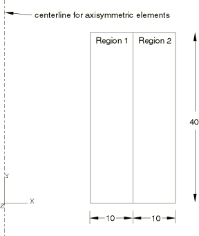
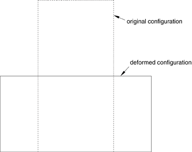
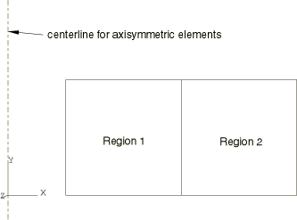
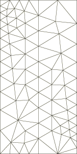
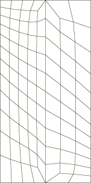
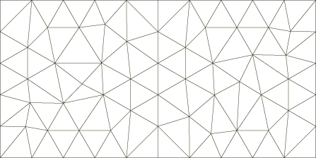

# 3.15.1 在Abaqus/Standard中不同网格之间传递结果

**产品：** Abaqus/Standard  

### 测试的元素

C3D8R  C3D10  C3D10M  C3D20  C3D4  C3D8T  C3D20RT  

CAX3H  CAX4  CGAX4HT  CGAX8RT  

CPE3  CPE4  CPE6  CPE6H  CPE8  CPE8R  

CPEG3HT  CPEG4HT  

C3D8P  C3D20RP  CAX4P  CAX8RP  

CPS3  CPS4  CPS4T  DC2D4  

### 测试的特征

解决方案变量传递能力

### 问题描述

本节的验证测试由成对的模型组成。在每对中，第一个或原始模型经历简单变形到变形构型。第二个或派生模型用不同的网格（可能具有不同的单元类型）表示原始模型的变形构型。解决方案从原始模型传递到派生模型，并验证该模型的状态与原始模型在其变形构型中一致。

**模型：**

原始模型具有简单的矩形几何形状。在大多数情况下，模型包含两个不同的材料区域（见图3.15.1-1）。该模型经历均匀压缩（见图3.15.1-2），并将结果构型作为派生模型的几何形状（见图3.15.1-3）。具有轴对称元素的模型被放置在较大的径向位置，使得元素行为接近平面应变元素。具有三维元素的模型在深度方向上具有10个单位的深度，并具有与以下平面网格图中所示略有不同的网格。

**图3.15.1-1** 原始模型几何形状。

**图3.15.1-2** 原始模型的变形。

**图3.15.1-3** 派生模型几何形状。

**网格：**

选择非均匀网格，如图3.15.1-4、图3.15.1-5、图3.15.1-6和图3.15.1-7所示。

**图3.15.1-4** 原始模型三角形网格。

**图3.15.1-5** 原始模型四边形网格。

**图3.15.1-6** 派生模型三角形网格。

**图3.15.1-7** 派生模型四边形网格。

**材料：**

材料属性从以下模型中选择。在相邻区域使用两种不同材料属性的情况下，首先列出的参数应用于一个材料区域，第二个列出的参数应用于另一个：

弹性（包括[`UMAT`](../sub/sub-link.md#sub-xsl-umat)实现）

| 杨氏模量 | 1 104和1 105 |
| --- | --- |
| 泊松比 | 0.3 |

弹塑性

| 杨氏模量 | 1 104和1 105 |
| --- | --- |
| 泊松比 | 0.3 |
| 屈服应力 | 8 103和8 104 |

超弹性

| C10 | 1.9 103 |
| --- | --- |
| D11 | 2.4 104 |

**边界条件：**

原始模型底部表面受垂直运动约束，材料区域界面沿水平方向约束。然后，上表面以均匀运动压缩，而侧面以指定的保容运动膨胀。这些边界条件导致变形构型与分析中使用的材料模型无关。在一些测试中，图3.15.1-2所示的变形构型在中间步骤和增量时达到，这使得能够测试从中间构型进行解决方案映射。

具有温度自由度的原始模型在下边界规定温度为零，在上边界规定温度为1000，导致温度在模型高度上线性变化。

具有孔隙压力自由度的原始模型在下边界规定孔隙压力为零，在上边界规定孔隙压力为1，导致孔隙压力在模型高度上线性变化。

### 结果与讨论

验证每个派生模型中的材料解决方案变量与原始模型在其变形构型中的变量匹配。在模型具有不同材料区域的区域中，验证派生模型中的解决方案变量是独特的，在材料边界处没有平滑。在具有温度自由度的模型中，温度的线性分布以及在具有孔隙压力自由度的模型中孔隙压力的线性分布被验证在原始和派生模型之间一致。

### 输入文件

输入文件名描述分析过程、单元类型和材料类型。输入文件成对分组；每对包括一个原始模型（从中传递解决方案）和一个派生模型（向其传递解决方案）。

原始分析文件遵循格式pmap_*element*_*material*_*options*_a.inp；派生分析文件遵循格式pmap_*element*_*material*_*options*_d.inp。

*element*表示分析中使用的单元类型或多种单元类型。*material*表示分析中的材料类型。*options*表示测试的特定过程或特征。

#### CPE8单元测试：

[pmap_cpe8_elastic_static_a.inp](../eif/pmap_cpe8_elastic_static_a.inp)

原始模型。

[pmap_cpe8_elastic_static_d.inp](../eif/pmap_cpe8_elastic_static_d.inp)

派生模型。

#### CPE4单元测试：

[pmap_cpe4_elastic_static_a.inp](../eif/pmap_cpe4_elastic_static_a.inp)

原始模型。

[pmap_cpe4_elastic_static_d.inp](../eif/pmap_cpe4_elastic_static_d.inp)

派生模型。

#### 在原始模型中定义了方向的CPE4单元测试：

[pmap_cpe4_elastic_orient_a.inp](../eif/pmap_cpe4_elastic_orient_a.inp)

原始模型。

[pmap_cpe4_elastic_noorient_d.inp](../eif/pmap_cpe4_elastic_noorient_d.inp)

派生模型。

#### 在派生模型中定义了方向的CPE4单元测试：

[pmap_cpe4_elastic_noorient_a.inp](../eif/pmap_cpe4_elastic_noorient_a.inp)

原始模型。

[pmap_cpe4_elastic_orient_d.inp](../eif/pmap_cpe4_elastic_orient_d.inp)

派生模型。

#### 从CPS4到CPS3单元的解决方案映射测试：

[pmap_cps4_elastic_static_a.inp](../eif/pmap_cps4_elastic_static_a.inp)

原始模型。

[pmap_cps3_elastic_static_d.inp](../eif/pmap_cps3_elastic_static_d.inp)

派生模型。

#### 从CPE3到CPE4单元的解决方案映射测试：

[pmap_cpe3_plastic_static_a.inp](../eif/pmap_cpe3_plastic_static_a.inp)

原始模型。

[pmap_cpe4_plastic_static_d.inp](../eif/pmap_cpe4_plastic_static_d.inp)

派生模型。

#### 从CPEG3HT到CPEG4HT单元的解决方案映射测试：

[pmap_cpeg3ht_plastic_static_a.inp](../eif/pmap_cpeg3ht_plastic_static_a.inp)

原始模型。

[pmap_cpeg4ht_plastic_static_d.inp](../eif/pmap_cpeg4ht_plastic_static_d.inp)

派生模型。

#### 从C3D8P到C3D20RP单元的解决方案映射测试：

[pmap_c3d8p_elastic_a.inp](../eif/pmap_c3d8p_elastic_a.inp)

原始模型。

[pmap_c3d20rp_elastic_d.inp](../eif/pmap_c3d20rp_elastic_d.inp)

派生模型。

#### 在稳态土壤过程中从C3D8P到C3D20RP单元的解决方案映射测试：

[pmap_c3d8p_elastic_ss_a.inp](../eif/pmap_c3d8p_elastic_ss_a.inp)

原始模型。

[pmap_c3d20rp_elastic_ss_d.inp](../eif/pmap_c3d20rp_elastic_ss_d.inp)

派生模型。

#### 从C3D8P到C3D10MP单元的解决方案映射测试：

[pmap_c3d8p_elastic_a.inp](../eif/pmap_c3d8p_elastic_a.inp)

原始模型。

[pmap_c3d10mp_elastic_d.inp](../eif/pmap_c3d10mp_elastic_d.inp)

派生模型。

#### 从C3D8P到C3D8RP单元的解决方案映射测试：

[pmap_cpe8p_elastic_a.inp](../eif/pmap_cpe8p_elastic_a.inp)

原始模型。

[pmap_cpe8rp_elastic_d.inp](../eif/pmap_cpe8rp_elastic_d.inp)

派生模型。

#### 使用用户材料定义从CPE8R到CPE6H单元的解决方案映射测试：

[pmap_cpe8r_user_static_a.inp](../eif/pmap_cpe8r_user_static_a.inp)

原始模型。

[pmap_cpe6h_user_static_d.inp](../eif/pmap_cpe6h_user_static_d.inp)

派生模型。

#### 从CGAX4HT到CGAX8RT单元的解决方案映射测试：

[pmap_cgax4ht_plastic_coupled_a.inp](../eif/pmap_cgax4ht_plastic_coupled_a.inp)

原始模型。

[pmap_cgax8rt_plastic_coupled_d.inp](../eif/pmap_cgax8rt_plastic_coupled_d.inp)

派生模型。

#### 从CAX4P到CAX8RP单元的解决方案映射测试：

[pmap_cax4p_plastic_a.inp](../eif/pmap_cax4p_plastic_a.inp)

原始模型。

[pmap_cax8rp_plastic_d.inp](../eif/pmap_cax8rp_plastic_d.inp)

派生模型。

#### 使用超弹性材料从CPE6到CPE8单元的解决方案映射测试：

[pmap_cpe6_hyperelastic_static_a.inp](../eif/pmap_cpe6_hyperelastic_static_a.inp)

原始模型。

[pmap_cpe8_hyperelastic_static_d.inp](../eif/pmap_cpe8_hyperelastic_static_d.inp)

派生模型。

#### 从CPS4T到DC2D4单元的解决方案映射测试：

[pmap_cps4t_plastic_coupled_a.inp](../eif/pmap_cps4t_plastic_coupled_a.inp)

原始模型。

[pmap_dc2d4_plastic_heattransfer_d.inp](../eif/pmap_dc2d4_plastic_heattransfer_d.inp)

派生模型。

#### 从C3D8R到C3D10单元的解决方案映射测试：

[pmap_c3d8r_elastic_static_a.inp](../eif/pmap_c3d8r_elastic_static_a.inp)

原始模型。

[pmap_c3d10_elastic_static_d.inp](../eif/pmap_c3d10_elastic_static_d.inp)

派生模型。

#### 从C3D10M到C3D20单元的解决方案映射测试：

[pmap_c3d10m_plastic_static_a.inp](../eif/pmap_c3d10m_plastic_static_a.inp)

原始模型。

[pmap_c3d20_plastic_static_d.inp](../eif/pmap_c3d20_plastic_static_d.inp)

派生模型。

#### 对原始模型施加旋转的从C3D4到C3D10M单元的解决方案映射测试：

[pmap_c3d4_elastic_rotated_a.inp](../eif/pmap_c3d4_elastic_rotated_a.inp)

原始模型。

[pmap_c3d10m_elastic_rotated_d.inp](../eif/pmap_c3d10m_elastic_rotated_d.inp)

派生模型。

#### 从C3D8T到C3D20RT单元的解决方案映射测试：

[pmap_c3d8t_elastic_coupled_a.inp](../eif/pmap_c3d8t_elastic_coupled_a.inp)

原始模型。

[pmap_c3d20rt_elastic_coupled_d.inp](../eif/pmap_c3d20rt_elastic_coupled_d.inp)

派生模型。

