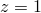

# 3.16.1 直接循环和低周疲劳分析

**产品：** Abaqus/Standard  

本节中的测试验证了直接循环分析过程以及使用直接循环方法的低周疲劳过程，用于承受不同类型循环载荷的结构，包括分布力、集中力、位移和温度。直接循环和低周疲劳过程也在单一分析或重启分析中其他过程之前或之后进行验证。

### I. 简单立方体

### 测试的元素

C3D8  C3D10  

### 测试的特征

承受不同循环载荷的简单立方体。

### 问题描述

每个测试中的模型由十二个四面体单元或一个砖单元组成。一端的所有节点（）沿z轴约束。循环分布载荷、集中载荷或位移以z方向施加到另一端的节点（）。使用运动硬化塑性模型和双层粘塑性模型。

### 结果与讨论

使用直接循环过程获得的结果与使用经典方法获得的结果进行比较，经典方法涉及在多个步骤中使用静态或准静态过程重复施加循环载荷。两种方法获得的稳定循环中应力-应变曲线的形状一致。

### 输入文件

[dircyclic_cload_ffouri_ftinc.inp](../eif/dircyclic_cload_ffouri_ftinc.inp)

具有固定数量的傅里叶项和固定时间增量的循环集中载荷。

[dircyclic_cload_ffouri_ftinctp.inp](../eif/dircyclic_cload_ffouri_ftinctp.inp)

具有固定数量的傅里叶项和固定时间增量并使用[*TIME POINTS](../key/key-link.md#usb-kws-htimepoints)选项的循环集中载荷。

[dircyclic_cload_vfouri_ftinc.inp](../eif/dircyclic_cload_vfouri_ftinc.inp)

具有变化数量的傅里叶项和固定时间增量的循环集中载荷。

[dircyclic_cload_vfouri_ftinctp.inp](../eif/dircyclic_cload_vfouri_ftinctp.inp)

具有变化数量的傅里叶项和固定时间增量并使用[*TIME POINTS](../key/key-link.md#usb-kws-htimepoints)选项的循环集中载荷。

[dircyclic_cload_ffouri_vtinctp.inp](../eif/dircyclic_cload_ffouri_vtinctp.inp)

具有固定数量的傅里叶项和自动时间增量并使用[*TIME POINTS](../key/key-link.md#usb-kws-htimepoints)选项的循环集中载荷。

[dircyclic_precload.inp](../eif/dircyclic_precload.inp)

静态预加载步骤。

[dircyclic_cload_ffouri_ftinc_r.inp](../eif/dircyclic_cload_ffouri_ftinc_r.inp)

dircyclic_precload.inp的重启。具有固定数量的傅里叶项和固定时间增量的循环集中载荷。

[dircyclic_cload_ffouri_ftinc_rs.inp](../eif/dircyclic_cload_ffouri_ftinc_rs.inp)

dircyclic_cload_ffouri_ftinc_r.inp的重启。具有固定数量的傅里叶项和固定时间增量的循环集中载荷。

[dircyclic_cload_ffouri_ftinc_ps.inp](../eif/dircyclic_cload_ffouri_ftinc_ps.inp)

dircyclic_cload_ffouri_ftinc_r.inp的后输出。

[dircyclic_cload_ffouri_ftinc_ms.inp](../eif/dircyclic_cload_ffouri_ftinc_ms.inp)

单一分析中的多个直接循环分析步骤。具有固定数量的傅里叶项和固定时间增量的循环集中载荷。

[dircyclic_dload_ffouri_ftinc.inp](../eif/dircyclic_dload_ffouri_ftinc.inp)

具有固定数量的傅里叶项和固定时间增量的循环分布载荷。

[dircyclic_disp_ffouri_ftinc.inp](../eif/dircyclic_disp_ffouri_ftinc.inp)

具有固定数量的傅里叶项和固定时间增量的循环位移载荷。

[dircyclic_cloadc_vfouri_ftinc.inp](../eif/dircyclic_cloadc_vfouri_ftinc.inp)

具有接触的通用静态步骤，然后是具有变化数量的傅里叶项和固定时间增量的直接循环步骤。

### II. 带圆孔的简单薄板

### 测试的元素

CPE4R

### 测试的特征

承受不同循环载荷的带圆孔简单薄板。

### 问题描述

未变形的方形薄板厚度为1.5 mm，每边长度为7.5 mm。它有一个半径为0.25 mm的中心通孔。物体用128个平面应变减缩积分单元（单元类型CPE4R）建模。对称条件在处和处通过边界条件施加。平行于x轴的边缘在y方向上被约束不能拉伸。循环集中力或循环分布力以x方向施加到网格的右边缘。对于从热传递分析结果文件中读取的循环热载荷的情况，右边缘也在x方向上被约束。使用运动硬化塑性模型和双层粘塑性模型。

### 结果与讨论

使用直接循环过程获得的结果（应力-应变曲线）与使用经典方法获得的结果进行比较，经典方法涉及在多个步骤中使用静态或准静态过程重复施加循环载荷。两种方法获得的稳定循环中应力-应变曲线的形状一致。在循环集中力施加于模型的情况下，发生塑性循环硬化，其中应力-应变曲线的形状不变化，但应变平均值不断移动。这种行为通过直接循环方法和经典方法都可以预测。

### 输入文件

[dircyclic_heat.inp](../eif/dircyclic_heat.inp)

热传递分析。

[dircyclic_temp_ffouri_ftinc.inp](../eif/dircyclic_temp_ffouri_ftinc.inp)

循环热载荷，温度从热传递运行的结果文件（dircyclic_heat.inp）中读取。

[dircyclic_rtemp_vfouri_ftinc.inp](../eif/dircyclic_rtemp_vfouri_ftinc.inp)

循环热载荷，温度从热传递运行的结果文件（dircyclic_heat.inp）中读取，并斜坡到其初始条件值。

[dircyclic_dload_vfouri_ftinc.inp](../eif/dircyclic_dload_vfouri_ftinc.inp)

具有变化数量的傅里叶项和固定时间增量的循环分布载荷。

[dircyclic_cload_vfouri_vtinctp.inp](../eif/dircyclic_cload_vfouri_vtinctp.inp)

具有变化数量的傅里叶项和自动时间增量并使用[*TIME POINTS](../key/key-link.md#usb-kws-htimepoints)选项的循环集中载荷。

[dircyclic_cload_vfouri_vtinc_ps.inp](../eif/dircyclic_cload_vfouri_vtinc_ps.inp)

dircyclic_cload_vfouri_vtinctp.inp的后输出。

### III. 圆缺口棒

### 测试的元素

CAX4

### 测试的特征

承受循环载荷的圆缺口棒。

### 问题描述

未变形的圆缺口棒长度为75 mm，缺口半径为2 mm，截面直径为10 mm。物体用672个4节点双线性轴对称四边形单元（单元类型CAX4）建模。在处的对称条件通过边界条件施加。平行于x轴的边缘承受y方向的位移载荷。接着是位移载荷为0.25 mm的静态步骤，然后是低周疲劳步骤。正弦循环位移载荷在0.375 mm和0.125 mm之间，周期为80秒。使用线性运动硬化塑性模型。

### 结果与讨论

使用低周疲劳过程获得的结果（比例刚度退化，SDEG）与文献中可用的结果进行比较（见Pirondi, 2003）。随着循环进行，缺口根部的损伤积累持续增加。当循环次数达到50时，SDEG等于0.74，接近Pirondi（2003）中获得的结果。

### 输入文件

[directcyclic_fatigue_rnb.inp](../eif/directcyclic_fatigue_rnb.inp)

接着是承受循环位移载荷的低周疲劳步骤的静态步骤。

[directcyclic_fatigue_rnb_rest.inp](../eif/directcyclic_fatigue_rnb_rest.inp)

从directcyclic_fatigue_rnb.inp中的低周疲劳步骤重启的低周疲劳步骤。

[directcyclic_fatigue_rnb_rest2.inp](../eif/directcyclic_fatigue_rnb_rest2.inp)

从directcyclic_fatigue_rnb.inp中的静态步骤重启的低周疲劳步骤。

[directcyclic_fatigue_rnb_ps.inp](../eif/directcyclic_fatigue_rnb_ps.inp)

directcyclic_fatigue_rnb.inp的后输出。

### 参考

Pirondi,  A., and N. Bonora, "Modeling Ductile Damage under Fully Reversed Cycling," Computational Materials Science, vol. 26, pp. 129-141, 2003.

