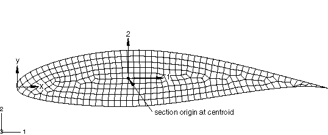

# 3.17.2 Meshing and analyzing a two-dimensional model of a beam cross-section

**Product: **Abaqus/Standard  

### Elements tested

WARP2D3    WARP2D4    

### Features tested

The special-purpose two-dimensional elements WARP2D3 (3-node triangular) and WARP2D4 (4-node quadrilateral) are used to create two-dimensional beam cross-section models. The beam section generation procedure is used to numerically calculate the geometric, stiffness, and inertia properties of the section, including the warping function and shear center location (see ["Meshed beam cross-sections," Section 3.5.6 of the Abaqus Theory Guide](../stm/stm-link.md#stm-elm-meshedsections)). The calculated properties are written to the `*jobname*.bsp` text file.

### Problem description

**Model: **

Several cross-section shapes are considered.  Two-dimensional finite element models of an I-section, an I-section with nodal offset, a rectangular section, a pipe section with a cut, a C-section, and an airfoil section (see [Figure 3.17.2--1](ch03s17abv263.md#ver-meshingbeamsect-airf)) are included.

**Figure 3.17.2–1** An airfoil cross-section.

**Mesh: **

All the cross-sections are meshed using WARP2D3 and/or WARP2D4 elements.

**Material: **

Only elastic materials, using either the linear isotropic or the orthotropic shear behavior option, can be used for the two-dimensional model.

**Boundary conditions: **

Boundary conditions are not meaningful when generating beam section properties and are ignored.

**Loading: **

Loads are not meaningful when generating beam section properties and are ignored.

### Results and discussion

The beam cross-section properties for each of the meshed cross-sections are written to the `*jobname*.bsp` text file. The integrated values of the properties for the meshed beam cross-sections are compared to the analytical solutions or solutions generated for a section from the predefined library. The warping function shapes of the two-dimensional cross-sections compare well with the solutions for the solid element models of the beam subjected to a unit twist.

### Input files

[meshedsect_airfoil.inp](../eif/meshedsect_airfoil.inp)

Meshed cross-section of an airfoil.

[meshedsect_c.inp](../eif/meshedsect_c.inp)

Meshed C cross-section.

[meshedsect_cutcircle.inp](../eif/meshedsect_cutcircle.inp)

Meshed pipe cross-section with cut.

[meshedsect_i_iso.inp](../eif/meshedsect_i_iso.inp)

Meshed I cross-section with isotropic material.

[meshedsect_i_ortho.inp](../eif/meshedsect_i_ortho.inp)

Meshed I cross-section with orthotropic material.

[meshedsect_i_orthoiso.inp](../eif/meshedsect_i_orthoiso.inp)

Meshed I cross-section with TRACTION material.

[meshedsect_i_twomat.inp](../eif/meshedsect_i_twomat.inp)

Meshed I cross-section with two different materials.

[meshedsect_i_offset.inp](../eif/meshedsect_i_offset.inp)

Meshed I cross-section with nodal offset.

[meshedsect_rectangle.inp](../eif/meshedsect_rectangle.inp)

Meshed rectangular cross-section.

