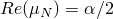
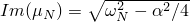
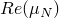
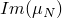
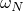

# 3.18.1 复特征值提取

**产品：** Abaqus/Standard  

本节中的测试验证了Abaqus/Standard中的复特征值提取过程，该过程使用子空间投影方法。该过程针对具有对称刚度矩阵（包括阻尼项）的系统以及具有摩擦的问题进行测试，摩擦会引入刚度矩阵的非对称性。

### I. 单元素测试

### 测试的元素

CPE4  

### 测试的特征

具有对称刚度矩阵的系统（有无阻尼）的复特征值提取。

### 问题描述

在两个测试中，模型都由一个单位长度的二次单元组成。一端的节点（）被约束。对未变形构型执行特征值提取。

### 结果与讨论

第一个问题（pcfreq_ce4sf_real.inp）中的刚度矩阵是对称的，不包含阻尼。在没有阻尼贡献的情况下，复特征求解器提取的特征值必须具有零实部，虚部（频率）必须与先前频率提取步骤中获得的频率相同。在第二个问题（pcfreq_ce4sf_real.inp）中引入了质量比例阻尼。对于欠阻尼系统可以导出以下关系：和，其中和分别是复特征值的实部和虚部；是质量比例阻尼因子；是未阻尼系统的固有频率。该问题获得的复特征值与上述公式一致。

### 输入文件

[pcfreq_ce4sf_real.inp](../eif/pcfreq_ce4sf_real.inp)

无阻尼对称刚度矩阵的复特征值提取。

[pcfreq_ce4sf_imag.inp](../eif/pcfreq_ce4sf_imag.inp)

具有质量比例阻尼的对称刚度矩阵的复特征值提取。

### II. 两板之间压缩的旋转环

### 测试的元素

C3D8

### 测试的特征

由摩擦贡献引起的不对称刚度矩阵系统的复特征值提取。

### 问题描述

该模型由一个内半径为1.0、外半径为2.0的环和位于环两侧的两个板组成。环使用线性弹性材料建模，杨氏模量为200，泊松比为0.3，密度为1.0。接触对定义环的侧面与板之间的接触。环用16个线性砖单元（单元类型C3D8）网格化。对于可变形-可变形接触模型，板用膜单元（单元类型M3D4）建模；对于可变形-刚性接触问题，用刚性单元（单元类型R3D4）建模。

载荷包括两个步骤。在第一步中，板向环移动0.05的距离以建立无摩擦接触。在第二步中，摩擦系数增加到0.3，并对环施加旋转速度。由于复特征求解器使用子空间投影方法，必须在复特征值提取步骤之前提取固有频率。考虑以下具有不同接触模型的问题：
- 具有小滑动的可变形-可变形接触（pcfreq_def_ss.inp），
- 具有小滑动包括摩擦感应阻尼效应的可变形-可变形接触（pcfreq_def_ss_fdamp.inp），
- 具有小滑动的可变形-刚性接触（pcfreq_rg_ss.inp），
- 具有有限滑动的可变形-可变形接触（pcfreq_def_fs.inp），以及
- 具有有限滑动的可变形-可变形接触的重启分析（pcfreq_def_fs_res.inp）。

此外，还测试了具有稳态传输步骤（pcfreq_sst_3d.inp）、子结构使用（pcfreq_sup_use.inp）和速度相关摩擦系数（pcfreq_def_ss_negdamp.inp）的分析。

### 结果与讨论

对于此问题没有解析解可用，因此结果（不稳定模式的频率和阻尼比）仅在不同模型之间进行比较。如下表所示，pcfreq_def_fs.inp、pcfreq_def_fs_res.inp、pcfreq_def_ss.inp、pcfreq_def_ss_fdamp.inp、pcfreq_def_ss_negdamp.inp、pcfreq_rg_ss.inp和pcfreq_sst_3d.inp的结果非常一致。pcfreq_sup_use.inp结果的差异是由于使用子结构来模拟弹性环。

| 输入文件 | 不稳定模式频率 | 不稳定模式实部 |
| --- | --- | --- |
| pcfreq_def_ss | 1.769 | 0.1648 |
| pcfreq_def_ss_fdamp | 1.769 | 0.1636 |
| pcfreq_rg_ss | 1.769 | 0.1448 |
| pcfreq_def_fs | 1.770 | 0.1650 |
| pcfreq_def_fs_res | 1.770 | 0.1650 |
| pcfreq_sst_3d | 1.767 | 0.1582 |
| pcfreq_sup_use | 1.799 | 0.1487 |
| pcfreq_def_ss_negdamp | 1.769 | 0.1705 |

### 输入文件

[pcfreq_def_ss.inp](../eif/pcfreq_def_ss.inp)

具有小滑动的可变形-可变形接触。

[pcfreq_def_ss_fdamp.inp](../eif/pcfreq_def_ss_fdamp.inp)

具有小滑动包括摩擦感应阻尼效应的可变形-可变形接触。

[pcfreq_rg_ss.inp](../eif/pcfreq_rg_ss.inp)

具有小滑动的可变形-刚性接触。

[pcfreq_def_fs.inp](../eif/pcfreq_def_fs.inp)

具有有限滑动的可变形-可变形接触。

[pcfreq_def_fs_res.inp](../eif/pcfreq_def_fs_res.inp)

具有有限滑动的可变形-可变形接触，重启分析。

[pcfreq_sst_3d.inp](../eif/pcfreq_sst_3d.inp)

在稳态传输步骤中施加旋转速度的可变形-刚性接触。

[pcfreq_sst_axi.inp](../eif/pcfreq_sst_axi.inp)

pcfreq_sst_3d.inp中使用的轴对称网格生成。

[pcfreq_sup_use.inp](../eif/pcfreq_sup_use.inp)

子结构分析。

[pcfreq_sup_gen.inp](../eif/pcfreq_sup_gen.inp)

pcfreq_sup_use.inp中引用的子结构生成文件。

[pcfreq_def_ss_negdamp.inp](../eif/pcfreq_def_ss_negdamp.inp)

具有小滑动和速度相关摩擦系数的可变形-可变形接触。

