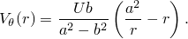
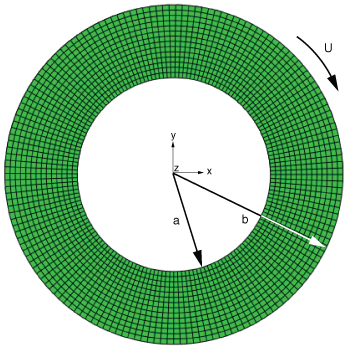
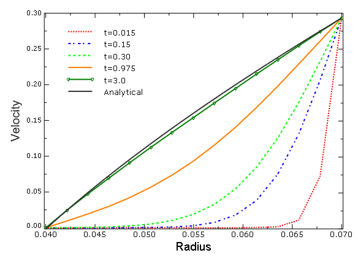
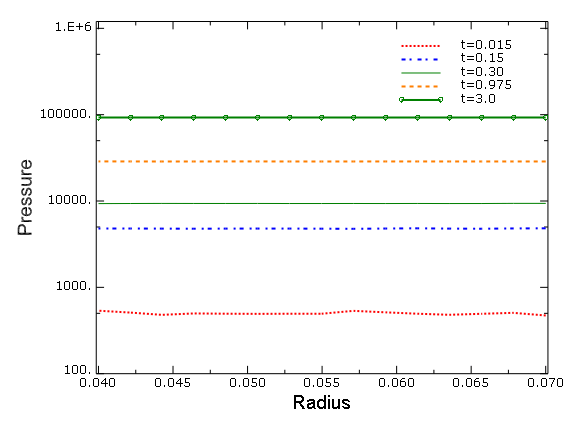
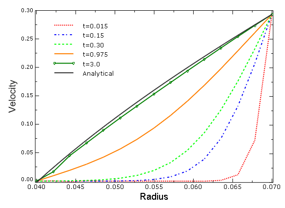
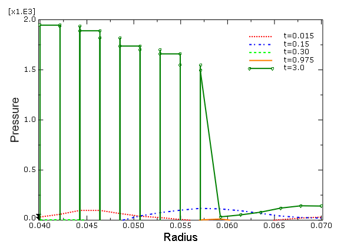

# 3.19.1 旋转水盘的CEL分析

**产品：** Abaqus/Explicit  

### 测试的元素

EC3D8R

### 测试的特征

欧拉分析

### 问题描述

本例使用纯欧拉分析技术对两个同心圆柱体之间水的粘性流动进行建模。

**模型：**

该模型在Abaqus/CAE中创建，使用简单的圆形欧拉域，外半径为0.07 m，内半径为a=0.04 m（见图3.19.1-1）。由于欧拉分析必须在三维空间中进行，这个二维问题使用一个单一欧拉单元通过其厚度的薄域来近似。矩形单元在欧拉分析中提供最佳的精度和性能，因此选择厚度与最小单元尺寸相对应。

**网格：**

欧拉域在圆周方向上用160个单元，在径向方向上用14个单元进行网格划分（见图3.19.1-1）。该网格在径向方向提供了良好的分辨率和合理的纵横比单元。总共使用2240个欧拉EC3D8R单元。采用圆形（保形）网格以避免欧拉-拉格朗日接触。

**材料：**

水被建模为近不可压缩的粘性牛顿流体。材料模型中使用线性Us Up Hugoniot形式的Mie-Grüneisen状态方程。用于定义材料的参数见表3.19.1-1。

**边界条件：**

为了近似水盘的旋转，水在外圆周上承受均匀切向速度U=0.2932 m/s，在内圆周上固定（见图3.19.1-1）。所有域面的法向零速度边界条件防止材料流入或流出域。

### 结果与讨论

施加的边界条件将水完全限制在欧拉域内。由于Us Up材料几乎是不可压缩的，必须注意确保施加的边界条件不会导致体积变化，这可能引起水中虚假压力振荡。实际上，规定的切向速度在无穷小变形时是保容的（相对于域边界的切向）。边界节点发生有限位移，沿直线轨迹而非圆周弧线，这导致径向膨胀以及圆周运动。EC3D8R单元的底层拉格朗日加映射公式利用包括这个有限位移的中间"变形"状态（见Abaqus分析用户指南第14章"欧拉分析"）。该公式导致大的压力振荡，掩盖了人们感兴趣的粘性剪切应力。通过释放内半径处的径向速度来减轻压力，允许无穷小径向运动来抵消规定速度的径向分量。

稳态切向速度沿半径的解析解由Granger（1995）给出为

在Abaqus/Explicit中，模拟从静止的水开始，切向速度U规定在外边界上。速度通过粘性沿径向向内传播，最终几乎达到稳态条件。使用U=0.2932 m/s，水盘在约0.15秒内旋转一圈。选择3秒的模拟时间，使得水盘旋转20圈，解决方案接近稳态。图3.19.1-2显示了整个半径上瞬态切向速度的解决方案。20圈后，瞬态解决方案与解析稳态解非常吻合。

在没有压力缓解边界修改的情况下，会产生大的压力。图3.19.1-3显示了沿半径的压力演变。在t=0.015秒的旋转开始时压力经历大的振荡，并随时间迅速增加。实际上，在t=0.015和0.15秒时，速度曲线中也观察到靠近内表面的振荡。在这里，正切向速度表示水甚至在靠近内表面的地方沿与施加速度相反的方向流动。

图3.19.1-4和图3.19.1-5显示了在内半径处具有缓解边界条件的切向速度和压力分布的演变。切向速度逐渐接近解析解。压力降低了三个数量级以上，并在零恒定压力的解析解附近振荡。缓解的边界条件还将计算速度提高了近2.5倍。内半径处的缓解边界导致4.32×10^-6 m的径向位移，或模型内半径的0.01%，可以安全忽略。

考虑到Abaqus/Explicit的瞬态动力学特性，三秒后的切向速度剖面与稳态解析解相比显示出良好的精度。

### 输入文件

[eulerian_rotating_disk.inp](../eif/eulerian_rotating_disk.inp)

旋转水盘。

### 参考

Granger,  R.A., Fluid Mechanics, Dover Publications, 1995.

### 表格

**表3.19.1-1** 水的材料参数。

| 参数 | 值 |
| --- | --- |
| 密度（） | 998.2 kg/m3 |
| 粘度（） | 0.1 N s/m2 |
|  | 1450 m/s |
|  | 0 |
|  | 0 |

### 图表

**图3.19.1-1** 欧拉域的几何形状、网格和边界条件。

**图3.19.1-2** 无压力缓解时切向速度的演变。

**图3.19.1-3** 无压力缓解时压力的演变。

**图3.19.1-4** 在内半径处具有缓解边界条件时切向速度的演变。

**图3.19.1-5** 在内半径处具有缓解边界条件时压力的演变。

