# 3.20.1 光滑粒子流体动力学分析

**产品：** Abaqus/Explicit  

### I. 鸟撞飞机发动机叶片

### 测试的元素

PC3D

### 问题描述

本验证问题测试PC3D单元描述鸟对飞机发动机叶片撞击的能力。旋转的飞机发动机叶片使用光滑粒子流体动力学（SPH）技术受到圆柱形飞行鸟模型的撞击。撞击后，鸟完全解体并飞溅到发动机叶片表面。类似的方法可用于对受高速度物体撞击的薄壳结构的大变形进行建模。

**模型：**

该模型分析飞行物体与旋转飞机发动机叶片之间的撞击相互作用。飞机发动机叶片使用960个S4RS壳单元建模。更靠近涡轮轮毂的一组节点运动学耦合到位于轮毂中心的参考节点。恒定角速度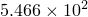 rad/s施加到参考节点关于z轴。发动机叶片使用弹塑性材料建模，杨氏模量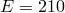 GPa，泊松比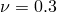，密度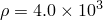 kg/m3，以及各向同性硬化。飞行鸟使用4160个PC3D单元建模。鸟材料使用表格状态方程（EOS）材料建模，抗拉强度为94 MPa，密度为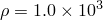 kg/m3。建模鸟的圆柱体横截面半径为0.04 m，圆柱体高度为0.076 m。鸟物体表面与壳结构之间的接触相互作用通过接触包含定义。

模型的初始构型如图3.20.1-1所示。

飞机发动机叶片和鸟系统变形的中间构型如图3.20.1-2所示。

### 结果与讨论

撞击后，叶片发生严重变形。靠近撞击区域的薄壳结构边缘发生翘曲。鸟物体完全解体并飞溅到发动机叶片表面。本测试问题验证了SPH技术建模流体类材料大变形和失效的能力。还验证了PC3D和S4RS单元之间的接触相互作用。

### 输入文件

[ver_prc_birdsplash.inp](../eif/ver_prc_birdsplash.inp)

Abaqus/Explicit输入文件。

### 图表

**图3.20.1-1** 飞机发动机叶片和鸟系统未变形构型。

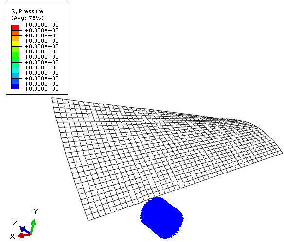

**图3.20.1-2** 飞机发动机叶片和鸟系统变形构型。

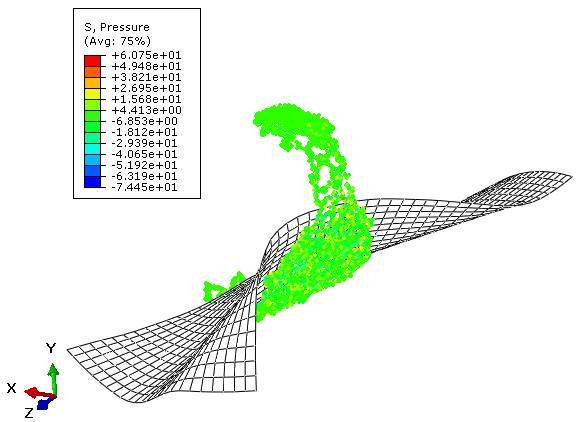

### II. 使用转换的鸟撞飞机发动机叶片

### 测试的元素

C3D8R  PC3D  

### 问题描述

本验证问题测试减缩积分连续单元（C3D8R）在鸟撞飞机发动机叶片撞击过程中随变形进展转换为SPH粒子的能力。

**模型：**

总体而言，模型、材料属性和加载条件与"鸟撞飞机发动机叶片"相同。唯一的例外是鸟首先使用C3D8R单元建模，而不是PC3D单元。基于应变的准则用于将每个连续单元转换为八个SPH粒子。在用户定义的接触包含中自动定义内部生成的粒子与壳结构之间的接触相互作用。

模型的初始构型如图3.20.1-3所示。

飞机发动机叶片和鸟系统变形的中间构型如图3.20.1-4所示。

### 结果与讨论

撞击后，叶片发生严重变形。连续单元在每个单元达到指定的最大主应变时逐步转换。靠近撞击区域的薄壳结构边缘发生翘曲。

### 输入文件

[ver_prc_birdsplashconv.inp](../eif/ver_prc_birdsplashconv.inp)

Abaqus/Explicit输入文件。

### 图表

**图3.20.1-3** 飞机发动机叶片和用连续单元建模的鸟的未变形构型。

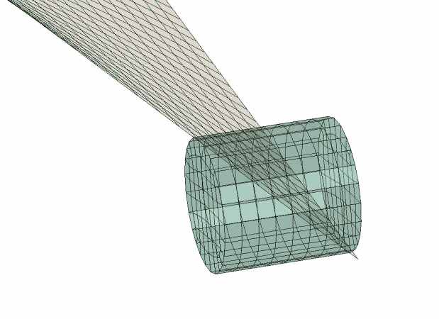

**图3.20.1-4** 随着连续单元转换的进展，飞机发动机叶片和鸟的变形构型。

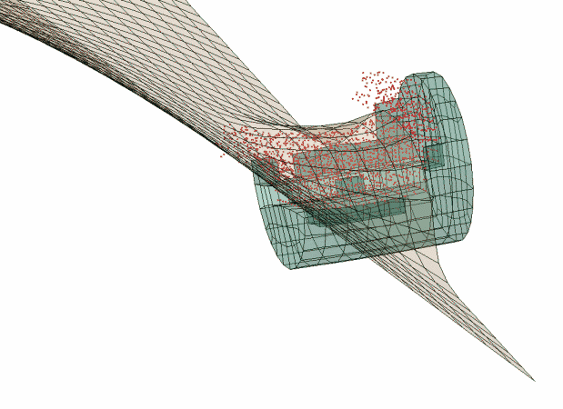

### III. 方形盘中的水飞溅

### 测试的元素

PC3D

### 问题描述

本问题测试PC3D单元建模相同材料的两个液体体的撞击和混合的能力。球形水滴在重力作用下落入装有水的方形容器中。水滴向下朝容器中的水移动，飞溅后沉入容器内的平衡状态。容器使用五个壳单元建模。在本测试问题中使用质量缩放和体积模量减少来增加稳定时间增量。由于可压缩性在本分析中不起重要作用，这种建模选择不应显著影响结果。

**模型：**

该模型分析具有相同材料属性的两种液体的撞击和混合。球形液滴和容器中的液体分别使用3544和9000个PC3D单元建模。两种液体都使用USUP类型EOS材料定义，模拟线性状态方程。使用的材料参数为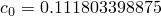 mm/s，和。为了增加稳定时间增量，液体密度被人为定义为1 tonne/mm3。容器高度为5 mm。容器的水平横截面为边长15 mm的正方形。容器的侧面和底部壁使用S4R壳单元建模。液体与壳结构之间的接触相互作用通过接触包含定义。

初始构型和中间构型如图3.20.1-5和图3.20.1-6所示。

### 结果与讨论

本测试问题验证了Abaqus/Explicit中SPH技术建模两种液体材料的撞击和混合过程的能力。也验证了质量缩放技术，该技术在此动态分析中显著增加了稳定时间增量。

### 输入文件

[ver_prc_watersplashinpan.inp](../eif/ver_prc_watersplashinpan.inp)

Abaqus/Explicit输入文件。

[ver_prc_watersplashinpan_sphere.inp](../eif/ver_prc_watersplashinpan_sphere.inp)

球体节点坐标。

[ver_prc_watersplashinpan_tank.inp](../eif/ver_prc_watersplashinpan_tank.inp)

容器节点坐标。

### 图表

**图3.20.1-5** 水滴和装水方形盘初始构型。

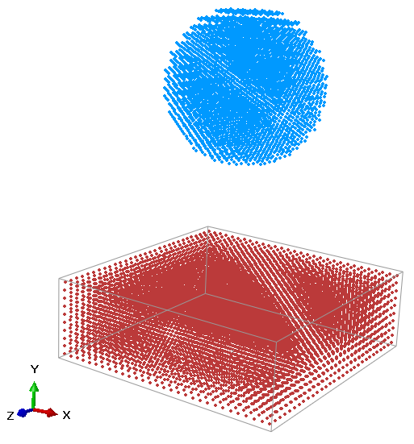

**图3.20.1-6** 水滴在装水方形盘中飞溅的中间构型。

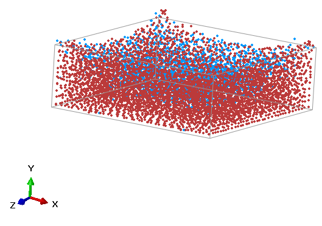

### IV. 船首像的飞溅

### 问题描述

本问题测试PC3D单元与具有复杂曲面的刚性固体结构之间的撞击相互作用。液体块向船首像移动并飞溅到其表面。本模型中使用的内聚力有助于在飞溅过程中保持液体材料的一些抗拉强度。

**模型：**

该模型分析与使用SPH技术建模的液体和刚性固体结构之间的撞击相互作用。液体块使用53040个PC3D单元建模。使用的液体材料模型是USUP类型EOS材料，模拟线性状态方程。使用的材料参数为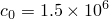 mm/s，和。为此EOS类型材料定义了2 MPa的失效强度。为了建模船首像，使用了4084个R3D3刚性单元。液体的初始速度为3000 mm/s，沿y方向朝向船首像。约束箱的尺寸为800 mm × 800 mm × 500 mm，使用48个R3D4刚性单元建模。液体与船首像和约束箱表面之间的接触相互作用通过使用无摩擦表面相互作用的接触包含定义。

初始和中间构型如图3.20.1-7和图3.20.1-8所示。

### 结果与讨论

本问题验证了SPH技术建模与具有复杂表面地形的刚体撞击相互作用的能力。也测试了为SPH粒子建模的内聚力效应的作用。

### 输入文件

[ver_prc_splashfigurehead.inp](../eif/ver_prc_splashfigurehead.inp)

Abaqus/Explicit输入文件。

### 图表

**图3.20.1-7** 水块和船首像的初始构型。

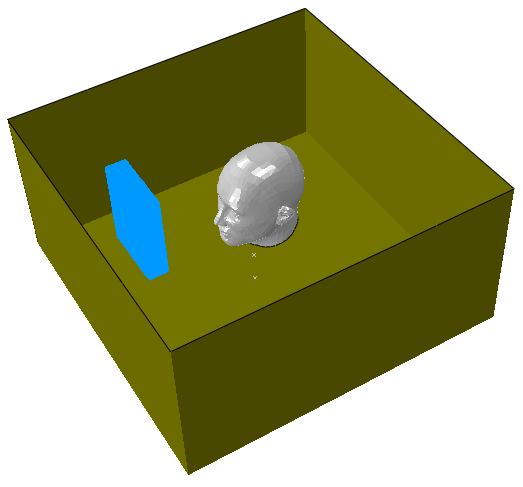

**图3.20.1-8** 水在船首像上飞溅的中间构型。

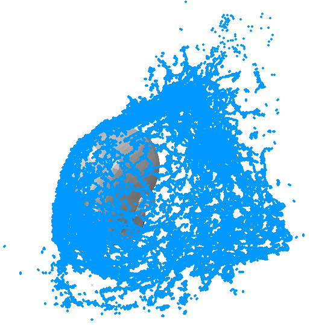

### V. 船首像雕像的融化

### 问题描述

本问题测试PC3D单元在温度突然变化时建模各向同性弹塑性材料的大变形和失效的能力。船首像雕像使用温度相关材料属性建模，随着温度突然跳升到更高值开始融化。还测试了SPH相关粒子与刚性单元之间的接触相互作用。

**模型：**

本问题分析使用SPH技术建模的船首像雕像的温度相关失效。船首像雕像使用8252个PC3D单元建模，并通过场变量依赖性表征具有温度相关弹塑性材料模式。当无量纲场变量等于1.0时，杨氏模量等于2 MPa，当此变量变为2.0时等于0.8 MPa。塑性属性对温度的依赖性通过表格数据给出。材料密度定义为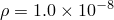 tonne/mm3。50个R3D4单元用于建模底部和侧壁。融化过程在动态分析期间温度突然升高后加速。固体雕像与刚性壁之间的接触相互作用通过接触包含定义。

初始和中间构型如图3.20.1-9和图3.20.1-10所示。

### 结果与讨论

本问题验证了SPH技术建模温度相关各向同性弹塑性材料的大变形和失效的应用。也测试了使用SPH粒子建模的该材料与刚体之间的接触相互作用。

### 输入文件

[ver_prc_figureheadmelting.inp](../eif/ver_prc_figureheadmelting.inp)

Abaqus/Explicit输入文件。

### 图表

**图3.20.1-9** 船首像雕像的初始构型。

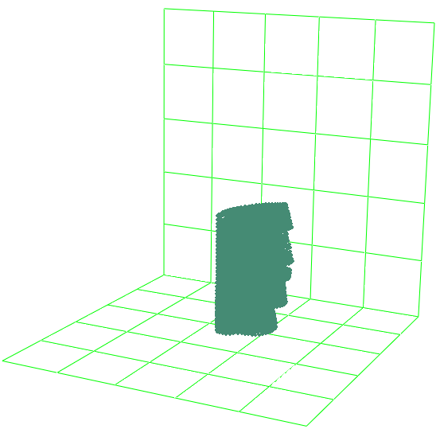

**图3.20.1-10** 融化船首像雕像的中间构型速度矢量图。

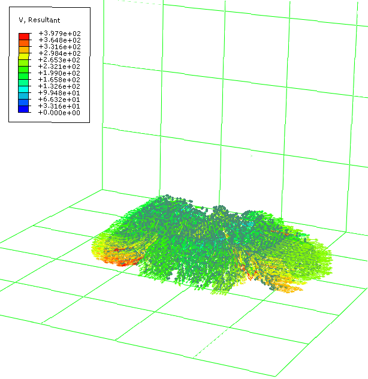

### VI. 船首像的粉碎

### 问题描述

本问题测试PC3D单元建模船首像撞击固体壁的能力。船首像建模为类似牙膏的粘性材料，被粉碎到固体壁上。撞击后，船首像完全撞在侧壁上，然后在重力作用下流到底壁上。也测试了SPH相关粒子与刚性单元之间的接触相互作用。

**模型：**

该模型分析与船首像和固体壁之间的撞击相互作用。船首像使用8252个PC3D单元建模。用于此船首像的材料模型是USUP类型EOS材料，模拟线性状态方程。使用的材料参数为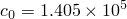，和。为此流体力学材料通过表格数据定义了线性粘性剪切行为。还为此材料定义了10 MPa的抗拉失效强度。船首像密度设置为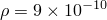 tonne/mm3。50个R3D4单元用于建模底部和侧壁。船首像的初始速度设置为1.0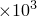 mm/s朝向侧壁。船首像然后在重力作用下沿抛物线路径运动，直到撞击壁。撞击后，船首像被粉碎到侧壁上，然后由于完全材料失效而撞到角落边缘。船首像与刚性壁之间的接触相互作用使用粗糙摩擦来描述摩擦相互作用，通过接触包含定义。

船首像和刚性壁的初始构型和中间构型如图3.20.1-11和图3.20.1-12所示。

### 结果与讨论

本问题验证了SPH技术建模内聚线性粘性材料失效的应用。也测试了该材料与刚性壁之间的接触相互作用。

### 输入文件

[ver_prc_figureheadsmashing.inp](../eif/ver_prc_figureheadsmashing.inp)

Abaqus/Explicit输入文件。

### 图表

**图3.20.1-11** 船首像的初始构型。

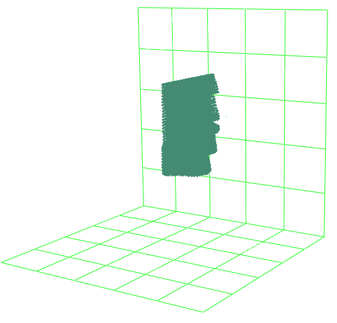

**图3.20.1-12** 被撞在墙上后船首像中间构型的速度矢量图。

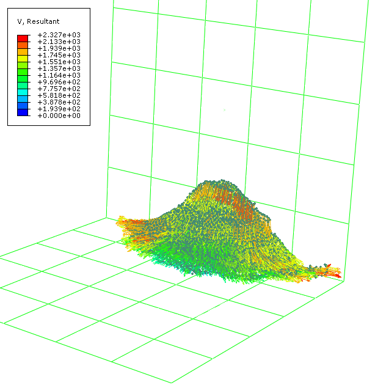

### VII. 弹体撞击板

### 测试的元素

PC3D

### 问题描述

本验证问题测试PC3D单元处理高速弹体撞击时率相关弹塑性材料的大变形和失效的能力。实心板，其中心部分使用SPH技术建模，受到高速圆柱形刚性物体的撞击。撞击后，板靠近中心部分首先发生大变形，然后破裂。最终，弹体穿透板。

**模型：**

该模型分析与高速弹体和实心板之间的撞击相互作用。实心板尺寸为400 mm × 400 mm × 12 mm。板中心半径为100 mm的圆形部分使用102726个PC3D单元建模，板的其余部分使用9312个C3D8R单元建模。圆柱形刚性实心弹体的长度为25 mm，半径为8.4 mm。弹体的初始速度设置为1000 m/s。板使用的材料为钢，杨氏模量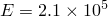 MPa，泊松比 0.3，密度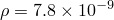 tonne/mm3。板被建模为具有率相关硬化的弹塑性材料。延性和剪切损伤基于能量准则演化。刚性弹体与实心板之间的相互作用使用摩擦系数为0.3的摩擦接触定义。

模型初始构型如图3.20.1-13所示，变形中间构型横截面如图3.20.1-14所示。

### 结果与讨论

撞击后，板中心部分首先发生大变形，然后碎裂。最终，弹体完全穿透板。本问题验证了SPH技术建模率相关弹塑性材料大变形和失效的能力。也验证了PC3D单元与实体单元之间的接触相互作用。

### 输入文件

[ver_prc_projectileimpact.inp](../eif/ver_prc_projectileimpact.inp)

Abaqus/Explicit输入文件。

### 图表

**图3.20.1-13** 实心板和弹体的初始构型。

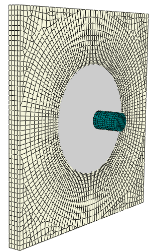

**图3.20.1-14** 承受弹体撞击的实心板Mises应力等值线图。

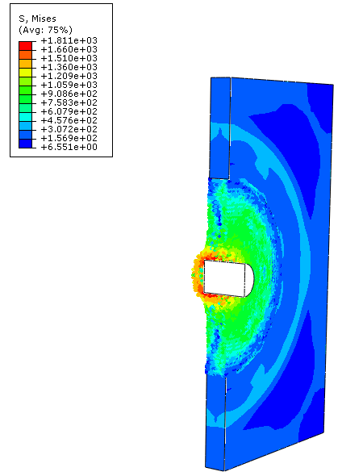

