# 3.21.1 Fluid-structure interaction of a cantilever beam inside a channel

**Product: **Abaqus/Standard  

### I. Unidirectional solution transfer between Abaqus/Standard and FLUENT

### Element tested

CPS4I

### Features tested

- Unidirectional coupling between Abaqus/Standard and FLUENT; and
- transfer of normal surface pressure and concentrated forces.

### Problem description

This verification problem illustrates the co-simulation feature used to couple Abaqus/Standard with FLUENT to perform a fluid-structure interaction (FSI) simulation. The problem consists of a slender cantilever beam placed inside a channel with steady, incompressible, laminar flow. For this case a unidirectional coupling is considered in which fluid pressure along the cantilever beam is computed by FLUENT and is imported into Abaqus. The problem is simple such that comparison between the numerical and analytical results can be made.

**Model: **

The model consists of a slender cantilever beam inside a channel, as illustrated in [Figure 3.21.1--1](ch03s21abv268.md#ver-prc-fsichannel-model). The beam length is 1 m, and the thickness is 0.01 m. The depth is considered sufficiently large so that end effects can be neglected and the flow can be considered independent of the *z* position. A 0.1 m slice of the beam and channel is chosen for this model. The FLUENT model contains two fluid domains that are distinct at one end and merge at the opposite end of the beam: the top channel height is 0.02 m, and the bottom channel height is 0.04 m. The channel cross-section is uniform along the beam.

**Figure 3.21.1–1** Schematic of channel flow problem.

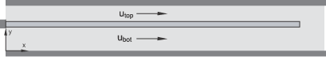

**Mesh: **

A two-dimensional model is used. The mesh consists of incompatible mode plane stress elements: 100 elements along the length, and 4 elements stacked in the thickness direction. No mesh parameter studies were performed on the structural mesh. The fluid-structure interface is defined through a surface definition.

The fluid mesh consists of 200 quadrilateral cells along the channel length and 8 cells and 16 cells stacked in the top and bottom channels, respectively. Quadrilateral fluid cells were used since these generally provide better pressure results than triangular fluid cells at the faces.

**Material: **

The structural model uses linear elastic properties with Young's modulus of 1.09 GPa and a Poisson's ratio of 0.3. 

The fluid model assumes incompressible flow with a fluid density of 1000 kg/m3 and a dynamic viscosity of 0.001 kg/ms.

**Boundary conditions: **

The structure is fixed on the inlet end of the channel and free at the outlet end. The velocity inlet flow corresponds to a Reynolds number of 250 in the upper channel and 354 in the lower channel. A pressure outlet with a zero gauge pressure is specified at the outlet, implying that the fluid of the top and bottom channel merge and have the same pressure condition. A fully developed flow is assumed and is specified through the FLUENT user-defined function `fsi_channel_2d.c` for two-dimensional problems and `fsi_channel_3d.c` for three-dimensional problems.

**Loading: **

 The fluid flow induces both normal pressure and viscous shear forces on the cantilever. The viscous shear forces are relatively small. The cantilever deforms due to the pressure difference in the top and bottom channels. 

**Analytical results: **

A fully developed flow is assumed through the uniform cross-section channel with an incompressible fluid. Thus, the *y*-velocity component () and the gradient of the *x*-velocity component (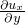) are zero everywhere; and the governing Navier-Stokes equation for the fluid flow is 

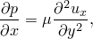

where *y* represents a local coordinate system of each channel,  represents the cantilever interface, and 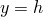 represents the channel wall. The flow at the fluid-structure interface and the channel wall are zero. Thus,  at  and   for both the top and bottom channels.

Substituting the boundary condition and integrating the Navier-Stokes equation leads to the flow solution for each channel:

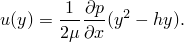

The mean velocity, 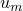, is defined as the integral of the flow solution over the channel cross-sectional area divided by the cross-sectional area. Assuming a unit depth,

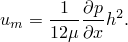

Solving for the pressure gradient, you obtain a linear pressure distribution in each channel,

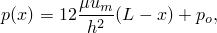

 where  is the gauge pressure at the outlet.

The deformation of a cantilever beam subjected to a triangular distributed pressure is given by

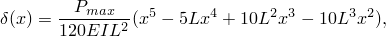

where  is the pressure at the inlet end.

The tip deflection due to the flow in each channel is

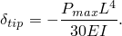

Since the flow fields merge and the structure is linear, you can superimpose the results for both channels.

**Units: **

The SI unit system is used. Abaqus does not require that the analysis be run with a particular unit system as long as all properties are specified in a consistent manner. However, the unit system used by Abaqus must coincide with those used by the third-party analysis code.

### Coupling scheme

A unidirectional coupling scheme, illustrated in [Figure 3.21.1--2](ch03s21abv268.md#ver-prc-fsichannel-oneway), is employed with FLUENT designated to begin the exchange process by sending its exchange information first. FLUENT computes the flow field around the undeformed cantilever (arrow 1) and sends the pressure distribution to Abaqus (arrow 2). Abaqus then computes the deformation corresponding to the pressure field during the first increment (arrow 3). 

**Figure 3.21.1–2** Coupling scheme for unidirectional simulation.

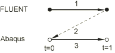

### Running the co-simulation

The following procedure illustrates how to run the co-simulation using the MpCCI project file:
- The Abaqus and FLUENT problem files should be copied to the appropriate product directories: *problemDir*/ABAQUS and *problemDir*/FLUENT, and the MpCCI project file should be copied into the *problemDir* directory.
- From the *problemDir* directory, submit the MpCCI project file to MpCCI GUI in batch mode: `mpcci -batch *example*.csp`

### Results and discussion

Based on the analytical derivation for normal pressure distribution, the expected tip deflection is –1.235  104 m. The simulation results are shown in [Table 3.21.1--1](ch03s21abv268.md#table-oneway) for a case in which normal pressure (PRESS) is imported into Abaqus and a case in which concentrated forces (CF) are imported into Abaqus.

**Table 3.21.1–1** Results for unidirectional transfer.
| Element | Tip Deflection (m) (PRESS) | Tip Deflection (m) (CF) |
| --- | --- | --- |
| CPS4I | --1.202 104 (--2.7%) | --1.202 104 (2.7%) |

The pressure difference between the top and bottom channels reported by FLUENT shows a –2.7% difference compared with the analytically predicted pressure difference. This discrepancy is consistent with the differences observed in the tip deflections. Viscous shear forces, which are not consistent with the analytical derivation, are transferred in addition to the normal pressure forces for cases in which concentrated forces are exchanged. These viscous shear forces are relatively small.

### Input files

##### **Unidirectional transfer**

[fsi_channel_cps4i_pr_1-way.inp](../eif/fsi_channel_cps4i_pr_1-way.inp)

Abaqus input file for unidirectional transfer with pressure loads imported.

[fsi_channel_cps4i_cf_1-way.inp](../eif/fsi_channel_cps4i_cf_1-way.inp)

Abaqus input file for unidirectional transfer with concentrated forces imported.

[fsi_channel_cps4i_pr_1-way.csp](../eif/fsi_channel_cps4i_pr_1-way.csp)

MpCCI GUI project file for fsi_channel_cps4i_pr_1-way.inp.

[fsi_channel_cps4i_cf_1-way.csp](../eif/fsi_channel_cps4i_cf_1-way.csp)

MpCCI GUI project file for fsi_channel_cps4i_cf_1-way.inp.

[fsi_channel_2d.cas](../eif/fsi_channel_2d.cas)

FLUENT case file for all two-dimensional models.

[fsi_channel_2d_1-way.jou](../eif/fsi_channel_2d_1-way.jou)

FLUENT journal file for all unidirectional transfers.

[fsi_channel_2d.c](../eif/fsi_channel_2d.c)

FLUENT user-defined function for two-dimensional laminar flow.

### II. Bidirectional solution transfer between Abaqus/Standard and FLUENT

### Elements tested

CPS4I    C3D8I    

### Features tested

- Bidirectional solution transfer between Abaqus/Standard and FLUENT;
- transfer of current coordinates to FLUENT and pressure and concentrated forces to Abaqus;
- two-dimensional and three-dimensional simulations;
- serial and parallel coupling schemes; and
- nodal transformations.

### Problem description

**Model: **

The two-dimensional model is identical to the model used for the unidirectional solution transfer. A three-dimensional model is included and described under this section. In addition, two-dimensional and three-dimensional models with nodal transformations specified at the fluid-structure interface are included.

**Mesh: **

 The three-dimensional structural mesh consists of continuum elements: 100 elements along the length, and 4 elements stacked in the thickness direction. No mesh parameter studies were performed on the structural mesh. 

The fluid mesh for the three-dimensional model consists of 200 hexahedron cells along the channel length and 8 cells and 16 cells stacked in the top channel and bottom channels, respectively. Quadrilateral fluid cells were used since these generally provide better surface pressures than prismatic fluid cells.

**Boundary conditions: **

The boundary conditions are identical to the boundary conditions specified for the unidirectional solution transfer.

**Loading: **

 The fluid flow over the channel induces both normal pressure and viscous shear forces on the cantilever. The viscous shear forces are relatively small. The cantilever deforms in response to the pressure differential between the flow in the top and bottom channels. The deformations are transferred back to FLUENT, and a new flow solution is obtained. This process is repeated until a steady-state condition is established; specifically, until minor changes in deformation and pressure are observed between consecutive coupling steps.

**Analytical results: **

The formulation derived under the unidirectional solution transfer holds only if there is no significant cross-flow; i.e., no flow perpendicular to the cantilever. As the deflection of the cantilever increases, the cross-flow becomes more dominant and, thus, the numerical results deviate from the analytical results. 

### Coupling schemes

The simulations are run using both serial and parallel coupling schemes illustrated in [Figure 3.21.1--3](ch03s21abv268.md#ver-prc-fsichannel-twoway-serial) and [Figure 3.21.1--4](ch03s21abv268.md#ver-prc-fsichannel-twoway-parallel), respectively.

For the serial coupling scheme FLUENT computes the flow field around the undeformed cantilever (arrow 1). The pressure is transferred to Abaqus (arrow 2). Abaqus computes the deformation corresponding to the pressure field during the first increment and sends the deformed configuration to FLUENT (arrows 3 and 4). This completes one coupling step. FLUENT then computes a new flow solution based on the current configuration of the cantilever (arrow 5), and the steps are repeated until a steady solution is obtained. Typically, only a few exchanges are needed until solutions quantities show minor differences between consecutive coupling steps.

For the parallel coupling scheme FLUENT computes the flow field around the undeformed cantilever (arrow 1) and Abaqus performs an initial increment without any FSI loads. When the target time is reached, both analysis codes exchange solution quantities (arrow 2). Abaqus and FLUENT independently proceed to compute a new solution based on the quantities received from the previous coupling step. Typically, only a few exchanges are needed until the solutions quantities show minor differences between consecutive coupling steps.

**Figure 3.21.1–3** Serial coupling scheme.

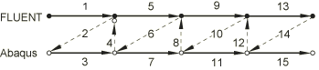

**Figure 3.21.1–4** Parallel coupling scheme.

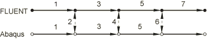

### Running the co-simulation

The following procedure illustrates how to run the co-simulation using the MpCCI project file:
- The Abaqus and FLUENT problem files should be copied to the appropriate product directories: *problemDir*/ABAQUS and *problemDir*/FLUENT, and the MpCCI project file should be copied into the *problemDir* directory.
- From the *problemDir* directory, submit the MpCCI project file to MpCCI GUI in batch mode: `mpcci -batch *example*.csp`

The MpCCI configuration files are also included, such that these problems can be run without the MpCCI GUI. 

### Results and discussion

The solution for the bidirectional transfer is expected to be close to the unidirectional transfer because of the small tip deflection. The simulation results are shown in [Table 3.21.1--2](ch03s21abv268.md#table-twoway) for the case in which normal pressure (PRESS) is imported into Abaqus and for the case in which concentrated forces (CF) are imported into Abaqus. 

**Table 3.21.1–2** Results for bidirectional transfer.
| Element | Tip Deflection (m) (PRESS) | Tip Deflection (m) (CF) |
| --- | --- | --- |
| CPS4I (serial) | --1.148 104 | --1.148 104 |
| CPS4I (parallel) | --1.148 104 | --1.148 104 |
| C3D8I (serial) | --1.158 104 | --1.158 104 |
| C3D8I (parallel) | --1.158 104 | --1.158 104 |
| C3D20R (serial) | --1.162 104 | --1.162 104 |

The input files used with nodal transformation on the fluid-structure interface yield the same solution as the case without nodal transformation, thus verifying that the concentrated loads are properly transformed to the local coordinate system prior to applying the loads.

### Input files

##### **Serial coupling scheme**

[fsi_channel_cps4i_pr_crd.inp](../eif/fsi_channel_cps4i_pr_crd.inp)

Abaqus input file using CPS4I elements; bidirectional transfer with pressure loads imported and current coordinates exported. 

[fsi_channel_cps4i_cf_crd.inp](../eif/fsi_channel_cps4i_cf_crd.inp)

Abaqus input file using CPS4I elements; bidirectional transfer with concentrated forces imported and current coordinates exported.

[fsi_channel_c3d8i_pr_crd.inp](../eif/fsi_channel_c3d8i_pr_crd.inp)

Abaqus input file using C3D8I elements; bidirectional transfer with pressure loads imported and current coordinates exported. 

[fsi_channel_c3d8i_cf_crd.inp](../eif/fsi_channel_c3d8i_cf_crd.inp)

Abaqus input file using C3D8I elements; bidirectional transfer with concentrated forces imported and current coordinates exported.

[fsi_channel_c3d20r_cf_crd.inp](../eif/fsi_channel_c3d20r_cf_crd.inp)

Abaqus input file using C3D20R elements; bidirectional transfer with concentrated forces imported and current coordinates exported.

[fsi_channel_c3d20r_cf_crd.inp](../eif/fsi_channel_c3d20r_cf_crd.inp)

Abaqus input file using C3D20R elements; bidirectional transfer with concentrated forces imported and current coordinates exported.

[fsi_channel_cps4i_pr_crd.csp](../eif/fsi_channel_cps4i_pr_crd.csp)

MpCCI GUI project file for fsi_channel_cps4i_pr_crd.inp.

[fsi_channel_cps4i_cf_crd.csp](../eif/fsi_channel_cps4i_cf_crd.csp)

MpCCI GUI project file for fsi_channel_cps4i_pr_crd.inp.

[fsi_channel_c3d8i_pr_crd.csp](../eif/fsi_channel_c3d8i_pr_crd.csp)

MpCCI GUI project file for fsi_channel_cps4i_pr_crd_par.inp.

[fsi_channel_c3d8i_cf_crd.csp](../eif/fsi_channel_c3d8i_cf_crd.csp)

MpCCI GUI project file for fsi_channel_c3d8i_cf_crd_par.inp.

[fsi_channel_c3d20r_pr_crd.csp](../eif/fsi_channel_c3d20r_pr_crd.csp)

MpCCI GUI project file for fsi_channel_c3d20r_pr_crd.inp.

[fsi_channel_c3d20r_cf_crd.csp](../eif/fsi_channel_c3d20r_cf_crd.csp)

MpCCI GUI project file for fsi_channel_c3d20r_cf_crd.inp.

[fsi_channel_2d_transient.cas](../eif/fsi_channel_2d_transient.cas)

FLUENT case file for all two-dimensional problems.

[fsi_channel_2d.jou](../eif/fsi_channel_2d.jou)

FLUENT journal file for all two-dimensional problems.

[fsi_channel_2d.c](../eif/fsi_channel_2d.c)

FLUENT user-defined function for two-dimensional laminar flow.

[fsi_channel_3d_transient.cas](../eif/fsi_channel_3d_transient.cas)

FLUENT case file for all three-dimensional problems.

[fsi_channel_3d.jou](../eif/fsi_channel_3d.jou)

FLUENT journal file for all three-dimensional problems.

[fsi_channel_3d.c](../eif/fsi_channel_3d.c)

FLUENT user-defined function for three-dimensional laminar flow.

##### **Parallel coupling scheme**

[fsi_channel_cps4i_pr_crd_par.inp](../eif/fsi_channel_cps4i_pr_crd_par.inp)

Abaqus input file using CPS4I elements; bidirectional transfer with pressure loads imported and current coordinates exported. 

[fsi_channel_cps4i_cf_crd_par.inp](../eif/fsi_channel_cps4i_cf_crd_par.inp)

Abaqus input file using CPS4I elements; bidirectional transfer with concentrated forces imported and current coordinates exported.

[fsi_channel_c3d8i_pr_crd_par.inp](../eif/fsi_channel_c3d8i_pr_crd_par.inp)

Abaqus input file using C3D8I elements; bidirectional transfer with pressure loads imported and current coordinates exported. 

[fsi_channel_c3d8i_cf_crd_par.inp](../eif/fsi_channel_c3d8i_cf_crd_par.inp)

Abaqus input file using C3D8I elements; bidirectional transfer with concentrated forces imported and current coordinates exported.

[fsi_channel_cps4i_pr_crd_par.csp](../eif/fsi_channel_cps4i_pr_crd_par.csp)

MpCCI GUI project file for fsi_channel_cps4i_pr_crd_par.inp.

[fsi_channel_cps4i_cf_crd_par.csp](../eif/fsi_channel_cps4i_cf_crd_par.csp)

MpCCI GUI project file for fsi_channel_cps4i_cf_crd_par.inp.

[fsi_channel_c3d8i_pr_crd_par.csp](../eif/fsi_channel_c3d8i_pr_crd_par.csp)

MpCCI GUI project file for fsi_channel_c3d8i_pr_coord_par.inp.

[fsi_channel_c3d8i_cf_crd_par.csp](../eif/fsi_channel_c3d8i_cf_crd_par.csp)

MpCCI GUI project file for fsi_channel_c3d8i_cf_crd_par.inp.

[fsi_channel_2d_transient.cas](../eif/fsi_channel_2d_transient.cas)

FLUENT case file for all two-dimensional problems.

[fsi_channel_2d_par.jou](../eif/fsi_channel_2d_par.jou)

FLUENT journal file for all two-dimensional problems.

[fsi_channel_2d.c](../eif/fsi_channel_2d.c)

FLUENT user-defined function for two-dimensional laminar flow.

[fsi_channel_3d_transient.cas](../eif/fsi_channel_3d_transient.cas)

FLUENT case file for all three-dimensional problems.

[fsi_channel_3d_par.jou](../eif/fsi_channel_3d_par.jou)

FLUENT journal file for all three-dimensional problems.

[fsi_channel_3d.c](../eif/fsi_channel_3d.c)

FLUENT user-defined function for three-dimensional laminar flow.

##### **Nodal transformation**

[fsi_channel_cps4i_cf_crd_trnsf.inp](../eif/fsi_channel_cps4i_cf_crd_trnsf.inp)

Abaqus input file using CPS4I elements; bidirectional transfer with concentrated forces imported and current coordinates exported using nodal transformation.

[fsi_channel_c3d8i_cf_crd_trnsf.inp](../eif/fsi_channel_c3d8i_cf_crd_trnsf.inp)

Abaqus input file using C3D8I elements; bidirectional transfer with concentrated forces imported and current coordinates exported using nodal transformation.

[fsi_channel_cps4i_cf_crd_trnsf.csp](../eif/fsi_channel_cps4i_cf_crd_trnsf.csp)

MpCCI GUI project file for fsi_channel_cps4i_cf_crd_trnsf.inp.

[fsi_channel_c3d8i_cf_crd_trnsf.csp](../eif/fsi_channel_c3d8i_cf_crd_trnsf.csp)

MpCCI GUI project file for fsi_channel_c3d8i_cf_crd_trnsf.inp.

[fsi_channel_2d_transient.cas](../eif/fsi_channel_2d_transient.cas)

FLUENT case file for all two-dimensional problems.

[fsi_channel_2d.jou](../eif/fsi_channel_2d.jou)

FLUENT journal file for all two-dimensional problems.

[fsi_channel_2d.c](../eif/fsi_channel_2d.c)

FLUENT user-defined function for two-dimensional laminar flow.

[fsi_channel_3d_transient.cas](../eif/fsi_channel_3d_transient.cas)

FLUENT case file for all three-dimensional problems.

[fsi_channel_3d.jou](../eif/fsi_channel_3d.jou)

FLUENT journal file for all three-dimensional problems.

[fsi_channel_3d.c](../eif/fsi_channel_3d.c)

FLUENT user-defined function for three-dimensional laminar flow.

### III. Rendezvousing scheme

### Element tested

CPS4I

### Features tested

The following rendezvousing schemes are tested in Abaqus/Standard:
- The coupling step size is a user-defined constant and Abaqus/Standard is forced to use a single increment per coupling step (lockstep).
- The coupling step size is a user-defined constant and Abaqus/Standard is allowed to take one or more increments during the coupling step (subcycle).
- The coupling step size is defined by FLUENT and Abaqus/Standard is allowed to take one or more increments during the coupling step (subcycle).

### Problem description

The problem is identical to the two-dimensional channel problem discussed in the previous sections, with the exception of the time stepping scheme. The rendezvousing scheme is defined through the MpCCI GUI. Specifying a target time period allows Abaqus to subcycle based on its own time stepping scheme while maintaining exchanges with the third-party code at a fixed frequency. Abaqus/Standard interpolates the imported loads between the previous coupling step and the target values.

### Running the co-simulation

The following procedure illustrates how to run the co-simulation using the MpCCI project file:
- The Abaqus and FLUENT problem files should be copied to the appropriate product directories: *problemDir*/ABAQUS and *problemDir*/FLUENT, and the MpCCI project file should be copied into the *problemDir* directory.
- From the *problemDir* directory, submit the MpCCI project file to MpCCI GUI in batch mode: `mpcci -batch *example*.csp`

The MpCCI configuration files are also included, such that these problems can be run from without the MpCCI GUI. 

### Results and discussion

 The loads are properly interpolated during subcycles, and the rendezvous times are met as specified by the rendezvousing scheme. This has been verified by plotting a history plot of the variable CF at an interface node.

### Input files

[fsi_channel_cps4i_constantDt_lockstep.inp](../eif/fsi_channel_cps4i_constantDt_lockstep.inp)

Abaqus input file where the coupling step size is a user-defined constant and Abaqus/Standard is forced to use a single increment per coupling step (lockstep).

[fsi_channel_cps4i_constantDt.inp](../eif/fsi_channel_cps4i_constantDt.inp)

Abaqus input file using C3D8I elements; bidirectional transfer, automatic time stepping, and meeting target times in a loose manner.

[fsi_channel_cps4i_importDt.inp](../eif/fsi_channel_cps4i_importDt.inp)

Abaqus input file using C3D8I elements; bidirectional transfer, direct user-specified time stepping, and meeting target times exactly.

[fsi_channel_cps4i_constantDt_lockstep.csp](../eif/fsi_channel_cps4i_constantDt_lockstep.csp)

MpCCI GUI project file for fsi_channel_cps4i_constantDt_lockstep.inp.

[fsi_channel_cps4i_constantDt.csp](../eif/fsi_channel_cps4i_constantDt.csp)

MpCCI GUI project file for fsi_channel_cps4i_constantDt.inp.

[fsi_channel_cps4i_importDt.csp](../eif/fsi_channel_cps4i_importDt.csp)

MpCCI GUI project file for fsi_channel_cps4i_importDt.inp.

[fsi_channel_2d_transient.cas](../eif/fsi_channel_2d_transient.cas)

FLUENT case file for all two-dimensional problems.

[fsi_channel_2d.jou](../eif/fsi_channel_2d.jou)

FLUENT journal file for all two-dimensional problems.

[fsi_channel_2d.c](../eif/fsi_channel_2d.c)

FLUENT user-defined function for two-dimensional laminar flow.

