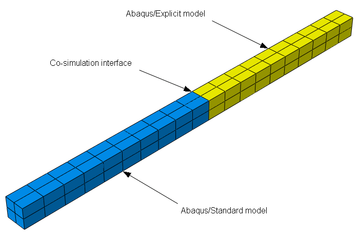

# 3.21.2 Abaqus/Standard到Abaqus/Explicit协同仿真

**产品：** Abaqus/Standard  Abaqus/Explicit  

本节中的测试验证了当两个分析产品处理模型的互补域时Abaqus/Standard和Abaqus/Explicit的协同仿真相互作用。相同模型的Abaqus/Explicit模拟获得的结果被用作参考解决方案。

### 测试的特征

以下部分描述了以下验证问题：
- Abaqus/Explicit与Abaqus/Standard非线性动力学过程的锁定步长协同仿真；
- Abaqus/Explicit与Abaqus/Standard非线性动力学过程的子循环协同仿真；
- Abaqus/Explicit与Abaqus/Standard非线性准静态过程的子循环协同仿真；以及
- 在Abaqus/Explicit和Abaqus/Standard作业之间的协同仿真界面上应用的各种建模技术和模型属性案例。

### I. Abaqus/Standard非线性动力学过程到Abaqus/Explicit过程的锁定步长协同仿真

### 测试的元素

B31  C3D8I  C3D8  C3D4  S4R  T3D2  

### 测试的特征

对于承受动力学大变形运动的模型，使用锁定步长Abaqus/Standard到Abaqus/Explicit协同仿真获得结果的保真度和数值稳定性。

### 问题描述

该问题是一个承受端部激励力的简单梁（见图3.21.2-1）。

**图3.21.2-1** 连续单元协同仿真模型配置。梁验证问题的配置位于此图的模型中心线上。使用的壳单元位于所示模型的外侧。

**模型：**

该模型由长度为20、宽度为1、高度为1的梁的Abaqus/Standard和Abaqus/Explicit组件组成。

**网格：**

连续单元和壳单元模型使用规则砖网格。

**材料：**

使用线性弹性材料定义。

**边界条件：**

梁的Abaqus/Standard部分在其端部完全嵌入。

**载荷：**

梁的Abaqus/Explicit部分承受垂直于梁轴线的载荷。

**协同仿真定义：**

每个模型在协同仿真控制上使用锁定步长方法。

### 锁定步长协同仿真算法描述

使用锁定步长方法时，Abaqus/Standard和Abaqus/Explicit将使用相同的时间增量推进各自的解决方案。

### 结果与讨论

在每个案例中，Abaqus/Standard到Abaqus/Explicit协同仿真结果与Abaqus/Explicit结果通常具有良好的一致性。

### 输入文件

#### 梁单元测试：

[beam_dyntodyn_lockstep_std.inp](../eif/beam_dyntodyn_lockstep_std.inp)

B31 Abaqus/Standard分析。

[beam_dyntodyn_lockstep_xpl.inp](../eif/beam_dyntodyn_lockstep_xpl.inp)

B31 Abaqus/Explicit分析。

[beam_dyntodyn_lockstep_config.xml](../eif/beam_dyntodyn_lockstep_config.xml)

协同仿真配置文件。

[beam_fullxpl.inp](../eif/beam_fullxpl.inp)

B31 Abaqus/Explicit参考分析。

#### 连续单元测试：

[contbeam_dyntodyn_lockstep_std.inp](../eif/contbeam_dyntodyn_lockstep_std.inp)

C3D8I Abaqus/Standard分析。

[contbeam_dyntodyn_lockstep_xpl.inp](../eif/contbeam_dyntodyn_lockstep_xpl.inp)

C3D8I Abaqus/Explicit分析。

[contbeam_dyntodyn_lockstep_config.xml](../eif/contbeam_dyntodyn_lockstep_config.xml)

协同仿真配置文件。

[contbeam_fullxpl.inp](../eif/contbeam_fullxpl.inp)

C3D8I Abaqus/Explicit参考分析。

#### 混合单元测试：

[contbeam_rot_dyntodyn_lockstep_std.inp](../eif/contbeam_rot_dyntodyn_lockstep_std.inp)

B31, C3D8I, S4R Abaqus/Standard分析。

[contbeam_rot_dyntodyn_lockstep_xpl.inp](../eif/contbeam_rot_dyntodyn_lockstep_xpl.inp)

B31, C3D8I, S4R Abaqus/Explicit分析。

[contbeam_rot_dyntodyn_lockstep_config.xml](../eif/contbeam_rot_dyntodyn_lockstep_config.xml)

协同仿真配置文件。

[contbeam_rot_fullxpl.inp](../eif/contbeam_rot_fullxpl.inp)

B31, C3D8I, S4R Abaqus/Explicit参考分析。

#### 具有轴向载荷的桁架单元测试：

[truss_dyntodyn_lockstep_std.inp](../eif/truss_dyntodyn_lockstep_std.inp)

T3D2 Abaqus/Standard分析。

[truss_dyntodyn_lockstep_xpl.inp](../eif/truss_dyntodyn_lockstep_xpl.inp)

T3D2 Abaqus/Explicit分析。

[truss_dyntodyn_lockstep_config.xml](../eif/truss_dyntodyn_lockstep_config.xml)

协同仿真配置文件。

[truss_fullxpl.inp](../eif/truss_fullxpl.inp)

T3D2 Abaqus/Explicit参考分析。

#### 在协同仿真界面区域具有不同网格的测试：

[contbeam_dmesh_dyntodyn_lock_std.inp](../eif/contbeam_dmesh_dyntodyn_lock_std.inp)

C3D4 Abaqus/Standard分析。

[contbeam_dmesh_dyntodyn_lock_xpl.inp](../eif/contbeam_dmesh_dyntodyn_lock_xpl.inp)

C3D8 Abaqus/Explicit分析。

[contbeam_dmesh_dyntodyn_lock_config.xml](../eif/contbeam_dmesh_dyntodyn_lock_config.xml)

协同仿真配置文件。

[contbeam_dmesh2_dyntodyn_lock_std.inp](../eif/contbeam_dmesh2_dyntodyn_lock_std.inp)

C3D8 Abaqus/Standard分析。

[contbeam_dmesh2_dyntodyn_lock_xpl.inp](../eif/contbeam_dmesh2_dyntodyn_lock_xpl.inp)

C3D4 Abaqus/Explicit分析。

[contbeam_dmesh2_dyntodyn_lock_config.xml](../eif/contbeam_dmesh2_dyntodyn_lock_config.xml)

协同仿真配置文件。

### II. Abaqus/Standard非线性动力学过程到Abaqus/Explicit过程的子循环协同仿真

### 测试的元素

B31  C3D8I  C3D8  C3D4  S4R  T3D2  

### 测试的特征

对于承受动力学大变形运动的模型，使用子循环Abaqus/Standard到Abaqus/Explicit协同仿真获得结果的保真度和数值稳定性。

### 问题描述

该问题是一个承受严重激励力的简单梁（见图3.21.2-1）。

**模型：**

该模型由长度为20、宽度为1、高度为1的梁的Abaqus/Standard和Abaqus/Explicit组件组成。

**网格：**

连续单元和壳单元模型使用规则砖网格。

**材料：**

使用线性弹性材料定义。

**边界条件：**

梁的Abaqus/Standard部分在其端部完全嵌入。

**载荷：**

梁的Abaqus/Explicit部分承受垂直于梁轴线的载荷。

**协同仿真定义：**

每个模型在协同仿真控制上使用子循环方法。

### 子循环协同仿真算法描述

使用子循环方法时，Abaqus/Standard和Abaqus/Explicit将使用适合其解决方案的时间增量推进各自的解决方案。

### 结果与讨论

在每个案例中，Abaqus/Standard到Abaqus/Explicit协同仿真结果与Abaqus/Explicit结果通常具有良好的一致性。

### 输入文件

#### 梁单元测试：

[beam_dyntodyn_subcycle_std.inp](../eif/beam_dyntodyn_subcycle_std.inp)

B31 Abaqus/Standard分析。

[beam_dyntodyn_subcycle_xpl.inp](../eif/beam_dyntodyn_subcycle_xpl.inp)

B31 Abaqus/Explicit分析。

[beam_dyntodyn_subcycle_config.xml](../eif/beam_dyntodyn_subcycle_config.xml)

协同仿真配置文件。

[beam_fullxpl.inp](../eif/beam_fullxpl.inp)

B31 Abaqus/Explicit参考分析。

#### 连续单元测试：

[contbeam_dyntodyn_subcycle_std.inp](../eif/contbeam_dyntodyn_subcycle_std.inp)

C3D8I Abaqus/Standard分析。

[contbeam_dyntodyn_subcycle_xpl.inp](../eif/contbeam_dyntodyn_subcycle_xpl.inp)

C3D8I Abaqus/Explicit分析。

[contbeam_dyntodyn_subcycle_config.xml](../eif/contbeam_dyntodyn_subcycle_config.xml)

协同仿真配置文件。

[contbeam_fullxpl.inp](../eif/contbeam_fullxpl.inp)

C3D8I Abaqus/Explicit参考分析。

#### 混合单元测试：

[contbeam_rot_dyntodyn_subcycle_std.inp](../eif/contbeam_rot_dyntodyn_subcycle_std.inp)

B31, C3D8I, S4R Abaqus/Standard分析。

[contbeam_rot_dyntodyn_subcycle_xpl.inp](../eif/contbeam_rot_dyntodyn_subcycle_xpl.inp)

B31, C3D8I, S4R Abaqus/Explicit分析。

[contbeam_rot_dyntodyn_subcycle_config.xml](../eif/contbeam_rot_dyntodyn_subcycle_config.xml)

协同仿真配置文件。

[contbeam_rot_fullxpl.inp](../eif/contbeam_rot_fullxpl.inp)

B31, C3D8I, S4R Abaqus/Explicit参考分析。

#### 具有轴向载荷的桁架单元测试：

[truss_dyntodyn_subcycle_std.inp](../eif/truss_dyntodyn_subcycle_std.inp)

T3D2 Abaqus/Standard分析。

[truss_dyntodyn_subcycle_xpl.inp](../eif/truss_dyntodyn_subcycle_xpl.inp)

T3D2 Abaqus/Explicit分析。

[truss_dyntodyn_subcycle_config.xml](../eif/truss_dyntodyn_subcycle_config.xml)

协同仿真配置文件。

[truss_fullxpl.inp](../eif/truss_fullxpl.inp)

T3D2 Abaqus/Explicit参考分析。

#### 在协同仿真界面区域具有不同网格的测试：

[contbeam_dmesh_dyntodyn_sub_std.inp](../eif/contbeam_dmesh_dyntodyn_sub_std.inp)

C3D4 Abaqus/Standard分析。

[contbeam_dmesh_dyntodyn_sub_xpl.inp](../eif/contbeam_dmesh_dyntodyn_sub_xpl.inp)

C3D8 Abaqus/Explicit分析。

[contbeam_dmesh_dyntodyn_sub_config.xml](../eif/contbeam_dmesh_dyntodyn_sub_config.xml)

协同仿真配置文件。

[contbeam_dmesh2_dyntodyn_sub_std.inp](../eif/contbeam_dmesh2_dyntodyn_sub_std.inp)

C3D8 Abaqus/Standard分析。

[contbeam_dmesh2_dyntodyn_sub_xpl.inp](../eif/contbeam_dmesh2_dyntodyn_sub_xpl.inp)

C3D4 Abaqus/Explicit分析。

[contbeam_dmesh2_dyntodyn_sub_config.xml](../eif/contbeam_dmesh2_dyntodyn_sub_config.xml)

协同仿真配置文件。

#### 较少频率界面矩阵分解的测试：

以下输入文件在协同仿真控制上测试每个Abaqus/Standard增量一次界面矩阵的分解。

[contbeam_dyntodyn_fact_std.inp](../eif/contbeam_dyntodyn_fact_std.inp)

C3D8I Abaqus/Standard分析。

[contbeam_dyntodyn_fact_xpl.inp](../eif/contbeam_dyntodyn_fact_xpl.inp)

C3D8I Abaqus/Explicit分析。

[contbeam_dyntodyn_fact_config.xml](../eif/contbeam_dyntodyn_fact_config.xml)

协同仿真配置文件。

[contbeam_dmesh_dyntodyn_fact_std.inp](../eif/contbeam_dmesh_dyntodyn_fact_std.inp)

C3D4 Abaqus/Standard分析。

[contbeam_dmesh_dyntodyn_fact_xpl.inp](../eif/contbeam_dmesh_dyntodyn_fact_xpl.inp)

C3D8 Abaqus/Explicit分析。

[contbeam_dmesh_dyntodyn_fact_config.xml](../eif/contbeam_dmesh_dyntodyn_fact_config.xml)

协同仿真配置文件。

### III. Abaqus/Standard非线性静态过程到Abaqus/Explicit过程的子循环协同仿真

### 测试的元素

B31  C3D8I  C3D8  C3D4  S4R  T3D2  

### 测试的特征

对于承受准静态变形的模型，使用Abaqus/Standard准静态过程到Abaqus/Explicit协同仿真的子循环获得结果的保真度和数值稳定性。

### 问题描述

该问题是一个承受准静态载荷的简单梁（见图3.21.2-1）。

**模型：**

该模型由长度为20、宽度为1、高度为1的梁的Abaqus/Standard和Abaqus/Explicit组件组成。

**网格：**

连续单元和壳单元模型使用规则砖网格。

**材料：**

使用线性弹性材料定义。

**边界条件：**

梁的Abaqus/Standard部分在自由端完全嵌入。

**载荷：**

梁的Abaqus/Explicit部分承受垂直于梁轴线的载荷。

**协同仿真定义：**

每个模型在协同仿真控制上使用子循环方法。

### 子循环协同仿真算法描述

使用子循环方法时，Abaqus/Standard和Abaqus/Explicit将使用适合其解决方案的时间增量推进各自的解决方案。

### 结果与讨论

在每个案例中，Abaqus/Standard到Abaqus/Explicit协同仿真结果与Abaqus/Explicit结果通常具有良好的一致性。

### 输入文件

#### 连续单元测试：

[contbeam_statodyn_subcycle_std.inp](../eif/contbeam_statodyn_subcycle_std.inp)

C3D8I Abaqus/Standard分析。

[contbeam_statodyn_subcycle_xpl.inp](../eif/contbeam_statodyn_subcycle_xpl.inp)

C3D8I Abaqus/Explicit分析。

[contbeam_statodyn_subcycle_config.xml](../eif/contbeam_statodyn_subcycle_config.xml)

协同仿真配置文件。

[contbeam_quasistatic_fullxpl.inp](../eif/contbeam_quasistatic_fullxpl.inp)

C3D8I Abaqus/Explicit参考分析。

#### 混合单元测试：

[contbeam_rot_statodyn_subcycle_std.inp](../eif/contbeam_rot_statodyn_subcycle_std.inp)

B31, C3D8I, S4R Abaqus/Standard分析。

[contbeam_rot_statodyn_subcycle_xpl.inp](../eif/contbeam_rot_statodyn_subcycle_xpl.inp)

B31, C3D8I, S4R Abaqus/Explicit分析。

[contbeam_rot_statodyn_fact_config.xml](../eif/contbeam_rot_statodyn_fact_config.xml)

协同仿真配置文件。

[contbeam_rot_quasistatic_fullxpl.inp](../eif/contbeam_rot_quasistatic_fullxpl.inp)

B31, C3D8I, S4R Abaqus/Explicit参考分析。

#### 具有轴向载荷的桁架单元测试：

[truss_statodyn_subcycle_std.inp](../eif/truss_statodyn_subcycle_std.inp)

T3D2 Abaqus/Standard分析。

[truss_statodyn_subcycle_xpl.inp](../eif/truss_statodyn_subcycle_xpl.inp)

T3D2 Abaqus/Explicit分析。

[truss_statodyn_subcycle_config.xml](../eif/truss_statodyn_subcycle_config.xml)

协同仿真配置文件。

[truss_fullxpl.inp](../eif/truss_fullxpl.inp)

T3D2 Abaqus/Explicit参考分析。

#### 在协同仿真界面区域具有不同网格的测试：

[contbeam_dmesh_statodyn_sub_std.inp](../eif/contbeam_dmesh_statodyn_sub_std.inp)

C3D4 Abaqus/Standard分析。

[contbeam_dmesh_statodyn_sub_xpl.inp](../eif/contbeam_dmesh_statodyn_sub_xpl.inp)

C3D8 Abaqus/Explicit分析。

[contbeam_dmesh_statodyn_sub_config.xml](../eif/contbeam_dmesh_statodyn_sub_config.xml)

协同仿真配置文件。

[contbeam_dmesh2_statodyn_sub_std.inp](../eif/contbeam_dmesh2_statodyn_sub_std.inp)

C3D8 Abaqus/Standard分析。

[contbeam_dmesh2_statodyn_sub_xpl.inp](../eif/contbeam_dmesh2_statodyn_sub_xpl.inp)

C3D4 Abaqus/Explicit分析。

[contbeam_dmesh2_statodyn_sub_config.xml](../eif/contbeam_dmesh2_statodyn_sub_config.xml)

协同仿真配置文件。

#### 较少频率界面矩阵分解的测试：

以下输入文件在协同仿真控制上测试每个Abaqus/Standard增量一次界面矩阵的分解。

[contbeam_rot_statodyn_fact_std.inp](../eif/contbeam_rot_statodyn_fact_std.inp)

B31, C3D8I, S4R Abaqus/Standard分析。

[contbeam_rot_statodyn_fact_xpl.inp](../eif/contbeam_rot_statodyn_fact_xpl.inp)

B31, C3D8I, S4R Abaqus/Explicit分析。

[contbeam_rot_statodyn_fact_config.xml](../eif/contbeam_rot_statodyn_fact_config.xml)

协同仿真配置文件。

[contbeam_dmesh_statodyn_fact_std.inp](../eif/contbeam_dmesh_statodyn_fact_std.inp)

C3D4 Abaqus/Standard分析。

[contbeam_dmesh_statodyn_fact_xpl.inp](../eif/contbeam_dmesh_statodyn_fact_xpl.inp)

C3D8 Abaqus/Explicit分析。

[contbeam_dmesh_statodyn_fact_config.xml](../eif/contbeam_dmesh_statodyn_fact_config.xml)

协同仿真配置文件。

### IV. Abaqus/Standard到Abaqus/Explicit协同仿真的模型属性测试

### 测试的元素

B21  C3D8I  C3D4  SFM3D4R  

### 测试的特征

确认对于涉及特定建模属性的情况，Abaqus/Standard到Abaqus/Explicit协同仿真正确操作。

### 问题描述

每个考虑的问题都是"Abaqus/Standard非线性动力学过程到Abaqus/Explicit过程的锁定步长协同仿真"中描述的变体。特定变体在输入文件描述中列出。

### 结果与讨论

在每个案例中，结果确认Abaqus/Standard到Abaqus/Explicit协同仿真在采用特定建模属性时正确运行。

### 输入文件

#### 二维梁单元测试：

[beam_2d_dyntodyn_subcycle_std.inp](../eif/beam_2d_dyntodyn_subcycle_std.inp)

B21 Abaqus/Standard分析。

[beam_2d_dyntodyn_subcycle_xpl.inp](../eif/beam_2d_dyntodyn_subcycle_xpl.inp)

B21 Abaqus/Explicit分析。

[beam_2d_dyntodyn_subcycle_config.xml](../eif/beam_2d_dyntodyn_subcycle_config.xml)

协同仿真配置文件。

#### 在界面上具有Abaqus/Standard子结构保留节点的测试：

[contbeam_substruc_subcycle_std.inp](../eif/contbeam_substruc_subcycle_std.inp)

C3D8I Abaqus/Standard分析。

[contbeam_substructure_gen.inp](../eif/contbeam_substructure_gen.inp)

C3D8I Abaqus/Standard子结构生成。

[contbeam_substruc_subcycle_std.inp](../eif/contbeam_substruc_subcycle_std.inp)

C3D8I Abaqus/Explicit分析。

[contbeam_substruc_subcycle_config.xml](../eif/contbeam_substruc_subcycle_config.xml)

协同仿真配置文件。

#### 在Abaqus/Explicit中使用质量缩放的测试：

[contbeam_dyntodyn_mass_scale_std.inp](../eif/contbeam_dyntodyn_mass_scale_std.inp)

C3D8I Abaqus/Standard分析。

[contbeam_dyntodyn_mass_scale_xpl.inp](../eif/contbeam_dyntodyn_mass_scale_xpl.inp)

具有质量缩放的C3D8I Abaqus/Explicit分析。

[contbeam_dyntodyn_mass_scale_config.xml](../eif/contbeam_dyntodyn_mass_scale_config.xml)

协同仿真配置文件。

#### 在协同仿真界面具有绑定约束的测试：

[tie_dyntodyn_lockstep_std.inp](../eif/tie_dyntodyn_lockstep_std.inp)

C3D4, SFM3D4R Abaqus/Standard分析。

[tie_dyntodyn_lockstep_xpl.inp](../eif/tie_dyntodyn_lockstep_xpl.inp)

C3D4, SFM3D4R Abaqus/Explicit分析。

[tie_dyntodyn_lockstep_config.xml](../eif/tie_dyntodyn_lockstep_config.xml)

协同仿真配置文件。

[tie_dyntodyn_subcycle_std.inp](../eif/tie_dyntodyn_subcycle_std.inp)

C3D4, SFM3D4R Abaqus/Standard分析。

[tie_dyntodyn_subcycle_xpl.inp](../eif/tie_dyntodyn_subcycle_xpl.inp)

C3D4, SFM3D4R Abaqus/Explicit分析。

[tie_dyntodyn_subcycle_config.xml](../eif/tie_dyntodyn_subcycle_config.xml)

协同仿真配置文件。

