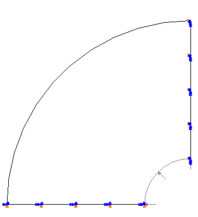
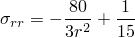
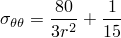
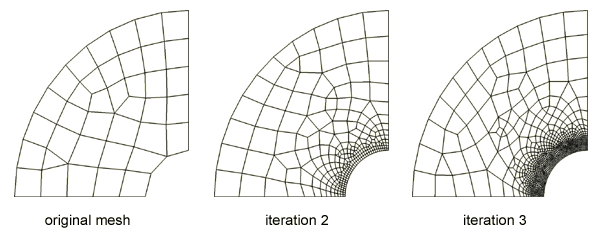

# 3.22.1 Pressurized thick-walled cylinder

**Products: **Abaqus/Standard  Abaqus/CAE  

### Elements tested

C3D10M    CPE3    CPE4R    CPE6    CPE8    

### Features tested

- Iterative mesh optimization using Abaqus/CAE and Abaqus/Standard.
- Error indicator variables in Abaqus/Standard.

### Problem description

This verification problem considers the case of pressure applied to a thick-walled linear elastic cylinder. The problem, which has a simple closed-form solution, is used to verify the iterative mesh optimization procedure.

**Model: **

All tests consider a quarter-symmetry model of an infinite extent cylinder with an internal radius of 5 and an external radius of 20. Appropriate symmetry boundary conditions are imposed on the horizontal and vertical surfaces (see [Figure 3.22.1--1](ch03s22abv270.md#ver-prc-adaptivity-cylindergeometry)).

**Mesh: **

Adaptivity is used to achieve a final mesh that attempts to reach a target error uniformly. The initial mesh is created with various Abaqus/CAE meshing techniques based on uniform seeding.

**Material: **

The stress distribution in the cylinder is independent of choice of linear elastic material properties; hence, a simple modulus of 1000 and a Poisson's ratio of 0.3 are used.

**Boundary conditions: **

Symmetry boundary conditions are applied.

**Loading: **

A unit pressure is applied to the cylinder interior.

**Error indicators: **

The following error indicator variables are tested:
- ENDENERI
- MISESERI

**Sizing methods: **

The following sizing methods are tested:
- Uniform method
- Minimum/maximum method

**Figure 3.22.1–1** Thick cylinder model.

### Results and discussion

The radial and circumferential stress, as well as their radial gradients, vary through the thickness of the cylinder, resulting in a finite element error in stress that varies radially for a uniform initial mesh. Hence, we expect that an optimized mesh, one that results in a radially uniform error, will have a radially varying mesh density.

For the geometry and loading the exact solution for this problem is

Results are shown in this section for a sequence of plane strain quadrilateral meshes adaptively meshed according to an ENDENERI error indicator variable and the minimum/maximum method sizing approach. Many more element, meshing, and sizing methods are tested in this section; most results, however, are similar to this representative case.

#### Adaptive remeshing

You can see the progression of meshes in [Figure 3.22.1--2](ch03s22abv270.md#ver-prc-adaptivity-cylindermesh). Since the gradient in stresses, and consequently the solution error, is higher toward the inside radius, the mesh refinement focuses on the inside radius.

**Figure 3.22.1–2** Mesh refinement progression.

#### Error measures

For each verification problem and mesh iteration the following are calculated:
- The element count for the iteration.
- The computed error indicator.
- The true solution error in , computed as both a global norm and a peak error.

As you can see from the representative case in [Table 3.22.1--1](ch03s22abv270.md#table-adaptivity-cylinder), the measure of true error tends to converge more rapidly than the error indicator value.

**Table 3.22.1–1** Error measures and indicators.
| Iteration | Element count | Error indicator | Error measure | Peak error |
| --- | --- | --- | --- | --- |
| 1 | 38 | 0.479 | 0.095 | 0.055 |
| 2 | 272 | 0.174 | 0.016 | 0.033 |
| 3 | 1014 | 0.146 | 0.012 | 0.016 |

### Files

Input files are in the form of Python scripts that you can run in Abaqus/CAE and a user subroutine file that computes the true error at each material point. The scripts will create the model and run an adaptivity analysis sequence of jobs. The input files are named according to a convention that reflects various parameter settings.

##### **Plane strain elements**

[adaptcyl_cpe4r_E_GL240.py](../eif/adaptcyl_cpe4r_E_GL240.py)

Quadrilateral dominant mesh with CPE4R and CPE3 elements. ENDENERI error indicator. Mimimum/maximum sizing method with 40% target on low-stress errors and a 2% target on high-stress errors.

[adaptcyl_cpe8_M_E2.py](../eif/adaptcyl_cpe8_M_E2.py)

Quadrilateral dominant mesh with CPE8 and CPE6 elements. MISESERI error indicator. Mimimum/maximum sizing method with 2% target on low-stress errors and a 0.1% target on high-stress errors.

##### **Three-dimensional elements**

[adaptcyl_c3d10m_E_U5.py](../eif/adaptcyl_c3d10m_E_U5.py)

Tetrahedral mesh with C3D10M elements. ENDENERI error indicator. Uniform sizing method with 5% target error.

##### **User subroutine file**

[adaptivity-cylinder.f](../eif/adaptivity-cylinder.f)

User subroutines [`UVARM`](../sub/sub-link.md#sub-xsl-uvarm) and [`UEXTERNALDB`](../sub/sub-link.md#sub-xsl-uexternaldb), which calculate the actual error at each material point and report global norms of error.

### Reference

Timoshenko,  S. P., and J. N. Goodier, Theory of Elasticity, McGraw-Hill, 1951.

