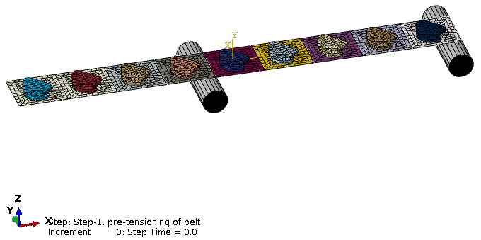

# 3.25.1 介质传输

**产品：** Abaqus/Standard  Abaqus/Explicit  

### I. 使用从Abaqus/Standard到Abaqus/Explicit导入的介质传输分析

### 测试的元素

C3D8R  

M3D4R  

### 问题描述

本节的验证测试是由使用M3D4R和C3D8R单元建模的九个块组成的周期性介质的介质传输分析。膜单元用于建模传送带，砖单元用于建模传送带顶部的包裹。包裹通过绑定约束绑定到传送带。该模型使用Abaqus/Standard进行预拉伸，然后导入到Abaqus/Explicit，在那里定义并激活周期性介质。传送带在Abaqus/Explicit分析开始时通过规定均匀初始速度开始运动。模型如图3.25.1-1所示。

**图3.25.1-1** 周期性介质传输分析。

由于周期性介质分析技术在Abaqus/Standard中不可用，块之间的绑定必须使用绑定约束显式定义，入口和出口处的边界条件必须直接在节点上定义。此外，入口块的前端节点必须被约束为具有与入口后端相应节点相同的位移。这通过在相应节点之间定义方程约束来实现，该约束强制y方向位移相等。传送带通过固定入口节点并在x方向上位移出口节点来拉伸。

在Abaqus/Explicit分析中，使用单元集和节点集定义周期性介质。添加了两个滚子，传送带和滚子之间定义了通用接触。入口和出口控制节点在y和z方向上固定，在x方向上给定速度1000。所有传送带和包裹节点在x方向上给定初始速度1000。当入口块的后端通过触发平面时，块洗牌发生。触发平面位于x坐标-200处，法向为x方向。

### 结果与讨论

传送带在Abaqus/Standard分析中被拉伸，应力状态和变形构型被正确导入到Abaqus/Explicit。在Abaqus/Explicit分析中，传送带在稳态方式下通过处理区移动，同时保持拉伸的应力状态。即使当入口块通过触发平面时，块被洗牌，应力状态几乎保持不变。

### 输入文件

##### **Abaqus/Standard分析文件**

[belt_standard.inp](../eif/belt_standard.inp)

第一个Abaqus/Standard分析。

##### **Abaqus/Explicit分析文件**

[belt_explicit.inp](../eif/belt_explicit.inp)

第二个Abaqus/Explicit导入分析。

### II. 使用Abaqus/Explicit的多步介质传输分析

### 测试的元素

M3D4R  

### 问题描述

本节的验证测试与上一节描述的模型相同，只是预拉伸步骤直接在Abaqus/Explicit分析中定义，包裹使用内聚接触而不是绑定约束固定到传送带。周期性介质在预拉伸步骤期间处于非活动状态。通过在入口和出口控制节点上施加不同幅度的速度边界条件来实现拉伸。然而，一个幅值在步骤开始时开始斜升，另一个延迟0.2秒。在步骤结束时，入口和出口控制节点具有均匀的速度边界条件。周期性介质在第二步中被激活，允许当入口块的后端通过触发平面时进行块洗牌。模型如图3.25.1-1所示。

### 结果与讨论

入口和出口速度的不匹配在第一步中正确产生拉伸的应力状态。在第二步中，速度是恒定的，传送带在稳态方式下通过处理区移动。即使当入口块通过触发平面时，块被洗牌，应力状态几乎保持不变。

### 输入文件

[belt_two_step.inp](../eif/belt_two_step.inp)

两步Abaqus/Explicit分析。

