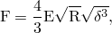
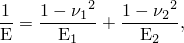
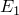
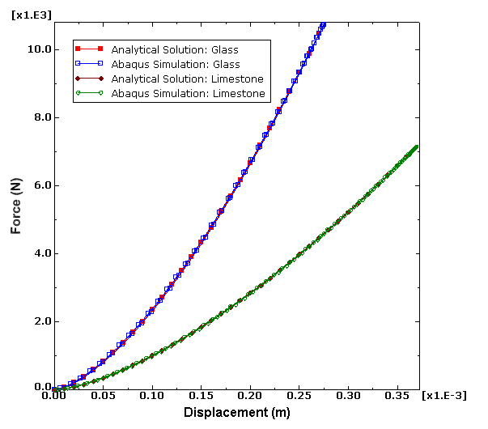
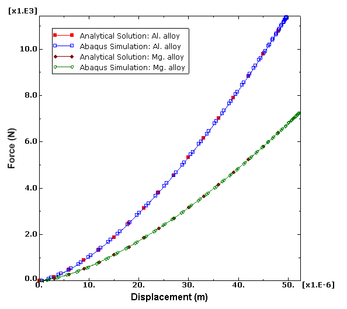
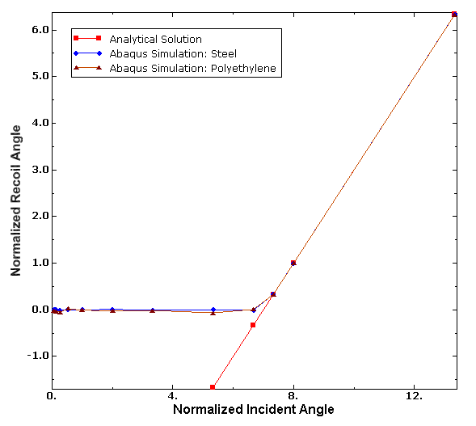
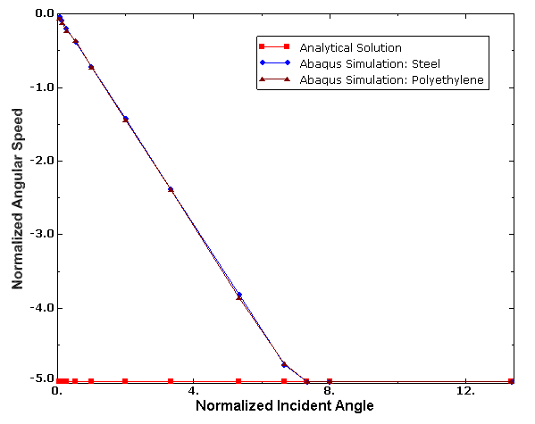
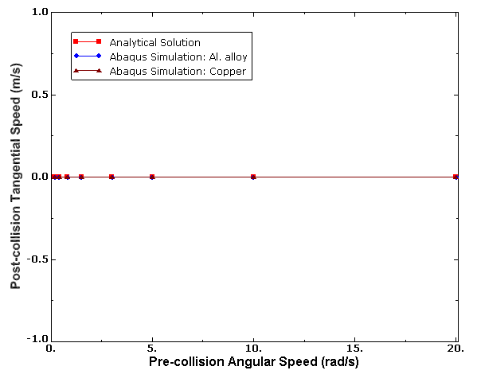
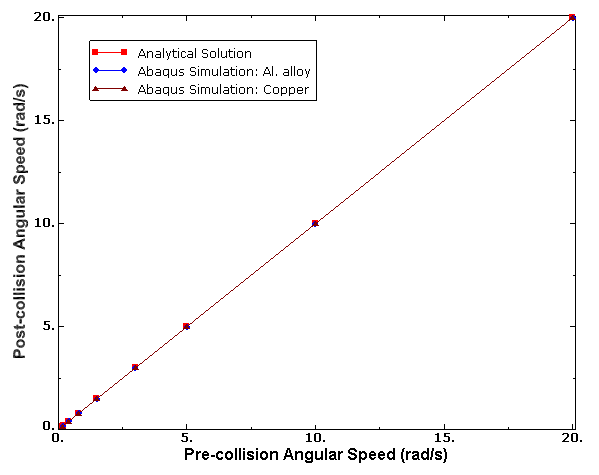
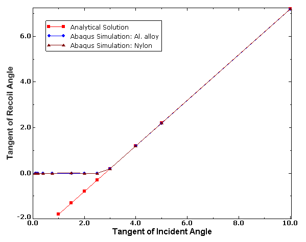

# 3.26.1 离散单元方法分析

**产品：** Abaqus/Explicit  

### 测试的元素

PD3D

### 测试的特征

接触相互作用：
- 两个离散粒子单元之间，以及
- 离散粒子单元与刚性平面之间。

### 问题描述

Abaqus/Explicit中的法向和切向接触公式与基于Hertzian接触公式与摩擦的解析结果在五个测试中进行比较（见Chung, 2011）。

**表3.26.1-1** 验证离散粒子单元法向和切向接触公式的五种测试。

|  | 接触描述 | 测试的特征 |
| --- | --- | --- |
| 测试1 | 两个相同球体的弹性正面碰撞 | 两个球体之间的弹性正面接触 |
| 测试2 | 球体与刚性平面的弹性正撞击 | 球体与平面之间的弹性正接触 |
| 测试3 | 球体以恒定正速度和入射角撞击固定刚性平面 | 球体与平面之间的切向接触 |
| 测试4 | 两个相同球体以相同的平移速度但相等且相反的角速度正面碰撞 | 两个球体之间的切向接触 |
| 测试5 | 两个具有不同平移和角速度的不同球体正面碰撞 | 两个球体之间的切向接触 |

这五个测试表征了离散粒子单元之间以及离散粒子单元与刚性平面之间的不同撞击场景。

**模型：**

**测试1**：两个半径为0.01 m的相同球体以相等且相反的平移速度正面碰撞。

**测试2**：半径为0.1 m的球体以平移速度在正方向撞击固定刚性平面。

**测试3**：固定刚性平面与半径为1.00×10^-5 m的球体之间以恒定正速度和变化的入射角撞击。此测试涉及一系列模拟，每个模拟具有不同的球体切向速度以表征特定入射角。

**测试4**：两个半径为0.1 m的相同球体以相同的平移速度但具有相等且相反的角速度正面碰撞。此测试涉及一系列模拟，每个模拟具有不同的球体角速度。

**测试5**：两个具有不同平移和角速度的不同尺寸球体正面碰撞。半径为0.1 m的球体具有平移和角速度；另一个球体大五倍，密度大1000倍，最初静止。该测试有多个模拟，每个模拟具有较小球体的不同角速度。

**网格：**

所有测试中的球体使用离散粒子单元（PD3D）建模，刚性平面（如适用）使用常规壳单元（S4R）建模，使其成为刚性的。

**材料：**

五个测试都使用两种不同的材料进行，如表3.26.1-2所述。

**表3.26.1-2** 球体材料属性。

|  | 属性 | 杨氏模量（GPa） | 泊松比 | 密度（kg/m3） |
| --- | --- | --- | --- | --- |
| 测试1 | 玻璃 | 48.0 | 0.20 | 2800 |
| 石灰石 | 20.0 | 0.25 | 2500 |
| 测试2 | 铝合金 | 70.0 | 0.30 | 2699 |
| 镁合金 | 40.0 | 0.35 | 1800 |
| 测试3 | 钢 | 208 | 0.30 | 7850 |
| 聚乙烯 | 1.0 | 0.40 | 1400 |
| 测试4 | 铝合金 | 70.0 | 0.33 | 2700 |
| 铜 | 120 | 0.35 | 8900 |
| 测试5 | 铝合金 | 70 | 0.33 | 2700* |
| 尼龙 | 2.5 | 0.40 | 1000* |

*较小球体的密度。较大球体密度大1000倍。

**边界条件：**

在适用的情况下，刚性平面在所有自由度上固定。

**初始条件：**

在所有测试中，给球体规定的初始平移和角速度（如适用），如表3.26.1-3所述。

**表3.26.1-3** 球体初始速度。

|  | 初始平移速度（m/s） | 初始角速度（rad/s） |
| --- | --- | --- |
| 测试1 | 10.0 | --- |
| 测试2 | 0.2 | --- |
| 测试3 | 5.0 | 0.1, 0.2, 0.4, 0.8, 1.5, 3.0, 5.0, 8.0, 10.0, 11.0, 12.0, 20.0 |
| 测试4 | 0.2 | 0.175, 0.4, 0.8, 1.5, 3.0, 5.0, 10.0, 20.0 |
| 测试5* | 0.2 | 0.175, 0.25, 0.4, 0.8, 1.5, 3.0, 4.0, 5.0, 6.0, 8.0, 10.0, 20.0 |

*较小球体的初始速度。较大球体静止。

**接触公式：**

使用Abaqus/Explicit中的通用接触公式。接触使用表格压力-闭合关系强制。由于离散单元的接触面积为 unity，压力-闭合关系实际上是作为通过Hertzian接触关系与摩擦计算的力量-穿透数据给出的：

其中

F是接触力，是穿透，和是两个球体的半径，和是杨氏模量，和是两个球体材料的泊松比。刚性平面通过使用大半径和一个球体的杨氏模量在Hertzian接触关系中近似。

每个测试的切向接触行为的摩擦系数如表3.26.1-4所列。

**表3.26.1-4** 摩擦系数。

|  | 摩擦系数 |
| --- | --- |
| 测试1 | 0.35 |
| 测试2 | 0.00 |
| 测试3 | 0.30 |
| 测试4 | 0.40 |
| 测试5 | 0.40 |

所有测试中不存在接触阻尼；因此，正方向碰撞的恢复系数为1.0，而摩擦是唯一的能量耗散源。

### 结果与讨论

| **测试1** | 对于两种材料和解析结果，将弹性接触力与穿透绘制（见图3.26.1-1）。将最大接触力、最大穿透和接触持续时间与解析结果进行比较（见Chung, 2011），如表3.26.1-5所示。**表3.26.1-5** 两个球体的正碰撞。 | 属性 | 玻璃 | 石灰石 | | --- | --- | --- | | Abaqus | 解析 | Abaqus | 解析 | | 接触持续时间（μs） | 40.85 | 40.34 | 54.65 | 54.20 | | 最大穿透（μm） | 274.87 | 274.11 | 369.06 | 368.30 | | 最大接触力（N） | 10741.3 | 10696.9 | 7130.2 | 7108.1 |
| --- | --- | --- | --- | --- | --- | --- | --- | --- | --- | --- | --- | --- | --- | --- | --- | --- | --- | --- | --- | --- | --- | --- | --- | --- | --- | --- | --- | --- | --- | --- | --- | --- | --- |
| 属性 | 玻璃 | 石灰石 |
| Abaqus | 解析 | Abaqus | 解析 |
| 接触持续时间（μs） | 40.85 | 40.34 | 54.65 | 54.20 |
| 最大穿透（μm） | 274.87 | 274.11 | 369.06 | 368.30 |
| 最大接触力（N） | 10741.3 | 10696.9 | 7130.2 | 7108.1 |
| **测试2** | 对于两种材料和解析结果，将弹性接触力与穿透绘制（见图3.26.1-2）。将最大接触力、最大穿透和接触持续时间与解析结果进行比较（见Chung, 2011），如表3.26.1-6所示。**表3.26.1-6** 球体与刚性平面的正碰撞。 | 属性 | 铝合金 | 镁合金 | | --- | --- | --- | | Abaqus | 解析 | Abaqus | 解析 | | 接触持续时间（μs） | 732 | 731.59 | 767 | 766.99 | | 最大穿透（μm） | 49.71 | 49.72 | 52.12 | 52.12 | | 最大接触力（N） | 11369.4 | 11370.8 | 7232.1 | 7232.0 |
| --- | --- | --- | --- | --- | --- | --- | --- | --- | --- | --- | --- | --- | --- | --- | --- | --- | --- | --- | --- | --- | --- | --- | --- | --- | --- | --- | --- | --- | --- | --- | --- | --- | --- |
| 属性 | 铝合金 | 镁合金 |
| Abaqus | 解析 | Abaqus | 解析 |
| 接触持续时间（μs） | 732 | 731.59 | 767 | 766.99 |
| 最大穿透（μm） | 49.71 | 49.72 | 52.12 | 52.12 |
| 最大接触力（N） | 11369.4 | 11370.8 | 7232.1 | 7232.0 |
| **测试3** | 对于每个模拟，计算球体的归一化入射角、归一化回弹角和归一化碰撞后角速度。归一化入射角是球体接触点的碰撞前相对切向速度与球体中心碰撞前相对正速度之比，再乘以摩擦系数。归一化碰撞后角速度是球体半径乘以碰撞后角速度，再除以球体的碰撞后正速度。图3.26.1-3显示了归一化回弹角与归一化入射角的关系图，与解析结果进行比较。归一化回弹角是球体接触点的碰撞后相对切向速度与球体中心碰撞后相对正速度之比，再乘以摩擦系数。图3.26.1-4显示了归一化碰撞后角速度与归一化入射角的关系图，与解析结果进行比较。图3.26.1-3和图3.26.1-4中的图显示，初始切向速度达到阈值之前持续粘附，超过阈值后，在碰撞过程中发生滑动。 |
| **测试4** | 图3.26.1-5显示了球体初始角速度与计算得到的碰撞后接触点切向速度的关系图，与解析结果进行比较。在图3.26.1-6中，碰撞后角速度与球体初始角速度绘制在一起，与解析结果进行比较。由于两个球体的角速度相同但旋转方向相反，在碰撞过程中没有相对滑动发生；因此，碰撞后切向速度不存在。初始和最终角速度之间的比较表明，由于相对滑动不存在，该模型中摩擦没有能量耗散。 |
| **测试5** | 对于每个模拟，评估碰撞和回弹角的正切。回弹角是碰撞后球体接触点的相对切向速度与球体中心的相对正速度之比。入射角是碰撞前相同量的评估。图3.26.1-7显示了回弹角正切与入射角正切的关系图。与测试3一样，低于某个阈值角速度，较小的球体粘附到较大的球体。超过此阈值，在碰撞过程中发生滑动。 |

### 输入文件

[normal_identical_part_part.inp](../eif/normal_identical_part_part.inp)

测试1：两个相同球体的弹性正面碰撞。

[normal_part_face.inp](../eif/normal_part_face.inp)

测试2：球体与刚性平面的弹性正撞击。

[oblique_part_face.inp](../eif/oblique_part_face.inp)

测试3：球体以恒定正速度和入射角撞击固定刚性平面。

[normal_oppspin_identical_part_part.inp](../eif/normal_oppspin_identical_part_part.inp)

测试4：两个相同球体以相同的平移速度但具有相等且相反的角速度正面碰撞。

[normal_spin_part_part.inp](../eif/normal_spin_part_part.inp)

测试5：两个具有不同平移和角速度的不同球体正面碰撞。

### 参考

Chung,  Y. C., and J. Y. Ooi, "Benchmark Tests for Verifying Discrete Element Modelling Codes at Particle Impact Level," Granular Matter, vol. 13, pp. 643-656, 2011.

### 图表

**图3.26.1-1** 两个球体碰撞的接触力与穿透。

**图3.26.1-2** 球体与刚性平面碰撞的接触力与穿透。

**图3.26.1-3** 归一化回弹角与归一化入射角。

**图3.26.1-4** 归一化碰撞后角速度与归一化入射角。

**图3.26.1-5** 碰撞后切向速度与碰撞前角速度。

**图3.26.1-6** 碰撞后角速度与碰撞前角速度。

**图3.26.1-7** 较小球体入射角正切与回弹角正切。

