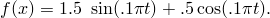

# 4.1.2 DISP

### 4.1.2 [`DISP`](../sub/sub-link.md#sub-xsl-disp)

**产品：**Abaqus/Standard  

### 测试单元

T3D2

### 测试功能

用于提供规定节点行为（位移、速度和加速度）的用户子程序。

### 问题描述

在一个动态分析中使用一维桁架单元构建的直段。模型在节点2、3和4（节点TRUSS.3、TRUSS.5和TRUSS.7，在部件实例装配中定义的模型）处使用用户子程序[`DISP`](../sub/sub-link.md#sub-xsl-disp)规定边界条件，而在节点5、6和7（TRUSS.9、TRUSS.11和TRUSS.13）处使用幅值定义规定边界条件。在节点2和5（TRUSS.3和TRUSS.9）规定位移变化，在节点3和6（TRUSS.5和TRUSS.11）规定速度变化，在节点4和7（TRUSS.7和TRUSS.13）规定加速度变化。规定的变化为

对于使用[`DISP`](../sub/sub-link.md#sub-xsl-disp)规定的变化，必须在子程序中包含适当的导数和积分。对于幅值规定，Abaqus自动执行必要的微分和积分。两种方法中规定的变化相同，因此结果也应该相同。

### 结果与讨论

可以绘制节点自由度的响应，以表明用户子程序[`DISP`](../sub/sub-link.md#sub-xsl-disp)提供了与幅值描述相同的历史记录。

### 输入文件

[udispxxx.inp](../eif/udispxxx.inp)

此分析的输入文件。

[udispxxx.f](../eif/udispxxx.f)

udispxxx.inp中使用的用户子程序[`DISP`](../sub/sub-link.md#sub-xsl-disp)。

[udispxxx_part1.inp](../eif/udispxxx_part1.inp)

此分析的输入文件，模型以部件实例装配的形式定义。此文件引用使用实用程序例程`GETPARTINFO`的用户子程序[`DISP`](../sub/sub-link.md#sub-xsl-disp)。

[udispxxx_part1.f](../eif/udispxxx_part1.f)

udispxxx_part1.inp中使用的用户子程序[`DISP`](../sub/sub-link.md#sub-xsl-disp)（说明实用程序例程`GETPARTINFO`的使用）。

[udispxxx_part2.inp](../eif/udispxxx_part2.inp)

此分析的输入文件，模型以部件实例装配的形式定义。此文件引用使用实用程序例程`GETINTERNAL`的用户子程序[`DISP`](../sub/sub-link.md#sub-xsl-disp)。

[udispxxx_part2.f](../eif/udispxxx_part2.f)

udispxxx_part2.inp中使用的用户子程序[`DISP`](../sub/sub-link.md#sub-xsl-disp)（说明实用程序例程`GETINTERNAL`的使用）。

