# 4.1.4 FRIC

### 4.1.4 [`FRIC`](../sub/sub-link.md#sub-xsl-fric)

**产品：**Abaqus/Standard  

### I. 在应力/位移分析中测试的用户子程序

### 测试单元

B31

### 测试功能

用于在应力/位移分析中定义接触面摩擦行为的用户子程序。

### 问题描述

Abaqus提供了库仑摩擦模型作为摩擦界面的默认行为。在此测试中使用了一种替代的本构模型。这里，界面被认为具有粘塑性行为，因此滑移应变率与剪应力成正比。对于这个特定示例

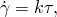

其中k=0.001。

使用一个相当刚性的梁单元来模拟杆。杆底部与三维刚性表面之间的接触通过指定主-从接触对来模拟。杆的底部构成基于节点的从表面，而刚性表面代表主表面。刚性表面在整个分析过程中保持空间固定，对应于x-y平面。该配置如图4.1.4-1所示。垂直于刚性表面（即平行于z轴）的杆，被迫与刚性表面接触，并通过在杆顶部沿轴向施加集中载荷而保持压缩。随后，通过施加如下形式的集中载荷向量

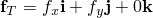

来迫使杆沿表面滑动。该节点上的所有旋转也被约束。

分析的前两个步骤建立了平衡解，其中梁单元被100的力压缩。然后分三个步骤（步骤3-5）滑动杆，每个步骤的总时间为1。在每个步骤中瞬时施加范数为100的切向力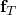，以保持剪应力向量的范数恒定。在这三个步骤中，检查增量滑移向量和界面剪应力与假设本构定律的一致性。

**图4.1.4-1** 用户子程序[`FRIC`](../sub/sub-link.md#sub-xsl-fric)第一个测试模型的示意图。

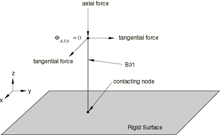

### 参考解

**步骤3：**

施加恒定的切向力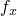=100和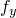=0。由于沿该轴施加的剪应力保持恒定值为100，因此此步骤结束时的总滑移沿x轴为0.1。

**步骤4：**

施加恒定的切向力==70.71。由于沿每个方向施加的剪应力保持恒定值为70.71，因此此步骤结束时的总滑移在x方向为0.17071，在y方向为0.07071。

**步骤5：**

施加恒定的切向力=0和=100。由于沿y轴施加的剪应力保持恒定值为100，因此此步骤结束时的总滑移在每个方向上为0.17071。

### 结果与讨论

结果与步骤3、4和5的解析解相符。

### 输入文件

[ufricxxx.inp](../eif/ufricxxx.inp)

应力/位移分析。

[ufricxxx.f](../eif/ufricxxx.f)

ufricxxx.inp中使用的用户子程序[`FRIC`](../sub/sub-link.md#sub-xsl-fric)。

### II. 在耦合温度-位移分析中测试的用户子程序

### 测试单元

C3D8T

### 测试功能

用于在耦合温度-位移分析中定义接触面摩擦行为的用户子程序。

### 问题描述

在此测试中，接触界面被认为具有粘塑性行为，因此滑移应变率与界面的剪应力和平均温度成正比。对于这个特定示例

其中 0.001 + 0.00001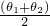，而和分别代表从表面和主表面节点的当前温度。

如图4.1.4-2所示，在两个实心块A和B之间定义接触。

**图4.1.4-2** 用户子程序[`FRIC`](../sub/sub-link.md#sub-xsl-fric)第二个测试模型的示意图。

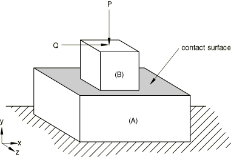

块A的底部在空间中固定。分析由一系列步骤组成，旨在验证接触条件以及由于用户定义的摩擦条件产生的摩擦热。材料特性以及不同的边界条件载荷的选择使得解析解可以容易地得出。

在步骤1中，建立了块A和块B之间的接触。

在步骤2中，通过在块B的顶面施加向下的力P=16000来维持两个块之间的接触。在这两个步骤中，每个块的温度保持在0。

步骤3验证摩擦定律是否正确施加，以及是否产生了适当的热量。块B通过瞬时施加x方向的剪切载荷Q=100而在块A上滑动。块B的温度从0升高到200，同时保持块A的温度为0。在滑动过程中，块A的顶面被固定以保持接触面垂直于y轴。假设50%的摩擦功转化为热量，而50%的热量通过每个接触面。在此第三步骤中，检查增量滑移向量、界面剪应力和产生的热量与假设本构定律的一致性。

### 参考解

在第三步骤结束时，通过积分滑移率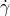可得总滑移

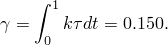

在Abaqus中，这种积分不是以连续方式进行的，而是通过将总时间离散为给定间隔来进行的，得出形式

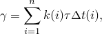

如果将单位时间分成10个相等的间隔，则得到总滑移为0.155。

每个间隔中由摩擦产生的热量为

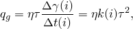

其中=0.5和=100。这个量的一半通过每个接触面。

### 结果与讨论

步骤3在10个相等的增量中在单位时间周期内进行。因此，获得总滑移为0.155。当将单位时间分成更多增量时，获得更接近0.150的值。在步骤3结束时每个增量获得的结果也与通过对每个时间间隔分析求和滑移获得的结果相符。

### 输入文件

[ufricxxy.inp](../eif/ufricxxy.inp)

耦合温度-位移分析。

[ufricxxy.f](../eif/ufricxxy.f)

ufricxxy.inp中使用的用户子程序[`FRIC`](../sub/sub-link.md#sub-xsl-fric)。

