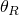

# 4.1.17 UFLUID

### 4.1.17 [`UFLUID`](../sub/sub-link.md#sub-xsl-ufluid)

**产品：**Abaqus/Standard  

### 测试功能

本节为使用流体腔体能力在Abaqus/Standard中生成的流体单元相关的流体行为提供基本验证测试。

### 测试单元

F2D2、SPRING1

### 测试功能

用于为理想气体定义流体密度和流体顺应的用户子程序。

### 问题描述

流体使用尺寸为1×1、单位厚度的二维流体块进行建模。用户定义的流体被建模为具有以下特性的理想气体：

| 环境压力， = 14.7 |
| --- |
| 绝对零温度， = 460. |
| 参考密度， = 10.0 |
| 密度的参考压力， = 0. |
| 密度的参考温度， = 200. |

**载荷：**

执行以下五个步骤：

1. 加载流体以产生100.0单位的压力。
2. 将流体温度升高到300.0。
3. 添加规定量的流体。
4. 移除规定量的流体。
5. 将流体温度降低到200.0。

### 结果与讨论

结果与精确解相符。

### 输入文件

[ufluidxx.inp](../eif/ufluidxx.inp)

此分析的输入文件。

[ufluidxx.f](../eif/ufluidxx.f)

ufluidxx.inp中使用的用户子程序[`UFLUID`](../sub/sub-link.md#sub-xsl-ufluid)。

