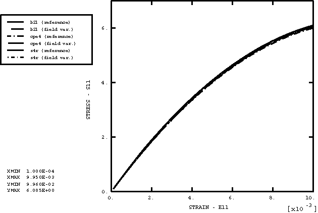

# 4.1.24 USDFLD

### 4.1.24 [`USDFLD`](../sub/sub-link.md#sub-xsl-usdfld)

**产品：**Abaqus/Standard  

### 测试单元

B21、CPE4、DC1D2、DC2D4、DS4、S4、S4R

### 测试功能

用于在材料点重新定义场变量的用户子程序。

### 问题描述

这组测试验证当值在运行时重新定义时，场变量值被正确传递到结构。在每个实例中，具有解变量（如温度或等效塑性应变）依赖性的Abaqus材料模型通过场变量依赖性实现。在运行时基于来自前一个增量的解值计算适当的场值。每个用户定义的场变量模型都根据等效的Abaqus材料模型进行检查。

选择 hypoelastic材料模型作为静力和动力分析中小应变的非线性弹性行为的基础。由于Abaqus不提供 hypoelastic切线模量对场变量的依赖性，因此使用具有等效割线模量的弹性材料来实现。

### 结果与讨论

用户场变量方法和相应Abaqus模型之间获得了非常接近的匹配。[图4.1.24-1](ch04s01abv299.md#verusdfld-comparemodels)显示了hypoelastic模型在静力分析中的比较。通过使用Abaqus/CAE可视化模块中的时间历史绘图能力，可以获得其他文件的类似匹配。

由于场变量方法使用前一个增量的值，随着时间增量减小，解决方案应该改进。整个过程中都观察到了这种趋势。

### 输入文件

[udfcd1hs.inp](../eif/udfcd1hs.inp)

稳态热传递分析，DC1D2单元。

[udfcd1hs.f](../eif/udfcd1hs.f)

udfcd1hs.inp中使用的用户子程序[`USDFLD`](../sub/sub-link.md#sub-xsl-usdfld)。

[udfcd1ht.inp](../eif/udfcd1ht.inp)

瞬态热传递分析，DC1D2单元。

[udfcd1ht.f](../eif/udfcd1ht.f)

udfcd1ht.inp中使用的用户子程序[`USDFLD`](../sub/sub-link.md#sub-xsl-usdfld)。

[udfcd2hs.inp](../eif/udfcd2hs.inp)

稳态热传递分析，DC2D4单元。

[udfcd2hs.f](../eif/udfcd2hs.f)

udfcd2hs.inp中使用的用户子程序[`USDFLD`](../sub/sub-link.md#sub-xsl-usdfld)。

[udfcd2ht.inp](../eif/udfcd2ht.inp)

瞬态热传递分析，DC2D4单元。

[udfcd2ht.f](../eif/udfcd2ht.f)

udfcd2ht.inp中使用的用户子程序[`USDFLD`](../sub/sub-link.md#sub-xsl-usdfld)。

[udfcdshs.inp](../eif/udfcdshs.inp)

稳态热传递分析，DS4单元。

[udfcdshs.f](../eif/udfcdshs.f)

udfcdshs.inp中使用的用户子程序[`USDFLD`](../sub/sub-link.md#sub-xsl-usdfld)。

[udfcdsht.inp](../eif/udfcdsht.inp)

瞬态热传递分析，DS4单元。

[udfcdsht.f](../eif/udfcdsht.f)

udfcdsht.inp中使用的用户子程序[`USDFLD`](../sub/sub-link.md#sub-xsl-usdfld)。

[udfebxdx.inp](../eif/udfebxdx.inp)

动态分析，弹性，B21单元。

[udfebxdx.f](../eif/udfebxdx.f)

udfebxdx.inp中使用的用户子程序[`USDFLD`](../sub/sub-link.md#sub-xsl-usdfld)。

[udfebxsx.inp](../eif/udfebxsx.inp)

静力分析，弹性，B21单元。

[udfebxsx.f](../eif/udfebxsx.f)

udfebxsx.inp中使用的用户子程序[`USDFLD`](../sub/sub-link.md#sub-xsl-usdfld)。

[udfecxdx.inp](../eif/udfecxdx.inp)

动态分析，弹性，CPE4单元。

[udfecxdx.f](../eif/udfecxdx.f)

udfecxdx.inp中使用的用户子程序[`USDFLD`](../sub/sub-link.md#sub-xsl-usdfld)。

[udfecxsx.inp](../eif/udfecxsx.inp)

静力分析，弹性，CPE4单元。

[udfecxsx.f](../eif/udfecxsx.f)

udfecxsx.inp中使用的用户子程序[`USDFLD`](../sub/sub-link.md#sub-xsl-usdfld)。

[udfesxdx.inp](../eif/udfesxdx.inp)

动态分析，弹性，S4R单元。

[udfesxdx.f](../eif/udfesxdx.f)

udfesxdx.inp中使用的用户子程序[`USDFLD`](../sub/sub-link.md#sub-xsl-usdfld)。

[udfesxsx.inp](../eif/udfesxsx.inp)

静力分析，弹性，S4/S4R单元。

[udfesxsx.f](../eif/udfesxsx.f)

udfesxsx.inp中使用的用户子程序[`USDFLD`](../sub/sub-link.md#sub-xsl-usdfld)。

[udfpbxsf.inp](../eif/udfpbxsf.inp)

随后进行频率分析的静力分析，弹塑性，B21单元。

[udfpbxsf.f](../eif/udfpbxsf.f)

udfpbxsf.inp中使用的用户子程序[`USDFLD`](../sub/sub-link.md#sub-xsl-usdfld)。

[udfpcxsf.inp](../eif/udfpcxsf.inp)

随后进行频率分析的静力分析，弹塑性，CPE4单元。

[udfpcxsf.f](../eif/udfpcxsf.f)

udfpcxsf.inp中使用的用户子程序[`USDFLD`](../sub/sub-link.md#sub-xsl-usdfld)。

[udfpsxsf.inp](../eif/udfpsxsf.inp)

随后进行频率分析的静力分析，弹塑性，S4/S4R单元。

[udfpsxsf.f](../eif/udfpsxsf.f)

udfpsxsf.inp中使用的用户子程序[`USDFLD`](../sub/sub-link.md#sub-xsl-usdfld)。

### 图

**图4.1.24-1** Hypoelastic模型比较。

