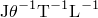

# 4.1.37 VUINTERACTION

### 4.1.37 [`VUINTERACTION`](../sub/sub-link.md#sub-xsl-vuinteraction)

**Product: **Abaqus/Explicit  

### Feature tested

User subroutine to specify stress and heat flux between contacting surfaces when using general contact.

### Problem description

User subroutine [`VUINTERACTION`](../sub/sub-link.md#sub-xsl-vuinteraction) used in this example models a mechanically compliant, thermally conductive interface material with uniform thickness. The interface material is assumed to be bonded to each of two contacting surfaces. The interface material exhibits elastic-plastic behavior with linear hardening in the normal contact direction and purely elastic resistance to relative sliding. Membrane straining of the interface does not affect the stress transmitted to the surfaces. The interface material is thermally conductive; and the conductance remains constant, independent of the gap or pressure at the interface.

Two simple configurations are used to test this user subroutine. In the first configuration each of two identical elastic bodies is modeled with a row of four elements. The second configuration is the same as the first configuration, but one row of elements is replaced by an analytical rigid surface. The bodies are initially parallel and bonded along the contact interface.

A complete list of properties specified for this interface model, in the order in which the values are specified on the second data line of the contact property definition, is as follows:

1. Gap cutoff distance. Only slave nodes with initial gaps less than this distance are bonded.
2. Young's modulus of the interface material.
3. Poisson's ratio of the interface material.
4. Initial yield stress in the normal direction of the interface material.
5. Hardening modulus in the normal direction of the interface material.
6. Interface thickness used in the strain calculations.
7. Thermal conductivity (units of ) of the interface material used for contact heat flux calculations.

### Load cases

In the purely mechanical analyses the interaction of the two elastic bodies is introduced through boundary conditions on the nodes away from the interface. Three separate loading conditions are applied to generate the following stress states in the interface: uniform normal stress without yielding, uniform shear stress, and nonuniform normal stress causing significant yielding at one end of the interface. For the first two cases the solution is compared with that of a reference model that uses a linear softening interface behavior available in Abaqus. For the last case with plasticity, the solution is compared with that of a reference model that uses subroutine [`VUINTER`](../sub/sub-link.md#sub-xsl-vuinter) for defining the interface response. In addition, for the last case a gap is introduced between the two elastic bodies to account for the thickness of the interface material.

In the thermo-mechanical analyses the two elastic bodies are held fixed with a gap between them. An initial temperature of 100 is given to one body; an initial temperature of 0 is given to the other body. The temperature differential causes heat flow between the bodies, resulting in a steady-state temperature of 50 in both bodies. The solution is compared to that obtained with the interface thermal conductance. 

### Tracking thickness and other issues specific to [`VUINTERACTION`](../sub/sub-link.md#sub-xsl-vuinteraction) functionality

 The two surfaces, identified for interaction, are tracked to identify those segments of these surfaces that are within a fixed distance, called tracking thickness, and those segments are made available in the user subroutine [`VUINTERACTION`](../sub/sub-link.md#sub-xsl-vuinteraction) for defining their interaction.  Hence, the tracking thickness must be set greater or equal to the maximum anticipated interface material thickness. 

 The state variables are associated with slave nodes and can be passed to user subroutine [`VUINTERACTION`](../sub/sub-link.md#sub-xsl-vuinteraction) multiple times within an increment as a given slave node may be within tracking distance to multiple master facets. In the elastic-plastic analysis using [`VUINTERACTION`](../sub/sub-link.md#sub-xsl-vuinteraction), two state variables are used to keep track of the current yield stress. During the solution the previous yield stress is read from state variable 1 and the new yield stress is written to state variable 2 for time increments that are odd;  the previous yield stress is read from state variable 2, and the new yield stress is written to state variable 1 for time increments that are even. This setup is incorporated to avoid using a state variable that has already been updated in the current time increment.

When thermal interaction is active between the surfaces, the heat fluxes are calculated by multiplying the thermal conductivity of the interface material with the temperature difference between the slave node and master contact point and dividing by the initial interface thickness. Effects such as heat generation due to friction are not taken into account.

### Results and discussion

Displacement results in the pure mechanical interaction models and the nodal temperature results in the themo-mechanical interaction models are compared to their respective reference solutions. The results agree for all cases.

### Input files

##### **Mechanical interaction between surfaces**

[vuinteraction_normal.inp](../eif/vuinteraction_normal.inp)

 Loading normal to the elastic interface.

[vuinteraction_normal.f](../eif/vuinteraction_normal.f)

User subroutine [`VUINTERACTION`](../sub/sub-link.md#sub-xsl-vuinteraction) used with vuinteraction_normal.inp.

[dfltpp3d_normal.inp](../eif/dfltpp3d_normal.inp)

 Reference model for comparison with results of vuinteraction_normal.inp.

[vuinteraction_shear.inp](../eif/vuinteraction_shear.inp)

 Loading tangential to the elastic interface.

[vuinteraction_shear.f](../eif/vuinteraction_shear.f)

User subroutine [`VUINTERACTION`](../sub/sub-link.md#sub-xsl-vuinteraction) used with vuinteraction_shear.inp.

[dfltpp3d_shear.inp](../eif/dfltpp3d_shear.inp)

 Reference model for comparison with results of vuinteraction_shear.inp.

[vuinteraction_rbody_normal.inp](../eif/vuinteraction_rbody_normal.inp)

 Same as vuinteraction_normal.inp except one of the two elastic bodies is made rigid.

[vuinteraction_rbody_normal.f](../eif/vuinteraction_rbody_normal.f)

User subroutine [`VUINTERACTION`](../sub/sub-link.md#sub-xsl-vuinteraction) used with vuinteraction_rbody_normal.inp.

[dfltpp3d_rbody_normal.inp](../eif/dfltpp3d_rbody_normal.inp)

 Reference model for comparison with results of vuinteraction_rbody_normal.inp.

[vuinteraction_plastic.inp](../eif/vuinteraction_plastic.inp)

 Loading normal to the elastic plastic interface.

[vuinteraction_plastic.f](../eif/vuinteraction_plastic.f)

[`VUINTERACTION`](../sub/sub-link.md#sub-xsl-vuinteraction) used with vuinteraction_plastic.inp.

[vuinter_plastic.inp](../eif/vuinter_plastic.inp)

 Reference model for comparison with results of vuinteraction_plastic.inp.

[vuinter_plastic.f](../eif/vuinter_plastic.f)

User subroutine [`VUINTER`](../sub/sub-link.md#sub-xsl-vuinter) used with vuinter_plastic.inp.

##### **Thermal interaction between surfaces**

[vuinteraction_heat.inp](../eif/vuinteraction_heat.inp)

 Heat transfer across the interface.

[vuinteraction_heat.f](../eif/vuinteraction_heat.f)

User subroutine [`VUINTERACTION`](../sub/sub-link.md#sub-xsl-vuinteraction) used with vuinteraction_heat.inp.

[dfltpp3d_heat.inp](../eif/dfltpp3d_heat.inp)

 Reference model for comparison with results of vuinteraction_heat.inp.

