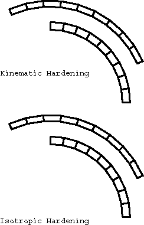
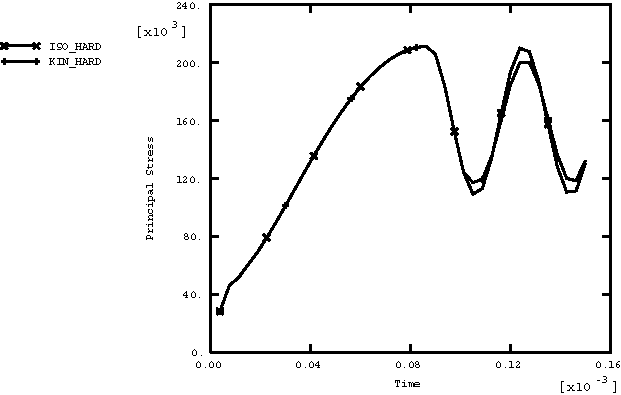
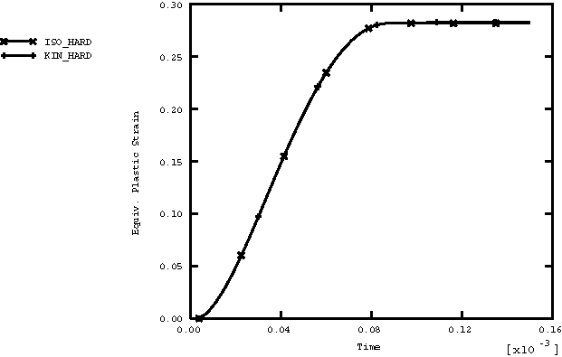
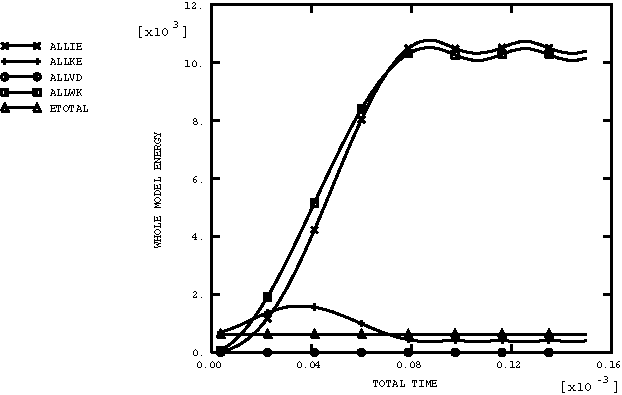
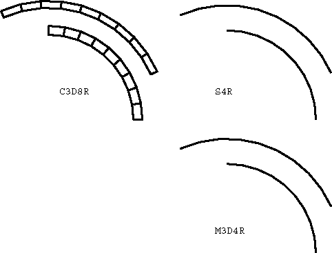
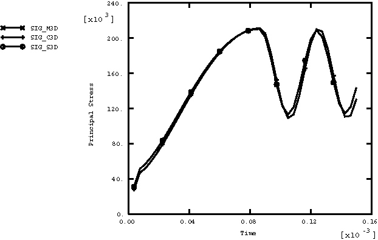
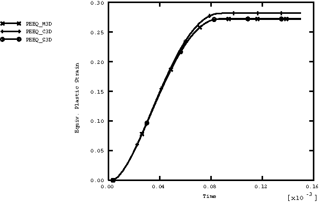
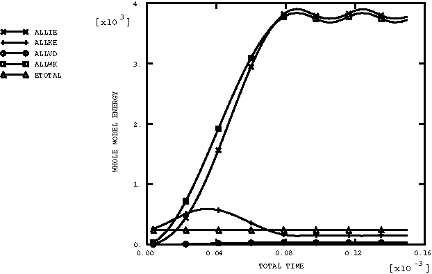

# 4.1.38 VUMAT：旋转圆柱体

### 4.1.38 [`VUMAT`](../sub/sub-link.md#sub-xsl-vumat)：旋转圆柱体

**产品：**Abaqus/Explicit  

### 测试的单元

CPE4R    C3D8R    M3D4R    S4R    

### 测试的功能

大变形运动学、带应变硬化的弹塑性材料、用户材料、多点约束。

### 问题描述

旋转圆柱体问题由 [Longcope 和 Key (1977)](ch04s01abv313.md#ver-ref-longcope) 提出，作为一种练习有限旋转算法的方法。在这个问题中，建模了一个具有 4000 rad/sec 初始角速度和零初始应力状态的圆柱体。（这在物理上是不可能的，因为体力在此角速度下会产生应力场。然而，这些初始条件是可以接受的，因为这只是一个数值实验。）圆柱体的内侧承受 67.3 MPa（9760 psi）压力的瞬时施加。

弹性材料属性定义为：杨氏模量 71 GPa（1.03×10⁷ psi），泊松比 0.3333，密度 2680 kg/m³（2.508×10⁴ lb sec²/in⁴）。使用具有 286 MPa（4.15×10⁴ psi）初始屈服和 3.565 GPa（5.17×10⁵ psi）恒定硬化模量的等向硬化塑性模型。

仅使用约束方程和多点约束对圆环的四分之一进行建模，以施加重复对称边界条件。

在网格的每个材料点处定义局部圆柱坐标系。

### 结果与讨论

第一种情况是使用 CPE4R 单元的二维模型。在这种情况下，在同一问题中定义了两个网格，如图 [图 4.1.38--1](ch04s01abv313.md#exxrotcyl-mesh-2d) 所示。[图 4.1.38--1](ch04s01abv313.md#exxrotcyl-mesh-2d) 中的下方网格使用内置的 Mises 等向硬化塑性模型。[图 4.1.38--1](ch04s01abv313.md#exxrotcyl-mesh-2d) 中的上方网格使用具有 [Abaqus Analysis User's Guide](../usb/usb-link.md#usb) 中描述的随动硬化 Mises 模型的用户子程序 [`VUMAT`](../sub/sub-link.md#sub-xsl-vumat)。[图 4.1.38--2](ch04s01abv313.md#exxrotcyl-stress-v-time-2d) 显示了两种情况下二维模型中最大主应力随时间的变化。[图 4.1.38--3](ch04s01abv313.md#exxrotcyl-eps-v-time-2d) 显示了两种情况下二维模型中等效塑性应变随时间的变化。[图 4.1.38--4](ch04s01abv313.md#exxrotcyl-energyhist-2d) 显示了二维模型中的能量历史。在该分析中，能量历史特别重要，因为它表明在强制执行多点约束时没有能量损失。

第二种情况是同一问题的三维表示，使用壳单元、膜单元和块单元建模圆环，并使用适当的边界条件以紧密重现原始二维模型。使用内置的 Mises 等向硬化塑性模型。三维情况的网格如图 [图 4.1.38--5](ch04s01abv313.md#exxrotcyl-mesh-3d) 所示。[图 4.1.38--6](ch04s01abv313.md#exxrotcyl-stress-v-time-3d) 显示了两种情况下三维模型中最大主应力随时间的变化。[图 4.1.38--7](ch04s01abv313.md#exxrotcyl-eps-v-time-3d) 显示了两种情况下三维模型中等效塑性应变随时间的变化。[图 4.1.38--8](ch04s01abv313.md#exxrotcyl-energyhist-3d) 显示了三维模型中的能量历史。请注意，每个能量值都是两种情况的总和。

结果与 [Longcope 和 Key (1977)](ch04s01abv313.md#ver-ref-longcope) 获得的结果非常吻合。

### 输入文件

[rotcyl2d.inp](../eif/rotcyl2d.inp)

二维情况的输入数据。

[rotcyl2dvumat.f](../eif/rotcyl2dvumat.f)

二维情况的 [`VUMAT`](../sub/sub-link.md#sub-xsl-vumat) 子程序。

[rotcyl3d.inp](../eif/rotcyl3d.inp)

三维情况的输入数据。

### 参考文献

Longcope, D. B., and S. W. Key, "On the Verification of Large Deformation Inelastic Dynamic Calculations through Experimental Comparisons and Analytic Solutions," PVP-PB-023, American Society of Mechanical Engineers, 1977.

### 图表

**图 4.1.38–1** 二维情况的网格。

**图 4.1.38–2** 二维情况的最大主应力与时间的关系。

**图 4.1.38–3** 二维情况的等效塑性应变与时间的关系。

**图 4.1.38–4** 二维情况的能量历史。

**图 4.1.38–5** 三维情况的网格。

**图 4.1.38–6** 三维情况的最大主应力与时间的关系。

**图 4.1.38–7** 三维情况的等效塑性应变与时间的关系。

**图 4.1.38–8** 三维情况的能量历史。

