# 5.1.3 幅值

**产品：**Abaqus/Standard、Abaqus/Explicit  

### 测试单元

CPE4R、MASS、T3D2

### 测试功能

通过使用幅值曲线测试指定规定量随时间变化的几种方法。

### 问题描述

幅值曲线用于指定一个函数，该函数定义整个分析过程中规定变量的任意时间变化。用户可以使用多种方法指定此函数。其中两种方法使用表格值来定义线性段的连续函数。表格幅值定义使用非固定时间增量，需要提供时间-幅值数据对。等间距幅值定义使用固定时间增量，只需指定一次，然后只需要函数值。另外两种幅值类型使用三角函数来定义函数。周期幅值定义使用傅里叶级数来定义函数。调制幅值定义使用两个正弦函数的乘积。指数衰减幅值定义使用指数函数。光顺阶梯幅值定义使用五次多项式方程来平滑地从某个幅值升/降到下一个幅值。依赖解的幅值定义（仅在Abaqus/Standard中可用）接受一个起始值，并让Abaqus根据解参数的演化计算后续值。目前只有一个解参数可用，即最大等效蠕变应变率，它与蠕变应变率中输入的目标值进行比较。

如果函数描述动态分析中的位移或速度，则需要函数的导数和积分。对于使用三角函数或指数函数的三种幅值类型，导数是连续的且可用的。对于使用五次多项式方程的幅值类型，导数是连续的且可用的；但是，在数据点处一阶和二阶导数均为零。对于使用表格值的两种类型，线性段没有连续导数，在段交点处二阶导数将为无穷大。具有平滑功能的幅值曲线允许用户定义一个关于数据点的区间，在该区间中使用二次函数插值以获得连续的一阶导数和有限的二阶导数。这些测试验证了此参数的使用。

输入文件[xampmult.inp](../eif/xampmult.inp)（Abaqus/Standard）和[xamptest.inp](../eif/xamptest.inp)（Abaqus/Explicit）是在多个步骤中进行的分析，在此期间以定义幅值的各种设置施加多个载荷和位移。[xampresm.inp](../eif/xampresm.inp)（Abaqus/Standard）和[xamprest.inp](../eif/xamprest.inp)（Abaqus/Explicit）从前一个步骤重新启动分析。使用了一个简单的桁架模型。各种节点自由度被规定为边界条件，并施加了载荷。在所有这些情况中，规定量都使用幅值曲线定义。此测试的目的是确保正确地从幅值定义中插值出要在下一步中应用的函数的初始值。由于[xampresm.inp](../eif/xampresm.inp)和[xamprest.inp](../eif/xamprest.inp)从前一个步骤重新启动分析，结果将显示重新启动步骤开始时的初始值是从进行重新启动的幅值曲线上的点获得的；该值将被斜坡施加到新步骤中定义的新值。检查与规定输入对应的输出变量，以验证幅值曲线的使用。

[xampsdep.inp](../eif/xampsdep.inp)和[xampress.inp](../eif/xampress.inp)在Abaqus/Standard中模拟矩形盘的超塑性成形。施加到薄板上的压力（迫使其获得模具形状）由依赖解的幅值确定。

### 结果与讨论

每种幅值类型的结果将在以下章节中讨论。

#### 表格幅值定义

[图5.1.3--1](ch05s01abv319.md#veramp-tab-a)到[图5.1.3--3](ch05s01abv319.md#veramp-tab-u)的历程曲线显示了边界条件的典型变化。对于这个特殊的变化示例，指定了速度历程。表格输入被给定为代表正弦曲线。所示的加速度历程是速度曲线对时间的导数。位移历程是速度曲线的积分。在测试中验证了各种其他类型的边界条件和规定曲线。

#### 周期幅值定义

[xampmult.inp](../eif/xampmult.inp)和[xamptest.inp](../eif/xamptest.inp)中使用的一种边界条件变化是用速度历程指定的。该变化使用与以下表达式对应的正弦变化来指定：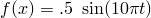。选择此变化使其与上一节中使用表格值指定的函数完全相同。加速度、速度和位移历程与上一节中的相同，如图[图5.1.3--1](ch05s01abv319.md#veramp-tab-a)到[图5.1.3--3](ch05s01abv319.md#veramp-tab-u)所示。

#### 等间距幅值定义

在[xampmult.inp](../eif/xampmult.inp)和[xamptest.inp](../eif/xamptest.inp)中指定了速度历程。这种特殊变化使用固定时间步长指定。选择此变化使其与使用非固定时间步长的表格值指定的函数完全相同（参见[表格幅值定义](ch05s01abv319.md#ver-amp-tab)）。加速度、速度和位移历程与之前讨论的相同，如图[图5.1.3--1](ch05s01abv319.md#veramp-tab-a)到[图5.1.3--3](ch05s01abv319.md#veramp-tab-u)所示。

#### 调制幅值定义

[xampmult.inp](../eif/xampmult.inp)和[xamptest.inp](../eif/xamptest.inp)中使用的一种边界条件变化是用100.0的比例因子指定的速度历程。该变化使用与以下表达式对应的正弦函数组合来指定：

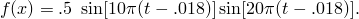

使用200.0的比例因子来放大函数。对于这种特殊变化的加速度、速度和位移历程如图[图5.1.3--4](ch05s01abv319.md#veramp-mod-a)到[图5.1.3--6](ch05s01abv319.md#veramp-mod-u)所示。

#### 指数衰减幅值定义

[xampmult.inp](../eif/xampmult.inp)和[xamptest.inp](../eif/xamptest.inp)中使用的一种边界条件变化是用200的比例因子指定的速度历程。该变化使用与以下表达式对应的指数函数来指定：

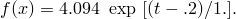

对于这种特殊变化的加速度、速度和位移历程如图[图5.1.3--7](ch05s01abv319.md#veramp-dec-a)到[图5.1.3--9](ch05s01abv319.md#veramp-dec-u)所示。

#### 光顺阶梯幅值

[xampmult.inp](../eif/xampmult.inp)和[xamptest.inp](../eif/xamptest.inp)中使用的一种边界条件变化是用100.0的比例因子指定的速度历程。该变化使用与以下表达式对应的多项式方程来指定：

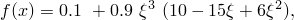

其中

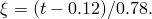

对于这种特殊变化的加速度、速度和位移历程如图[图5.1.3--10](ch05s01abv319.md#veramp-smooth-a)到[图5.1.3--12](ch05s01abv319.md#veramp-smooth-u)所示。

#### 依赖解的幅值

压力的初始值为1.0，幅值允许增加到该值的100倍（以及减小到初始值的0.1倍）。达到最大幅值，Abaqus/Standard停止分析，因为它无法在所施加的限制下跟随目标。这发生在薄板完全填充模具型腔之前。重新运行[xampress.inp](../eif/xampress.inp)，其中将最大幅值修改为参考载荷的500倍，允许完成变形。同样，最大允许幅值被用作Abaqus/Standard结束分析的机制。重新运行示例说明了另一种通常不推荐的可能性（因为在实践中可能不会发生）——载荷参考值增加了5.0倍。因此，幅值历程相应地自适应。

[图5.1.3--13](ch05s01abv319.md#veramp-soldep-origconfig)和[图5.1.3--16](ch05s01abv319.md#veramp-soldep-finalconfig)显示了不同变形阶段的刚性表面和可变形薄板。[图5.1.3--14](ch05s01abv319.md#veramp-soldep-amphist)和[图5.1.3--17](ch05s01abv319.md#veramp-soldep-totalamphist)显示了获得的幅值历程。[图5.1.3--15](ch05s01abv319.md#veramp-soldep-ratiohist)显示了模型中最大蠕变应变率与所提供的目标值之间的比率。

### 输入文件

##### **Abaqus/Standard分析**

[xampmult.inp](../eif/xampmult.inp)

在多个步骤中使用[*AMPLITUDE*](../key/key-link.md#usb-kws-mamplitude)。

[xampresm.inp](../eif/xampresm.inp)

xampmult.inp的[*RESTART*](../key/key-link.md#usb-kws-mrestart)测试。

[xampsdep.inp](../eif/xampsdep.inp)

[*AMPLITUDE*](../key/key-link.md#usb-kws-mamplitude),DEFINITION=SOLUTION DEPENDENT。

[xampress.inp](../eif/xampress.inp)

xampsdep.inp的[*RESTART*](../key/key-link.md#usb-kws-mrestart)测试。

##### **Abaqus/Explicit分析**

[xamptest.inp](../eif/xamptest.inp)

在多个步骤中使用[*AMPLITUDE*](../key/key-link.md#usb-kws-mamplitude)。

[xamprest.inp](../eif/xamprest.inp)

xamptest.inp的[*RESTART*](../key/key-link.md#usb-kws-mrestart)测试。

### 图片

**图5.1.3–1** 加速度历程；表格、周期或等间距幅值定义。

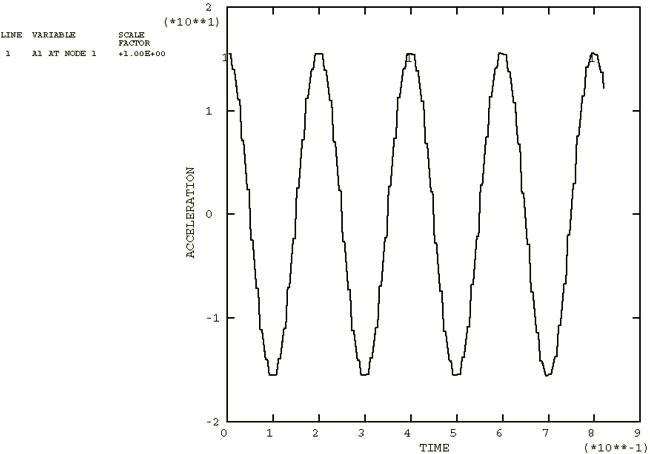

**图5.1.3–2** 速度历程；表格、周期或等间距幅值定义。

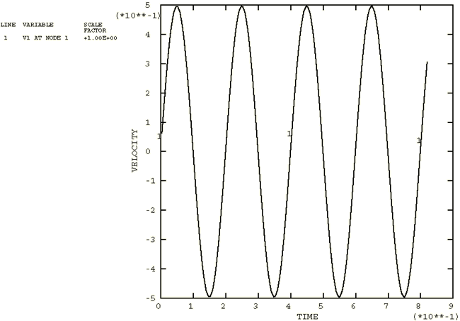

**图5.1.3–3** 位移历程；表格、周期或等间距幅值定义。

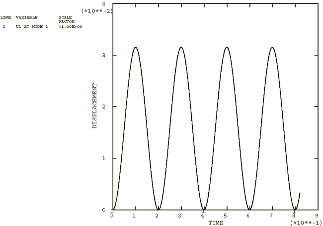

**图5.1.3–4** 加速度历程；调制幅值定义。

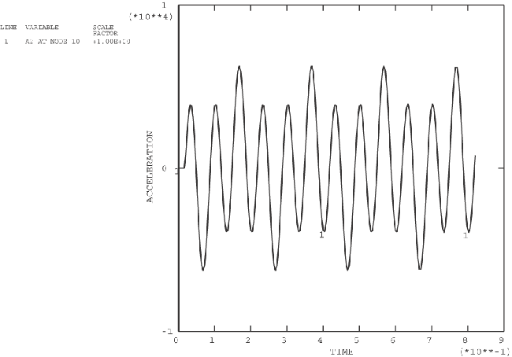

**图5.1.3–5** 速度历程；调制幅值定义。

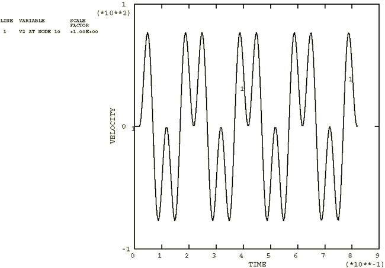

**图5.1.3–6** 位移历程；调制幅值定义。

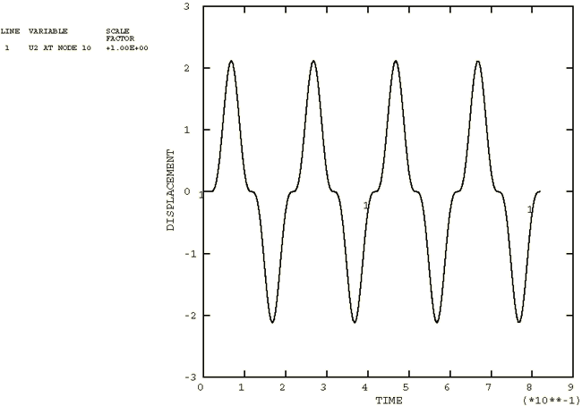

**图5.1.3–7** 加速度历程；指数衰减幅值定义。

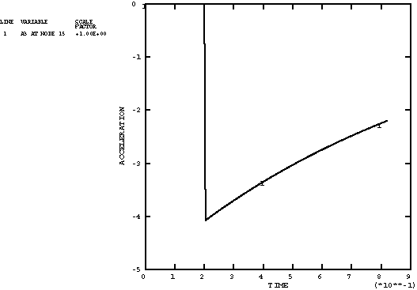

**图5.1.3–8** 速度历程；指数衰减幅值定义。

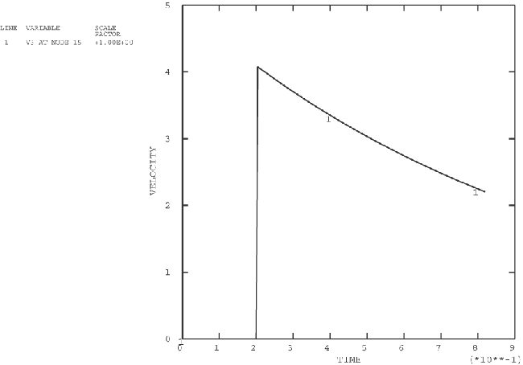

**图5.1.3–9** 位移历程；指数衰减幅值定义。

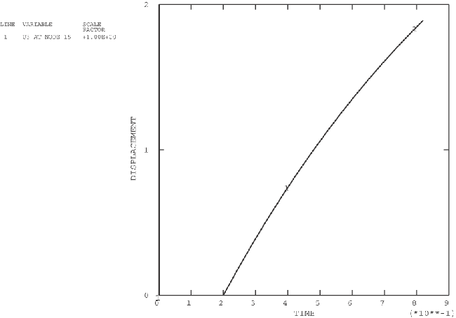

**图5.1.3–10** 加速度历程；光顺阶梯幅值定义。

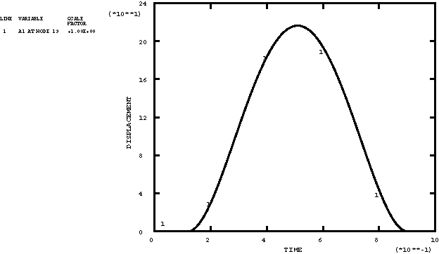

**图5.1.3–11** 速度历程；光顺阶梯幅值定义。

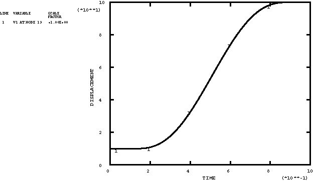

**图5.1.3–12** 位移历程；光顺阶梯幅值定义。

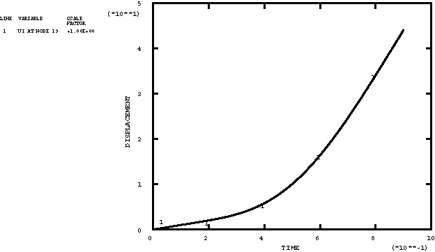

**图5.1.3–13** 原始运行中的构型；依赖解的幅值定义。

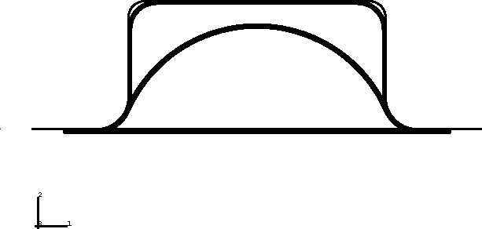

**图5.1.3–14** 原始运行的幅值历程；依赖解的幅值定义。

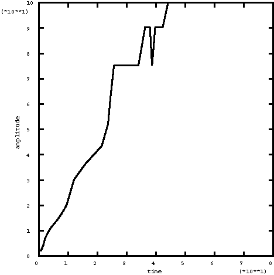

**图5.1.3–15** 原始运行的比率历程；依赖解的幅值定义。

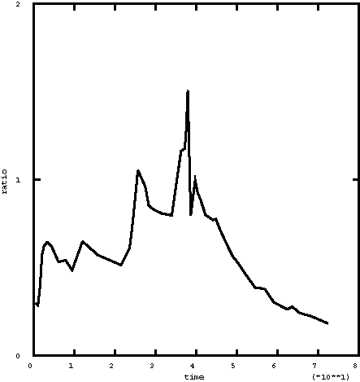

**图5.1.3–16** 重新启动后的最终构型；依赖解的幅值定义。

**图5.1.3–17** 总幅值历程；依赖解的幅值定义。

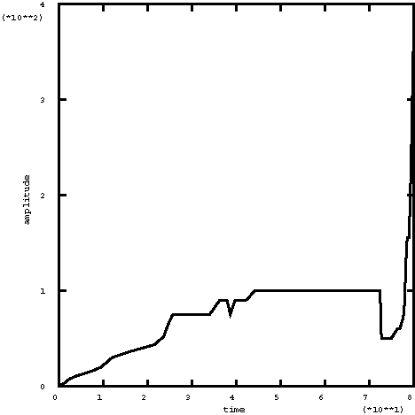

