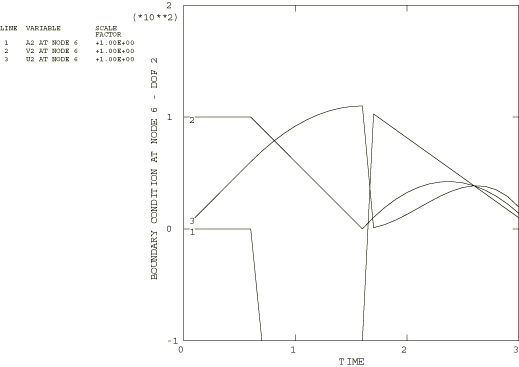

# 5.1.5 边界条件

**产品：**Abaqus/Standard  

### 测试功能

测试各种类型的規定边界条件。

### I. 复数边界条件

### 测试单元

AC2D4、CPS4

### 问题描述

在直接解稳态动态过程中测试实部和虚部边界条件的应用。测试在结构分析和声学分析中进行。每个测试分三个步骤执行。第一步对结构的特定自由度施加非零实部边界条件，获得稳态谐波响应。第二步与第一步相同，只是对指定自由度的虚部分量施加非零边界条件。预期结果是，两个步骤的自由度响应应该相同但相位相差90度。第三步与前两步相同，只是对指定自由度的实部和虚部分量同时施加非零边界条件。对于此步骤，预期结果是自由度响应与前两个步骤的响应相差45度相位。

### 结果与讨论

**表5.1.5–1** 复数边界条件，结构分析（[xbccplxs.inp](../eif/xbccplxs.inp)）。
|  | 频率 | U11 | U21 | PU11 | PU21 |
| --- | --- | --- | --- | --- | --- |
| 步骤1： | 50.0 | 0.0508 | 1.110 | 180.0 | 0.0 |
|  | 100.0 | 0.0034 | 1.110 | 180.0 | 0.0 |
| 步骤2： | 50.0 | 0.0508 | 1.110 | 90.0 | 90.0 |
|  | 100.0 | 0.0034 | 1.110 | 90.0 | 90.0 |
| 步骤3： | 50.0 | 0.0719 | 1.570 | 135.0 | 45.0 |
|  | 100.0 | 0.0048 | 1.570 | 135.0 | 45.0 |

**表5.1.5–2** 复数边界条件，声学分析（[xbccplxa.inp](../eif/xbccplxa.inp)）。
|  | 频率 | POR1 | PPOR1 | POR21 | PPOR21 |
| --- | --- | --- | --- | --- | --- |
| 步骤1： | 50.0 | 1.110 | 0.0 | 0.0546 | 180.0 |
|  | 100.0 | 1.110 | 0.0 | 0.0126 | 180.0 |
| 步骤2： | 50.0 | 1.110 | 90.0 | 0.0546 | 90.0 |
|  | 100.0 | 1.110 | 90.0 | 0.0126 | 90.0 |
| 步骤3： | 50.0 | 1.570 | 45.0 | 0.0772 | 135.0 |
|  | 100.0 | 1.570 | 45.0 | 0.0179 | 135.0 |

### 输入文件

[xbccplxs.inp](../eif/xbccplxs.inp)

复数边界条件，结构分析。

[xbccplxa.inp](../eif/xbccplxa.inp)

复数边界条件，声学分析。

### II. 位移、速度和加速度边界条件

### 测试单元

B21

### 问题描述

输入文件[xbctypex.inp](../eif/xbctypex.inp)测试多步骤动态分析中边界条件的连续性。在步骤之间修改边界条件规范。位移、速度和加速度历程被广泛改变以确保适当的过渡。测试固定边界条件以确保使用正确定义在各个节点位置设置位移。此外，边界条件规范从用户规定的幅值到用户子程序[`DISP`](../sub/sub-link.md#sub-xsl-disp)，再到固定边界条件类型（即encastre等），甚至完全移除边界条件规范，进行了各种改变。

### 结果与讨论

在此测试中，在几个不同节点上测试了边界条件的几种组合。作为典型示例，讨论节点6的自由度2上的边界条件规范。

第一步将加速度为零定义为节点6自由度2的边界条件。这样做时，使用动态分析的默认幅值变化。如["定义分析，" Abaqus Analysis User's Guide第6.1.2节](../usb/usb-link.md#usb-anl-aover)中所述，动态分析的默认幅值选择是阶跃函数，但对于规定位移和旋转边界条件，默认值是线性斜坡函数。节点6还具有100的初始速度。所得速度和位移应根据规定的加速度变化（包括初始速度）进行积分。

在第二步中，规范改为速度历程，并线性应用步幅。因此，速度应该是从第一步结束时的先前值线性变化到在此步骤的定义中设置的最终值（0.0）。所得的位移和加速度历程应反映此规定变化。

在第三步中，线性应用步幅，并将规范改为引用用户子程序[`DISP`](../sub/sub-link.md#sub-xsl-disp)。在用户子程序中，加速度是幅值因子的值，该因子在步骤中被斜坡化。速度和位移是该变化的适当积分。由于幅值是线性应用的，幅值因子在此步骤中从此步骤先前位移值100斜坡化到此步骤边界条件定义中给出的最终值10。这个线性定义修改了用户子程序中指定的函数，使得加速度是线性的，速度是二次的，位移是三次的。对于这个典型的边界条件规范，曲线如图[图5.1.5--1](ch05s01abv321.md#verboundary-history)所示。在测试中验证了边界条件规范的许多其他变化。

**图5.1.5–1** 节点6自由度2的边界条件历程。

### 输入文件

[xbctypex.inp](../eif/xbctypex.inp)

TYPE边界条件。

[xbctypex.f](../eif/xbctypex.f)

xbctypex.inp中使用的用户子程序[`DISP`](../sub/sub-link.md#sub-xsl-disp)。

### III. 速度型边界条件，静态分析

### 测试单元

B21

### 问题描述

输入文件[xbcvelstat.inp](../eif/xbcvelstat.inp)测试在多步骤静态分析中边界条件（主要是速度）在步骤之间修改时的连续性。速度在动态分析中始终是已知的，但在静态分析中不会计算和存储。因此，在静态分析中使用速度规范会带来一些独特的问题。

输入文件[xbcvelres1.inp](../eif/xbcvelres1.inp)和[xbcvelres2.inp](../eif/xbcvelres2.inp)测试在静态分析中使用速度型边界条件时的重新启动能力。[xbcvelres1.inp](../eif/xbcvelres1.inp)不终止进行重新启动的分析的当前步骤，而[xbcvelres2.inp](../eif/xbcvelres2.inp)则终止。输入文件设计使得重新启动分析的结果与原始分析的结果相同。

### 结果与讨论

原始分析由使用梁单元的四个静态步骤组成。九个可用自由度通过步骤之间的边界条件规范修改得到充分练习。在一个步骤中指定为带幅值参考的速度的边界条件可以在下一步中修改为带斜坡幅值规范的位移规范，或者可以固定或完全移除。当检查边界条件的连续性时，可以看到它是正确的。重新启动分析产生与原始分析相同的结果。

### 输入文件

[xbcvelstat.inp](../eif/xbcvelstat.inp)

TYPE=VELOCITY边界条件，静态分析。

[xbcvelres1.inp](../eif/xbcvelres1.inp)

xbcvelstat.inp的不带END STEP的[*RESTART*](../key/key-link.md#usb-kws-mrestart)测试。

[xbcvelres2.inp](../eif/xbcvelres2.inp)

xbcvelstat.inp的带END STEP的[*RESTART*](../key/key-link.md#usb-kws-mrestart)测试。

