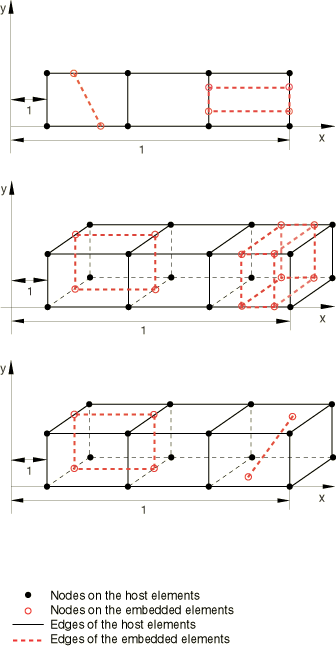

# 5.1.9 嵌入单元技术

**产品：**Abaqus/Standard、Abaqus/Explicit  

### 测试单元

C3D8、C3D8R、C3D20

CAX4、CAX4R、CAX8

CPE4、CPE4R、CPE8

SC6R、SC8R

MAX1、MAX2、M3D4、M3D4R、M3D8

SFMAX1、SFMAX2、SFM3D4、SFM3D4R、SFM3D8

T2D2、T2D3、T3D2、T3D3

### 测试功能

使用各种类型的嵌入不同类型宿主单元的单元来约束嵌入节点到适当的宿主单元。

### 问题描述

使用连续体单元作为宿主单元的模型由三个宿主单元组成，在大多数情况下，还有两个不同类型的嵌入单元。使用连续体壳单元作为宿主单元的模型由六个或九个单元组成：三个膜单元嵌入一组三个SC8R或六个SC6R单元中。所有在一端（*x*=1）的节点都被约束在所有自由度上。集中载荷施加在另一端（*x*=10）节点的负*y*方向上。

### 结果与讨论

使用嵌入单元技术获得的结果与使用等效MPC模型获得的结果相同。

### 输入文件

##### **Abaqus/Standard输入文件**

[xembedele2d1_std.inp](../eif/xembedele2d1_std.inp)

静态步骤；二维一阶桁架单元和二维一阶实体单元嵌入三个二维一阶实体单元中。

[xembedele2d2_std.inp](../eif/xembedele2d2_std.inp)

静态步骤；二维二阶桁架单元和二维二阶实体单元嵌入三个二维二阶实体单元中。

[xembedelecax1_std.inp](../eif/xembedelecax1_std.inp)

静态步骤；带钢筋的轴对称一阶膜单元和一阶轴对称实体单元嵌入三个一阶轴对称实体单元中。

[xembedelecax2_std.inp](../eif/xembedelecax2_std.inp)

静态步骤；带钢筋的轴对称二阶膜单元和二阶轴对称实体单元嵌入三个二阶轴对称实体单元中。

[xembedelecax3_std.inp](../eif/xembedelecax3_std.inp)

静态步骤；带钢筋的轴对称一阶表面单元和一阶轴对称实体单元嵌入三个一阶轴对称实体单元中。

[xembedelecax4_std.inp](../eif/xembedelecax4_std.inp)

静态步骤；带钢筋的轴对称二阶表面单元和二阶轴对称实体单元嵌入三个二阶轴对称实体单元中。

[xembedele3d1_std.inp](../eif/xembedele3d1_std.inp)

静态步骤；带钢筋的三维一阶膜单元和三维一阶实体单元嵌入三个三维一阶实体单元中。

[xembedele3d2_std.inp](../eif/xembedele3d2_std.inp)

静态步骤；带钢筋的三维二阶膜单元和三维二阶实体单元嵌入三个三维二阶实体单元中。

[xembedele3d3_std.inp](../eif/xembedele3d3_std.inp)

静态步骤，然后是频率、稳态动态、模态动态、响应谱、随机响应和动态步骤；带钢筋的三维一阶桁架单元和三维一阶膜单元嵌入三个三维一阶实体单元中。

[xembedele3d4_std.inp](../eif/xembedele3d4_std.inp)

静态步骤；三维二阶桁架单元和带钢筋的三维二阶膜单元嵌入三个三维二阶实体单元中。

[xembedele3d5_std.inp](../eif/xembedele3d5_std.inp)

静态步骤；带钢筋的三维一阶表面单元和三维一阶实体单元嵌入三个三维一阶实体单元中。

[xembedele3d6_std.inp](../eif/xembedele3d6_std.inp)

静态步骤；带钢筋的三维二阶表面单元和三维二阶实体单元嵌入三个三维二阶实体单元中。

[xembedele3d7_std.inp](../eif/xembedele3d7_std.inp)

静态步骤，然后是频率、稳态动态、模态动态、响应谱、随机响应和动态步骤；三维一阶桁架单元和带钢筋的三维一阶表面单元嵌入三个三维一阶实体单元中。

[xembedele3d8_std.inp](../eif/xembedele3d8_std.inp)

静态步骤；三维二阶桁架单元和带钢筋的三维二阶表面单元嵌入三个三维二阶实体单元中。

[xembedele3d9_std.inp](../eif/xembedele3d9_std.inp)

静态步骤；带钢筋的三维一阶表面单元和三维一阶实体单元嵌入三个三维一阶实体单元中。在静态分析期间应用[*MODEL CHANGE*](../key/key-link.md#usb-kws-hmodelchange)功能来移除和添加表面单元。

[xembedele3d10_std.inp](../eif/xembedele3d10_std.inp)

静态步骤；带钢筋的三个膜单元嵌入三个8节点连续体壳单元中。

[xembedele3d11_std.inp](../eif/xembedele3d11_std.inp)

静态步骤；带钢筋的三个膜单元嵌入六个6节点连续体壳单元中。

[xembedele3d12_std.inp](../eif/xembedele3d12_std.inp)

静态步骤；带钢筋的一阶圆柱表面单元嵌入一阶圆柱实体单元中。

[xembedele3d13_std.inp](../eif/xembedele3d13_std.inp)

静态步骤；带钢筋的二阶圆柱表面单元嵌入二阶圆柱实体单元中。

[xembedele3d14_std.inp](../eif/xembedele3d14_std.inp)

静态步骤；带钢筋的壳单元和梁单元嵌入三个三维一阶实体单元中。

##### **Abaqus/Explicit输入文件**

[xembedele2d1_xpl.inp](../eif/xembedele2d1_xpl.inp)

二维一阶桁架单元和二维一阶实体单元嵌入三个二维一阶实体单元中。

[xembedelecax1_xpl.inp](../eif/xembedelecax1_xpl.inp)

一阶轴对称实体单元嵌入三个一阶轴对称实体单元中。

[xembedele3d1_xpl.inp](../eif/xembedele3d1_xpl.inp)

带钢筋的三维一阶膜单元和三维一阶实体单元嵌入三个三维一阶实体单元中。

[xembedele3d1_xpl_c3d8.inp](../eif/xembedele3d1_xpl_c3d8.inp)

带钢筋的三维一阶膜单元和三维一阶实体单元嵌入三个三维一阶实体单元中。

[xembedele3d3_xpl.inp](../eif/xembedele3d3_xpl.inp)

三维一阶桁架单元和带钢筋的三维一阶膜单元嵌入三个三维一阶实体单元中。

[xembedele3d4_xpl.inp](../eif/xembedele3d4_xpl.inp)

带钢筋的三维一阶表面单元和三维一阶实体单元嵌入三个三维一阶实体单元中。

[xembedele3d5_xpl.inp](../eif/xembedele3d5_xpl.inp)

带钢筋的壳单元和梁单元嵌入三个三维一阶实体单元中。

### 图片

**图5.1.9–1** 嵌入宿主单元中的单元。

