# 5.1.20 辐射视角因子定义：对称性和遮挡

**产品：**Abaqus/Standard  

### 测试功能

通过将使用不同对称选项的模型获得的结果与不使用对称性的完整模型获得的结果进行比较，验证辐射对称性。使用几种不同的配置来允许在二维、三维和轴对称情况下测试所有对称性选项。一些配置也用于测试辐射遮挡。

由于此验证套件的主要关注点是非平凡几何中视角因子的计算，所有问题仅由稳态热传递分析的单步中的单个增量组成。所选的非平凡配置不存在解析解；因此，结果验证仅限于比较此问题的变体，使用不同类型和级别的对称性运行。所有记录的结果都可以通过使用Abaqus版本提供的输入文件运行来重现。

### I. 无限长方形截面管

### 二维模型

### 测试单元

DC2D4

### 问题描述

使用方形管横截面的四种不同二维模型：完整模型、带一个反射对称的半模型、带两个反射对称的四分之一模型和带循环对称的四分之一模型。完整、半和四分之一模型如[图5.1.20-1](ch05s01abv336.md#verrviewsymm-2dinfsqtube)所示。二维模型意味着管在垂直于横截面的方向上无限延伸。

**图5.1.20-1** 二维方形管模型。

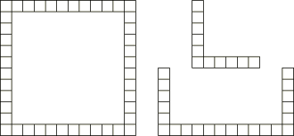

### 结果与讨论

|  | 单元6，边3 |
| --- | --- |
| RADFL | VFTOT | FTEMP |
| xrv24sn000.inp | 3823.0 | 1.0 | 517.7 |
| xrv24snr10.inp | 3823.0 | 1.0 | 517.7 |
| xrv24snr20.inp | 3823.0 | 1.0 | 517.7 |
| xrv24snc04.inp | 3823.0 | 1.0 | 517.7 |

|  | 单元21，边2 |
| --- | --- |
| RADFL | VFTOT | FTEMP |
| xrv24sn000.inp | 4787.0 | 1.0 | 719.5 |
| xrv24snr10.inp | 4787.0 | 1.0 | 719.5 |
| xrv24snr20.inp | 4787.0 | 1.0 | 719.5 |
| xrv24snc04.inp | 4787.0 | 1.0 | 719.5 |

### 输入文件

[xrv24sn000.inp](../eif/xrv24sn000.inp)

完整模型，DC2D4单元。

[xrv24snr10.inp](../eif/xrv24snr10.inp)

半模型，DC2D4单元，一个反射对称。

[xrv24snr20.inp](../eif/xrv24snr20.inp)

四分之一模型，DC2D4单元，两个反射对称。

[xrv24snc04.inp](../eif/xrv24snc04.inp)

四分之一模型，DC2D4单元，循环对称（NC=4）。

### 三维模型

### 测试单元

DC3D8

### 问题描述

使用方形截面管的三种不同模型。在所有情况下都建模了完整横截面，并且通过在垂直于管横截面的方向上使用周期性对称来模拟管的无限范围。三种模型在周期性对称使用的重复次数上有所不同。

**图5.1.20-2** 三维方形管模型。

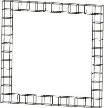

### 结果与讨论

|  | 单元6，边5 |
| --- | --- |
| RADFL | VFTOT | FTEMP |
| xrv38snp05.inp | 849.4 | 0.6578 | 471.9 |
| xrv38snp10.inp | 2376.0 | 0.8696 | 495.4 |
| xrv38snp20.inp | 3722.0 | 0.9702 | 517.1 |
| 2D模型 | 3823.0 | 1.0000 | 517.7 |

|  | 单元21，边4 |
| --- | --- |
| RADFL | VFTOT | FTEMP |
| xrv38snp05.inp | 5592.0 | 0.7504 | 675.9 |
| xrv38snp10.inp | 5525.0 | 0.8811 | 698.0 |
| xrv38snp20.inp | 4648.0 | 0.9719 | 720.5 |
| 2D模型 | 4787.0 | 1.0000 | 719.5 |

### 输入文件

[xrv38snp05.inp](../eif/xrv38snp05.inp)

完整横截面模型，DC3D8单元，周期性对称（NR=5）。

[xrv38snp10.inp](../eif/xrv38snp10.inp)

完整横截面模型，DC3D8单元，周期性对称（NR=10）。

[xrv38snp20.inp](../eif/xrv38snp20.inp)

完整横截面模型，DC3D8单元，周期性对称（NR=20）。

### II. 带遮挡的无限长方形截面管

### 二维模型

### 测试单元

DC2D4

### 问题描述

使用方形管和遮挡物横截面的四种不同二维模型：完整模型、带一个反射对称的半模型、带两个反射对称的四分之一模型和带循环对称的四分之一模型。完整、半和四分之一模型如[图5.1.20-3](ch05s01abv336.md#verrviewsymm-2dinfsqtube-block)所示。二维模型意味着管和遮挡物在垂直于横截面的方向上无限延伸。

**图5.1.20-3** 带遮挡的二维方形管。

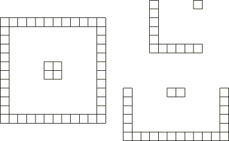

### 结果与讨论

|  | 单元6，边3 |
| --- | --- |
| RADFL | VFTOT | FTEMP |
| xrv24sb000.inp | 1063.0 | 0.9970 | 701.0 |
| xrv24sbr10.inp | 1063.0 | 0.9970 | 701.0 |
| xrv24sbr20.inp | 1063.0 | 0.9970 | 701.0 |
| xrv24sbc04.inp | 1063.0 | 0.9970 | 701.0 |

|  | 单元21，边2 |
| --- | --- |
| RADFL | VFTOT | FTEMP |
| xrv24sb000.inp | 4506.0 | 0.9909 | 619.2 |
| xrv24sbr10.inp | 4506.0 | 0.9909 | 619.2 |
| xrv24sbr20.inp | 4506.0 | 0.9909 | 619.2 |
| xrv24sbc04.inp | 4506.0 | 0.9909 | 619.2 |

|  | 单元106，边1 |
| --- | --- |
| RADFL | VFTOT | FTEMP |
| xrv24sb000.inp | 12745.0 | 1.0 | 812.6 |
| xrv24sbr10.inp | 12745.0 | 1.0 | 812.6 |
| xrv24sbr20.inp | 12745.0 | 1.0 | 812.6 |
| xrv24sbc04.inp | 12745.0 | 1.0 | 812.6 |

### 输入文件

[xrv24sb000.inp](../eif/xrv24sb000.inp)

完整模型，DC2D4单元。

[xrv24sbr10.inp](../eif/xrv24sbr10.inp)

半模型，DC2D4单元，一个反射对称。

[xrv24sbr20.inp](../eif/xrv24sbr20.inp)

四分之一模型，DC2D4单元，两个反射对称。

[xrv24sbc04.inp](../eif/xrv24sbc04.inp)

四分之一模型，DC2D4单元，循环对称（NC=4）。

### 三维模型

### 测试单元

DC3D8

### 问题描述

使用方形截面管和遮挡物的六种不同模型。这些模型涉及横截面模型和用于模拟管和遮挡物无限范围的周期性对称重复次数的不同组合。使用三种横截面模型：完整模型、带两个反射对称的四分之一模型和带循环对称的四分之一模型。[图5.1.20-4](ch05s01abv336.md#verrviewsymm-3dinfsqtube-block)显示了所使用的横截面模型。

**图5.1.20-4** 带遮挡的三维方形管。

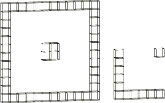

### 结果与讨论

|  | 单元6，边5 |
| --- | --- |
| RADFL | VFTOT | FTEMP |
| xrv38sbp05.inp | 1044.0 | 0.7296 | 506.7 |
| xrv38sbrp5.inp | 1044.0 | 0.7296 | 506.7 |
| xrv38sbcp5.inp | 1044.0 | 0.7296 | 506.7 |
| xrv38sbcp10.inp | 1129.0 | 0.9016 | 637.9 |
| xrv38sbcp20.inp | 1098.0 | 0.9749 | 701.0 |
| xrv38sbcp50.inp | 1071.0 | 0.9934 | 700.7 |
| 2D模型 | 1063.0 | 0.9970 | 701.0 |

|  | 单元21，边4 |
| --- | --- |
| RADFL | VFTOT | FTEMP |
| xrv38sbp05.inp | 1603.0 | 0.7893 | 511.4 |
| xrv38sbrp5.inp | 1603.0 | 0.7893 | 511.4 |
| xrv38sbcp5.inp | 1603.0 | 0.7893 | 511.4 |
| xrv38sbcp10.inp | 2930.0 | 0.9116 | 567.2 |
| xrv38sbcp20.inp | 4426.0 | 0.9710 | 618.3 |
| xrv38sbcp50.inp | 4484.0 | 0.9871 | 618.7 |
| 2D模型 | 4506.0 | 0.9970 | 619.2 |

|  | 单元106，边3 |
| --- | --- |
| RADFL | VFTOT | FTEMP |
| xrv38sbp05.inp | 15583.0 | 0.8510 | 776.8 |
| xrv38sbrp5.inp | 15583.0 | 0.8510 | 776.8 |
| xrv38sbcp5.inp | 15583.0 | 0.8510 | 776.8 |
| xrv38sbcp10.inp | 14241.0 | 0.9593 | 790.6 |
| xrv38sbcp20.inp | 12694.0 | 0.9875 | 813.6 |
| xrv38sbcp50.inp | 12719.0 | 0.9926 | 812.9 |
| 2D模型 | 12745.0 | 1.0000 | 812.6 |

### 输入文件

[xrv38sbp05.inp](../eif/xrv38sbp05.inp)

完整横截面模型，DC3D8单元，周期性对称（NR=5）。

[xrv38sbrp5.inp](../eif/xrv38sbrp5.inp)

带两个反射对称的四分之一横截面模型，DC3D8单元，周期性对称（NR=5）。

[xrv38sbcp5.inp](../eif/xrv38sbcp5.inp)

带循环对称（NC=4）的四分之一横截面模型，DC3D8单元，周期性对称（NR=5）。

[xrv38sbcp10.inp](../eif/xrv38sbcp10.inp)

带循环对称（NC=4）的四分之一横截面模型，DC3D8单元，周期性对称（NR=10）。

[xrv38sbcp20.inp](../eif/xrv38sbcp20.inp)

带循环对称（NC=4）的四分之一横截面模型，DC3D8单元，周期性对称（NR=20）。

[xrv38sbcp50.inp](../eif/xrv38sbcp50.inp)

带循环对称（NC=4）的四分之一横截面模型，DC3D8单元，周期性对称（NR=50）。

### III. 有限长度方形截面管

### 无遮挡的三维模型

### 测试单元

DC3D8

### 问题描述

分析具有方形横截面的单位长度管。使用方形截面的四种不同模型：完整模型、带一个反射对称的半模型、带两个反射对称的四分之一模型和带循环对称的四分之一模型。[图5.1.20-5](ch05s01abv336.md#verrviewsymm-3dfinsqtube)显示了所使用的横截面模型。

**图5.1.20-5** 带遮挡的三维有限方形管。

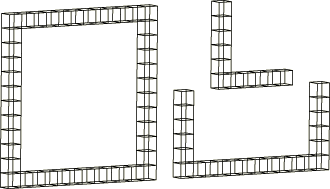

### 结果与讨论

|  | 单元6，边5 |
| --- | --- |
| RADFL | VFTOT | FTEMP |
| xrv38sn000.inp | 1544.0 | 0.0788 | 429.3 |
| xrv38snr10.inp | 1544.0 | 0.0788 | 429.3 |
| xrv38snr20.inp | 1544.0 | 0.0788 | 429.3 |
| xrv38snc04.inp | 1544.0 | 0.0788 | 429.3 |

|  | 单元21，边4 |
| --- | --- |
| RADFL | VFTOT | FTEMP |
| xrv38sn000.inp | 6694.0 | 0.2796 | 629.1 |
| xrv38snr10.inp | 6694.0 | 0.2796 | 629.1 |
| xrv38snr20.inp | 6694.0 | 0.2796 | 629.1 |
| xrv38snc04.inp | 6694.0 | 0.2796 | 629.1 |

### 输入文件

[xrv38sn000.inp](../eif/xrv38sn000.inp)

完整横截面模型，DC3D8单元。

[xrv38snr10.inp](../eif/xrv38snr10.inp)

半横截面模型，DC3D8单元，一个反射对称。

[xrv38snr20.inp](../eif/xrv38snr20.inp)

四分之一横截面模型，DC3D8单元，两个反射对称。

[xrv38snc04.inp](../eif/xrv38snc04.inp)

四分之一横截面模型，DC3D8单元，循环对称（NC=4）。

### 带遮挡的三维模型

### 测试单元

DC3D8

### 问题描述

分析单位长度方形横截面管和遮挡物。使用三种横截面模型：完整模型、带两个反射对称的四分之一模型和带循环对称的四分之一模型。[图5.1.20-6](ch05s01abv336.md#verrviewsymm-3dfinsqtube-block)显示了所使用的横截面模型。

**图5.1.20-6** 带遮挡的三维有限方形管。

### 结果与讨论

|  | 单元6，边5 |
| --- | --- |
| RADFL | VFTOT | FTEMP |
| xrv38sb000.inp | 169.5 | 0.1000 | 359.6 |
| xrv38sbr20.inp | 169.5 | 0.1000 | 359.6 |
| xrv38sbc04.inp | 169.5 | 0.1000 | 359.6 |

|  | 单元21，边4 |
| --- | --- |
| RADFL | VFTOT | FTEMP |
| xrv38sb000.inp | 452.7 | 0.2874 | 372.1 |
| xrv38sbr20.inp | 452.7 | 0.2874 | 372.1 |
| xrv38sbc04.inp | 452.7 | 0.2874 | 372.1 |

|  | 单元106，边3 |
| --- | --- |
| RADFL | VFTOT | FTEMP |
| xrv38sb000.inp | 17304.0 | 0.1322 | 745.5 |
| xrv38sbr20.inp | 17304.0 | 0.1322 | 745.5 |
| xrv38sbc04.inp | 17304.0 | 0.1322 | 745.5 |

### 输入文件

[xrv38sb000.inp](../eif/xrv38sb000.inp)

完整横截面模型，DC3D8单元。

[xrv38sbr20.inp](../eif/xrv38sbr20.inp)

四分之一横截面模型，DC3D8单元，两个反射对称。

[xrv38sbc04.inp](../eif/xrv38sbc04.inp)

四分之一横截面模型，DC3D8单元，循环对称（NC=4）。

### IV. 方形截面管环

### 无遮挡的轴对称模型

### 测试单元

DCAX4

### 问题描述

分析具有方形横截面的管环。使用方形截面的两种不同模型：完整模型和带一个反射对称的半模型。[图5.1.20-7](ch05s01abv336.md#verrviewsymm-asymsqtube)显示了所使用的横截面模型。

**图5.1.20-7** 无遮挡的轴对称模型。

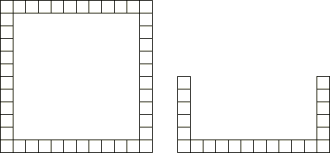

### 结果与讨论

|  | 单元6，边3 |
| --- | --- |
| RADFL | VFTOT | FTEMP |
| xrva4sn000.inp | 218.7 | 1.003 | 563.3 |
| xrva4snr10.inp | 218.7 | 1.003 | 563.3 |

|  | 单元21，边2 |
| --- | --- |
| RADFL | VFTOT | FTEMP |
| xrva4sn000.inp | 5599.0 | 1.022 | 690.5 |
| xrva4snr10.inp | 5599.0 | 1.022 | 690.5 |

### 输入文件

[xrva4sn000.inp](../eif/xrva4sn000.inp)

完整横截面模型，DCAX4单元。

[xrva4snr10.inp](../eif/xrva4snr10.inp)

半横截面模型，DCAX4单元，一个反射对称。

### 带遮挡的轴对称模型

### 测试单元

DCAX4

### 问题描述

分析内部带有遮挡物的方形横截面管环。使用方形截面的两种不同模型：完整模型和带一个反射对称的半模型。[图5.1.20-8](ch05s01abv336.md#verrviewsymm-asymsqtube-block)显示了所使用的横截面模型。

**图5.1.20-8** 带遮挡的轴对称模型。

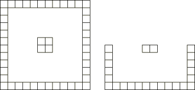

### 结果与讨论

|  | 单元6，边3 |
| --- | --- |
| RADFL | VFTOT | FTEMP |
| xrva4sb000.inp | 1225.0 | 1.004 | 711.3 |
| xrva4sbr10.inp | 1225.0 | 1.004 | 711.3 |

|  | 单元21，边2 |
| --- | --- |
| RADFL | VFTOT | FTEMP |
| xrva4sb000.inp | 3970.0 | 1.015 | 641.0 |
| xrva4sbr10.inp | 3970.0 | 1.015 | 641.0 |

|  | 单元106，边1 |
| --- | --- |
| RADFL | VFTOT | FTEMP |
| xrva4sb000.inp | 12877.0 | 1.003 | 817.5 |
| xrva4sbr10.inp | 12877.0 | 1.003 | 817.5 |

### 输入文件

[xrva4sb000.inp](../eif/xrva4sb000.inp)

完整横截面模型，DCAX4单元。

[xrva4sbr10.inp](../eif/xrva4sbr10.inp)

半横截面模型，DCAX4单元，一个反射对称。

### V. 无限延伸的三维立方体阵列

### 二维模型

### 测试单元

DC2D4

### 问题描述

模拟无限立方体阵列。二维模型意味着阵列在第三方向上延伸到无穷远。使用三种不同模型：九乘十一对象阵列、在垂直于阵列方向上具有周期性对称的九对象阵列、以及在两个方向上具有周期性对称的单个对象。使用周期性对称的模型中的重复次数使这些模型等同于九乘十一阵列模型。模型如[图5.1.20-9](ch05s01abv336.md#verrviewsymm-2dcubearray)所示，其中黑色方块表示具有两个周期性对称的模型，灰色方块表示具有一个周期性对称的模型。

**图5.1.20-9** 二维立方体阵列。

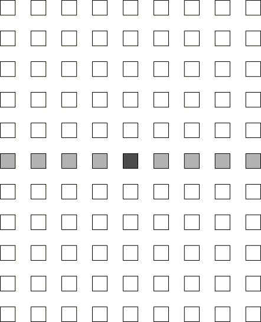

### 结果与讨论

|  | 单元55，边1 |
| --- | --- |
| RADFL | VFTOT | FTEMP |
| xrv24ab000.inp | 24725.0 | 0.9635 | 884.6 |
| xrv24abp05.inp | 24723.0 | 0.9635 | 884.6 |
| xrv24ab2p5.inp | 23444.0 | 0.9635 | 887.4 |

|  | 单元55，边2 |
| --- | --- |
| RADFL | VFTOT | FTEMP |
| xrv24ab000.inp | 23168.0 | 0.9645 | 594.8 |
| xrv24abp05.inp | 23175.0 | 0.9645 | 594.9 |
| xrv24ab2p5.inp | 23465.0 | 0.9645 | 603.8 |

### 输入文件

[xrv24ab000.inp](../eif/xrv24ab000.inp)

九乘十一阵列，DC2D4单元。

[xrv24abp05.inp](../eif/xrv24abp05.inp)

带一个周期性对称的九对象阵列（NR=5），DC2D4单元。

[xrv24ab2p5.inp](../eif/xrv24ab2p5.inp)

带两个周期性对称的单个对象阵列（NR1=4，NR2=5），DC2D4单元。

### 三维模型

### 测试单元

DC3D8

### 问题描述

模拟无限立方体阵列。三维模型由在三个方向上具有周期性对称的单个立方体单元组成。使用两种模型，其中周期性对称重复次数不同。模型所基于的单个单元如[图5.1.20-10](ch05s01abv336.md#verrviewsymm-3dcubearray)所示。

**图5.1.20-10** 用于三维立方体阵列的单个单元。

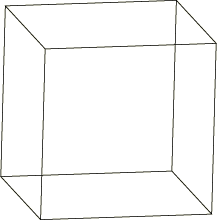

### 结果与讨论

|  | 单元55，边3 |
| --- | --- |
| RADFL | VFTOT | FTEMP |
| xrv38abp05.inp | 6657.0 | 1.011 | 805.8 |
| xrv38abp10.inp | 7044.0 | 1.086 | 806.1 |

|  | 单元55，边4 |
| --- | --- |
| RADFL | VFTOT | FTEMP |
| xrv38abp05.inp | 6527.0 | 1.012 | 722.2 |
| xrv38abp10.inp | 7026.0 | 1.083 | 723.8 |

### 输入文件

[xrv38abp05.inp](../eif/xrv38abp05.inp)

带三个周期性对称的单个对象阵列（NR1=4，NR2=4，NR3=5），DC3D8单元。

[xrv38abp10.inp](../eif/xrv38abp10.inp)

带三个周期性对称的单个对象阵列（NR1=8，NR2=8，NR3=10），DC3D8单元。

### VI. 另一个无限长管内的无限长翅片管

### 轴对称模型

### 测试单元

DCAX4

### 问题描述

模拟另一个无限长简单管内的无限长翅片管之间的辐射。所使用的轴对称网格如[图5.1.20-11](ch05s01abv336.md#verrviewsymm-asymfinnedtubes)所示。管的无限范围通过在管长度方向上的周期性对称来建模。使用具有不同周期性对称重复次数的三种模型。

**图5.1.20-11** 翅片管模型的轴对称网格。

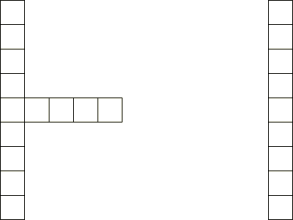

### 结果与讨论

|  | 单元82，边1 |
| --- | --- |
| RADFL | VFTOT | FTEMP |
| xrva4tb000.inp | 6118.0 | 0.4383 | 710.0 |
| xrva4tbp05.inp | 5885.0 | 1.022 | 747.0 |
| xrva4tbp10.inp | 5884.0 | 1.022 | 747.0 |

|  | 单元85，边3 |
| --- | --- |
| RADFL | VFTOT | FTEMP |
| xrva4tb000.inp | 755.8 | 0.2182 | 487.8 |
| xrva4tbp05.inp | 524.6 | 0.9951 | 589.1 |
| xrva4tbp10.inp | 508.9 | 1.002 | 588.8 |

|  | 单元92，边4 |
| --- | --- |
| RADFL | VFTOT | FTEMP |
| xrva4tb000.inp | 1875.0 | 0.3750 | 415.7 |
| xrva4tbp05.inp | 6404.0 | 1.005 | 459.1 |
| xrva4tbp10.inp | 6404.0 | 1.012 | 459.1 |

### 输入文件

[xrva4tb000.inp](../eif/xrva4tb000.inp)

无周期性对称的轴对称模型，DCAX4单元。

[xrva4tbp05.inp](../eif/xrva4tbp05.inp)

带周期性对称的轴对称模型（NR=5），DCAX4单元。

[xrva4tbp10.inp](../eif/xrva4tbp10.inp)

带周期性对称的轴对称模型（NR=10），DCAX4单元。

### 三维模型

### 测试单元

DC3D8

### 问题描述

模拟另一个无限长简单管内的无限长翅片管之间的辐射。使用的两种三维网格如[图5.1.20-12](ch05s01abv336.md#verrviewsymm-3dfinnedtubes)所示：一个是完整的360网格，另一个是该网格的一个切片，与循环对称结合使用。循环对称中使用的循环次数是变化的。管的无限范围通过在管长度方向上的周期性对称来建模。

**图5.1.20-12** 翅片管模型的三维网格。

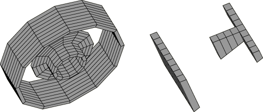

### 结果与讨论

|  | 单元82，边3 |
| --- | --- |
| RADFL | VFTOT | FTEMP |
| xrv38tb000.inp | 6217.0 | 0.4003 | 692.1 |
| 轴对称模型 | 6118.0 | 0.4383 | 710.0 |
| xrv38tbp05.inp | 5721.0 | 0.9710 | 735.8 |
| xrv38tbpc12.inp | 6362.0 | 0.9710 | 750.6 |
| xrv38tbpc24.inp | 6070.0 | 1.010 | 747.2 |
| 轴对称模型 | 5885.0 | 1.022 | 747.0 |

|  | 单元85，边5 |
| --- | --- |
| RADFL | VFTOT | FTEMP |
| xrv38tb000.inp | 722.4 | 0.2256 | 497.9 |
| 轴对称模型 | 755.8 | 0.2182 | 487.8 |
| xrv38tbp05.inp | 424.3 | 0.9987 | 587.4 |
| xrv38tbpc12.inp | 439.2 | 0.9987 | 591.6 |
| xrv38tbpc24.inp | 507.6 | 0.9964 | 589.2 |
| 轴对称模型 | 524.6 | 0.9951 | 589.1 |

|  | 单元92，边6 |
| --- | --- |
| RADFL | VFTOT | FTEMP |
| xrv38tb000.inp | 1791.0 | 0.3787 | 414.7 |
| 轴对称模型 | 1875.0 | 0.3750 | 415.7 |
| xrv38tbp05.inp | 6219.0 | 0.9844 | 455.5 |
| xrv38tbpc12.inp | 6465.0 | 0.9744 | 457.7 |
| xrv38tbpc24.inp | 6438.0 | 1.027 | 458.9 |
| 轴对称模型 | 6404.0 | 1.012 | 459.1 |

### 输入文件

[xrv38tb000.inp](../eif/xrv38tb000.inp)

在无限方向上无周期性对称的完整360模型，DC3D8单元。

[xrv38tbp05.inp](../eif/xrv38tbp05.inp)

在无限方向上带周期性对称的完整360模型（NR=5），DC3D8单元。

[xrv38tbpc12.inp](../eif/xrv38tbpc12.inp)

30切片模型，带循环对称（NC=12）和在无限方向上的周期性对称（NR=5），DC3D8单元。

[xrv38tbpc24.inp](../eif/xrv38tbpc24.inp)

15切片模型，带循环对称（NC=24）和在无限方向上的周期性对称（NR=5），DC3D8单元。

