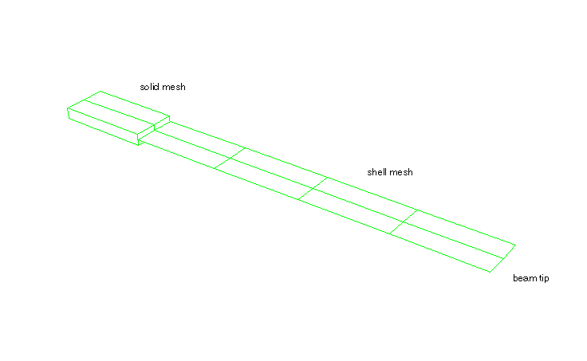
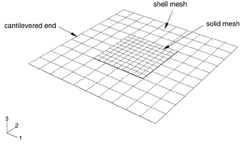
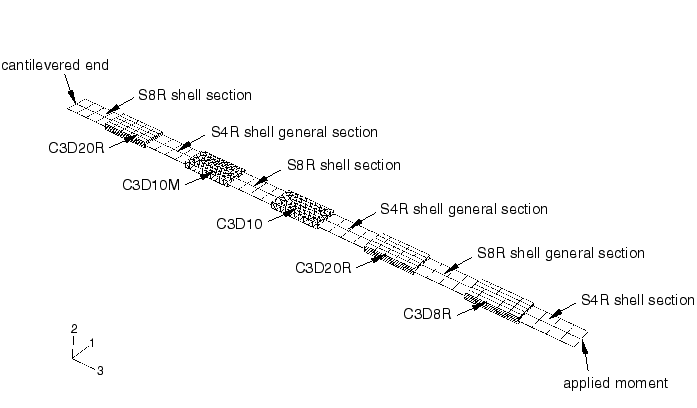

# 5.1.22 壳-实体耦合约束

**产品：**Abaqus/Standard、Abaqus/Explicit  

### 测试功能

本节提供壳-实体耦合约束的基本验证测试。

### I. 带壳-实体耦合约束的静态测试

### 测试单元

S3R    S4R    S8R    S9R5    STRI3    STRI65

SC8R

C3D4    C3D8    C3D8R    C3D10    C3D10I    C3D10M

C3D20R    C3D27R

### 问题描述

由通过壳-实体耦合约束连接的壳单元和连续单元组成的悬臂梁在尖端承受各种载荷条件。该问题用壳和实体单元的各种组合进行分析。

此外，提供了两个输入文件来说明壳-实体耦合约束如何用于将壳单元连接到连续壳单元。在这种情况下，连续壳表示实体界面。

**载荷：**

- 步骤1：在线性扰动分析中，在梁尖端施加=60的载荷。
- 步骤2：在线性扰动分析中，在梁尖端施加=60的载荷。
- 步骤3：在大位移分析中，在梁尖端施加= -60的载荷。
- 步骤4：在大位移分析中，在梁尖端施加=60的载荷。
- 步骤5：移除第四步中施加的载荷。
- 步骤6：改变边界条件，在梁尖端规定绕*z*轴旋转。

对于Abaqus/Explicit测试，省略线性扰动步骤，载荷如下：
- 步骤1：在大位移分析中，在梁尖端施加= -60的载荷。
- 步骤2：在大位移分析中，在梁尖端施加=60的载荷。
- 步骤3：移除前两步中施加的载荷。
- 步骤4：改变边界条件，在梁尖端规定绕*z*轴旋转。

### 结果与讨论

一般情况下结果表明壳边缘和实体单元被适当地耦合。

### 输入文件

##### **Abaqus/Standard输入文件**

[xshell2solid_s3r_c3d4_std.inp](../eif/xshell2solid_s3r_c3d4_std.inp)

在静态分析中测试S3R壳单元和C3D4连续单元之间的壳-实体耦合。

[xshell2solid_s3r_c3d8_std.inp](../eif/xshell2solid_s3r_c3d8_std.inp)

在静态分析中测试S3R壳单元和C3D8连续单元之间的壳-实体耦合。

[xshell2solid_s3r_c3d10_std.inp](../eif/xshell2solid_s3r_c3d10_std.inp)

在静态分析中测试S3R壳单元和C3D10连续单元之间的壳-实体耦合。

[xshell2solid_s3r_c3d10i_std.inp](../eif/xshell2solid_s3r_c3d10i_std.inp)

在静态分析中测试S3R壳单元和C3D10I连续单元之间的壳-实体耦合。

[xshell2solid_s3r_c3d10m_std.inp](../eif/xshell2solid_s3r_c3d10m_std.inp)

在静态分析中测试S3R壳单元和C3D10M连续单元之间的壳-实体耦合。

[xshell2solid_s3r_c3d20r_std.inp](../eif/xshell2solid_s3r_c3d20r_std.inp)

在静态分析中测试S3R壳单元和C3D20R连续单元之间的壳-实体耦合。

[xshell2solid_s3r_c3d27r_std.inp](../eif/xshell2solid_s3r_c3d27r_std.inp)

在静态分析中测试S3R壳单元和C3D27R连续单元之间的壳-实体耦合。

[xshell2solid_s4r_c3d4_std.inp](../eif/xshell2solid_s4r_c3d4_std.inp)

在静态分析中测试S4R壳单元和C3D4连续单元之间的壳-实体耦合。

[xshell2solid_s4r_c3d8_std.inp](../eif/xshell2solid_s4r_c3d8_std.inp)

在静态分析中测试S4R壳单元和C3D8连续单元之间的壳-实体耦合。

[xshell2solid_s4r_c3d8_nb_std.inp](../eif/xshell2solid_s4r_c3d8_nb_std.inp)

在静态分析中测试S4R壳单元和C3D8连续单元之间的壳-实体耦合，连续单元上定义了基于节点的表面。

[xshell2solid_s4r_c3d10_std.inp](../eif/xshell2solid_s4r_c3d10_std.inp)

在静态分析中测试S4R壳单元和C3D10连续单元之间的壳-实体耦合。

[xshell2solid_s4r_c3d10i_std.inp](../eif/xshell2solid_s4r_c3d10i_std.inp)

在静态分析中测试S4R壳单元和C3D10I连续单元之间的壳-实体耦合。

[xshell2solid_s4r_c3d10m_std.inp](../eif/xshell2solid_s4r_c3d10m_std.inp)

在静态分析中测试S4R壳单元和C3D10M连续单元之间的壳-实体耦合。

[xshell2solid_s4r_c3d20r_std.inp](../eif/xshell2solid_s4r_c3d20r_std.inp)

在静态分析中测试S4R壳单元和C3D20R连续单元之间的壳-实体耦合。

[xshell2solid_s4r_c3d20r_nb_std.inp](../eif/xshell2solid_s4r_c3d20r_nb_std.inp)

在静态分析中测试S4R壳单元和C3D20R连续单元之间的壳-实体耦合，连续单元上定义了基于节点的表面。

[xshell2solid_s4r_c3d27r_std.inp](../eif/xshell2solid_s4r_c3d27r_std.inp)

在静态分析中测试S4R壳单元和C3D27R连续单元之间的壳-实体耦合。

[xshell2solid_s4r_sc8r_std.inp](../eif/xshell2solid_s4r_sc8r_std.inp)

在静态分析中测试S4R壳单元和SC8R连续壳单元之间的壳-实体耦合。

[xshell2solid_s8r_c3d4_std.inp](../eif/xshell2solid_s8r_c3d4_std.inp)

在静态分析中测试S8R壳单元和C3D4连续单元之间的壳-实体耦合。

[xshell2solid_s8r_c3d8_std.inp](../eif/xshell2solid_s8r_c3d8_std.inp)

在静态分析中测试S8R壳单元和C3D8连续单元之间的壳-实体耦合。

[xshell2solid_s8r_c3d8_nb_std.inp](../eif/xshell2solid_s8r_c3d8_nb_std.inp)

在静态分析中测试S8R壳单元和C3D8连续单元之间的壳-实体耦合，连续单元上定义了基于节点的表面。

[xshell2solid_s8r_c3d8_off_std.inp](../eif/xshell2solid_s8r_c3d8_off_std.inp)

在静态分析中测试S8R壳单元和C3D8连续单元之间的壳-实体耦合，在[*SHELL SECTION](../key/key-link.md#usb-kws-mshellsection)选项上使用了OFFSET参数。

[xshell2solid_s8r_c3d10_std.inp](../eif/xshell2solid_s8r_c3d10_std.inp)

在静态分析中测试S8R壳单元和C3D10连续单元之间的壳-实体耦合。

[xshell2solid_s8r_c3d10i_std.inp](../eif/xshell2solid_s8r_c3d10i_std.inp)

在静态分析中测试S8R壳单元和C3D10I连续单元之间的壳-实体耦合。

[xshell2solid_s8r_c3d10m_std.inp](../eif/xshell2solid_s8r_c3d10m_std.inp)

在静态分析中测试S8R壳单元和C3D10M连续单元之间的壳-实体耦合。

[xshell2solid_s8r_c3d20r_std.inp](../eif/xshell2solid_s8r_c3d20r_std.inp)

在静态分析中测试S8R壳单元和C3D20R连续单元之间的壳-实体耦合。

[xshell2solid_s8r_c3d20r_nb_std.inp](../eif/xshell2solid_s8r_c3d20r_nb_std.inp)

在静态分析中测试S8R壳单元和C3D20R连续单元之间的壳-实体耦合，连续单元上定义了基于节点的表面。

[xshell2solid_s8r_c3d27r_std.inp](../eif/xshell2solid_s8r_c3d27r_std.inp)

在静态分析中测试S8R壳单元和C3D27R连续单元之间的壳-实体耦合。

[xshell2solid_s9r5_c3d8_std.inp](../eif/xshell2solid_s9r5_c3d8_std.inp)

在静态分析中测试S9R5壳单元和C3D8连续单元之间的壳-实体耦合。

[xshell2solid_stri3_c3d8_std.inp](../eif/xshell2solid_stri3_c3d8_std.inp)

在静态分析中测试STRI3壳单元和C3D8连续单元之间的壳-实体耦合。

[xshell2solid_stri65_c3d20r_std.inp](../eif/xshell2solid_stri65_c3d20r_std.inp)

在静态分析中测试STRI65壳单元和C3D20R连续单元之间的壳-实体耦合。

##### **Abaqus/Explicit输入文件**

[xshell2solid_s3r_c3d4_xpl.inp](../eif/xshell2solid_s3r_c3d4_xpl.inp)

在静态分析中测试S3R壳单元和C3D4连续单元之间的壳-实体耦合。

[xshell2solid_s3r_c3d8r_xpl.inp](../eif/xshell2solid_s3r_c3d8r_xpl.inp)

在静态分析中测试S3R壳单元和C3D8R连续单元之间的壳-实体耦合。

[xshell2solid_s3r_c3d10m_xpl.inp](../eif/xshell2solid_s3r_c3d10m_xpl.inp)

在静态分析中测试S3R壳单元和C3D10M连续单元之间的壳-实体耦合。

[xshell2solid_s4r_c3d4_xpl.inp](../eif/xshell2solid_s4r_c3d4_xpl.inp)

在静态分析中测试S4R壳单元和C3D4连续单元之间的壳-实体耦合。

[xshell2solid_s4r_c3d8r_xpl.inp](../eif/xshell2solid_s4r_c3d8r_xpl.inp)

在静态分析中测试S4R壳单元和C3D8R连续单元之间的壳-实体耦合。

[xshell2solid_s4r_c3d10m_xpl.inp](../eif/xshell2solid_s4r_c3d10m_xpl.inp)

在静态分析中测试S4R壳单元和C3D10M连续单元之间的壳-实体耦合。

[xshell2solid_s4r_sc8r_xpl.inp](../eif/xshell2solid_s4r_sc8r_xpl.inp)

在静态分析中测试S4R壳单元和SC8R连续壳单元之间的壳-实体耦合。

### II. 带壳-实体耦合约束的动态测试

### 测试单元

S4R    S8R

C3D4    C3D8    C3D8R    C3D10    C3D10I    C3D10M

C3D20R    C3D27R

### 问题描述

由通过壳-实体耦合约束连接的壳单元和连续单元组成的悬臂梁在尖端承受各种载荷条件。该问题用壳和实体单元的各种组合进行分析。

**载荷：**

- 步骤1：对梁进行频率分析。
- 步骤2：在大位移分析中弯曲梁。
- 步骤3：释放梁，执行非线性动态回弹分析。

对于Abaqus/Explicit测试，省略频率分析，载荷如下：
- 步骤1：在大位移分析中弯曲梁。
- 步骤2：释放梁，执行非线性动态回弹分析。

### 结果与讨论

一般情况下结果表明壳边缘和实体单元被适当地耦合。

### 输入文件

##### **Abaqus/Standard输入文件**

[xshell2solid_dyn_s4r_c3d4_std.inp](../eif/xshell2solid_dyn_s4r_c3d4_std.inp)

在动态分析中测试S4R壳单元和C3D4连续单元之间的壳-实体耦合。

[xshell2solid_dyn_s4r_c3d8_std.inp](../eif/xshell2solid_dyn_s4r_c3d8_std.inp)

在动态分析中测试S4R壳单元和C3D8连续单元之间的壳-实体耦合。

[xshell2solid_dyn_s4r_c3d10_std.inp](../eif/xshell2solid_dyn_s4r_c3d10_std.inp)

在动态分析中测试S4R壳单元和C3D10连续单元之间的壳-实体耦合。

[xshell2solid_dyn_s4r_c3d10i_std.inp](../eif/xshell2solid_dyn_s4r_c3d10i_std.inp)

在动态分析中测试S4R壳单元和C3D10I连续单元之间的壳-实体耦合。

[xshell2solid_dyn_s4r_c3d10m_std.inp](../eif/xshell2solid_dyn_s4r_c3d10m_std.inp)

在动态分析中测试S4R壳单元和C3D10M连续单元之间的壳-实体耦合。

[xshell2solid_dyn_s4r_c3d20_std.inp](../eif/xshell2solid_dyn_s4r_c3d20_std.inp)

在动态分析中测试S4R壳单元和C3D20连续单元之间的壳-实体耦合。

[xshell2solid_dyn_s4r_c3d27_std.inp](../eif/xshell2solid_dyn_s4r_c3d27_std.inp)

在动态分析中测试S4R壳单元和C3D27连续单元之间的壳-实体耦合。

[xshell2solid_dyn_s8r_c3d4_std.inp](../eif/xshell2solid_dyn_s8r_c3d4_std.inp)

在动态分析中测试S8R壳单元和C3D4连续单元之间的壳-实体耦合。

[xshell2solid_dyn_s8r_c3d8_std.inp](../eif/xshell2solid_dyn_s8r_c3d8_std.inp)

在动态分析中测试S8R壳单元和C3D8连续单元之间的壳-实体耦合。

[xshell2solid_dyn_s8r_c3d10_std.inp](../eif/xshell2solid_dyn_s8r_c3d10_std.inp)

在动态分析中测试S8R壳单元和C3D10连续单元之间的壳-实体耦合。

[xshell2solid_dyn_s8r_c3d10i_std.inp](../eif/xshell2solid_dyn_s8r_c3d10i_std.inp)

在动态分析中测试S8R壳单元和C3D10I连续单元之间的壳-实体耦合。

[xshell2solid_dyn_s8r_c3d10m_std.inp](../eif/xshell2solid_dyn_s8r_c3d10m_std.inp)

在动态分析中测试S8R壳单元和C3D10M连续单元之间的壳-实体耦合。

[xshell2solid_dyn_s8r_c3d20_std.inp](../eif/xshell2solid_dyn_s8r_c3d20_std.inp)

在动态静态分析中测试S8R壳单元和C3D20连续单元之间的壳-实体耦合。

[xshell2solid_dyn_s8r_c3d27_std.inp](../eif/xshell2solid_dyn_s8r_c3d27_std.inp)

在动态分析中测试S8R壳单元和C3D27连续单元之间的壳-实体耦合。

##### **Abaqus/Explicit输入文件**

[xshell2solid_dyn_s4r_c3d4_xpl.inp](../eif/xshell2solid_dyn_s4r_c3d4_xpl.inp)

在动态分析中测试S4R壳单元和C3D4连续单元之间的壳-实体耦合。

[xshell2solid_dyn_s4r_c3d8r_xpl.inp](../eif/xshell2solid_dyn_s4r_c3d8r_xpl.inp)

在动态分析中测试S3R壳单元和C3D8R连续单元之间的壳-实体耦合。

[xshell2solid_dyn_s4r_c3d10m_xpl.inp](../eif/xshell2solid_dyn_s4r_c3d10m_xpl.inp)

在动态分析中测试S4R壳单元和C3D10M连续单元之间的壳-实体耦合。

### III. 带壳-实体耦合约束的悬臂薄方板自由振动

### 测试单元

S8R    STRI65

C3D10    C3D10I    C3D20R

### 问题描述

对悬臂薄方板进行自由振动分析（见[图5.1.22-1](ch05s01abv338.md#vershell2solid-plate)）。板的外侧部分用壳单元建模，板的中间部分用连续单元建模，通过壳-实体耦合约束连接到壳单元。提取前六阶模态。该问题用壳和实体单元的各种组合进行分析。这些测试验证了耦合约束能够用包含角落的界面精确建模壳-实体耦合的能力。还测试了壳和实体单元的自由表面生成能力。

**图5.1.22-1** 悬臂薄方板。

### 结果与讨论

固有频率和振型与参考NAFEMS解决方案比较良好。NAFEMS解决方案来自国家有限元方法与标准机构（英国）：NAFEMS出版物TNSB Rev. 3，"标准NAFEMS基准"，1990年10月。

1. 测试1 --- S8R壳单元和C3D10连续单元（有和无自由表面生成）。
2. 测试2 --- S8R壳单元和C3D10I连续单元（有和无自由表面生成）。
3. 测试3 --- S8R壳单元和C3D20连续单元（有和无自由表面生成）。
4. 测试4 --- STRI65壳单元和C3D10连续单元。
5. 测试5 --- STRI65壳单元和C3D10I连续单元。
6. 测试6 --- STRI65壳单元和C3D20连续单元。

|  | 模态 |
| --- | --- |
| 1 | 2 | 3 | 4 | 5 | 6 |
| NAFEMS | 0.421 | 1.029 | 2.582 | 3.306 | 3.753 | 6.555 |
| 测试1 | 0.434 | 1.024 | 2.861 | 3.642 | 3.873 | 6.745 |
| 测试2 | 0.434 | 1.024 | 2.861 | 3.642 | 3.873 | 6.745 |
| 测试3 | 0.429 | 1.023 | 2.750 | 3.484 | 3.809 | 6.641 |
| 测试4 | 0.434 | 1.024 | 2.875 | 3.628 | 3.866 | 6.727 |
| 测试5 | 0.434 | 1.024 | 2.875 | 3.628 | 3.866 | 6.727 |
| 测试6 | 0.430 | 1.024 | 2.782 | 3.496 | 3.811 | 6.648 |

### 输入文件

##### **Abaqus/Standard输入文件**

[xshell2solidvib_c3d10_s8r.inp](../eif/xshell2solidvib_c3d10_s8r.inp)

使用壳-实体耦合约束耦合在一起的S8R壳单元和C3D10连续单元的悬臂薄方板自由振动分析。

[xshell2solidvib_c3d10_s8r_free.inp](../eif/xshell2solidvib_c3d10_s8r_free.inp)

使用壳-实体耦合约束耦合在一起的S8R壳单元和C3D10连续单元的悬臂薄方板自由振动分析。实体和壳表面使用自由表面生成。

[xshell2solidvib_c3d10_stri65.inp](../eif/xshell2solidvib_c3d10_stri65.inp)

使用壳-实体耦合约束耦合在一起的STRI65壳单元和C3D10连续单元的悬臂薄方板自由振动分析。

[xshell2solidvib_c3d10i_s8r.inp](../eif/xshell2solidvib_c3d10i_s8r.inp)

使用壳-实体耦合约束耦合在一起的S8R壳单元和C3D10I连续单元的悬臂薄方板自由振动分析。

[xshell2solidvib_c3d10i_s8r_free.inp](../eif/xshell2solidvib_c3d10i_s8r_free.inp)

使用壳-实体耦合约束耦合在一起的S8R壳单元和C3D10I连续单元的悬臂薄方板自由振动分析。实体和壳表面使用自由表面生成。

[xshell2solidvib_c3d10i_stri65.inp](../eif/xshell2solidvib_c3d10i_stri65.inp)

使用壳-实体耦合约束耦合在一起的STRI65壳单元和C3D10I连续单元的悬臂薄方板自由振动分析。

[xshell2solidvib_c3d20_s8r.inp](../eif/xshell2solidvib_c3d20_s8r.inp)

使用壳-实体耦合约束耦合在一起的S8R壳单元和C3D20连续单元的悬臂薄方板自由振动分析。

[xshell2solidvib_c3d20_s8r_free.inp](../eif/xshell2solidvib_c3d20_s8r_free.inp)

使用壳-实体耦合约束耦合在一起的S8R壳单元和C3D20连续单元的悬臂薄方板自由振动分析。实体和壳表面使用自由表面生成。

[xshell2solidvib_c3d20_stri65.inp](../eif/xshell2solidvib_c3d20_stri65.inp)

使用壳-实体耦合约束耦合在一起的STRI65壳单元和C3D20连续单元的悬臂薄方板自由振动分析。

### IV. 带壳-实体耦合约束的组合梁静态测试

### 测试单元

S4R    S8R

C3D8R    C3D10    C3D10M

C3D20R

### 问题描述

用壳和连续单元的交替网格对悬臂梁的纯弯曲进行建模。此示例中建模了十个独立的壳-实体界面。梁长22英寸，宽1英寸，厚0.25英寸。材料为线弹性，杨氏模量30×10^6 psi，泊松比0.3。对于400 lb-in力矩的经典线性弹性参考尖端位移解为2.4英寸。

**载荷：**

- 步骤1：在线性扰动分析中，在梁尖端施加= 400 lb-in的力矩。
- 步骤2：使用NLGEOM进行大位移分析，在梁尖端施加= 400 lb-in的力矩。

### 结果与讨论

一般情况下结果表明壳边缘和实体单元被适当地耦合。线性扰动和非线性分析的计算尖端位移分别为2.49英寸和2.48英寸。

### 输入文件

[xshell2solid_builtupbeam.inp](../eif/xshell2solid_builtupbeam.inp)

在静态分析中测试组合梁的壳-实体耦合。

### V. 带壳-实体耦合约束的组合梁显式动态测试

### 测试单元

S4R

C3D8R    C3D4    C3D10M

### 问题描述

用壳和连续单元的交替网格对悬臂梁的弯曲进行建模。此示例中建模了十个独立的壳-实体界面。梁长22英寸，宽1英寸，厚0.25英寸。材料为线弹性，杨氏模量30×10^6 psi，。梁承受2.4英寸的尖端位移。

**载荷：**

- 步骤1：在梁尖端施加= 2.4英寸的位移。

### 结果与讨论

一般情况下结果表明壳边缘和实体单元被适当地耦合。

### 输入文件

[xshell2solid_builtupbeam_xpl.inp](../eif/xshell2solid_builtupbeam_xpl.inp)

在显式动态分析中测试组合梁的壳-实体耦合。

